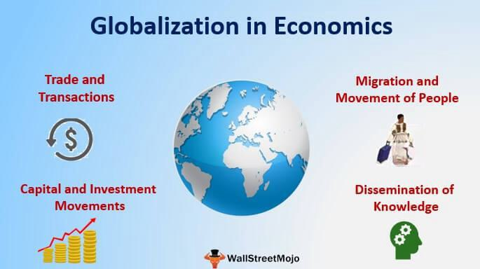

The modern financial landscape is characterized by a high degree of interconnectedness, largely due to the forces of globalization. As nations have opened their economies, international finance has surged, enabling markets to integrate and multiply cross-border transactions. This integration began, in earnest, during the latter half of the twentieth century, as regulations eased and technology advanced, allowing capital, goods, and services to flow more freely across borders.

Globalization has been a catalyst for the evolution of financial services, fostering an environment where financial institutions must adapt to an increasingly interconnected world. Traditional banking services have expanded to include a wider array of financial instruments and services that cater to a global clientele. This shift has been facilitated by international institutions such as the International Monetary Fund (IMF) and the World Bank, which have worked to stabilize and grow the global economy, providing a framework within which international finance could thrive.



Technology has been transformative in its impact on global financial markets. Advancements in information technology, communication, and computing power have revolutionized how financial transactions are conducted. Digital platforms and online services have enabled rapid, real-time transactions across the globe, reducing both time and costs associated with financial activities. This digital transformation has not only increased efficiency but also competition among financial service providers as they seek innovative ways to serve their clients better.

Within this tech-driven financial ecosystem, algorithmic trading has emerged as a significant component. This method, which involves using computer algorithms to execute trades at high speeds, has gained prominence as markets have become more volatile and fragmented. Algorithmic trading optimizes the execution of trades by determining the best possible pricing and timing, minimizing costs, and reducing human error. Its rise is a testament to the role of technology in shaping modern financial services, offering a glimpse into future market dynamics.

As the financial landscape continues to evolve, globalization and technology remain pivotal. International finance has not only expanded opportunities for trade and investment but has also increased the complexity of financial systems, necessitating new approaches to management and regulation. Understanding these dynamics is crucial for stakeholders aiming to thrive in this rapidly changing environment.

## Table of Contents

## The Growth of International Finance

International finance has undergone significant evolution over the centuries, influenced by shifts in economic power, technological advancements, and political transformations. Historically, international finance found its roots in global trade, which necessitated currency exchange across borders. By the 19th century, the gold standard had established a more predictable system for international trade, allowing countries to stabilize their currencies' value against a universal benchmark. The Bretton Woods system post-World War II further shaped international finance by introducing fixed exchange rates and the dollar's prominence, setting the stage for the modern financial world.

Key international institutions such as the International Monetary Fund (IMF) and the World Bank were established during the mid-20th century to promote monetary cooperation and financial stability. The IMF provides financial support to countries experiencing balance of payments problems while advocating for economic policies that foster growth and stability. The World Bank, on the other hand, offers financial and technical assistance to developing nations, aiming to reduce poverty and stimulate sustainable economic development. Both institutions have played pivotal roles in facilitating cross-border economic growth and providing a framework for international financial stability.

In recent decades, cross-border investments and capital flows have surged, driven by globalization and the liberalization of financial markets. This has resulted in an interconnected global economy where capital can move freely in search of higher returns. Current trends include a rise in foreign direct investments, where companies invest capital in other countries to expand their market reach and access resources. Additionally, the emergence of portfolio investments, which involve buying foreign stocks and bonds, signifies a shift towards diversified investment strategies aimed at spreading risk.

However, international finance is not without challenges. Global financial markets face vulnerabilities such as currency fluctuations, political instability, and economic disparities among nations. These challenges require robust risk management strategies and sound economic policies to mitigate potential impacts. On the opportunity side, international finance provides avenues for economic growth, access to broader markets, and diversification of investment portfolios, benefiting both investors and national economies.

Regulatory environments play a crucial role in cross-border financial activities, influencing how capital flows are managed and controlled. Different countries have varying regulatory standards that can either facilitate or hinder international financial transactions. For instance, stringent regulations may prevent foreign investment flows, while lenient regulations might lead to economic vulnerabilities, such as exploitation by speculative markets. Harmonizing these regulatory frameworks and fostering cooperation among international financial authorities is essential to promote a stable and effective global financial system.

In summary, the growth of international finance is a testament to the increasing interconnectedness of the world's economies. While presenting both challenges and opportunities, it emphasizes the need for international collaboration, robust regulatory frameworks, and adaptability to evolving market dynamics, thereby supporting sustainable global economic growth.

## Globalization and Its Impact on Financial Services

Globalization refers to the integration of economies and cultures across the globe, and in financial services, it represents the increase in cross-border financial flows and the interconnectedness of financial markets. The globalization of financial services has led to the proliferation and evolution of banking and financial institutions worldwide, transforming the way they operate.

The reshaping of banks and financial institutions can be observed through the adoption of international standards, regulatory frameworks, and financial products. Institutions have expanded their operations beyond domestic borders, offering products and services to international markets, which has increased competition and customer choice. Global banks have established branches and subsidiaries worldwide, leading to a diverse range of financial services being accessible across different regions.

This interconnectedness has intensified competition among financial service providers, pushing for greater innovation. As firms vie to capture global market share, they invest in developing new financial products tailored to various markets, or improve on existing services by integrating global best practices. Such competition spurs innovation, fostering an environment where financial technology firms, or fintechs, thrive. These enterprises often offer more agile solutions compared to traditional banking institutions, thereby challenging established players to adopt digital solutions.

Digital transformation plays a crucial role in enhancing the efficiency of financial services. Technologies such as cloud computing, big data analytics, [artificial intelligence](/wiki/ai-artificial-intelligence), and blockchain have revolutionized back-office processes, customer interactions, and risk management policies. For example, banks use big data and AI to gather insights on customer behavior, ensuring personalized services and more robust risk assessments. Digital platforms enable seamless cross-border transactions, reducing the time and cost associated with international money transfers. Furthermore, blockchain technology offers potential for more transparent and tamper-proof processes in areas like trade finance and cross-border payments.

Several case studies highlight successful globalization strategies employed by financial services firms. HSBC, one of the largest banking and financial services organizations in the world, has successfully globalized its operations by tailoring its offerings to align with local market needs while maintaining global standards of service and compliance. Similarly, Citigroup has capitalized on its extensive international network to expand its reach by integrating local expertise with global resources. Both firms leverage digital transformation to ensure consistent and efficient service delivery across different jurisdictions.

In conclusion, globalization has significantly impacted financial services by reshaping banking institutions, intensifying competition, and driving innovation. The ongoing digital transformation offers immense potential to improve service efficiency, enabling financial service providers to meet the diverse needs of a global clientele effectively. As a result, institutions that successfully adapt to these changes stand well-positioned to thrive in an increasingly interconnected financial landscape.

## Algorithmic Trading: Revolutionizing Financial Markets

Algorithmic trading, often referred to as algo trading, involves the use of computer algorithms to manage trading processes, allowing market transactions to be executed at speeds and volumes unmatched by human traders. This trading strategy relies significantly on computer programs that follow a defined set of instructions to generate trading signals and determine the timing, price, or quantity of trades. The primary objective is to leverage the advantages of speed, precision, and reduced costs, thereby outperforming traditional trading methods.

At the core of [algorithmic trading](/wiki/algorithmic-trading) is the ability to execute trades at high velocity. Algorithms can process vast amounts of market data in fractions of a second, identifying patterns and executing trades much faster than a human can. This capability enables traders to exploit small price discrepancies across markets or benefit from rapid changes in asset prices. The formula for calculating the rate of return for trades executed algorithmically is similar to any other investment strategy:

$$
R = \frac{{P_{\text{sell}} - P_{\text{buy}}}}{P_{\text{buy}}}
$$

where $R$ is the rate of return, $P_{\text{sell}}$ is the selling price, and $P_{\text{buy}}$ is the buying price.

The benefits of algorithmic trading are multifaceted. Firstly, it enhances efficiency by allowing simultaneous processing of multiple trades, analyzing multiple markets, and responding to varying conditions instantly. The ability to handle large trading volumes concurrently minimizes transaction costs and often leads to better prices due to lower slippage. Secondly, algorithmic trading significantly reduces human error. By eliminating emotional decision-making and reliance on intuition, trading activities become more consistent and predictable.

A driving force behind the proliferation of algorithmic trading is technological advancements. With the advent of high-frequency trading ([HFT](/wiki/high-frequency-trading-strategies)) systems, traders can now exploit millisecond-level timeframes to make profits. Enhanced computational power and improved data feed technologies enable the execution of complex algorithms that were previously impractical. Software implementations often use programming languages like Python, which provides libraries such as NumPy for numerical calculations and pandas for data analysis. Below is a simple example of an algorithm that could be used to decide whether to make a trade based on moving averages:

```python
import pandas as pd

# Sample data
data = {'prices': [101, 102, 103, 100, 98, 97, 99, 101, 105]}
df = pd.DataFrame(data)

# Calculate moving averages
df['MA_short'] = df['prices'].rolling(window=3).mean()
df['MA_long'] = df['prices'].rolling(window=5).mean()

# Generate trading signals
df['signal'] = 0  # No trade by default
df.loc[df['MA_short'] > df['MA_long'], 'signal'] = 1  # Buy signal
df.loc[df['MA_short'] < df['MA_long'], 'signal'] = -1  # Sell signal
```

This script showcases the moving average crossover strategy, a popular algorithmic trading method.

Despite its advantages, algorithmic trading also presents risks and ethical challenges. The rapid pace of trading could amplify market [volatility](/wiki/volatility-trading-strategies) and trigger systemic risks. Flash crashes, exemplified by events like the 2010 market event when the Dow Jones Industrial Average plunged and recovered within minutes, highlight the potential destabilizing effects of algorithmic trading. Moreover, the reliance on sophisticated algorithms raises ethical questions surrounding the fairness of markets, as not every participant has access to such technologies.

In conclusion, algorithmic trading represents a transformative shift in financial markets by leveraging technology to enhance trade execution. While it offers numerous advantages, such as efficiency and reduced human error, it also necessitates careful consideration of associated risks and ethical concerns to ensure stable and fair markets.

## Challenges and Opportunities in a Globalized Financial System

In today's interconnected financial environment, managing risks requires a robust framework due to the intricate web of global economic relationships. The synchronization of markets means that financial shocks can ripple through economies with unprecedented speed, necessitating sophisticated risk management strategies. To adequately address these challenges, financial institutions employ various techniques, including credit risk modeling and stress testing, to anticipate potential losses and mitigate their impact. The adoption of advanced algorithms and [machine learning](/wiki/machine-learning) aids in identifying patterns and forecasting risks more accurately, providing a competitive advantage to those who effectively leverage these technologies.

Globalization has opened numerous opportunities for growth and diversification in international markets. The expansion into emerging markets presents significant prospects for financial gains, spurred by increasing consumer bases and relatively untapped resources. Diversification across borders allows firms to spread their risks and potentially stabilize returns by minimizing exposure to a single country's economic fluctuations. However, successful entry into these markets requires understanding local financial systems, consumer behavior, and regulatory landscapes to tailor services that meet indigenous needs effectively.

Geopolitical events remain a potent force influencing global finance. Political instability, trade wars, and policy changes can create volatility, affecting currency exchange rates, interest rates, and asset prices. For instance, developments like Brexit or tensions in international trade relations highlight how geopolitical uncertainties can disrupt markets. Institutions must adopt agile strategies, maintaining flexibility to recalibrate their operations quickly in response to a shifting geopolitical climate. This may include diversifying supply chains, hedging currency risks, or establishing local partnerships to mitigate political risks.

Adapting to changing regulations and compliance requirements is another significant [factor](/wiki/factor-investing) in the global financial system. International financial institutions must navigate a complex array of regulations spanning multiple jurisdictions. Compliance is not only a legal obligation but also a strategic priority, as regulatory breaches can result in substantial financial penalties and reputational damage. Firms must invest in compliance technologies and cultivate a culture of transparency and accountability to remain competitive. This includes implementing robust data protection measures in the face of stringent data privacy laws, such as the General Data Protection Regulation (GDPR) in the European Union.

Technological advancements offer strategies for effectively navigating the global financial landscape. Automation and blockchain technology have already begun to transform back-office operations, reducing costs, and enhancing efficiency. Fintech innovations provide solutions such as mobile banking and digital payment systems, facilitating broader reach and operational scalability. Financial services firms must be proactive in adopting these cutting-edge technologies, integrating them into their processes to enhance customer satisfaction and streamline operations. Additionally, artificial intelligence and big data analytics offer insights into market trends and consumer preferences, enabling informed decision-making and personalized financial services.

In summary, while a globalized financial system presents multifaceted challenges, it simultaneously offers substantial opportunities for growth and innovation. By strategically managing risks, seizing market opportunities, and embracing regulatory and technological changes, institutions can thrive in this dynamic environment.

## The Future of Global Financial Services and Algo Trading

As the global financial landscape continues to transform, the future of international finance and algorithmic trading will be shaped by technological advancements, emerging markets, and evolving priorities such as sustainability. These elements present both opportunities and challenges that stakeholders must navigate to maintain competitive and resilient financial services.

Predictions for the evolution of international finance and globalization suggest that the continued integration of global markets will persist, propelled by technological innovations and digital connectivity. The expansion of cross-border transactions will likely necessitate more sophisticated regulatory frameworks to handle complexities associated with multi-jurisdictional operations. Financial institutions will need to adapt by embracing digital solutions that enhance efficiency while ensuring compliance with international standards.

Artificial intelligence (AI) and machine learning are poised to revolutionize algorithmic trading, offering tools to process large datasets at unprecedented speeds. These technologies can identify patterns and trends that are invisible to human analysts, enabling more informed and timely decision-making. For instance, machine learning algorithms can be used to enhance predictive modeling in stock markets by analyzing historical data, social media sentiment, and macroeconomic indicators. The application of AI could improve trading strategies, optimize execution paths, and reduce the reliance on human intervention.

Consider the Python example below for a simple machine learning model that predicts stock price movements based on historical data:

```python
import pandas as pd
from sklearn.model_selection import train_test_split
from sklearn.ensemble import RandomForestClassifier
from sklearn.metrics import accuracy_score

# Load the dataset
data = pd.read_csv('stock_data.csv')

# Features and label
features = data.drop(['PriceMovement'], axis=1)  # Dropping the target label column
label = data['PriceMovement']

# Split the data into training and testing sets
X_train, X_test, y_train, y_test = train_test_split(features, label, test_size=0.2, random_state=42)

# Initialize and fit the Random Forest model
model = RandomForestClassifier(n_estimators=100, random_state=42)
model.fit(X_train, y_train)

# Predict and evaluate the model
predictions = model.predict(X_test)
accuracy = accuracy_score(y_test, predictions)
print(f"Model Accuracy: {accuracy:.2f}")
```

Meanwhile, emerging markets will increasingly influence global finance as they offer new opportunities for growth and diversification. These markets often exhibit higher growth rates compared to developed economies, attracting capital flows that seek higher returns. However, investors must remain wary of risks like political instability and currency fluctuations inherent in these regions.

Sustainability and environmental, social, and governance ([ESG](/wiki/esg-investing)) criteria are critical in shaping future financial services. As global awareness about climate change and social responsibility rises, financial entities are incorporating ESG factors into their investment strategies. This shift not only reflects ethical considerations but also responds to the growing demand from investors and regulators for sustainable practices. ESG-focused financial products are expected to become more prevalent, directing capital towards sustainable ventures and influencing corporate behavior across industries.

In preparing for an ever-evolving financial environment, stakeholders must cultivate adaptability to address regulatory changes, geopolitical tensions, and technological disruptions. This may involve investing in robust cybersecurity measures, developing agile financial products, and fostering innovation through partnerships with fintech firms and research institutions. Embracing these strategies will enable financial services to seize emerging opportunities while mitigating risks in a globalized economy.

## Conclusion

The interconnectedness of global finance and technology has transformed the financial landscape, ushering in a new era where borders are often transparent, and markets operate in real-time. This interrelation has enabled the rapid flow of capital across countries, thereby promoting economic growth and innovation. As financial markets become increasingly globalized, institutions and individuals alike are compelled to embrace this trend. Doing so facilitates access to a broader array of financial products and services, fostering competition and diversification.

Algorithmic trading exemplifies the synergies between technology and finance, playing a pivotal role in contemporary markets. By leveraging advanced algorithms, market participants can execute trades with unprecedented speed and accuracy. This not only enhances market efficiency but also reduces the potential for human error, thereby contributing to market stability. The significance of algorithmic trading in modern finance cannot be overstated, as it is a key driver of [liquidity](/wiki/liquidity-risk-premium) and price discovery.

For financial service providers and stakeholders, adapting to and innovating in a globalized world is imperative. This adaptation requires a holistic approach that includes understanding cross-border regulatory environments, investing in technological infrastructure, and securing talent that can navigate complex global dynamics. By doing so, they can capture growth opportunities, improve service delivery, and enhance client satisfaction.

Lastly, maintaining an acute awareness of global trends and regulatory changes is essential in the financial industry. The fast-paced nature of global finance demands agility and informed decision-making. Practitioners and institutions must commit to ongoing education and strategic foresight to remain competitive and relevant. In this ever-evolving landscape, continuous learning and adaptation are not optional but necessary for sustainable success.

## References & Further Reading

[1]: Bergstra, J., Bardenet, R., Bengio, Y., & Kégl, B. (2011). ["Algorithms for Hyper-Parameter Optimization."](https://dl.acm.org/doi/10.5555/2986459.2986743) Advances in Neural Information Processing Systems 24.

[2]: ["Advances in Financial Machine Learning"](https://www.amazon.com/Advances-Financial-Machine-Learning-Marcos/dp/1119482089) by Marcos Lopez de Prado

[3]: ["Evidence-Based Technical Analysis: Applying the Scientific Method and Statistical Inference to Trading Signals"](https://www.amazon.com/Evidence-Based-Technical-Analysis-Scientific-Statistical/dp/0470008741) by David Aronson

[4]: ["Machine Learning for Algorithmic Trading"](https://github.com/stefan-jansen/machine-learning-for-trading) by Stefan Jansen

[5]: ["Quantitative Trading: How to Build Your Own Algorithmic Trading Business"](https://www.amazon.com/Quantitative-Trading-Build-Algorithmic-Business/dp/1119800064) by Ernest P. Chan