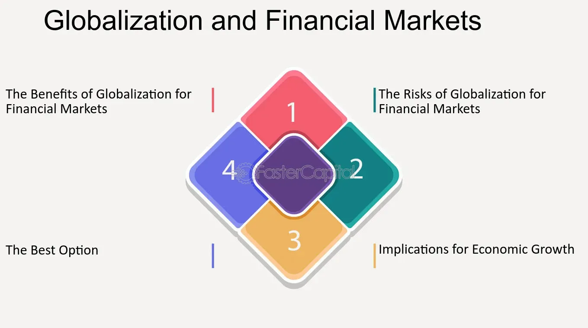

## Table of Contents

## What is globalization in the context of financial services?

Globalization in the context of financial services means that money and financial activities can move more easily across different countries. This happens because of better technology, fewer rules that stop money from moving, and agreements between countries. For example, someone in one country can invest in a company in another country without much trouble. Banks and other financial companies can also work in many countries, helping people and businesses to do things like save money, borrow money, or invest.

This globalization has made financial services more competitive and given people more choices. But it also brings some risks. If something goes wrong in one country's financial system, it can affect other countries too. This is called a financial crisis. To manage these risks, countries work together to make rules and watch over the financial system. This helps keep the global financial system stable and safe for everyone.

## How has technology facilitated the globalization of financial services?

Technology has made it easier for financial services to work across the world. With the internet and computers, people can now do banking, investing, and other financial activities from anywhere. They don't need to go to a bank in their own country. They can use their phone or computer to send money to another country or buy stocks in a foreign company. This is possible because technology helps connect banks and financial markets around the world.

Also, technology has made it cheaper and faster to move money between countries. Before, it could take days and cost a lot of money to send money overseas. Now, with technology, it can happen in seconds and cost much less. This has made it easier for people and businesses to work with others in different countries. It has also helped new kinds of financial services, like online banking and digital wallets, to grow and reach more people around the world.

## What are the key drivers behind the globalization of financial services?

The main reasons for the globalization of financial services are technology, fewer rules, and countries working together. Technology, like the internet and computers, has made it easy for people to do financial activities from anywhere. They can use their phone or computer to send money to another country or buy stocks in a foreign company. This has helped banks and other financial companies to work in many countries and reach more people.

Another big reason is that countries have made fewer rules that stop money from moving between them. This has made it easier for financial services to work across borders. Also, countries have made agreements to help their financial systems work together better. These agreements help make sure that money can move freely and safely between countries.

Lastly, the need for financial services has grown as more people and businesses work across the world. Companies want to invest in other countries, and people want to save and spend money in different places. This demand has pushed financial services to become more global. As a result, financial services have become more competitive and given people more choices, but it has also brought new risks that countries need to manage together.

## What are the benefits of globalized financial services for consumers?

Globalized financial services give consumers more choices and better deals. Because banks and financial companies can work in many countries, they have to compete with each other. This means they try to offer better services and lower prices to attract customers. For example, you might find a bank in another country that offers a better [interest rate](/wiki/interest-rate-trading-strategies) on your savings account. Or you might use an app to send money to family in another country for a lower fee than before.

Another benefit is that it's easier for consumers to do financial activities from anywhere. With the internet and technology, you can check your bank account, invest in stocks, or pay bills from your phone or computer, no matter where you are. This is very helpful if you travel a lot or live in different countries. It also means you can take advantage of financial opportunities around the world, like investing in a growing company in another country or getting a loan from a bank that offers better terms.

## How do regulations impact the globalization of financial services?

Regulations can both help and slow down the globalization of financial services. On one hand, when countries make fewer rules about moving money, it becomes easier for financial services to work across borders. This means banks and other financial companies can offer their services in more countries, giving people more choices and better deals. Countries also make agreements to work together and make sure their financial systems can connect smoothly. These agreements help make sure money can move freely and safely between countries, which is good for globalization.

On the other hand, too many or different regulations can make it harder for financial services to go global. If each country has its own strict rules, it can be difficult and expensive for a bank to follow all of them. This might stop banks from wanting to work in other countries. Also, if one country has very loose rules, it can create risks for the whole global financial system. That's why countries work together to make rules that help keep the financial system stable and safe for everyone, even as they try to make it easier for financial services to globalize.

## What challenges do financial institutions face when expanding globally?

When financial institutions try to expand globally, they face many challenges. One big challenge is dealing with different rules in each country. Every country has its own laws about how banks and other financial companies can work. These rules can be very different and hard to follow. It can take a lot of time and money to understand and follow all these rules. If a bank makes a mistake, it could get in trouble with the law or lose money.

Another challenge is understanding different cultures and languages. People in different countries have different ways of doing things and different ideas about money. A bank needs to understand these differences to offer services that people will want to use. Also, if a bank's employees don't speak the local language, it can be hard to talk to customers and do business. This can slow down the bank's work and make it harder to grow in that country.

Lastly, there are risks from the global economy. When a bank works in many countries, problems in one country's economy can affect the bank's work everywhere. For example, if one country has a financial crisis, it can make it harder for the bank to get money back from loans or investments in that country. This can hurt the bank's business in other countries too. To manage these risks, banks need to be very careful and plan well when they expand globally.

## How has the globalization of financial services affected emerging markets?

The globalization of financial services has brought both good and bad changes to emerging markets. On the good side, it has helped these countries grow faster. More money can come into these countries from banks and investors in other parts of the world. This money can be used to start new businesses, build roads and schools, and create jobs. People in emerging markets can also use new financial services, like online banking and mobile money, to save and spend their money more easily. This can help them have a better life.

However, there are also challenges. Sometimes, the money that comes into emerging markets can leave quickly if there is a problem in the global economy. This can cause big problems for these countries. For example, if a lot of money leaves suddenly, it can make it hard for businesses to get loans and can cause people to lose their jobs. Also, the financial services from other countries can be hard for people in emerging markets to understand and use. They might not know how to use new technology or might not trust banks from other countries. This can make it hard for them to benefit from globalization.

## What role do international financial institutions like the IMF and World Bank play in global financial services?

International financial institutions like the International Monetary Fund (IMF) and the World Bank play a big role in global financial services. They help countries work together and make rules that keep the global financial system stable and safe. The IMF watches over the world's economy and helps countries that are having money problems. It can lend money to these countries to help them get better. The World Bank, on the other hand, focuses on helping poor countries grow by giving them money for projects like building schools and roads. Both of these institutions help make sure that money can move smoothly and safely between countries.

However, these institutions also face challenges. Sometimes, the rules they make can be hard for some countries to follow. This can make it difficult for these countries to get the help they need. Also, when they give money to a country, they often ask that country to make changes to its economy. These changes can be hard for people in that country and can cause problems. But overall, the IMF and World Bank are important for helping countries work together and making the global financial system better for everyone.

## How does the globalization of financial services influence economic stability?

The globalization of financial services can help make the world's economy more stable. When money can move easily between countries, it can help countries that are having money problems. For example, if a country is in trouble, it can get loans from other countries or international institutions like the IMF. This can help the country get better and keep the global economy stable. Also, when banks and investors from different countries work together, they can share ideas and help each other. This can make the whole financial system stronger and more stable.

However, globalization can also make the economy less stable. If something goes wrong in one country, it can affect other countries too. For example, if a big bank in one country fails, it can make people in other countries worried about their money. This can cause them to take their money out of banks, which can make the problem worse. Also, when money moves quickly between countries, it can cause big changes in the value of money. This can make it hard for countries to plan and can cause economic problems. So, while globalization can help make the economy more stable, it can also bring new risks that countries need to manage carefully.

## What are the risks associated with the globalization of financial services?

The globalization of financial services can bring some risks. One big risk is that problems in one country can quickly spread to other countries. For example, if a bank in one country fails, it can make people in other countries worried about their money. This can cause them to take their money out of banks, which can make the problem worse. Another risk is that money can move too quickly between countries. This can cause big changes in the value of money, making it hard for countries to plan and causing economic problems.

Another risk is that different countries have different rules about financial services. When banks work in many countries, it can be hard for them to follow all these rules. If they make a mistake, they could get in trouble with the law or lose money. Also, if one country has very loose rules, it can create risks for the whole global financial system. This is why countries need to work together to make rules that help keep the financial system stable and safe for everyone.

Lastly, there's the risk that the benefits of globalization might not be shared equally. Some countries and people might get a lot of benefits, while others might not get as much. This can cause problems and make it harder for some countries to grow. It's important for countries to work together to make sure that everyone can benefit from the globalization of financial services.

## How can financial institutions mitigate risks in a globalized market?

Financial institutions can lower risks in a global market by being careful and planning well. They need to understand the rules in each country they work in and make sure they follow them. This can be hard because rules can be different and change a lot. But if they do it right, they can avoid getting in trouble with the law or losing money. They should also keep an eye on the global economy and be ready for problems. If they see a country's economy starting to have trouble, they can take steps to protect their money and business.

Another way to lower risks is by spreading out their work. Instead of putting all their money and effort into one country, they can work in many different countries. This way, if something goes wrong in one place, it won't hurt their whole business. They can also use technology to help them watch over their work in different countries and react quickly if something goes wrong. By being careful, planning well, and spreading out their work, financial institutions can make the global market safer for themselves and their customers.

## What future trends are expected in the globalization of financial services?

In the future, technology will keep playing a big role in making financial services more global. More people will use their phones and computers to do banking and other financial activities from anywhere. This will make it easier for banks and other financial companies to work in many countries and reach more people. New technology like blockchain and digital currencies might also change how money moves between countries, making it faster and cheaper. This could help more people and businesses work together across the world.

Another trend is that countries will keep working together to make rules about financial services. They will try to make these rules fair and easy to follow, so banks can work in more countries without too much trouble. But they will also be careful to keep the global financial system stable and safe. This means they might make new rules to manage risks and stop problems from spreading between countries. Overall, the globalization of financial services will keep growing, but it will need to be managed carefully to make sure it helps everyone and doesn't cause too many problems.

## How is Algorithmic Trading Revolutionizing Financial Markets?

Algorithmic trading, often referred to as algo trading, involves the use of computer algorithms to manage trading processes, allowing market transactions to be executed at speeds and volumes unmatched by human traders. This trading strategy relies significantly on computer programs that follow a defined set of instructions to generate trading signals and determine the timing, price, or quantity of trades. The primary objective is to leverage the advantages of speed, precision, and reduced costs, thereby outperforming traditional trading methods.

At the core of [algorithmic trading](/wiki/algorithmic-trading) is the ability to execute trades at high velocity. Algorithms can process vast amounts of market data in fractions of a second, identifying patterns and executing trades much faster than a human can. This capability enables traders to exploit small price discrepancies across markets or benefit from rapid changes in asset prices. The formula for calculating the rate of return for trades executed algorithmically is similar to any other investment strategy:

$$
R = \frac{{P_{\text{sell}} - P_{\text{buy}}}}{P_{\text{buy}}}
$$

where $R$ is the rate of return, $P_{\text{sell}}$ is the selling price, and $P_{\text{buy}}$ is the buying price.

The benefits of algorithmic trading are multifaceted. Firstly, it enhances efficiency by allowing simultaneous processing of multiple trades, analyzing multiple markets, and responding to varying conditions instantly. The ability to handle large trading volumes concurrently minimizes transaction costs and often leads to better prices due to lower slippage. Secondly, algorithmic trading significantly reduces human error. By eliminating emotional decision-making and reliance on intuition, trading activities become more consistent and predictable.

A driving force behind the proliferation of algorithmic trading is technological advancements. With the advent of high-frequency trading ([HFT](/wiki/high-frequency-trading-strategies)) systems, traders can now exploit millisecond-level timeframes to make profits. Enhanced computational power and improved data feed technologies enable the execution of complex algorithms that were previously impractical. Software implementations often use programming languages like Python, which provides libraries such as NumPy for numerical calculations and pandas for data analysis. Below is a simple example of an algorithm that could be used to decide whether to make a trade based on moving averages:

```python
import pandas as pd

# Sample data
data = {'prices': [101, 102, 103, 100, 98, 97, 99, 101, 105]}
df = pd.DataFrame(data)

# Calculate moving averages
df['MA_short'] = df['prices'].rolling(window=3).mean()
df['MA_long'] = df['prices'].rolling(window=5).mean()

# Generate trading signals
df['signal'] = 0  # No trade by default
df.loc[df['MA_short'] > df['MA_long'], 'signal'] = 1  # Buy signal
df.loc[df['MA_short'] < df['MA_long'], 'signal'] = -1  # Sell signal
```

This script showcases the moving average crossover strategy, a popular algorithmic trading method.

Despite its advantages, algorithmic trading also presents risks and ethical challenges. The rapid pace of trading could amplify market [volatility](/wiki/volatility-trading-strategies) and trigger systemic risks. Flash crashes, exemplified by events like the 2010 market event when the Dow Jones Industrial Average plunged and recovered within minutes, highlight the potential destabilizing effects of algorithmic trading. Moreover, the reliance on sophisticated algorithms raises ethical questions surrounding the fairness of markets, as not every participant has access to such technologies.

In conclusion, algorithmic trading represents a transformative shift in financial markets by leveraging technology to enhance trade execution. While it offers numerous advantages, such as efficiency and reduced human error, it also necessitates careful consideration of associated risks and ethical concerns to ensure stable and fair markets.

## References & Further Reading

[1]: Bergstra, J., Bardenet, R., Bengio, Y., & Kégl, B. (2011). ["Algorithms for Hyper-Parameter Optimization."](https://dl.acm.org/doi/10.5555/2986459.2986743) Advances in Neural Information Processing Systems 24.

[2]: ["Advances in Financial Machine Learning"](https://www.amazon.com/Advances-Financial-Machine-Learning-Marcos/dp/1119482089) by Marcos Lopez de Prado

[3]: ["Evidence-Based Technical Analysis: Applying the Scientific Method and Statistical Inference to Trading Signals"](https://www.amazon.com/Evidence-Based-Technical-Analysis-Scientific-Statistical/dp/0470008741) by David Aronson

[4]: ["Machine Learning for Algorithmic Trading"](https://github.com/stefan-jansen/machine-learning-for-trading) by Stefan Jansen

[5]: ["Quantitative Trading: How to Build Your Own Algorithmic Trading Business"](https://www.amazon.com/Quantitative-Trading-Build-Algorithmic-Business/dp/1119800064) by Ernest P. Chan