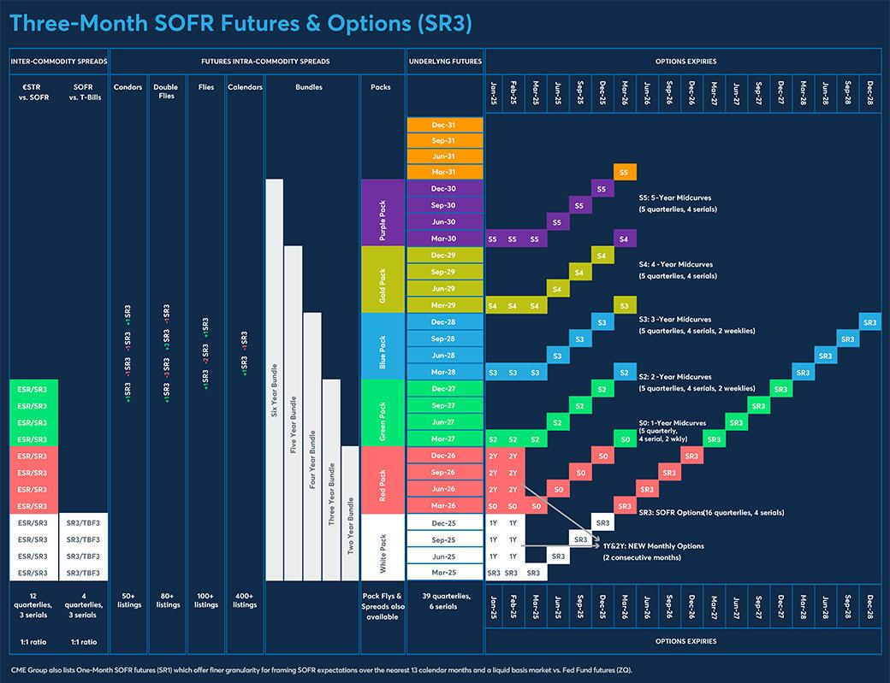

The digital age has transformed trading dynamics, leading to notable advancements in the way financial markets operate. Among these advancements, algorithmic trading has emerged as a key development, optimizing trading strategies through the use of technology. Within this sphere, the evolution of Globex has played a pivotal role in reshaping the trading landscape.

Globex, a significant electronic trading platform, initiated a revolution in trading futures, options, and various commodity contracts. As one of the first platforms to facilitate electronic trading, Globex marked a departure from the traditional open-outcry method, bringing increased efficiency and accessibility to traders worldwide. By offering a continuously operating marketplace, it allowed orders to be executed at any time, effectively breaking down the barriers of time zones and market hours.

This article explores the working mechanism and historical development of Globex, placing it within the broader narrative of algorithmic trading. Since its inception, Globex has been instrumental in democratizing access to trading by allowing traders across the globe to participate in markets 24 hours a day, five days a week. This round-the-clock market access has not only increased participation but also contributed to greater liquidity and more competitive pricing.

Through examining the evolution of Globex, we gain insights into the technological advancements that have shaped the financial markets, influencing both traders and exchanges alike. Understanding Globex's impact provides a window into the current state of algorithmic trading and offers clues to its future trajectory.

## Table of Contents

## The Advent of Globex

Launched in 1992, Globex marked a monumental shift in trading environments as the premier electronic trading platform under the aegis of the Chicago Mercantile Exchange (CME). This launch enabled traders to transcend the constraints of traditional open-outcry sessions, providing an efficient, nearly continuous trading facility that substantially broadened market accessibility. The platform’s establishment was in response to an emerging need to accommodate after-hours trading, a limitation of previous trading systems.

Initially, the Globex system operated on technology supplied by Reuters. This collaboration brought forth an advanced method for executing futures and options trades electronically, providing a framework that facilitated real-time transactions across different time zones. This was revolutionary, as it supported a near 24-hour trading cycle from Sunday afternoon to Friday afternoon, connecting traders globally and enhancing the liquidity and dynamism of global markets.

Globex offered a streamlined process whereby participants could access a central trading marketplace, thereby promoting increased market participation. This structural change was pivotal not only in escalating the [volume](/wiki/volume-trading-strategy) of trades but also in promoting transparency and efficiency within the markets. As a result, industry practices gradually shifted, with electronic trading gaining prominence over the more traditional methods that had dominated until then. The introduction of Globex was a foundational moment, setting the stage for the rapid evolution and acceptance of electronic trading mechanisms that followed.

## Working Mechanism of Globex

Globex, as an electronic trading platform, provides traders with real-time access to a central marketplace, allowing for trade execution almost continuously from Sunday evening to Friday evening. This 24/5 operation model enhances market accessibility for traders around the globe, accommodating various time zones and trading strategies. The platform is integral to sustaining the high-speed environment of modern trading, where rapid response to market changes is crucial.

To access Globex, users must first establish relationships with CME Group clearing firms. These clearing firms function as intermediaries, crucial in ensuring the trades are settled correctly. Once this relationship is secured, traders use a certified trading application to connect to the Globex system. This setup guarantees standardized access to the trading environment, enabling seamless interaction with the platform's infrastructure.

Globex operates as a continuous auction market, providing constant price discovery and [liquidity](/wiki/liquidity-risk-premium). Its operation is characterized by transparency, where all participants have access to the same information, fostering fair competition. Through algorithms, automated systems update bid and ask prices dynamically, depending on supply and demand represented by market participants. This process not only contributes to market efficiency but also supports the vast trading volumes seen on the platform. On average, Globex processes over 17 million contracts daily, encompassing a diverse range of financial products such as futures and options on indices, interest rates, and commodities.

The robustness of Globex's infrastructure is pivotal to supporting these high transaction volumes. It incorporates advanced technology to ensure system availability, low latency, and resilience against market [volatility](/wiki/volatility-trading-strategies). Errors are minimized, and trades are executed accurately due to the platform's reliability. These features contribute significantly to the confidence that traders and institutions place in Globex as a primary trading interface in global financial markets.

## Significant Milestones in Globex History

The development of Globex was primarily driven by the need for an electronic trading framework that extended beyond traditional trading hours. This need became apparent in 1987, leading to the eventual launch of the platform in 1992 under the auspices of the Chicago Mercantile Exchange (CME). Globex was recognized as the first electronic trading platform, offering futures and options trading capabilities that were previously executed only in open-outcry trading sessions. 

One significant milestone in the evolution of Globex occurred in the year 2000 with the introduction of an open-access policy. This policy change fundamentally transformed the trading landscape by allowing market participants direct access to the trading platform. Such democratization of access significantly increased electronic trading volumes, fostering greater participation from a diverse pool of traders and institutions. This strategic shift aligned with broader technological advancements and the increasing reliance on electronic trading systems across financial markets.

By 2012, the impact of Globex on CME Group's operations had become particularly pronounced. Electronic trading via Globex accounted for 84% of the total trading volume of the CME Group, indicating a major transition from traditional methods to electronic platforms. This marked a notable paradigm shift in trading practices, showcasing the growing dominance of electronic trading and its efficiency in handling large transaction volumes. The steady rise in electronic trading volumes not only improved liquidity but also contributed to increased market transparency and execution speed.

The historical trajectory of Globex illustrates a series of pivotal developments that underscored its role in advancing electronic trading. These milestones reflect broader trends within financial markets, where technology continues to drive innovations and reshape how trading is conducted globally.

## Globex's Role in the Evolution of Algorithmic Trading

Algorithmic trading, which has revolutionized financial markets, finds significant roots in platforms such as Globex. This electronic trading platform facilitated the transition from manual processes to complex algorithmic solutions, enabling greater efficiency and liquidity in trading a wide range of financial products.

Throughout its history, Globex has continuously leveraged technological advancements to enhance the trading experience. By providing an infrastructure that supports high-frequency transactions, Globex has enabled traders to execute orders with precision and speed. This development marked a departure from traditional trading methods, allowing for the rapid dissemination and execution of strategic decisions based on real-time market data. The platform's ability to handle large volumes of trades contributed significantly to the rise of [algorithmic trading](/wiki/algorithmic-trading).

The introduction of innovative trading contracts, such as the E-mini S&P 500, further exemplifies Globex's role in advancing algorithmic trading. Launched in 1997, the E-mini S&P 500 became a popular derivative contract due to its liquidity and smaller contract size compared to standard S&P 500 futures. This democratized trading access, making it more feasible for a wider range of traders to engage in futures markets, and promoted the development of strategies reliant on algorithms for execution.

Moreover, Globex's advancements have supported the widespread acceptance and adoption of algorithmic trading practices. As algorithms evolved to include sophisticated techniques like statistical [arbitrage](/wiki/arbitrage), [machine learning](/wiki/machine-learning) models, and predictive analytics, the platform adapted by offering enhanced functionalities and processing capabilities. This adaptability ensured that traders could continue to refine and implement their algorithms effectively, contributing to the enduring popularity and efficacy of such trading methods.

In summary, Globex has played a pivotal role in the evolution of algorithmic trading by continuously integrating technological innovations, facilitating the development of new trading contracts, and providing a robust infrastructure that supports algorithm-driven strategies. This synergy between technology and trading practice has fundamentally transformed how financial markets operate, making them more accessible, efficient, and complex.

## Modern Landscape and Future Prospects

In the contemporary trading environment, CME Globex remains a fundamental component of the predominantly algorithmic-driven market. As a pioneer in electronic trading, Globex has continuously adapted to technological advancements, ensuring it meets the rapidly evolving needs of traders globally. Among the most significant trends impacting the platform today are high-frequency trading ([HFT](/wiki/high-frequency-trading-strategies)) and the integration of machine learning algorithms.

High-frequency trading, characterized by its execution of a large number of trades at extremely high speeds, hinges on the ability of platforms to process large volumes of data with minimal latency. Globex's infrastructure is designed to facilitate such operations, providing the robust and fast communication networks necessary to execute trades in microseconds. The focus here is on reducing the time lag (latency) between an order decision and its execution, critical in a marketplace where fractions of a second can determine profitability.

In tandem with HFT, machine learning has introduced sophisticated predictive analytics to trading strategies. Algorithms capable of learning from historical data and identifying patterns enhance the decision-making processes, optimizing trade executions on platforms like Globex. This advancement supports traders in assessing risks more accurately and adapting strategies dynamically based on market conditions.

The future trajectory of Globex involves continuous improvement in its core technology to sustain this [momentum](/wiki/momentum) of innovation. Enhancing data accuracy and reducing latency further are expected to remain pivotal objectives. Additionally, security measures will be increasingly vital, as the platform handles substantial transactional data that requires protection against cyber threats. Investments in cybersecurity frameworks are, therefore, integral as Globex progresses.

Furthermore, Globex's role in ensuring market integrity and efficiency will be instrumental as global financial systems increasingly rely on algorithmic trading. Upcoming innovations may include implementing blockchain technology for improved transparency and developing AI defenses against trading anomalies.

In conclusion, CME Globex exemplifies the synergy between electronic trading platforms and technological evolution. It stands prepared to face future demands, ensuring it remains a linchpin in the algorithmic trading network and actively contributes to the stability and integrity of financial markets worldwide.

## Conclusion

Globex, since its inception, has significantly transformed the trading landscape by implementing electronic solutions that have laid the groundwork for what we know today as algorithmic trading. The platform’s ability to facilitate global market access, extend trading hours, and ensure transparency and efficiency are cornerstone achievements that underscore its pivotal role. Understanding the historical context and the technical functionalities of Globex offers vital insights into how technology can reshape financial markets. Both traders and exchanges have benefited tremendously from this transformation, as it has introduced cost efficiencies and enhanced decision-making processes.

The evolution of Globex is not just a historical account but a reflection of ongoing innovation. As it continues to adapt and develop, the influence of Globex serves as a testament to the extreme impact that technological advancements have on financial trading. These advancements pave the way for speculative insights into the platform's future trajectory, where further innovation in high-frequency trading, machine learning, and data analytics can be anticipated. These features are crucial for maintaining and potentially enhancing market integrity and efficiency, indicating that the role of platforms like Globex will remain pivotal in the evolving landscape of global finance.

## References & Further Reading

[1]: Melamed, L., & Tamarkin, B. ("Leo Melamed: The Man Who Changed the World of Financial Futures"). Wiley.

[2]: Chicago Mercantile Exchange (CME Group) - ["History of the CME"](https://en.wikipedia.org/wiki/CME_Group)

[3]: Hull, J. C. (2014). ["Options, Futures, and Other Derivatives."](https://www.amazon.com/Options-Futures-Other-Derivatives-9th/dp/0133456315) Pearson.

[4]: Aldridge, I. (2013). ["High-Frequency Trading: A Practical Guide to Algorithmic Strategies and Trading Systems."](https://www.amazon.com/High-Frequency-Trading-Practical-Algorithmic-Strategies/dp/1118343506) Wiley Finance.

[5]: Harris, L. (2003). ["Trading and Exchanges: Market Microstructure for Practitioners."](https://www.amazon.com/Trading-Exchanges-Market-Microstructure-Practitioners/dp/0195144708) Oxford University Press.