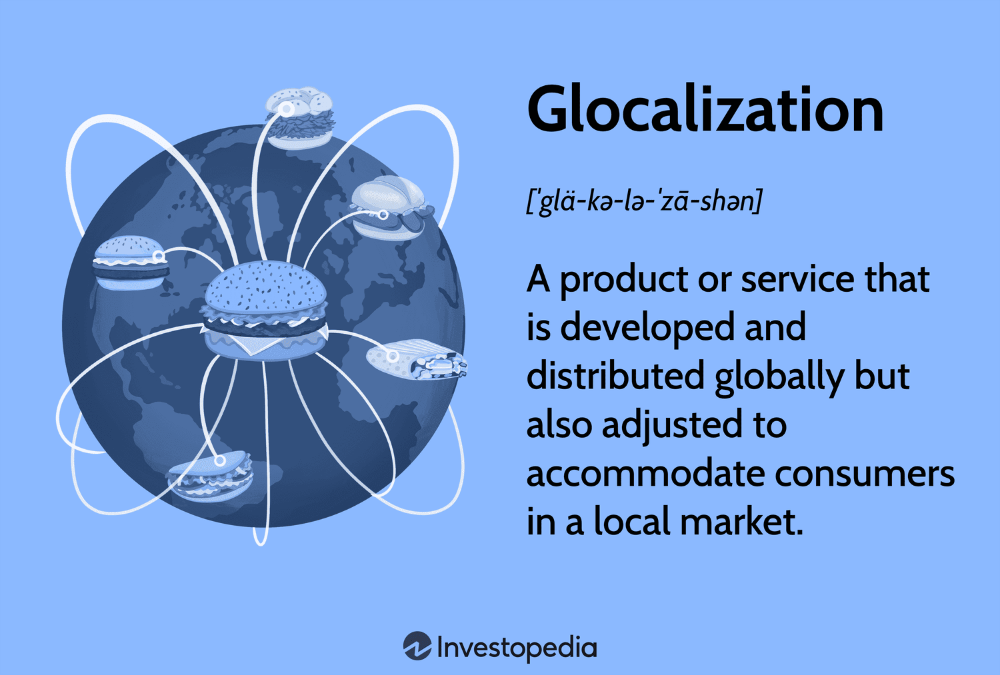

## Table of Contents

## What is glocalization?

Glocalization is a mix of the words "globalization" and "localization." It means adapting global products or ideas to fit local cultures and needs. Companies use glocalization to make their products more appealing to people in different countries. For example, a fast-food chain might change its menu to include local dishes in different countries.

This idea is important because it helps businesses connect better with customers around the world. By respecting and including local customs and tastes, companies can build stronger relationships with people in different places. Glocalization shows that while the world is becoming more connected, local differences still matter a lot.

## How does glocalization differ from globalization?

Glocalization and globalization are related but different ideas. Globalization means spreading ideas, products, and cultures all over the world. It's like making everything more connected and the same everywhere. For example, when a big company opens stores in many countries, that's globalization.

On the other hand, glocalization is about taking those global things and changing them to fit local places. It's like customizing global products to match what people in a specific area like or need. So, if that big company changes its menu to include local foods in different countries, that's glocalization. It shows that while the world is connected, local cultures are still important and should be respected.

## What are the key elements of glocalization?

Glocalization is all about mixing global ideas with local customs. It means taking something that is popular all over the world and making it fit into a specific place. This can be done by changing a product to match what people in that area like or need. For example, a company might change the flavors of a drink to suit local tastes.

The main idea behind glocalization is to respect and include local cultures while still being part of the global market. It helps businesses connect better with people in different countries because it shows that the company cares about the local community. By doing this, companies can build stronger relationships and be more successful in different parts of the world.

## What are the benefits of glocalization for businesses?

Glocalization helps businesses by making their products more appealing to people in different places. When a company changes its products to fit local tastes and needs, it shows that they care about the people in that area. This can make customers feel more connected to the brand and more likely to buy their products. For example, if a food company adds local dishes to its menu, people in that area might choose to eat there more often because they feel the company understands their culture.

Another benefit of glocalization is that it can help businesses grow in new markets. By adapting to local customs and preferences, a company can enter a new country more easily. This can lead to more sales and a bigger customer base. For instance, if a clothing brand starts making clothes with local designs or colors, it might attract more customers in that region who feel the brand speaks to them directly. This way, glocalization can help a business expand and be successful in different parts of the world.

## How does glocalization impact local communities?

Glocalization can have a positive effect on local communities. When big companies change their products to fit local tastes, it shows that they care about the people in that area. This can make local people feel more important and respected. For example, if a global fast-food chain starts selling local dishes, people in the community might feel proud that their food is being shared with the world. This can also help local traditions stay strong because the company is helping to keep them alive.

But glocalization can also have some challenges for local communities. Sometimes, big global companies might take over local businesses that can't compete with them. This can make it hard for small shops or restaurants to stay open. Also, if people start buying more global products that have been changed a little to fit local tastes, they might not support local businesses as much. So, while glocalization can bring some good things to local communities, it's important to make sure that it doesn't harm the small businesses that are a big part of the community.

## Can you provide examples of glocalization in marketing?

One example of glocalization in marketing is how McDonald's changes its menu to fit local tastes. In India, where many people don't eat beef, McDonald's offers the McAloo Tikki, a burger made with a potato and pea patty. This shows that they care about the local culture and dietary preferences. By doing this, McDonald's makes its brand more appealing to people in India and shows that it respects their traditions.

Another example is how Coca-Cola changes its marketing campaigns for different countries. In China, Coca-Cola created a campaign called "Share a Coke" where they used popular Chinese names on their bottles. This made the product feel more personal and connected to the local people. It helped Coca-Cola build a stronger relationship with customers in China by showing that they understand and value the local culture.

## What are some successful case studies of glocalization?

One successful case of glocalization is how KFC has grown in China. KFC changed its menu to include local flavors like congee and rice dishes. They also made their restaurants feel more like home by adding traditional Chinese decor. This made KFC very popular in China because people felt the company understood and respected their culture. By doing this, KFC was able to become the biggest fast-food chain in China, with more stores than in any other country.

Another example is how Unilever adapted its products for the Indian market. Unilever created a low-cost detergent called Wheel, which was specifically made for people who wash their clothes by hand. They also used marketing that spoke directly to Indian consumers, showing people in traditional Indian settings. This helped Unilever connect with local people and become a leading brand in India. By understanding and meeting the needs of the local market, Unilever was able to grow its business successfully in the country.

## How can a company implement glocalization strategies?

To implement glocalization strategies, a company needs to understand the local culture and what people in that area like and need. This means doing a lot of research to find out about local customs, tastes, and traditions. For example, a food company might need to know what kinds of foods people in a new country enjoy. Once they have this information, the company can start changing their products to fit these local preferences. This could mean adding new flavors to a drink or changing the way a product is packaged to match what people in that area like.

After making these changes, the company should also think about how to market their products in a way that speaks to local people. This might involve using local languages in advertisements or showing local scenes and people in their marketing materials. By doing this, the company shows that they care about the local community and want to be a part of it. This can help build trust and loyalty among local customers, making the company more successful in that market.

## What challenges might companies face when adopting glocalization?

When companies try to use glocalization, they can run into some problems. One big challenge is understanding the local culture well enough to make changes that really fit. It's not easy to know what people in a new place like and need. If a company gets it wrong, they might make products that don't sell well or even offend people. This can hurt their business and their reputation in that area.

Another problem is the cost and time it takes to change products and marketing for different places. It can be expensive to do the research needed to understand local tastes and to then make those changes. It also takes a lot of time to test these new products and make sure they work well in the local market. If a company doesn't have the money or time to do this right, their glocalization efforts might not be successful.

## How does glocalization affect global supply chains?

Glocalization can change how companies handle their global supply chains. When a company decides to change its products to fit local tastes, it might need to find new suppliers in different places. This means the company has to work with more people and make sure everything still works smoothly. For example, if a food company starts using local ingredients in a new country, they have to make sure those ingredients are good quality and can be delivered on time. This can make the supply chain more complicated but also more connected to the local area.

Sometimes, glocalization can make supply chains more efficient too. If a company can find good local suppliers, it might not have to ship things as far. This can save money and be better for the environment because it reduces the need for long-distance transportation. But, it can also be hard to keep everything balanced. The company has to make sure that using local suppliers doesn't mess up their other supply chains around the world. So, while glocalization can make things more complex, it can also bring some good changes to how a company manages its supplies.

## What role does technology play in facilitating glocalization?

Technology helps companies do glocalization by making it easier to learn about different places and their cultures. With the internet, companies can research what people in a new country like and need. They can use social media and online surveys to find out about local tastes and traditions. This information helps them change their products to fit the local market. For example, a company can use data from online searches to see what flavors are popular in a certain area and then add those flavors to their products.

Technology also makes it easier for companies to work with local suppliers and manage their supply chains. With tools like cloud computing and real-time data tracking, companies can keep track of their products from anywhere in the world. This helps them make sure that local ingredients are good quality and can be delivered on time. Technology also lets companies talk to their local partners quickly and easily, which helps them work together better. So, technology is really important for making glocalization work well.

## How can glocalization contribute to sustainable development?

Glocalization can help with sustainable development by making sure that global businesses fit well with local areas. When companies change their products to match local tastes and needs, they often use local resources and work with people in the community. This can help the local economy grow because more jobs are created and local businesses might get more customers. Also, when companies use local ingredients, it can be better for the environment because less energy is used to transport things from far away. This helps keep the planet healthy and supports the idea of sustainable development, which is about making sure we can keep living well in the future.

Another way glocalization helps with sustainable development is by keeping local cultures strong. When big companies show respect for local traditions and customs, it helps keep those traditions alive. This can make people in the community feel proud and valued, which is important for sustainable development. When people feel good about their culture, they are more likely to work together to solve problems and make their community better. So, glocalization can help make sure that development is not just about money, but also about keeping the world a good place to live for everyone.

## References & Further Reading

[1]: McDonald's India Menu: Exploring Its Localization Strategy. Journal of International Business Studies.

[2]: European Automobile Manufacturers Association (ACEA), "Vehicle Emission Standards."

[3]: Microsoft Language Settings and International Features Documentation.

[4]: ["Algorithms for Hyper-Parameter Optimization"](https://dl.acm.org/doi/10.5555/2986459.2986743) by Bergstra, J., Bardenet, R., Bengio, Y., & Kégl, B. (2011). Advances in Neural Information Processing Systems 24.

[5]: ["Advances in Financial Machine Learning"](https://www.amazon.com/Advances-Financial-Machine-Learning-Marcos/dp/1119482089) by Marcos Lopez de Prado.

[6]: ["Evidence-Based Technical Analysis: Applying the Scientific Method and Statistical Inference to Trading Signals"](https://www.amazon.com/Evidence-Based-Technical-Analysis-Scientific-Statistical/dp/0470008741) by David Aronson.

[7]: ["Machine Learning for Algorithmic Trading"](https://github.com/stefan-jansen/machine-learning-for-trading) by Stefan Jansen.

[8]: ["Quantitative Trading: How to Build Your Own Algorithmic Trading Business"](https://www.amazon.com/Quantitative-Trading-Build-Algorithmic-Business/dp/0470284889) by Ernest P. Chan.