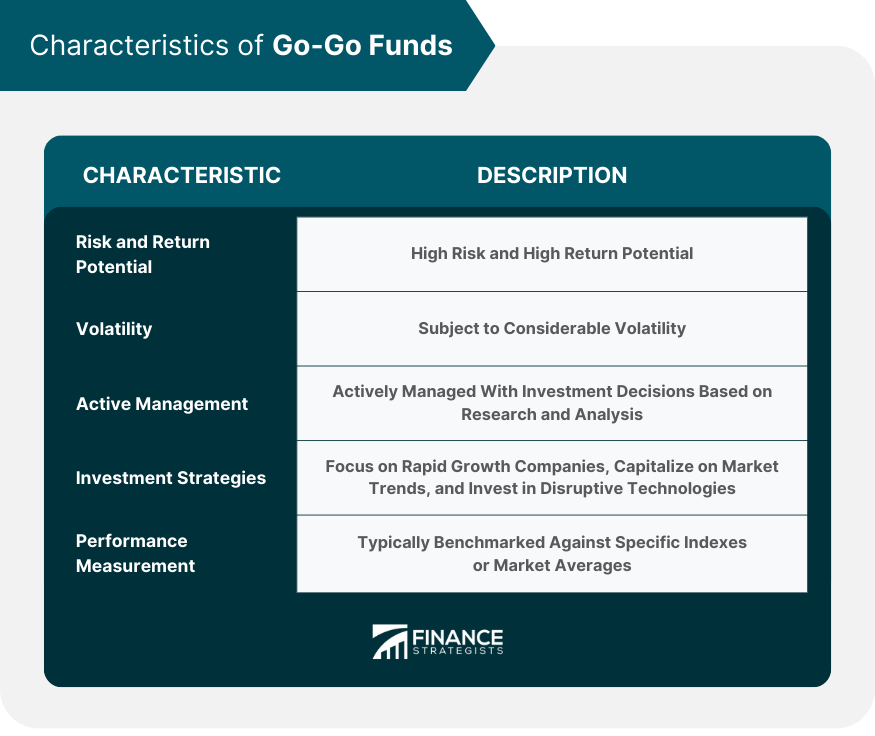

## Table of Contents

## What is Go-Go Fund?

Go-Go Fund is a website where people can ask for money to help with different projects or personal needs. People share their stories and set a goal for how much money they need. Others can then choose to give money to help reach that goal. It's a way for people to support each other, whether it's for starting a new business, paying for medical bills, or helping with other important causes.

The platform is easy to use. Anyone can create a page to ask for help, and it's simple to share the page on social media to reach more people. Donors can give any amount they want, and they can often see updates on how the project is going. Go-Go Fund takes a small fee for using the service, but most of the money goes directly to the person who needs it. It's a popular way for communities to come together and make a difference.

## How does a Go-Go Fund work?

A Go-Go Fund works by letting people create a page where they can ask for money for their projects or needs. They tell their story and set a goal for how much money they want to raise. Then, they share their page with friends, family, and on social media so more people can see it. Anyone who wants to help can give money to the page. The person who started the page can share updates about their project, so donors know how things are going.

When someone donates money, Go-Go Fund takes a small fee for using their service. The rest of the money goes to the person who needs it. Donors can give any amount they want, even just a few dollars. It's a way for people to support each other, whether it's for starting a business, paying for medical bills, or helping with other important causes. It's easy to use and helps bring communities together to make a difference.

## What are the main objectives of a Go-Go Fund?

The main objective of a Go-Go Fund is to help people raise money for their projects or needs. This can be anything from starting a new business, paying for medical bills, to supporting a personal cause. By creating a page on Go-Go Fund, people can share their story and set a money goal. This allows them to reach out to friends, family, and even strangers who might want to help.

Another important objective is to bring people together to support each other. Go-Go Fund makes it easy for anyone to donate money, no matter how big or small the amount. The platform also lets the person raising money share updates, so donors can see how their contributions are making a difference. This sense of community and shared purpose is what makes Go-Go Fund special.

## Who can start a Go-Go Fund?

Anyone can start a Go-Go Fund. You don't need to be a special person or have a big project. If you need help with something, like paying for school, fixing your home, or starting a small business, you can make a page on Go-Go Fund to ask for money.

It's easy to get started. All you need to do is go to the Go-Go Fund website, make an account, and create your page. You'll need to write about why you need the money and how much you want to raise. Then, you can share your page with others so they can help you reach your goal.

## What types of projects typically use Go-Go Funds?

Many different kinds of projects use Go-Go Funds. People often use them to raise money for medical bills when they or someone they love is sick and needs help paying for treatments. They also use Go-Go Funds to help pay for big life events like weddings or funerals, which can be very expensive. Another common use is for education, where people raise money to go to school or pay off student loans.

Go-Go Funds are also popular for creative projects. Artists, musicians, and writers use them to get money to make new art, record music, or publish [books](/wiki/algo-trading-books). People starting small businesses often use Go-Go Funds to get the money they need to open their doors or buy equipment. It's a way for anyone with a dream or a need to ask for help from their community.

Sometimes, Go-Go Funds are used for community projects, like fixing up a local park or helping people after a natural disaster. These projects bring people together to make their neighborhoods better. No matter what the project is, Go-Go Funds help people share their stories and get support from others who want to help.

## How is the success of a Go-Go Fund measured?

The success of a Go-Go Fund is mainly measured by how much money it raises compared to its goal. If someone sets a goal to raise $1,000 and they end up with $1,500, that's a success because they went over their target. People look at the total amount of money raised and how many people donated to see if the project did well. If lots of people give money, even small amounts, it shows that the project has a lot of support.

Another way to measure success is by looking at how the money helps the project or the person who asked for it. If the money helps someone pay for medical bills or start a business, that's a big success. Success can also be seen in the updates and stories shared by the person who started the Go-Go Fund. If they share good news about how the money made a difference, it shows the project was successful in reaching its goals.

## What are the fees associated with using a Go-Go Fund platform?

When you use a Go-Go Fund platform, there are some fees you need to know about. The main fee is a platform fee, which is usually around 5% of the total money you raise. This fee helps pay for running the website and keeping it safe for everyone. There's also a payment processing fee, which is around 2.9% plus $0.30 for each donation. This fee goes to the company that handles the money transfers, like a bank or a payment service.

These fees are taken out of the money you raise before it gets to you. So, if you raise $100, the platform might take $5 for their fee, and the payment processor might take around $3 for their fee, leaving you with about $92. It's good to think about these fees when you set your fundraising goal, so you can make sure you raise enough money to cover them and still reach your target.

## Can Go-Go Funds be used for non-profit causes?

Yes, Go-Go Funds can be used for non-profit causes. Many people and organizations use Go-Go Fund to raise money for things like helping the homeless, protecting the environment, or supporting education. It's a good way for non-profits to tell their story and get money from people who want to help. Non-profits can create a page on Go-Go Fund, set a goal, and share it with others. People can then donate to the cause and help make a difference.

The process is simple. A non-profit group makes a page and tells people what they need money for. They can share pictures and updates to show how the money will be used. Donors can give any amount they want, and they feel good knowing they are helping a cause they care about. Go-Go Fund takes a small fee, but most of the money goes to the non-profit to help with their work. It's a great way for non-profits to connect with people who want to support their mission.

## What are the legal and tax implications of running a Go-Go Fund?

When you run a Go-Go Fund, you need to know about some legal and tax things. If you are raising money for a personal need, like medical bills or school fees, the money you get is usually not taxed. But, if you use the money to make more money, like starting a business, you might have to pay taxes on it. It's a good idea to talk to a tax expert to make sure you do everything right. Also, you need to follow the rules of the Go-Go Fund platform and any local laws about fundraising.

If you are running a Go-Go Fund for a non-profit cause, the rules can be different. Non-profits don't usually pay taxes on the money they raise, but they need to keep good records and use the money for their mission. They also need to follow special rules about how they ask for money and report it. It's important for non-profits to check with a lawyer or a tax expert to make sure they are doing everything the right way.

## How does a Go-Go Fund impact the traditional funding landscape?

Go-Go Fund has changed how people get money for their projects and needs. Before, people mostly used banks or big investors to get money. Now, with Go-Go Fund, anyone can ask for help from friends, family, and even strangers. This makes it easier for people who might not have been able to get money the old way. It's like a big online community where people help each other out.

This change has made the world of funding more open and fair. People with small projects or personal needs can now get the money they need without going through big banks or investors. Go-Go Fund also lets people share their stories and connect with others who want to help. This has made fundraising more personal and has brought people together in new ways.

## What are the potential risks and challenges associated with Go-Go Funds?

Using Go-Go Funds can have some risks. One big risk is that you might not reach your money goal. If you don't get enough money, you might not be able to do your project or take care of your needs. Another risk is that some people might use Go-Go Funds to trick others and take their money. It's important to be careful and check if the person asking for money is telling the truth. Also, there are fees that come with using Go-Go Funds, which means you might not get all the money people give you.

There are also challenges when you use Go-Go Funds. It can be hard to get a lot of people to see your page and give money. You need to share your story well and make people want to help you. It can also take a lot of time to keep updating your page and thanking people who give money. Plus, if you're using Go-Go Funds for a non-profit or business, you need to make sure you follow all the rules and laws about fundraising and taxes. This can be tricky and might need help from experts.

## How can data analytics enhance the effectiveness of Go-Go Fund campaigns?

Data analytics can help make Go-Go Fund campaigns work better by showing who is giving money and how they found out about the campaign. By looking at this information, people running the campaign can see what kind of stories or messages get more donations. They can also find out which social media platforms or websites are best for sharing their page. This helps them focus their efforts where they will get the most help.

Using data analytics also lets campaign organizers see how much money they are raising over time. They can see if they need to change their goal or try new ways to get more donations. By understanding these patterns, they can make their campaign more successful. This can mean reaching more people and getting more money to help with their project or need.

## References & Further Reading

[1]: Manaster, S. (1975). ["The 'Go-Go' Years and the '70s Market."](https://www.amazon.com/Go-Go-Years-Crashing-Streets-Bullish-ebook/dp/B00MAEVRAQ) Financial Analysts Journal.

[2]: Lopez de Prado, M. (2018). ["Advances in Financial Machine Learning."](https://www.amazon.com/Advances-Financial-Machine-Learning-Marcos/dp/1119482089) Wiley.

[3]: Aronson, D.R. (2006). ["Evidence-Based Technical Analysis: Applying the Scientific Method and Statistical Inference to Trading Signals."](https://www.amazon.com/Evidence-Based-Technical-Analysis-Scientific-Statistical/dp/0470008741) Wiley.

[4]: Chan, E. P. (2009). ["Quantitative Trading: How to Build Your Own Algorithmic Trading Business."](https://github.com/egorpe/EPChan-QuantitativeTrading/blob/master/example7_6.m) John Wiley & Sons.

[5]: Jansen, S. (2020). ["Machine Learning for Algorithmic Trading."](https://github.com/stefan-jansen/machine-learning-for-trading) Packt Publishing.