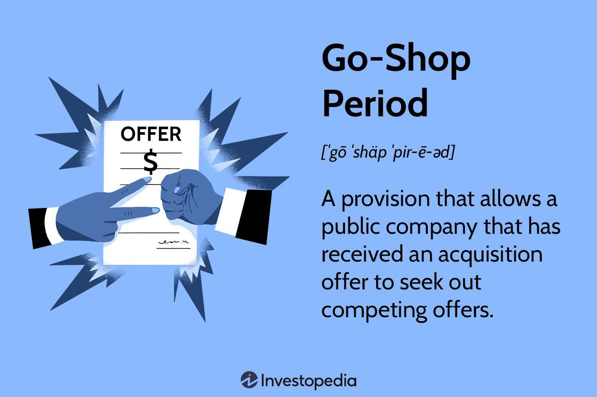

Mergers and acquisitions (M&A) are pivotal strategies that corporations employ to spur growth and restructure their operations. These transactions not only facilitate market expansion but also enable diversification of products or services and the realization of financial synergy. At the core of M&A activities lies a complex web of strategic considerations, legal frameworks, and financial assessments, making the understanding of such transactions crucial for stakeholders involved.

Central to many M&A agreements are corporate provisions such as the go-shop period, a mechanism designed to safeguard shareholder interests by allowing the target company to actively seek alternative bids even after a deal has been signed. This provision is essential in fostering competitive bidding, thus ensuring that shareholders receive the best possible offer. The intricacies of the go-shop period highlight the need for careful negotiation and strategic foresight in M&A deals.



Algorithmic trading, a modern innovation in financial markets, also plays a significant role in M&A activities. By employing computer algorithms to execute trades rapidly and in large volumes, this technology enhances the ability to identify profitable trading opportunities and manage associated risks. Consequently, algorithmic trading influences the dynamics of M&A transactions, offering new avenues for efficiency and decision-making.

This article examines these critical components, exploring how provisions like the go-shop period and technological advancements such as algorithmic trading shape the landscape of corporate transactions. With the continuous evolution of market conditions and technologies, understanding these elements is vital for crafting robust M&A strategies that maximize shareholder value.

## Table of Contents

## Understanding Mergers and Acquisitions

Mergers and acquisitions (M&A) are critical strategies employed by companies to stimulate growth and enhance corporate performance. These complex transactions involve the consolidation of companies or assets, leading to potential increases in market share, diversification of product lines or services, and the realization of financial synergies.

The primary motivation behind engaging in M&A transactions is to achieve economies of scale. By merging with or acquiring other companies, businesses can streamline operations, reduce costs, and increase efficiency. This strategic alignment often results in enhanced competitive positioning in the market, allowing firms to capture a larger market share. Diversification is another compelling reason for companies to pursue M&A. By acquiring firms in new markets or sectors, companies can mitigate risks associated with their primary business operations. This diversification can stabilize revenue streams and provide a buffer against market [volatility](/wiki/volatility-trading-strategies).

Financial synergy is also a significant driver of M&A activities. When companies combine forces, they can often generate increased shareholder value beyond the sum of their independent values. This can be achieved through cost reductions, tax benefits, and the optimization of capital structure. For instance, the combined entity may have lower borrowing costs due to improved creditworthiness.

The successful execution of M&A transactions requires careful negotiation and a thorough understanding of the intricate legal, financial, and regulatory landscape. Due diligence is a critical component of this process, involving a comprehensive assessment of the target company's assets, liabilities, operations, and legal standing. This helps identify potential risks and opportunities, informing the strategic alignment of the transaction. In addition, negotiating the terms of an M&A deal is a complex process that involves establishing the transaction price, considering payment methods (such as cash or stock), and determining the future role of the target company's management team.

Another essential aspect of M&A is valuation. Accurately assessing the worth of a company is paramount to ensuring a fair transaction. This often involves using financial models, such as discounted cash flow (DCF) analysis, to project future cash flows and determine present value.

In conclusion, mergers and acquisitions are strategic endeavors aimed at fostering growth and improving corporate performance. Through careful negotiation, detailed due diligence, and proper valuation, companies can capitalize on these transactions to gain a competitive edge and drive long-term shareholder value.

## The Go-Shop Period: A Strategic Mechanism

A go-shop period is a significant provision in merger and acquisition agreements, designed to enhance the prospects of achieving the best possible deal for a target company's shareholders. This mechanism grants the target company a specified period of time, typically ranging from 30 to 60 days, during which it can actively solicit and negotiate with third-party bidders, even after it has entered into an acquisition agreement with an initial bidder. The primary objective is to maximize shareholder value by fostering a competitive bidding environment.

The go-shop period serves as a protective measure by allowing the target company to continue exploring alternative transactions that might offer more favorable terms than those initially agreed upon. This provision mitigates concerns of inadequate bidding processes and limited initial buyer interest, which could potentially undervalue the target company's assets. By encouraging competitive bids, the go-shop period can lead to an increase in the price received by shareholders, thereby aligning with the fiduciary duties of the company's board of directors.

The effectiveness of a go-shop period largely depends on its structure and the market conditions. It requires careful management to balance its potential to secure better offers against the initial agreement's inherent uncertainties. A well-executed go-shop can act as a catalyst for improved offer terms, while also adding complexity to the negotiation dynamics with the original bidder. In practice, the inclusion of a go-shop period can influence the initial bidder's offer, anticipated competition, and the negotiation of break-up fees that may be incurred if the original agreement is terminated due to a superior proposal emerging during the go-shop period.

Overall, the strategic use of a go-shop period highlights its value as a tool for safeguarding shareholder interests, promoting market competition, and enhancing the target company's negotiation leverage.

## Algorithmic Trading in M&A

Algorithmic trading deploys complex computer algorithms to execute trades at exceptionally high speeds and volumes, significantly influencing the financial markets and processes such as mergers and acquisitions (M&A). This form of trading leverages vast amounts of data to identify potential trading opportunities and manage associated risks, impacting the dynamics of corporate transactions.

At its core, [algorithmic trading](/wiki/algorithmic-trading) involves the use of predefined rules and models to make trading decisions, often based on timely market data. Algorithms can quickly analyze various parameters, such as price, timing, and [volume](/wiki/volume-trading-strategy), to ascertain the most favorable conditions for executing trades. This capability is crucial in M&A scenarios, where market perceptions and rapid price movements can dramatically affect deals.

The ability of algorithms to process information and execute trades without human intervention enables market participants to react instantaneously to market changes. For instance, when an announcement is made about a potential merger, algorithms can immediately assess the information and make trades based on the anticipated effects on stock prices. This swift reaction can create [arbitrage](/wiki/arbitrage) opportunities where traders exploit differences in a stock's price post-announcement.

In the context of M&A, algorithmic trading serves several purposes:

1. **Efficiency and Speed**: It provides an advantage in executing large volumes of trades rapidly, which is especially beneficial when markets respond to news of corporate acquisitions or mergers.

2. **Risk Management**: Algorithms can be designed to minimize exposure to risk by implementing stop-loss orders or by diversifying trades across various assets and time frames.

3. **Market Analysis**: Algorithms analyze market trends and patterns that could influence the outcome of M&A activities. By simulating different scenarios, they can predict how respective stock prices might move in response to announcements or developments in the M&A process.

To illustrate, consider the Python snippet below, which outlines a basic arbitrage trading strategy one might apply in an M&A situation:

```python
def detect_arbitrage_opportunity(stock_prices_before, stock_prices_after):
    arbitrage_opportunities = []
    for stock, price_before in stock_prices_before.items():
        price_after = stock_prices_after.get(stock, None)
        if price_after:
            price_change = price_after - price_before
            if abs(price_change) / price_before > 0.05: # Example threshold for arbitrage
                arbitrage_opportunities.append((stock, price_change))
    return arbitrage_opportunities

# Example usage
stock_prices_before = {'ABC': 100, 'XYZ': 150}
stock_prices_after = {'ABC': 107, 'XYZ': 140}

opportunities = detect_arbitrage_opportunity(stock_prices_before, stock_prices_after)
print("Arbitrage Opportunities:", opportunities)
```

This code illustrates how an algorithm might spot opportunities for profit based on price changes before and after a merger announcement. Proper conditions and thresholds guide the algorithm to ensure it identifies potentially lucrative trading opportunities.

Overall, algorithmic trading in the context of M&A transactions enhances market efficiency, reduces transaction costs, and allows for quick capital allocation. Nevertheless, it is crucial for firms employing these strategies to maintain transparency and adhere to regulatory standards to safeguard market integrity.

## Benefits and Challenges of Go-Shop Provisions

Go-shop provisions are mechanisms in merger and acquisition agreements that permit a target company to actively seek superior offers from other potential buyers, even after an initial agreement has been reached. This clause is particularly beneficial as it allows the board of directors to fulfill their fiduciary duty of ensuring that shareholders receive the most advantageous offer. By fostering an environment of competition, go-shop periods can lead to better financial outcomes for shareholders, as new bidders may come forward with more lucrative proposals.

The primary benefit of a go-shop clause is its ability to maximize shareholder value. By allowing a target company to engage with other suitors, it provides the opportunity for higher bids to emerge, which can enhance the offer received by the shareholders. This period is usually characterized by a specified time frame, commonly ranging between 30 to 60 days, during which the directors can solicit additional proposals. A successful go-shop process not only ensures adherence to the board's fiduciary responsibility but also mitigates potential claims of negligence or conflict of interest by demonstrating that the board acted to secure the best possible outcome.

However, go-shop provisions also present several challenges. One of the main drawbacks is the introduction of uncertainty into the initial deal. The existence of a go-shop period may cause the initial bidder to lose confidence in the guaranteed closure of their offer, potentially leading them to lower their bid or withdraw entirely. This uncertainty can complicate negotiations, as the original bidder might insist on certain concessions, such as higher termination or break-up fees, to compensate for the augmented risk introduced by the go-shop period.

Furthermore, the competitive landscape introduced by a go-shop clause might not always produce better offers. The effectiveness of these periods heavily relies on market conditions and the strategic attractiveness of the target company. In some cases, the go-shop process may yield no additional bids, thereby adding unnecessary complexity and delaying the finalization of the transaction.

In conclusion, while go-shop provisions offer a strategic advantage by enabling boards to explore and secure the best possible deal for their shareholders, they also come with inherent challenges. These include potential uncertainties in initial agreements and complexities in negotiations with original bidders. Balancing these benefits and challenges requires adept strategic planning and a keen understanding of market dynamics to protect shareholder interests and capitalize on potential opportunities.

## Real-World Examples of Go-Shop Periods

Dell's acquisition offers a pertinent example of how go-shop periods can influence the outcomes of mergers and acquisitions. In October 2013, Dell Inc. underwent a significant transaction where its founder, Michael Dell, in partnership with the private equity firm Silver Lake Partners, sought to take the company private. The initial offer was set at $24.4 billion. However, as part of the acquisition agreement, Dell's board of directors implemented a go-shop period to ensure they were fulfilling their fiduciary duties by seeking potentially better offers for shareholders.

During the 45-day go-shop period, Dell actively solicited alternative acquisition proposals. This process is not merely a procedural formality but rather a strategic mechanism to possibly uncover a superior offer. To facilitate the evaluation of any incoming offers, the board had negotiated a relatively modest break-up fee, which is a predefined compensation the original bidder receives if their deal falls through due to another offer being accepted. The lower break-up fee is intended to not disincentivize potential competitors from submitting a bid during the go-shop period.

The impact of the go-shop period in the Dell case was noticeable. Although no superior bid ultimately materialized, the go-shop provision added credibility to the board's decision and the final transaction. It demonstrated that the board took comprehensive measures to explore all options for maximizing shareholder value. The go-shop period effectively secured shareholder approval, showing a robust attempt to achieve the best outcome for stakeholders.

This example underscores the go-shop provision's role in shaping the negotiation dynamics and final agreements of M&A transactions. By creating opportunities for competitive offers, a well-implemented go-shop period has the potential to lead to better financial terms and instill confidence among shareholders regarding the fairness of the board's decision-making process.

## Legal and Financial Implications

Go-shop periods and associated break-up fees play an essential role in mergers and acquisitions (M&A) negotiations, requiring strategic management to balance associated risks and rewards. The go-shop provision is not merely a procedural element but a crucial safeguard designed to ensure that shareholders receive optimal value in a transaction. It allows the target company to solicit alternative acquisition proposals even after an initial deal agreement has been reached. 

This provision can lead to the identification of superior offers, thus aligning with the fiduciary responsibilities of the company's board. The board is obligated to act in the best interests of its shareholders, which involves seeking and securing the most favorable terms possible. The accompanying break-up fee is often a negotiated component, serving as compensation for the initial bidder should the deal fall through due to a successful competing offer. This fee must be set at a level that balances deterrent effects against the encouragement of competitive bidding scenarios.

The legal framework surrounding go-shop periods and break-up fees is intricate. It demands careful consideration to protect shareholder interests while promoting fair competition. Regulatory bodies often scrutinize these provisions to ensure that they do not unduly inhibit the emergence of competing bids that could deliver greater shareholder value. From a financial perspective, these mechanisms are pivotal in influencing the dynamics between the purchasing entities and the target company. 

Managing the go-shop period effectively involves strategic planning and negotiation skills to mitigate uncertainties inherent in M&A deals. The presence of a break-up fee introduces a financial consideration that must be weighed against the potential benefits of attracting additional bidders. An optimal balance can create an environment that maximizes shareholder value, ensuring that every aspect of a merger or acquisition aligns with the overarching goal of strategic growth and corporate restructuring.

Legal advisors often play a critical role in structuring these provisions to minimize litigation risks and ensure compliance with corporate governance standards. The effective integration of go-shop periods and break-up fees in M&A transactions requires a comprehensive understanding of legal obligations and financial impacts, highlighting the need for expertise in both areas to navigate these complex negotiations proficiently.

## The Future of M&A Transactions

The future of mergers and acquisitions (M&A) is poised for transformation driven by the integration of technology, particularly algorithmic trading and [artificial intelligence](/wiki/ai-artificial-intelligence) (AI). These technological advancements are redefining how companies assess, negotiate, and execute corporate transactions. Algorithmic trading, for instance, enables firms to process vast volumes of data and execute trades at unprecedented speeds. This capability not only changes the dynamics of market pricing during M&A activity but also helps in identifying optimal transaction timings and managing associated risks.

As AI continues to mature, its application in M&A extends beyond trading. AI-driven analytics facilitates enhanced due diligence by enabling companies to analyze unstructured data sets rapidly, identify patterns, and predict potential outcomes. Machine learning algorithms can provide insights into market trends and help identify targets that align with strategic goals. Additionally, AI can assist in valuing companies more accurately by taking into account a wider range of variables and scenarios.

Market dynamics are also expected to shift, influencing the use of strategic mechanisms such as go-shop periods. Traditionally, go-shop periods allow a company to solicit higher offers even after an initial deal is agreed upon, ensuring competitive fairness and shareholder interests. As technology alters competitive landscapes and market efficiencies, the strategic implementation of these periods may become more nuanced. Companies might leverage the analytical power of AI to determine the most opportune times to initiate go-shop periods, maximizing competitive bidding and shareholder returns.

Furthermore, as technology progresses, we may see the emergence of new tools and provisions that adjust to the complexities of modern corporate needs. Blockchain technology, for instance, holds potential for enhancing transparency and security in M&A processes, potentially reducing transaction times and costs by providing an immutable and decentralized record of due diligence and contractual agreements.

In conclusion, advancing technology is anticipated to continuously reshape M&A transactions. The increasing importance of algorithmic trading and AI in these transactions underscores the need for companies to adapt and integrate these technologies into their strategic planning. This evolution will likely lead to more optimized, efficient, and value-driven corporate transactions, influencing how companies approach their growth and restructuring initiatives.

## Conclusion

Navigating the complexities of mergers and acquisitions (M&A) is an intricate process that necessitates a thorough understanding of key provisions such as the go-shop period, alongside the strategic deployment of algorithmic trading. These components are instrumental in shaping M&A strategies that effectively enhance shareholder value.

The go-shop period serves as a crucial mechanism that allows target companies to explore better offers even after an initial agreement is reached. By encouraging competitive bidding, the go-shop provision helps ensure shareholders receive optimal value from potential corporate transactions. This strategic period empowers boards of directors to fulfill their fiduciary duties, promoting a balance between potential deals and shareholders' interests.

Algorithmic trading, leveraging advanced computational strategies, has become a transformative force in M&A. Its ability to process vast datasets and execute trades with precision enhances market efficiency and aids in identifying attractive opportunities. By mitigating risks and optimizing transaction outcomes, algorithmic trading supports companies in making informed strategic decisions during mergers and acquisitions.

For companies and investors aiming to maximize value through M&A activities, mastering these components is of paramount importance. A comprehensive understanding and effective application of go-shop provisions and algorithmic trading enable entities to navigate competitive landscapes, safeguard shareholder interests, and drive sustainable corporate growth. As market conditions continue to evolve with technological advancements, the successful integration of these elements into M&A strategies will be crucial in achieving long-term organizational objectives.

## References & Further Reading

[1]: Gaughan, P. A. (2015). ["Mergers, Acquisitions, and Corporate Restructurings"](https://onlinelibrary.wiley.com/doi/book/10.1002/9781119380771). John Wiley & Sons.

[2]: Harroch, R. M., & Lipkin, A. V. (2020). ["M&A: The Importance of the Go-Shop Provision."](https://www.forbes.com/sites/allbusiness/2016/03/17/13-key-intellectual-property-issues-in-mergers-and-acquisitions/) Forbes.

[3]: Easterbrook, F. H., & Fischel, D. R. (1982). ["The Proper Role of a Target's Management in Responding to a Tender Offer."](https://chicagounbound.uchicago.edu/journal_articles/2068/) Harvard Law Review, 94(6), 1161-1204.

[4]: McDonald, J. G., & Cavalluzzo, K. S. (1996). ["The Role of Mergers and Acquisitions in the Evolution of Industry Structure"](https://www.jstor.org/stable/10.1086/341638). Applied Economics, 28(12), 1599-1606.

[5]: Hasbrouck, J. (2003). ["Intraday Price Formation in U.S. Equity Index Markets."](https://onlinelibrary.wiley.com/doi/10.1046/j.1540-6261.2003.00609.x) Journal of Risk, 12(3), 115-137.