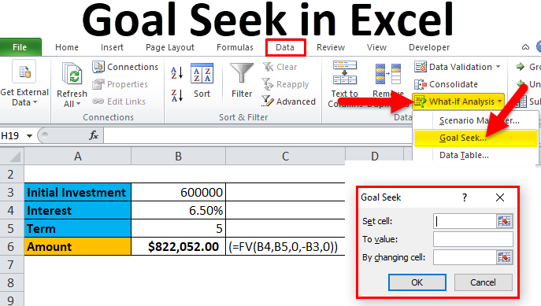

## Table of Contents

## What is Goal Seek in Microsoft Excel?

Goal Seek is a tool in Microsoft Excel that helps you find the right input when you know the result you want. Imagine you have a formula in a cell, and you know what the final number should be, but you're not sure what number to put into the formula to get that result. Goal Seek can figure that out for you. It works by changing one cell's value until the formula in another cell matches your target number.

Using Goal Seek is easy. You start by going to the 'Data' tab on the Excel ribbon and clicking on 'What-If Analysis', then selecting 'Goal Seek'. A small window will pop up where you can tell Excel which cell has the formula you want to change, what the desired result is, and which cell you want Excel to change to reach that result. Once you click 'OK', Excel will do the work and show you the new value that makes your formula match your goal. It's a handy tool for solving problems quickly without lots of guesswork.

## How do you access the Goal Seek tool in Excel?

To use the Goal Seek tool in Excel, first open your Excel workbook. Look at the top of the screen for the 'Data' tab. Click on it, and you'll see a section called 'Forecast'. Inside that section, there's a button labeled 'What-If Analysis'. Click on that button, and a small menu will pop up. From this menu, choose 'Goal Seek'.

After you click 'Goal Seek', a new window will appear. This window asks you for three things: the cell with the formula you want to change, the result you want that formula to give, and the cell you want Excel to change to reach that result. Fill in these details, then click 'OK'. Excel will then work its magic, adjusting the value in the cell you specified until the formula's result matches your goal.

## Can you explain the basic steps to use Goal Seek?

To use Goal Seek in Excel, first go to the 'Data' tab at the top of your screen. Find the 'What-If Analysis' button in the 'Forecast' section and click it. A small menu will pop up, and you should choose 'Goal Seek' from this menu. This will open a new window where you need to fill in some details.

In the Goal Seek window, you'll see three boxes. The first box asks for the cell that has the formula you want to change. The second box is where you type in the result you want that formula to give. The last box is for the cell you want Excel to change to reach that result. After you fill in these boxes, click 'OK'. Excel will then adjust the value in the cell you chose until the formula's result matches your goal.

## What types of problems can Goal Seek solve?

Goal Seek is a handy tool in Excel that can help solve many different kinds of problems. It's especially useful when you know the end result you want but aren't sure what numbers you need to start with to get there. For example, if you're trying to figure out how much you need to sell to reach a certain profit, Goal Seek can help you find that number. It can also be used in personal finance to determine how much you need to save each month to reach a savings goal, or in business to find out how many units you need to produce to meet a specific cost target.

Another common use for Goal Seek is in academic settings, where students might use it to solve equations. If you have a formula and you know what the answer should be, Goal Seek can help you find the right value to plug into the formula to get that answer. This can be especially helpful in subjects like math or physics, where you might be working with complex equations and need to find a specific input to achieve a desired output. Overall, Goal Seek is a versatile tool that can help you solve a wide range of problems by working backwards from your desired result.

## What are the limitations of using Goal Seek?

Goal Seek is helpful but it has some limits. It can only change one number at a time. If you need to change more than one number to get your result, Goal Seek won't work. Also, it can only work with numbers, so if your problem involves words or other types of data, you can't use Goal Seek.

Another limit is that Goal Seek might not find a solution if the answer you want is not possible with the numbers you have. It's also not good for very big or complex problems because it can be slow or might not find the right answer. So, while Goal Seek is great for simple problems, it's not the best tool for everything.

## How does Goal Seek differ from other Excel tools like Solver?

Goal Seek and Solver are both tools in Excel that help you find answers to problems, but they work in different ways. Goal Seek is simpler and can only change one number at a time to reach a goal. For example, if you want to know how much you need to sell to make a certain profit, Goal Seek can help you find that number. It's easy to use and works well for small, straightforward problems where you know the result you want but not the starting number.

Solver, on the other hand, is more powerful and can handle bigger and more complex problems. It can change many numbers at once to find the best solution. For instance, if you're trying to minimize costs while maximizing profits and you have several variables to consider, Solver can help you figure out the best combination of those variables. While Solver is more versatile, it's also more complicated to set up and use, so it's better for advanced users or more intricate problems.

## Can Goal Seek handle multiple variable inputs?

Goal Seek in Excel can't handle multiple variable inputs. It's designed to change just one number at a time to reach a specific goal. If you know the result you want from a formula but not the starting number, Goal Seek can help you find that number. But if your problem involves changing more than one number, Goal Seek won't work.

For problems with multiple variables, you need a different tool like Solver. Solver can change many numbers at once to find the best solution. It's more powerful and can handle bigger, more complex problems, but it's also harder to use. So, if you need to adjust several inputs to reach your goal, Solver is the tool you should use instead of Goal Seek.

## What are some common errors encountered when using Goal Seek and how to resolve them?

When using Goal Seek, you might run into a few common errors. One error is when Goal Seek can't find a solution because the result you want isn't possible with the numbers you have. For example, if you're trying to make a profit of $1000 but your costs are too high, Goal Seek won't be able to find a way to reach that profit. To fix this, check your numbers and make sure your goal is realistic. You might need to change your goal or adjust other parts of your spreadsheet to make it work.

Another error you might see is when Goal Seek says it can't change the cell you want. This usually happens because the cell you're trying to change is protected, or it has a formula in it instead of a number. To solve this, make sure the cell you want to change is not locked and contains a number, not a formula. You can unlock a cell by going to the 'Review' tab, clicking on 'Unprotect Sheet', and then making sure the cell isn't set to be protected. If the cell has a formula, you'll need to choose a different cell that has a number in it for Goal Seek to work correctly.

## How can Goal Seek be used in financial modeling?

In financial modeling, Goal Seek is a helpful tool for figuring out what numbers you need to reach your financial goals. Imagine you're trying to find out how much you need to save each month to buy a car in a year. You know the price of the car and how much interest your savings account earns. With Goal Seek, you can set the total savings at the end of the year to the price of the car, and then Goal Seek will tell you the monthly savings amount you need to reach that goal. It's like working backwards from your goal to find the right starting number.

Another way Goal Seek is used in financial modeling is for business planning. Let's say you want to know how many products you need to sell to make a certain profit. You know your costs, the price you sell the product for, and the profit you want to make. By using Goal Seek, you can set the profit to your target amount, and Goal Seek will adjust the number of units sold until your profit matches your goal. This helps you plan your sales targets and understand what you need to do to meet your financial objectives.

## What are advanced strategies for optimizing results with Goal Seek?

To get the best results from Goal Seek, start by making sure your starting numbers are as close as possible to what you think the answer will be. This helps Goal Seek find the right number faster. Also, try breaking big problems into smaller pieces. Instead of trying to change one big thing, use Goal Seek to change smaller parts one at a time. This can make it easier to find the right answer and see how each part affects your goal.

Another good strategy is to use Goal Seek along with other tools in Excel. For example, you can use it with the 'What-If Analysis' to see different possible outcomes before you set your goal. This helps you understand how different numbers can change your results. Also, after you use Goal Seek, double-check your numbers to make sure they make sense. Sometimes Goal Seek might find a number that works but doesn't make sense in real life. By checking your work, you can be sure your results are both right and useful.

## How can you automate Goal Seek using VBA in Excel?

You can use VBA to make Goal Seek work automatically in Excel. First, you need to open the VBA editor by pressing Alt + F11 on your keyboard. Then, you create a new module and write a small piece of code. The code tells Excel which cell has the formula you want to change, what result you want, and which cell you want Excel to change to reach that result. When you run the code, Goal Seek does its job without you having to click buttons in the Excel window.

Here's a simple example of how the VBA code might look: `Sub UseGoalSeek() Range("B1").GoalSeek Goal:=100, ChangingCell:=Range("A1") End Sub`. In this code, `Range("B1")` is the cell with the formula, `100` is the result you want, and `Range("A1")` is the cell you want to change. When you run this code, Excel will change the value in cell A1 until the formula in B1 equals 100. Automating Goal Seek with VBA can save you time, especially if you need to do the same Goal Seek operation many times.

## What are some real-world examples or case studies where Goal Seek has been effectively used?

In a small business, Goal Seek was used to figure out how many products needed to be sold to break even. The owner knew the cost of making each product and the price it was sold for. By using Goal Seek, they set the profit to zero and found out the exact number of products they needed to sell to cover all their costs. This helped the owner plan their sales targets and make sure the business stayed profitable.

Another example is in personal finance. A person wanted to save enough money to go on a vacation in a year. They knew how much the vacation would cost and how much interest their savings account would earn. By using Goal Seek, they set the total savings at the end of the year to the vacation cost, and Goal Seek told them how much they needed to save each month. This helped them plan their budget and make sure they could afford the trip.

## What is Goal Seek in Microsoft Excel and how does it work?

Goal Seek is a built-in feature of Microsoft Excel that assists users in identifying the necessary input value needed to achieve a specific output, providing a practical approach to "what-if" scenarios. This tool allows users to manipulate input variables to observe changes in outcomes, offering a glimpse into potential future scenarios without complex computations.

For instance, when users need to determine the monthly payment required to pay off a loan within a specific period, Goal Seek can alter the payment amount until the balance reaches zero. Such calculations are vital for financial planning and forecasting, making Goal Seek an essential feature for professionals dealing with financial data.

The process of using Goal Seek involves specifying the cell containing the formula, setting a target value, and identifying the cell Excel will adjust to meet this target. A typical application might involve calculating a target profit margin. For a given revenue and expense scenario, Goal Seek can adjust a variable—such as price or [volume](/wiki/volume-trading-strategy)—until the profit margin reaches the desired percentage.

A practical example can be demonstrated through a simple financial model. Suppose you have the formula for monthly loan payments:

$$
\text{PMT} = \frac{r \times P}{1 - (1 + r)^{-n}}
$$

Where:
- $\text{PMT}$ is the monthly payment,
- $P$ is the loan principal,
- $r$ is the monthly interest rate,
- $n$ is the total number of payments.

Using Goal Seek, you can set the PMT cell to zero by adjusting $P$, thus finding the maximum loan amount that can be borrowed given a fixed payment.

Goal Seek simplifies the calculation process, offering instant insights into how specific changes impact overall outcomes. While robust for single-variable analysis, it presents limitations when scenarios require adjusting multiple variables simultaneously, necessitating more advanced Excel functions or supplementary software for comprehensive multi-variable assessments. Despite these constraints, Goal Seek remains a fundamental skill for both novices and professionals engaged in financial analysis and model building.

## References & Further Reading

[1]: Bergstra, J., Bardenet, R., Bengio, Y., & Kégl, B. (2011). ["Algorithms for Hyper-Parameter Optimization."](https://dl.acm.org/doi/10.5555/2986459.2986743) Advances in Neural Information Processing Systems 24.

[2]: ["Advances in Financial Machine Learning"](https://www.amazon.com/Advances-Financial-Machine-Learning-Marcos/dp/1119482089) by Marcos Lopez de Prado

[3]: ["Evidence-Based Technical Analysis: Applying the Scientific Method and Statistical Inference to Trading Signals"](https://www.amazon.com/Evidence-Based-Technical-Analysis-Scientific-Statistical/dp/0470008741) by David Aronson

[4]: ["Machine Learning for Algorithmic Trading"](https://github.com/stefan-jansen/machine-learning-for-trading) by Stefan Jansen

[5]: ["Quantitative Trading: How to Build Your Own Algorithmic Trading Business"](https://www.amazon.com/Quantitative-Trading-Build-Algorithmic-Business/dp/1119800064) by Ernest P. Chan