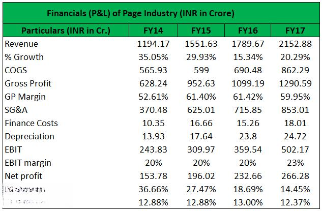

The modern financial landscape is marked by complexity and constant evolution, driven by an array of emerging developments that continually redefine accounting practices and financial reporting standards. A foundational element within this landscape is a firm's status as a going concern, a concept embedded within accounting principles and a critical indicator of financial health. This status reflects the assumption that an entity will persist in operating into the foreseeable future without facing the threat of liquidation. Ensuring a company maintains its going concern status is vital for accurate financial reporting and upholding investor confidence.

Simultaneously, the advancement of technology has led to the rise of algorithmic trading, or algo trading. This approach harnesses sophisticated algorithms and high-speed computing to execute trades with precision and efficiency, significantly transforming traditional trading methodologies. Algo trading has brought about profound changes, enhancing market liquidity and operational efficiencies, albeit introducing additional challenges such as regulatory scrutiny and the need for robust risk management.



Together, these elements—accounting principles, financial reporting, going concern analysis, and algo trading—play crucial roles in shaping decision-making processes and strategic directions within organizations. A comprehensive understanding of these interrelated concepts is indispensable for businesses, investors, and financial professionals striving to adeptly navigate and capitalize on the intricate workings of the financial world. As these domains continue to interact and develop, they will fundamentally influence the formulation of informed, strategic choices that ensure competitive advantage and sustainable advancement in today's dynamic markets.

## Table of Contents

## Understanding the Going Concern Principle

The going concern principle is a cornerstone of financial accounting, predicated on the assumption that a company will continue its operations for the foreseeable future without the threat of liquidation or distress. This assumption underpins the preparation of financial statements and drives strategic financial planning within organizations. The principle's foundation lies in its impact on asset valuation, liability recognition, and allocation of expenses over accounting periods.

### Definition and Importance

In essence, a business recognized as a going concern is expected to meet its financial obligations and sustain operational continuity, thereby justifying the carrying value of its assets and liabilities. This presumption ensures that assets are not valued as if they were to be sold off or liquidated but are considered essential parts of the operation. Consequently, the going concern status directly influences how financial data is recorded and reported, affecting stakeholders' assessments and decisions.

### Indicators and Red Flags

Certain indicators suggest potential threats to a company maintaining its going concern status. These include consistent operating losses, negative cash flows from operations, working capital deficiencies, and an inability to service debt or secure new financing. Additionally, legal proceedings, loss of a significant customer base, or macroeconomic challenges may also pose risks. Trend analysis and financial ratio evaluations often serve as tools for identifying such red flags.

### Interaction with Accounting Standards

The going concern principle operates within established accounting frameworks like the Generally Accepted Accounting Principles (GAAP) and the Generally Accepted Auditing Standards (GAAS). According to GAAP, financial statements must be prepared under the assumption that the entity is a going concern unless liquidation is imminent. Auditors, guided by GAAS, assess and provide opinions on a company's ability to continue as a going concern by evaluating the management's assessment, reviewing financial and operational plans, and examining subsequent events that may impact this status.

The interplay between accounting standards and the going concern principle necessitates rigorous evaluation processes. Auditors are required to consider all available evidence, including management's plans to mitigate financial distress. They must also evaluate whether there is substantial doubt about the entity's ability to continue as a going concern within a year after the financial statements are issued.

Understanding the going concern principle's implications helps stakeholders make informed decisions, ensuring assets are properly aligned with strategic business objectives and financial planning. It serves as a protective measure, safeguarding against potential financial misstatements and fostering trust among investors, creditors, and other stakeholders in the financial ecosystem.

## Financial Reporting and Going Concern Assessments

Financial reporting serves as a pivotal tool in evaluating a company’s ongoing viability, offering critical insights into its operational and financial health. At its core, financial statements—including the balance sheet, income statement, and cash flow statement—are instrumental in assessing a company's status as a going concern. These documents reflect a company’s assets, liabilities, revenues, expenses, and cash flows, providing a snapshot of its financial condition. 

The going concern principle assumes a business will continue to operate indefinitely and not face foreseeable liquidation. Accountants and auditors play a crucial role in evaluating this assumption. They assess whether there are substantial doubts about a company's ability to continue its operations. This evaluation is vital for stakeholders, including investors, creditors, and regulators, who rely on accurate financial health assessments to make informed decisions.

A negative going concern opinion, such as one issued in the audit report, can have significant implications. It often signals to stakeholders that a company might not be sustainable in the long term, leading to diminished investor confidence and potential difficulties in raising capital. This, in turn, could precipitate a decline in stock prices and restrict access to credit. The implications extend further, potentially impacting a company's strategic planning and operational adjustments.

The role of accountants and auditors in these evaluations is multifaceted. They must gather and analyze financial data, review operational performance, examine external economic factors, and scrutinize management’s plans to address financial challenges. Auditors, in particular, adopt auditing standards to assess whether there is substantial doubt regarding a company's ability to continue as a going concern. This involves a rigorous examination of financial statements and associated disclosures. If uncertainties about a company’s going concern status exist, they must be explicitly stated in the financial reporting documents.

Auditors utilize a range of criteria to assess a company's viability, including operating losses, negative cash flows, liabilities exceeding assets, and external factors such as economic conditions or changes in market demand. These factors are encapsulated within accounting standards such as Generally Accepted Accounting Principles (GAAP) and International Financial Reporting Standards (IFRS). In cases where doubt exists, detailed disclosures and management’s plans to mitigate these risks are vital components of financial reporting, ensuring transparency and supporting stakeholder decision-making processes.

In summary, financial reporting and going concern assessments are intertwined processes that together enable stakeholders to gauge the financial resilience and sustainability of a company. They play an integral role in shaping organizational strategies, investment decisions, and regulatory compliance. The expertise of accountants and auditors in navigating these assessments ensures the reliability and accuracy of the information provided, upholding the integrity of financial reporting.

## Algo Trading: Revolutionizing the Trading Landscape

Algorithmic trading, often referred to as algo trading, is transforming financial markets by leveraging computer algorithms to make trading decisions, execute orders, and manage portfolios with precision and speed that surpass human capabilities. This approach uses mathematical models and high-speed data analysis to execute a large number of trades in fractions of a second, optimizing for factors such as price, timing, and [volume](/wiki/volume-trading-strategy).

### Overview of Algo Trading

Algo trading operates primarily by analyzing market data with complex algorithms that identify trading opportunities based on pre-set criteria. These algorithms detect patterns and react to market changes faster than human traders. A typical algorithm might look something like this:

```python
def algo_trade(data):
    buy_threshold = 0.02
    sell_threshold = -0.02
    position = 0
    for i in range(1, len(data)):
        price_change = (data[i] - data[i-1]) / data[i-1]
        if price_change > buy_threshold and position <= 0:
            print("Buy")
            position += 1
        elif price_change < sell_threshold and position >= 0:
            print("Sell")
            position -= 1
```

This basic example illustrates how an algorithm might decide to buy or sell based on the percentage change in price.

### Benefits of Algo Trading

One of the primary benefits of algo trading is increased efficiency. By automating the trading process, algorithms can rapidly execute orders under optimal conditions, potentially capturing small market movements that might be missed by human traders. Algo trading also enhances market [liquidity](/wiki/liquidity-risk-premium), as the ability to execute many trades quickly absorbs market fluctuations.

Furthermore, alsgo trading reduces transaction costs by minimizing the need for manual interventions and allowing trades to occur at the most favorable times and prices. It also removes the emotional and psychological biases that often affect human traders, using purely quantitative approaches to make objective decisions.

### Impact on Market Liquidity and Efficiency

Algo trading contributes significantly to market efficiency. By rapidly processing large sets of information, these algorithms ensure that prices more accurately reflect available data. This, in turn, leads to more efficient markets where information is quickly embedded into asset prices, reducing the [arbitrage](/wiki/arbitrage) opportunities.

The presence of high-frequency traders, who often use algo trading strategies, has also contributed to increased market liquidity. These traders provide buying and selling pressure, enabling other participants to execute large orders without substantial price disruption.

### Challenges and Risks Associated with Algo Trading

Despite its benefits, algo trading poses several challenges and risks. A significant concern is the potential for market [volatility](/wiki/volatility-trading-strategies). Algorithms can act unexpectedly during unusual market conditions, sometimes leading to rapid swings.

Regulatory concerns are another critical aspect. Governing bodies such as the Securities and Exchange Commission (SEC) and the Commodity Futures Trading Commission (CFTC) have implemented regulations to monitor and control algo trading activities, aiming to mitigate risks like market manipulation and systemic failures.

Moreover, cybersecurity threats pose a risk to algo trading systems. The reliance on high-speed internet connections and the increasing sophistication of cyber-attacks mean that secure and robust technological infrastructure is crucial.

In summary, [algorithmic trading](/wiki/algorithmic-trading) is revolutionizing the financial landscape by enhancing efficiency, liquidity, and accuracy within markets. While it offers many advantages, the associated risks must be carefully managed through regulatory oversight, robust system architectures, and continual evaluation of algorithm performance.

## The Intersection of Financial Reporting and Algo Trading

The intersection of financial reporting and algorithmic trading represents a significant advancement in how market transactions are executed and analyzed. Financial reporting serves as a foundational element in investment decision-making, providing critical insights into a company's performance, health, and future prospects. These reports are the lifeblood of the financial ecosystem, offering data that algorithmic trading (algo trading) tools can leverage to execute trades with precision and speed. 

Algo trading utilizes complex algorithms and high-speed computing to analyze market trends and execute orders automatically based on pre-defined criteria. The reliance on accurate and transparent financial reporting is paramount as it provides the raw data necessary for these algorithms to function effectively. Financial statements, such as balance sheets, income statements, and cash flow statements, are input into algo trading systems, which in turn use sophisticated models to predict market movements, optimize portfolios, and manage risk.

Advancements in data analysis and [artificial intelligence](/wiki/ai-artificial-intelligence) (AI) have further strengthened the integration of accounting principles with trading strategies. AI-driven models can process large volumes of financial data at unprecedented speeds, identifying patterns and anomalies that might be missed by human analysts. These models are capable of using [machine learning](/wiki/machine-learning) techniques to improve over time, refining trading strategies based on historical data and evolving market conditions.

For instance, through natural language processing (NLP), AI systems can analyze textual data from financial reports, news releases, and analyst ratings to assess market sentiment and inform trading decisions. This capability allows traders to react swiftly to changes in market dynamics and make decisions that are backed by empirical data rather than intuition alone.

Here's a simple illustration of how an algorithm might be crafted in Python to analyze a stock's financial report and make a trading decision:

```python
import numpy as np

def calculate_basic_ratios(financial_data):
    """
    Calculate basic financial ratios for a stock given its financial data.

    financial_data: dict with keys 'revenue', 'cost_of_goods_sold', 
                    'operating_expenses', 'total_assets'.
    """
    gross_margin = (financial_data['revenue'] - financial_data['cost_of_goods_sold']) / financial_data['revenue']
    operating_margin = (financial_data['revenue'] - financial_data['cost_of_goods_sold'] - financial_data['operating_expenses']) / financial_data['revenue']
    asset_turnover = financial_data['revenue'] / financial_data['total_assets']

    return {
        'gross_margin': gross_margin,
        'operating_margin': operating_margin,
        'asset_turnover': asset_turnover
    }

def should_buy_stock(financial_ratios):
    """
    Make a simple trading decision based on financial ratios.

    financial_ratios: dict of financial ratios.
    """
    if financial_ratios['gross_margin'] > 0.4 and financial_ratios['operating_margin'] > 0.2 and financial_ratios['asset_turnover'] > 0.5:
        return True
    return False

# Example financial data for a fictional company
financial_data_example = {
    'revenue': 1000000,
    'cost_of_goods_sold': 400000,
    'operating_expenses': 200000,
    'total_assets': 1500000
}

ratios = calculate_basic_ratios(financial_data_example)
decision = should_buy_stock(ratios)

print("Buy the stock?" if decision else "Do not buy the stock.")
```

This code evaluates basic financial ratios to decide whether a stock merits purchase. Such algorithms, when scaled and refined, enable institutions to make informed and rapid investment decisions based on real-time financial reporting. As the financial world continues to evolve—with an increasing emphasis on real-time data and AI-driven insights—this intersection will remain a crucial area of focus, pushing the boundaries of what is possible in trading and investment strategies.

## Future Trends and Innovations

The future of financial reporting, going concern evaluations, and algorithmic trading is marked by rapid technological advancements that promise to reshape these domains significantly. A key development is the emergence of artificial intelligence (AI) and machine learning, which are transforming financial decision-making. AI algorithms are increasingly being used to analyze large datasets, identify patterns, and generate actionable insights that were previously beyond human capability. This enhanced analytical power supports more accurate financial reporting and robust going concern evaluations, enabling stakeholders to make more informed decisions.

Moreover, there is a growing trend towards real-time reporting. Traditional financial reporting cycles, which often rely on quarterly or annual updates, are gradually becoming less adequate in a fast-paced global economy. Real-time reporting utilizes advanced data collection, management, and analytics technologies to provide stakeholders with continuous insights into a company's financial health. This shift not only enhances transparency but also enables businesses to react promptly to financial risks and opportunities.

Another significant trend is the integration of AI with algorithmic trading strategies. Algorithmic trading systems are becoming increasingly sophisticated, using AI to process financial reports rapidly and make informed trading decisions. The synergy between accurate financial reporting and AI-driven analysis enhances trading efficiency, market liquidity, and overall investment strategies.

As these innovations advance, they also bring challenges, particularly in terms of regulation and ethical concerns. Regulators are tasked with ensuring that these technologies are used fairly and transparently, preventing potential abuses and maintaining market integrity.

In summary, the integration of AI and real-time reporting into financial systems is likely to redefine the landscape of accounting and trading. As stakeholders adapt to these changes, they must remain vigilant about potential risks and be proactive in leveraging new opportunities for strategic advantage. As development continues, these trends hold the promise of a more dynamic, responsive, and informed financial landscape.

## Conclusion

The integration of accounting principles, financial reporting, going concern evaluations, and algorithmic trading forms the backbone of the contemporary financial landscape. These components collectively enhance decision-making, streamline processes, and ensure transparency, all critical for stakeholders striving for competitive advantage. By understanding the synergy between these elements, businesses and investors can better anticipate market movements, optimize strategies, and safeguard financial health.

As highlighted throughout this article, accounting principles provide the framework for transparent and standardized financial reporting. These reports are instrumental in evaluating a firm's sustainability, often referred to through the going concern principle. This evaluation serves as a barometer for assessing an organization's ability to sustain operations, thereby influencing investor confidence and strategic planning.

Algorithmic trading, with its reliance on complex algorithms and high-speed data analysis, capitalizes on the information provided by comprehensive financial reports. It allows for rapid execution of trades, optimizing market participation and liquidity. However, this efficiency is contingent upon the accuracy and reliability of financial data, underscoring the need for robust financial reporting systems.

Looking ahead, the interplay between these domains promises both challenges and opportunities. Technological advancements, such as artificial intelligence and real-time data processing, will likely enhance this integration, enabling more nuanced and faster decision-making processes. As these tools evolve, financial professionals must navigate an increasingly sophisticated landscape, continuously adapting to maintain and enhance their market positions.

Understanding and leveraging these interconnections not only enable informed decision-making but also fortify a company's stance against volatile market dynamics. As we progress, the modern financial environment will likely demand higher synergies between these fundamental aspects, compelling stakeholders to innovate and adapt continually.

## References & Further Reading

[1]: ["Going Concern - Understanding the Basics"](https://www.investopedia.com/terms/g/goingconcern.asp) - IFRS Foundation

[2]: ["Accounting Standards for Going Concern"](https://viewpoint.pwc.com/dt/us/en/pwc/accounting_guides/financial_statement_/financial_statement___18_US/chapter_24_risks_and_US/245_going_concern_US.html) - Financial Accounting Standards Board (FASB)

[3]: ["Algo Trading: How the SEBI Changed the Landscape in India"](https://www.sebi.gov.in/reports-and-statistics/reports/dec-2021/consultation-paper-on-algorithmic-trading-by-retail-investors_54515.html?s=09) by Moneycontrol

[4]: Paddrik, M. E., Hayes, R., Todd, A., Yang, S., & Beling, P. A. (2013). ["An Agent-Based Model of the E-Mini S&P 500 to Understand Flash Crashes."](https://papers.ssrn.com/sol3/papers.cfm?abstract_id=1932152)

[5]: Knight, F. H. (2013). ["Risk, Uncertainty, and Profit."](https://oll.libertyfund.org/titles/knight-risk-uncertainty-and-profit) University of Chicago Press. 

[6]: ["Automated Trading With R"](https://github.com/chrisconlan/automated_trading_with_R) by Chris Conlan

[7]: Gomber, P., Arndt, B., Lutat, M., & Uhle, T. (2011). ["High-Frequency Trading"](https://papers.ssrn.com/sol3/papers.cfm?abstract_id=1858626) - Business & Information Systems Engineering.