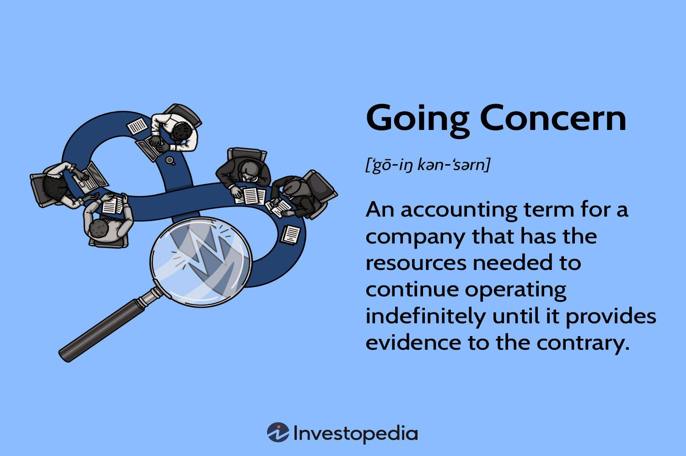

## Table of Contents

## What is the concept of going concern in financial reporting?

The concept of going concern in financial reporting is about whether a company can keep operating in the future. It looks at if the company will be able to pay its bills and continue its business for at least the next year. If there are doubts about this, it's called a "going concern issue." Accountants and auditors need to check for any signs that the company might not be able to keep going, like losing a lot of money or having big debts.

When a company has a going concern issue, it's important for the financial reports to mention this. This helps investors and others who read the reports understand the risks. If the company can't fix the problem, it might have to close down or sell its assets. This can change how the company's financial situation is shown in the reports, like showing assets at a lower value if they need to be sold quickly.

## Why is the going concern assumption important for businesses?

The going concern assumption is important for businesses because it helps everyone understand if a company will be able to keep running in the future. When people look at a company's financial reports, they want to know if the business can pay its bills and keep doing what it does. If there's a doubt about this, it's called a going concern issue. This information is crucial for investors, employees, and anyone else who cares about the company's future. They need to know if the company might have to close down or change a lot because of money problems.

If a business is seen as a going concern, it means the financial reports can show the value of things like buildings and equipment as if the company will use them for a long time. But if there's a going concern issue, the reports might need to show these things at a lower value, like what they would get if they had to sell them quickly. This can make a big difference in how the company looks financially. Knowing about going concern helps everyone make better decisions about the company, like whether to invest more money or if it's time to look for a new job.

## How does the going concern principle affect financial statements?

The going concern principle affects financial statements by shaping how a company's assets, liabilities, and overall financial health are shown. If a company is considered a going concern, it means it's expected to keep operating for the foreseeable future. In this case, the financial statements will value assets like buildings and equipment at their cost minus depreciation, assuming they will be used over a long period. This approach helps present a stable view of the company's financial position and allows for better long-term planning and investment decisions.

However, if there's doubt about the company's ability to continue as a going concern, the financial statements need to reflect this uncertainty. This could mean showing assets at a lower value, known as liquidation value, which is what the company might get if it had to sell them quickly. Liabilities might also be re-evaluated, and additional notes will be added to the financial statements to explain the going concern issue. This change can significantly impact how investors, creditors, and other stakeholders view the company's financial health, potentially affecting their decisions about investing or extending credit.

## What are the indicators that a company may not be a going concern?

There are several signs that a company might not be a going concern. One big sign is if the company is losing a lot of money and can't pay its bills. This can happen if sales are going down, costs are going up, or if the company has a lot of debt that it can't pay back. Another sign is if the company keeps needing to borrow more money just to keep going, which can show that it's not making enough money on its own. Also, if the company is losing important customers or suppliers, or if there are big legal problems, these can be signs that the company might not last much longer.

Another indicator is if the company's financial statements show a lot of changes, like selling off assets to get cash quickly. If the company is selling things it needs to operate, like machinery or buildings, it might be a sign that it's trying to stay afloat but can't keep going the way it is. Also, if the company's auditors mention in their report that there's a doubt about the company being a going concern, this is a clear warning sign. These signs together can tell people who care about the company, like investors or employees, that there might be big problems ahead.

## What steps should management take if they doubt the company's ability to continue as a going concern?

If management doubts the company's ability to continue as a going concern, they should first assess the situation carefully. This means looking at the company's finances closely to see how much money is coming in and going out, and figuring out if there are any big problems that could stop the company from operating. They should also talk to the company's accountants and auditors to get their advice on what to do. It's important to understand all the reasons why the company might be in trouble and see if there are any ways to fix things.

After understanding the situation, management should take action to try to solve the problems. This could mean finding ways to cut costs, like reducing spending on things that aren't essential. They might also try to increase income by finding new customers or selling more to existing ones. If the company has a lot of debt, management might need to talk to the people they owe money to and see if they can change the terms of the loans to make them easier to pay back. They should also think about selling off assets that aren't needed to get more cash. Throughout this process, it's crucial for management to keep everyone informed, like the board of directors, employees, and investors, about what's happening and what they're doing to fix it.

## How do auditors assess the going concern status of a company?

Auditors assess the going concern status of a company by looking at a lot of different things. They start by checking the company's financial statements to see if it's making enough money to pay its bills and keep going. They also look at other signs, like if the company is losing important customers or if it's having trouble paying back loans. Auditors talk to the company's management to understand what they think about the future and if they have plans to fix any problems. They also look at the company's plans to see if they seem realistic and if they will actually help the company stay in business.

If auditors find any signs that the company might not be a going concern, they need to think about how this affects the financial statements. They might need to change the way the company's assets and liabilities are shown in the reports. If there's a big doubt about the company's future, auditors will mention this in their report. This is important because it helps people who read the financial statements understand the risks. The goal is to make sure everyone has a clear picture of whether the company can keep operating or if it's in trouble.

## What are the disclosure requirements for going concern issues in financial statements?

When a company has doubts about being a going concern, it needs to tell people about it in its financial statements. This is important because it helps investors, employees, and others know if the company might have trouble staying open. The company has to write a note in the financial statements explaining why there's a doubt. They should talk about any big problems, like not having enough money or losing important customers. They also need to say what they're doing to fix these problems, like cutting costs or finding new ways to make money.

If the company's auditors also think there's a going concern issue, they will mention it in their report. This is called a "going concern opinion." The auditors will explain why they think the company might have trouble and what this means for the financial statements. They might say that the company's assets are shown at a lower value because they might have to be sold quickly. This helps everyone understand the risks and make better decisions about the company.

## Can you explain the difference between a going concern and a liquidation basis of accounting?

The going concern basis of accounting assumes that a company will keep operating into the future. When using this method, the financial statements show the value of things like buildings and equipment as if the company will use them for a long time. This means they are recorded at their cost minus depreciation. This approach helps everyone see the company as a stable business that will continue to make money and pay its bills. If there's a doubt about the company being able to keep going, the financial statements need to mention this, and the auditors might also talk about it in their report.

The liquidation basis of accounting is used when a company is not expected to keep operating and is going to close down or sell off all its assets. In this case, the financial statements show the value of assets at what the company might get if it has to sell them quickly. This is usually less than what the assets were worth when the company was operating normally. Liabilities are also shown differently, focusing on what needs to be paid off during the liquidation process. This method gives a clear picture of what the company's financial situation will be when it stops operating.

The main difference between the two is how they treat the company's future. The going concern basis looks at the company as continuing to do business, while the liquidation basis looks at it as ending operations. This difference affects how assets and liabilities are shown in the financial statements, which can change how investors and others see the company's financial health.

## What are the potential impacts on stakeholders if a company is not considered a going concern?

If a company is not considered a going concern, it can have big effects on people like investors, employees, and people the company owes money to. Investors might see their money lose value because the company's financial statements will show assets at lower prices, like what they would get if they sold them quickly. This can make investors worried and they might decide to sell their shares or not put more money into the company. Employees could be scared about losing their jobs if the company has to close down. They might start looking for new jobs to be safe. People the company owes money to, like banks, might think the company won't be able to pay them back and might ask for their money sooner or not lend more money.

Also, suppliers might not want to keep selling things to the company if they think it won't pay them. This can make it hard for the company to keep doing business. Customers might also stop buying from the company because they're not sure if it will be around to support the products or services they buy. All these changes can make the company's situation even worse and might lead to it closing down or being sold off. Knowing that a company is not a going concern helps everyone make better choices, like finding new jobs or investing somewhere else.

## How have recent accounting standards changed the approach to going concern evaluations?

Recent changes in accounting rules, like the ones from the Financial Accounting Standards Board (FASB) and the International Accounting Standards Board (IASB), have made it clearer and more detailed how companies should check if they can keep going as a going concern. Before, it was mostly up to the company's management to decide if they could keep running. Now, these rules say that companies have to look at their financial situation more often, at least once a year, and think about things that could stop them from staying open for the next year. If they see big problems, they have to write about it in their financial reports and explain what they're doing to fix it.

These new rules also make it more important for auditors to check the company's going concern status. Auditors have to look closely at what the company says about its future and see if it makes sense. If the auditors think the company might have trouble, they have to say so in their report. This helps everyone who reads the financial statements, like investors and employees, understand the risks better and make smarter choices about the company.

## What are some real-world examples of companies that faced going concern issues?

One real-world example of a company that faced going concern issues is Toys "R" Us. A few years ago, they said they were having trouble staying open because they couldn't pay their big debts. They tried to fix it by closing some stores and selling things at lower prices, but it didn't work out. In the end, they had to close all their stores in the U.S. This showed everyone how important it is for a company to manage its money well and keep enough cash to pay its bills.

Another example is Hertz, a car rental company. In 2020, when the world was dealing with the COVID-19 pandemic, fewer people were renting cars, and Hertz couldn't make enough money to pay back its loans. They had to tell everyone that they might not be able to keep going. Hertz tried to sell more cars and get new loans, but it was tough. They ended up filing for bankruptcy, which means they had to reorganize their business to try to stay open. This shows how big events can suddenly make it hard for a company to be a going concern.

## How can a company improve its going concern status and regain investor confidence?

If a company wants to improve its going concern status and make investors feel better, it should start by looking at its money situation carefully. They need to see where they can save money, like cutting down on things they don't really need. They might also try to make more money by finding new customers or selling more to the ones they already have. If the company has a lot of debt, talking to the people they owe money to and asking for easier payment terms can help. Selling things they don't need to get more cash is another good idea. By doing these things, the company can show everyone that they have a plan to fix their problems and keep going.

Another important step is to keep everyone in the loop. The company should tell its investors, employees, and anyone else who cares about what's happening and what they're doing to make things better. Being open and honest can help build trust. If the company can show that it's making progress, like making more money or paying off debts, this can make investors feel more confident. Over time, as the company gets stronger, it can regain its going concern status and make people believe in it again.

## References & Further Reading

[1]: ["Going Concern - Understanding the Basics"](https://www.investopedia.com/terms/g/goingconcern.asp) - IFRS Foundation

[2]: ["Accounting Standards for Going Concern"](https://viewpoint.pwc.com/dt/us/en/pwc/accounting_guides/financial_statement_/financial_statement___18_US/chapter_24_risks_and_US/245_going_concern_US.html) - Financial Accounting Standards Board (FASB)

[3]: ["Algo Trading: How the SEBI Changed the Landscape in India"](https://www.sebi.gov.in/reports-and-statistics/reports/dec-2021/consultation-paper-on-algorithmic-trading-by-retail-investors_54515.html?s=09) by Moneycontrol

[4]: Paddrik, M. E., Hayes, R., Todd, A., Yang, S., & Beling, P. A. (2013). ["An Agent-Based Model of the E-Mini S&P 500 to Understand Flash Crashes."](https://papers.ssrn.com/sol3/papers.cfm?abstract_id=1932152)

[5]: Knight, F. H. (2013). ["Risk, Uncertainty, and Profit."](https://oll.libertyfund.org/titles/knight-risk-uncertainty-and-profit) University of Chicago Press. 

[6]: ["Automated Trading With R"](https://github.com/chrisconlan/automated_trading_with_R) by Chris Conlan

[7]: Gomber, P., Arndt, B., Lutat, M., & Uhle, T. (2011). ["High-Frequency Trading"](https://papers.ssrn.com/sol3/papers.cfm?abstract_id=1858626) - Business & Information Systems Engineering.