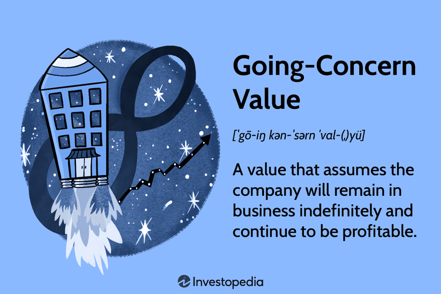

In the complex world of corporate finance, understanding the full value of a business is critical for investors and stakeholders. Business valuation encompasses various methods and metrics, among which going concern value holds significant importance. This article explores the concepts surrounding business valuation, going concern value, corporate finance, and the impact of algorithmic trading. By dissecting these components, we aim to provide a comprehensive overview that aids decision-making in investments, mergers, and acquisitions. Understanding these concepts can significantly enhance strategic planning and future financial performance. Clarity in valuation methods and their application is essential, as it helps stakeholders make informed decisions and optimize the economic potential of corporate entities.

## Table of Contents

## Understanding Business Valuation

Business valuation is a critical process in corporate finance, focusing on determining the economic value of a business or company. This process is pivotal for a range of activities, including but not limited to selling a business, establishing partner ownership, taxation, and divorce proceedings. Accurate valuation ensures informed decision-making, guiding investors and stakeholders through complex financial landscapes.

Determining a business's value can be achieved through various methods, each offering unique insights and considerations. These methodologies can be broadly categorized into three primary approaches: the income approach, the market approach, and the asset-based approach.

1. **Income Approach**: This method focuses on the potential future earnings of a business. It often employs discounted cash flow (DCF) analysis, a technique that estimates the present value of expected future cash flows. Mathematically, the formula for DCF can be expressed as:
$$
   \text{DCF} = \sum \left( \frac{CF_t}{(1 + r)^t} \right)

$$

   where $CF_t$ is the cash flow in year $t$, and $r$ is the discount rate. This approach is particularly useful for businesses where future income streams are predictable and stable.

2. **Market Approach**: This valuation technique assesses a company's value based on the sales prices of similar businesses or assets. It involves analyzing comparable company multiples, like the price-to-earnings ratio (P/E ratio), to benchmark against competitors. It is a practical approach when there is a rich dataset of comparable transactions available in the market.

3. **Asset-Based Approach**: This method calculates a business's value based on its net asset value, which is the difference between total assets and total liabilities. This approach is beneficial for companies with significant tangible assets. It assumes that the value of the company is equal to the sum of its parts, providing a solid ground for businesses with substantial physical presence or holdings.

Each of these approaches serves to provide a different perspective on the business's current worth and future potential. By employing these methodologies, businesses can gain a comprehensive understanding of their value, supporting strategic planning and facilitating informed financial decisions. This, in turn, enhances the accuracy and reliability of business valuations in various contexts, from mergers and acquisitions to legal disputes.

## Going-Concern Value: A Critical Component

Going-concern value is a fundamental concept in business valuation that presumes a company will [carry](/wiki/carry-trading) on its operations indefinitely, rather than liquidating or ceasing operations. This valuation is crucial when assessing a business's overall worth, as it encapsulates both tangible and intangible assets. Tangible assets might include physical properties like machinery, while intangible assets encompass non-physical items such as intellectual property, patents, and brand recognition.

One of the primary reasons going-concern value is indispensable is because it frequently results in a higher valuation than the liquidation value. The latter assumes that a company's assets will be sold off separately, often resulting in a financial figure significantly lower than the going-concern estimate. This distinction is vital as it highlights the broader range of value contained in a business's ongoing operations, which stand to generate future profits.

A key component of going-concern value is goodwill, an intangible asset that reflects elements such as brand reputation and customer loyalty. Goodwill is especially pertinent during mergers and acquisitions, where the strength of a brand and its customer relationships can command a premium in the buying price. For example, companies with established market positions or strong consumer followings often see their going-concern value substantially exceed their book value, largely due to the presence of goodwill.

Understanding the going-concern value enables investors and stakeholders to make well-informed decisions regarding the future prospects of a business. This holistic view of valuation considers both the current assets and the potential future earnings, offering a comprehensive insight into a company's potential for long-term success. Accurately assessing this value requires a nuanced approach to both operational dynamics and market positioning, ensuring the valuation reflects the true economic potential of the enterprise moving forward.

## Corporate Finance Perspectives

Corporate finance plays a pivotal role in managing the financial facets of a business, with a particular emphasis on capital management. A foundational component within this domain is understanding the going-concern value, which profoundly influences investment, mergers, and acquisitions decisions. The going-concern value represents the assumption that a company will continue its operations in the foreseeable future, allowing analysts to account for the business's long-term viability and ongoing profitability.

In corporate finance, professionals employ various financial models to evaluate a company's worth as a going concern. These models go beyond the mere sum of its parts, factoring in both tangible assets and intangible elements such as brand equity, customer relationships, and operational efficiencies. The Discounted Cash Flow (DCF) model is one such approach frequently used to incorporate expected future cash flows into present value estimates. The DCF model formulates the company's value as:

$$

\text{DCF} = \sum_{t=1}^{n} \frac{CF_t}{(1 + r)^t} 
$$

where $CF_t$ represents the cash flow in year $t$, $r$ is the discount rate, and $n$ is the number of periods.

These financial assessments lead to strategies aimed at growth, capital investment, and risk management. Capital investment decisions require a comprehensive understanding of the potential for generating returns, influenced by the continuity of operations and market conditions. Risk management strategies also benefit from accurate going-concern valuations by identifying potential financial vulnerabilities and ensuring sustainable operations amid competition and market shifts.

Integrating going-concern value assessments into corporate finance practices not only enhances financial planning but also strengthens strategic decisions. By providing a more complete picture of a company's financial health and future potential, stakeholders can allocate resources more effectively, pursue growth opportunities, and mitigate risks. Moreover, this integration fosters a proactive approach to navigating economic and market changes, thereby ensuring long-term stability and profitability.

## Role of Algorithmic Trading in Corporate Finance

Algorithmic trading has fundamentally altered the landscape of financial markets, primarily through the deployment of sophisticated algorithms capable of executing trades at unprecedented speeds and volumes. This high-frequency trading ([HFT](/wiki/high-frequency-trading-strategies)) approach leverages advanced computational methods to quickly process market data, identify trading opportunities, and execute transactions, often within milliseconds. These capabilities enable traders to exploit market inefficiencies and [arbitrage](/wiki/arbitrage) opportunities that would otherwise be unavailable through traditional trading methods.

In the context of corporate finance, [algorithmic trading](/wiki/algorithmic-trading) significantly impacts stock prices and market [liquidity](/wiki/liquidity-risk-premium). By facilitating rapid and voluminous trading activities, algorithms contribute to smoother price adjustments and reduce bid-ask spreads, thereby enhancing liquidity. This increased market fluidity directly affects corporate finance strategies, as firms rely on liquid markets for raising capital and executing mergers and acquisitions (M&A). For instance, a company contemplating a public offering must consider how algorithmic trading might influence stock [volatility](/wiki/volatility-trading-strategies) and investor sentiment, as these factors play a crucial role in the pricing and success of the offering.

Although algorithmic trading does not directly determine the valuation of a business, it does have an indirect impact by shaping market perceptions of a company's value. Rapid execution and the large-scale dissemination of market information can lead to significant fluctuations in a company's stock price. Traders and investors, influenced by these price movements and market signals, may adjust their valuation models, thus affecting investment decisions and the perceived worth of a company.

To navigate the complexities introduced by algorithmic trading, understanding its dynamics becomes essential, particularly in volatile market conditions. Investors and corporate finance professionals must develop strategies that account for potential rapid price changes and volatility spikes caused by algorithmic activity. This requires sophisticated risk management techniques and tools capable of analyzing high-frequency trading patterns and their implications on overall market behavior.

Moreover, algorithmic trading tools have evolved to provide more than just execution capabilities. They now encompass functions for analyzing market trends and forecasting financial performance. By utilizing historical market data and advanced statistical techniques, these tools can generate insights into future price movements and market trends. For example, [machine learning](/wiki/machine-learning) models, such as neural networks and support vector machines, can be trained on large datasets to predict price trends or identify indicators of market sentiment shifts, thereby providing valuable inputs for corporate financial planning and strategic decision-making.

In conclusion, while primarily a trading technology, algorithmic trading exerts a substantial influence on corporate finance by affecting market liquidity, price dynamics, and investor perceptions. As such, a thorough understanding of algorithmic trading's mechanisms and effects is indispensable for informed investment decisions and effective corporate finance strategies.

## Practical Applications and Case Studies

Real-world applications of going-concern valuations illustrate their pivotal role in business acquisitions and mergers. Businesses with strong brand equity and established customer bases typically command higher going-concern values. This is attributable to the intangible assets like brand reputation, customer loyalty, and ongoing operational efficiencies which augment the overall valuation beyond tangible assets. 

For example, consider a company such as Widget Corp., which is renowned for its robust brand presence and customer retention strategies. Such elements are commonly factored into the going-concern valuation, often resulting in a figure that far exceeds its liquidation value. In liquidation, assets are assessed individually, often fetching lower prices due to their standalone nature. Meanwhile, the going-concern approach accounts for the seamless operation of these assets together, reinforcing the company's [earning](/wiki/earning-announcement) potential.

Several case studies exemplify how accurate going-concern valuations have offered a strategic advantage in business transactions. When Company A sought to acquire Company B, an accurate going-concern valuation revealed the inherent value in Company B's branding and customer networks. This insight enabled Company A to negotiate a premium that reflected the true worth of Company B's ongoing operations. Conversely, relying solely on liquidation value would have undervalued Company B, potentially resulting in a missed opportunity for Company A to leverage the synergies post-acquisition.

Furthermore, financial analysts often utilize models aligning with the discounted cash flow (DCF) method to assess a firm's going-concern value. The DCF model considers the present value of expected future cash flows, incorporating both risk and growth factors. Mathematically, it can be represented as:

$$

DCF = \sum_{t=1}^{n} \frac{CF_t}{(1+r)^t} 
$$

where $CF_t$ represents cash flows at time $t$, $r$ is the discount rate, and $n$ is the number of periods.

In employing such models, stakeholders can gain insights into the sustainable earnings potential of a company, thus informing strategic choices regarding investments, mergers, and corporate strategies.

Overall, these practical applications illustrate the necessity of accurate going-concern valuations in navigating competitive and complex corporate transactions. They underscore the strategic importance of viewing a company's assets and operations as an integrated, ongoing entity, facilitating informed decision-making in the capital markets.

## Conclusion

Business valuation, particularly the going-concern value, offers a thorough understanding of a company's current worth and its potential trajectory. This valuation method assumes that a business will continue its operations into the foreseeable future and encompasses the full array of tangible and intangible assets, including critical components like goodwill, customer loyalty, and brand reputation. By integrating going-concern valuations into corporate finance practices, businesses can elevate their investment and strategic decision-making processes. This holistic method aids in more accurately forecasting and planning for growth, capital allocation, and risk management, thereby enhancing overall financial performance and strategy formulation.

The rise of algorithmic trading highlights the necessity for informed financial strategies. These automated trading systems influence stock prices and liquidity, affecting market perceptions and therefore, valuations. Although algorithmic trading does not directly contribute to business valuation, its impact on financial markets underlines the importance of considering external market dynamics when making investment decisions. The confluence of algorithmic trading with traditional valuation methods encourages stakeholders to adopt a broader perspective when evaluating businesses.

An understanding of these interconnected elements—business valuation, going-concern value, and algorithmic trading—is vital for all stakeholders engaged in business management and investments. By recognizing and effectively integrating these components, investors and corporate managers can make informed, strategic decisions that align with their long-term goals.

Looking forward, trends in corporate finance are expected to increasingly incorporate advanced analytics and refined valuation techniques. As technology and data analytics continue to evolve, the precision and comprehensiveness of valuation methods will likely improve, resulting in enhanced decision-making and strategic alignment. This progress points towards a future where valuations are even better equipped to navigate complex market environments and predict future financial performance.

## References & Further Reading

[1]: ["Business Valuation: Theory and Practice"](https://link.springer.com/book/10.1007/978-3-319-89494-2) by Aswath Damodaran

[2]: Berk, J., & DeMarzo, P. (2020). ["Corporate Finance."](https://www.pearson.com/en-us/subject-catalog/p/corporate-finance/P200000005829/9780135635926) Pearson Education.

[3]: ["Valuation: Measuring and Managing the Value of Companies"](https://www.amazon.com/Valuation-Measuring-Managing-Companies-Finance/dp/1119610885) by McKinsey & Company Inc.

[4]: Lopez de Prado, M. (2018). ["Advances in Financial Machine Learning."](https://www.amazon.com/Advances-Financial-Machine-Learning-Marcos/dp/1119482089) Wiley.

[5]: Chan, E. (2009). ["Quantitative Trading: How to Build Your Own Algorithmic Trading Business."](https://github.com/ftvision/quant_trading_echan_book) Wiley Trading series.