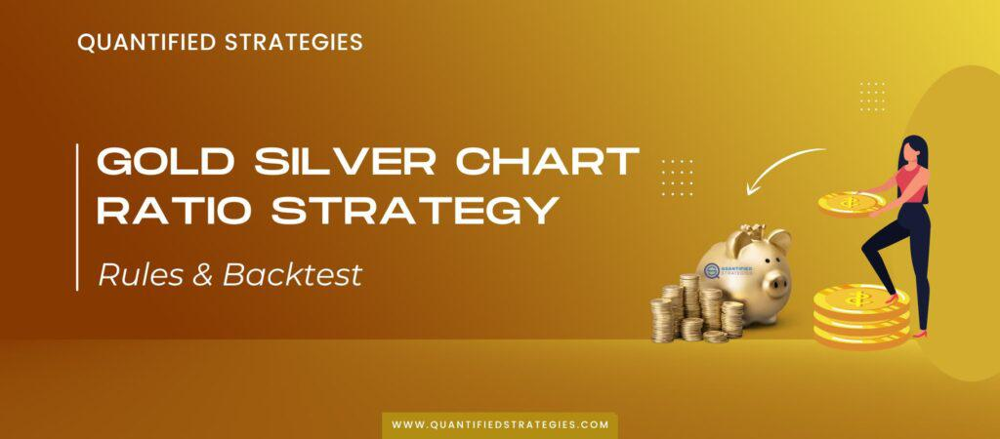

Investment in commodities such as gold and silver bullion has long been a cornerstone strategy for investors seeking portfolio diversification. These precious metals have historically served as hedges against inflation and currency depreciation, providing intrinsic value that can withstand economic fluctuations. In recent decades, technological advancements have dramatically transformed trading landscapes, bringing algorithmic trading to the forefront of bullion markets.

Algorithmic trading, which involves using computer algorithms to execute trading decisions, has gained traction due to its ability to process vast amounts of data at high speeds, capitalize on market inefficiencies, and enhance trading precision. By automating trades, investors can respond swiftly to market changes, thereby reducing the emotional bias that often accompanies manual trading.



This article examines various strategies for investing in gold and silver bullion, highlighting the role of algorithmic trading. Whether engaging in physical acquisition or employing financial instruments like exchange-traded funds (ETFs) and futures contracts, leveraging these metals can fortify your investment portfolio. We'll explore the associated benefits and potential risks, offering practical tips for effectively integrating gold and silver bullion into diverse investment strategies.

The advent of algorithmic trading presents fresh opportunities and challenges. As financial technology continues to evolve, understanding how to harness it in bullion markets becomes paramount. Through assessing both traditional investment methods and modern trading techniques, this article provides a comprehensive overview that can guide investors navigating today's dynamic financial landscape.

## Table of Contents

## Understanding Gold and Silver Bullion

Gold and silver bullion represent high-purity precious metals commonly shaped into bars, ingots, or coins. These forms are distinct for their standardization, typically maintaining a purity level of at least 99.5% for gold and 99.9% for silver, although the exact specifications can vary slightly based on the issuing mint or refinery. Bullion serves as a physical manifestation of wealth and has been utilized throughout history not only as a basis for currency but also as a secure investment vehicle and a symbol of prosperity.

Both gold and silver bullion are esteemed for their dual utility, which spans both industrial applications and investment purposes. Gold, beyond its aesthetic value, is integral in electronics, dentistry, and aerospace due to its conductive and non-corrosive properties. Silver, meanwhile, finds extensive application in electronics, solar panels, and medical devices, owing to its superior conductivity and antimicrobial attributes.

The intrinsic value of gold and silver bullion lies in several key features. Primarily, they are regarded as safe-haven assets, appreciated for their ability to maintain value during periods of economic turbulence or currency devaluation. Historically, these metals have seen price surges amidst financial crises or geopolitical instability, making them an attractive hedge against inflation and currency risks. This status as a reliable store of value can be attributed to their limited supply, enduring demand, and tangible nature, properties that fiat currencies do not possess.

Liquidity is another notable characteristic of bullion. In global financial markets, gold and silver can be readily traded, with major exchanges providing a platform for instant buying and selling. This high level of [liquidity](/wiki/liquidity-risk-premium) ensures that investors can convert bullion into cash with relative ease, which further enhances their appeal as a component of diversified investment portfolios.

In summary, gold and silver bullion are entities rich in history and practicality, offering both industrial and investment advantages. They are recognized for their intrinsic qualities, including high liquidity and secure status amid economic strife, underscoring their importance as hedges in personal and institutional wealth management strategies.

## Investment Strategies for Gold Bullion

Investment in gold bullion has been a time-honored strategy for wealth preservation and portfolio diversification. The avenues available for investing in gold are varied and cater to different investor needs and risk profiles. Here, we explore three primary methods of gold bullion investment: physical gold, gold exchange-traded funds (ETFs), and gold futures contracts.

### Physical Gold Investment

Physical gold investment involves purchasing tangible gold products, such as bars and coins. This form of investment is often favored for its perceived security and reliability. Owning physical gold means holding a direct asset that is not subject to counterparty risk, unlike some other financial instruments. 

However, investors must consider the costs associated with buying and storing physical gold. Secure storage is essential to protect against theft, and this can incur additional costs whether through home safes, bank deposit boxes, or specialized gold depositories. Additionally, buying physical gold often comes with a premium over the spot price, which reflects manufacturing, distribution, and dealer costs.

### Gold ETFs

Gold exchange-traded funds (ETFs) offer a more accessible way to invest in gold without the challenges of physical ownership. These funds trade on major exchanges and aim to track the price of gold by holding either physical gold or derivatives. This strategy provides liquidity, as shares can be bought and sold like stocks during trading hours. 

Investing in gold ETFs entails lower transaction costs compared to physical gold, and there is no need for storage or insurance. Nevertheless, ETFs come with inherent risks, such as tracking errors and management fees, which may affect the overall return on investment.

### Gold Futures Contracts

Gold futures contracts present another strategic investment vehicle, allowing investors to speculate on the future price of gold. By entering into a futures contract, an investor agrees to buy or sell a specific quantity of gold at a predetermined price on a set future date. 

This speculative approach can lead to significant profits if the investor accurately predicts market trends. However, futures trading is marked by high leverage, magnifying both potential gains and losses. It requires a thorough understanding of market dynamics and risk management techniques to navigate effectively. 

Gold futures trading is conducted on exchanges like the Chicago Mercantile Exchange (CME), which standardizes contracts and provides a regulated environment for transaction settlement. Nonetheless, the [volatility](/wiki/volatility-trading-strategies) and complexity associated with futures trading often mean this strategy is best suited for experienced investors.

In summary, investing in gold bullion can be approached through physical ownership, ETFs, or futures contracts. Each method offers distinct benefits and challenges, making it crucial for investors to assess their risk tolerance, investment goals, and market expertise when deciding on an appropriate strategy.

## Investment Strategies for Silver Bullion

Silver bullion serves a unique position in the investment world due to its dual role in both industrial applications and as a traditional investment vehicle. This dual demand renders silver both an essential component in industries and a popular asset among investors looking for diversification.

### Understanding the Dual Role of Silver
Silver's industrial demand is driven by its applications in electronics, solar panels, medical devices, and various other technological innovations. This industrial utility ensures a stable demand for silver, which augments its appeal as an investment. On the investment side, silver, much like gold, is considered a safe-haven asset, particularly attractive during economic downturns or periods of currency fluctuation.

### Physical Silver Investment
Acquiring physical silver in the form of coins or bars remains a traditional investment strategy. Investors purchase silver bars or coins from authorized dealers, store them personally, or use secured storage facilities. The acquisition of physical silver allows investors to directly own a tangible asset, offering protection against economic instability and inflation. A critical [factor](/wiki/factor-investing) in physical silver investment is the premium over the spot price, which can vary significantly based on the form (coin, bar) and the dealer’s pricing.

### Silver ETFs and Futures
For those preferring not to handle the physical storage of bullion, investing in silver through exchange-traded funds (ETFs) presents a convenient alternative. Silver ETFs, such as the iShares Silver Trust (SLV), allow investors to gain exposure to silver prices without the complications of physical ownership and storage. These ETFs track the price of silver, providing a liquid and accessible means of investing in the commodity.

Furthermore, silver futures offer another pathway for investors seeking exposure to silver's price movements. Futures contracts allow investors to speculate on the future price of silver, providing opportunities for both hedging and speculative gains. However, trading in futures contracts involves significant risk and requires a thorough understanding of the market dynamics, including margin requirements and the potential for substantial losses.

In summary, silver bullion investment strategies encompass a variety of methods—each with its potential benefits and challenges. Whether opting for physical silver or the more accessible ETFs and futures, investors can capitalize on silver's unique position as both an industrial metal and an investment commodity. As with any investment, thorough research and an informed approach are critical to success.

## Algorithmic Trading in Bullion Markets

Algorithmic trading has revolutionized how investors interact with financial markets, offering numerous advantages over traditional trading methods. In bullion markets, where gold and silver are traded, algorithms provide increased speed, data processing capacities, and the ability to execute complex trading strategies. Algorithmic trading reduces human error, emotional decisions, and can operate continuously without fatigue, thereby enhancing market efficiency.

Algorithms capitalize on market inefficiencies in gold and silver trading by analyzing large datasets and detecting subtle patterns that are often imperceptible to human traders. These patterns can indicate mispricings or short-term trends that an algorithm can exploit. Since bullion prices are influenced by a myriad of factors including geopolitical events, currency fluctuations, and changes in industrial demand, algorithmic systems can synthesize this information quickly to make informed trading decisions.

Key algorithmic strategies in bullion markets include mean reversion and [momentum](/wiki/momentum) trades. Mean reversion algorithms operate on the principle that asset prices will revert to their historical mean over time. If the price of gold or silver deviate from its average, the algorithm anticipates a correction and executes trades accordingly. The mathematical model underpinning mean reversion might look something like this:

$$
P_t = \mu + \gamma (P_{t-1} - \mu) + \epsilon_t
$$

where $P_t$ is the price at time $t$, $\mu$ is the long-term mean price, $\gamma$ is the reversion speed, and $\epsilon_t$ is a random error term.

Momentum trading strategies detect strong price trends and follow them. A momentum algorithm identifies assets trending strongly in one direction and places trades to capitalize on these movements. This can be particularly effective in bullion markets where price trends can persist due to prolonged geopolitical tensions or sustained fluctuations in currency values.

For example, a basic momentum trading strategy in Python could be implemented by calculating moving averages:

```python
def momentum_strategy(prices, short_window, long_window):
    signals = pd.DataFrame(index=prices.index)
    signals['price'] = prices
    signals['short_mavg'] = prices.rolling(window=short_window, min_periods=1).mean()
    signals['long_mavg'] = prices.rolling(window=long_window, min_periods=1).mean()
    signals['signal'] = 0.0  
    signals['signal'][short_window:] = np.where(signals['short_mavg'][short_window:] > signals['long_mavg'][short_window:], 1.0, 0.0) 
    signals['positions'] = signals['signal'].diff()
    return signals
```

Here, short and long moving averages are compared to generate buy or sell signals based on their crossover, indicating a momentum trade opportunity. Such strategies can be further refined with parameters adapted to the specific characteristics of bullion prices, enhancing profitability and risk management.

Overall, [algorithmic trading](/wiki/algorithmic-trading) in bullion markets allows for sophisticated strategies that leverage advanced analytics and technology, increasing the potential for successful investing in these precious commodities.

## Risks and Considerations

Volatility in the precious metal markets, such as those for gold and silver bullion, can significantly impact the performance of algorithmic trading. Precious metals are subject to price fluctuations due to various factors, including changes in global economic conditions, geopolitical tensions, and fluctuations in currency values. For instance, unexpected economic indicators or geopolitical events can lead to rapid market swings, which may challenge the effectiveness of algorithmic strategies that might not be calibrated for such sudden changes.

To mitigate these risks, it is crucial to implement robust risk management strategies when trading bullion. This might include setting appropriate stop-loss limits, diversifying trading strategies across different assets or timeframes, and regularly [backtesting](/wiki/backtesting) algorithmic models to ensure their effectiveness under varying market conditions. Risk management is about protecting your investment from substantial losses while still allowing for potential gains.

Understanding the legal and tax implications is also essential when investing in bullion. Different jurisdictions have varying regulations concerning the trading and ownership of precious metals. For instance, in some countries, capital gains from bullion trading are taxed differently from regular income. Additionally, ownership and sale of bullion might incur sales taxes or VAT, depending on the region. Investors should keep abreast of the laws applicable in their jurisdiction to avoid legal complications and maximize their after-tax returns on investment.

## Conclusion

Investing in gold and silver bullion presents a valuable strategy for diversification within a financial portfolio. These precious metals serve both as a hedge against inflation and a safeguard during economic instability. The integration of gold and silver into investment strategies offers opportunities for stability and potential growth.

Algorithmic trading has modernized the way investors approach bullion markets. By leveraging algorithms, traders can exploit market inefficiencies and execute trading strategies such as mean reversion and momentum trading with precision and speed. This technological advancement showcases the shifting dynamics in trading practices, allowing investors to potentially benefit from more efficient and profitable trades.

The consideration of both the benefits and risks is crucial. Precious metal markets are volatile, affecting algorithmic trading performance. Robust risk management strategies and understanding the implications of investing in bullion are imperative for navigating this landscape.

Diversifying into commodities like gold and silver is not only a strategic play to mitigate risks through asset allocation but also an opportunistic move to capitalize on potential market upswings. Staying informed about market trends and being adaptable to changes in the financial landscape are critical for maximizing investment potential.

In conclusion, gold and silver bullion, complemented by algorithmic trading, remain relevant in a diversified investment strategy. Investors who remain informed and responsive to market changes are better positioned to leverage these opportunities in a continuously evolving financial market.

## References & Further Reading

[1]: Bergstra, J., Bardenet, R., Bengio, Y., & Kégl, B. (2011). ["Algorithms for Hyper-Parameter Optimization."](https://papers.nips.cc/paper/4443-algorithms-for-hyper-parameter-optimization) Advances in Neural Information Processing Systems 24.

[2]: ["Advances in Financial Machine Learning"](https://www.amazon.com/Advances-Financial-Machine-Learning-Marcos/dp/1119482089) by Marcos Lopez de Prado

[3]: ["Evidence-Based Technical Analysis: Applying the Scientific Method and Statistical Inference to Trading Signals"](https://www.wiley.com/en-us/Evidence+Based+Technical+Analysis%3A+Applying+the+Scientific+Method+and+Statistical+Inference+to+Trading+Signals-p-9780470008744) by David Aronson

[4]: ["Machine Learning for Algorithmic Trading"](https://github.com/stefan-jansen/machine-learning-for-trading) by Stefan Jansen

[5]: ["Quantitative Trading: How to Build Your Own Algorithmic Trading Business"](https://books.google.com/books/about/Quantitative_Trading.html?id=j70yEAAAQBAJ) by Ernest P. Chan