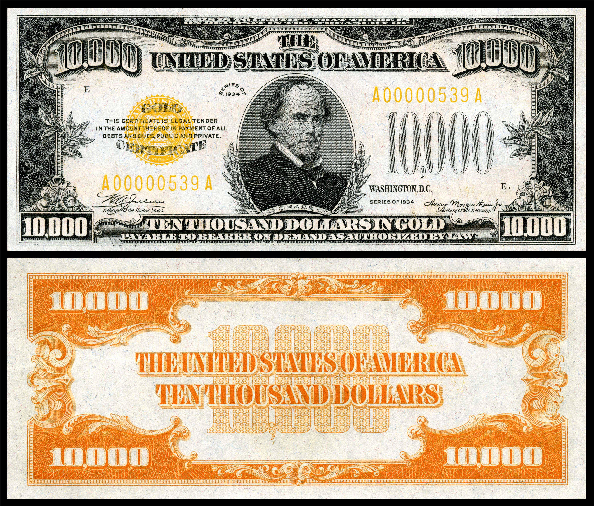

## Table of Contents

## What is a gold certificate?

A gold certificate is a piece of paper that says you own a certain amount of gold. It's like a receipt that shows you have gold stored somewhere, but you don't actually have the gold with you. Instead of carrying heavy gold bars, you can carry this certificate, which is much easier and safer.

In the past, people used gold certificates as money. Governments would issue these certificates, and people could use them to buy things. If someone wanted their gold back, they could trade the certificate for the actual gold. Today, gold certificates are not used as money anymore, but some people still use them as a way to invest in gold without having to store it themselves.

## When were gold certificates first introduced?

Gold certificates were first introduced in the United States in 1863. During the Civil War, the government needed a way to pay for things without using actual gold. So, they started issuing these certificates as a form of money. People could use them to buy things, and if they wanted, they could trade the certificate back for gold.

These certificates became popular because they were easier to [carry](/wiki/carry-trading) and use than heavy gold coins. They were used as money until 1933 when the U.S. government stopped allowing people to exchange the certificates for gold. After that, gold certificates were no longer used as money, but they remained a way for people to invest in gold without having to store it themselves.

## What was the primary purpose of gold certificates?

The main reason for gold certificates was to make it easier for people to use gold as money without carrying heavy gold coins or bars. During the Civil War, the U.S. government needed a way to pay for things without using actual gold, so they started issuing these certificates. People could use them to buy things, and if they wanted, they could trade the certificate back for gold.

Gold certificates became popular because they were easier to carry and use than heavy gold. They were used as money in the United States until 1933 when the government stopped allowing people to exchange the certificates for gold. After that, gold certificates were no longer used as money, but they remained a way for people to invest in gold without having to store it themselves.

## How did gold certificates function in the economy?

Gold certificates worked like money in the economy. People could use them to buy things just like they would use gold coins. The government would give out these certificates, and each one said how much gold it was worth. So, if someone wanted to buy something, they could give the seller a gold certificate instead of actual gold. This made trading easier because gold certificates were lighter and safer to carry around than heavy gold.

When people used gold certificates, it helped the economy because it made it easier for money to move around. If someone wanted their gold back, they could take the certificate to a special place and trade it for real gold. This system worked well until 1933 when the U.S. government said people couldn't trade their certificates for gold anymore. After that, gold certificates were not used as money, but some people still used them to invest in gold without having to keep the gold themselves.

## What countries have issued gold certificates?

Many countries have used gold certificates at different times. In the United States, gold certificates were first used during the Civil War in 1863. People could use them like money and trade them back for gold if they wanted. Other countries like Russia and China also used gold certificates in the past. They helped make trading easier because people didn't have to carry heavy gold around.

In Europe, countries like France and Germany issued gold certificates too. These certificates were popular because they were easier to use than gold coins. People could buy things with them and feel safe knowing they could get their gold back if they needed to. Even though gold certificates are not used as money anymore, some countries still let people use them to invest in gold without having to store it themselves.

## What is the difference between a gold certificate and a gold coin?

A gold certificate is a piece of paper that says you own a certain amount of gold. It's like a receipt that shows you have gold stored somewhere, but you don't actually have the gold with you. Instead of carrying heavy gold bars, you can carry this certificate, which is much easier and safer. People used gold certificates as money in the past, especially during the Civil War in the United States. They could use the certificates to buy things and trade them back for gold if they wanted.

A gold coin, on the other hand, is a piece of gold that you can hold in your hand. It's made of real gold and has a certain weight and value. Gold coins were used as money for a long time because they were easy to carry and use for buying things. Unlike gold certificates, gold coins are the actual gold, so you don't need to trade them for anything else. Today, people still use gold coins as a way to invest in gold, and they can be easier to trade than gold certificates because they are the real thing.

## How did the use of gold certificates evolve over time?

Gold certificates were first used in the United States during the Civil War in 1863. The government needed a way to pay for things without using actual gold, so they started giving out these certificates. People could use them like money to buy things, and if they wanted, they could trade the certificate back for gold. This made trading easier because gold certificates were lighter and safer to carry around than heavy gold coins. They became popular because they were easier to use than gold coins, and many countries like Russia, China, France, and Germany also used them.

Over time, the use of gold certificates changed a lot. In the United States, people used them as money until 1933 when the government said they couldn't trade the certificates for gold anymore. After that, gold certificates were not used as money, but some people still used them to invest in gold without having to store it themselves. Today, gold certificates are not used as money anymore, but they are still a way for people to invest in gold without having to carry it around. They are like a promise that you own gold, even if you don't have it with you.

## What impact did gold certificates have on monetary policy?

Gold certificates had a big impact on how governments made money decisions, called monetary policy. When the U.S. government started using gold certificates during the Civil War, it helped them pay for things without using actual gold. This made it easier for the government to control how much money was in the economy because they could issue certificates instead of having to dig up more gold. By controlling the number of gold certificates, the government could change how much money people had to spend, which helped them manage the economy better.

Over time, the use of gold certificates changed the way governments thought about money. When the U.S. government stopped letting people trade their certificates for gold in 1933, it showed that money didn't have to be tied to gold anymore. This change helped governments use other ways to control the economy, like setting interest rates or printing more paper money. Gold certificates helped show that money could be a promise of value, not just a piece of gold, which changed how governments made decisions about money and the economy.

## What led to the discontinuation of gold certificates in the United States?

Gold certificates were stopped in the United States because of a big change in how the country handled money. In 1933, during the Great Depression, President Franklin D. Roosevelt made a law called the Gold Reserve Act. This law said that people could not trade their gold certificates for real gold anymore. The government did this because they wanted to have more control over the money supply and help the economy get better. By stopping the use of gold certificates, the government could print more paper money without worrying about having enough gold to back it up.

This change was a big deal because it meant that the U.S. was moving away from the gold standard, where money had to be backed by gold. After 1933, gold certificates were not used as money anymore, but people could still use them to invest in gold without having to store it themselves. The end of gold certificates helped the government use new ways to control the economy, like changing interest rates or printing more money. This was a big step in how the U.S. and other countries thought about money and how to manage it.

## Are gold certificates still in use today, and if so, where?

Gold certificates are not used as money anymore, but some people still use them to invest in gold. They are like a piece of paper that says you own gold, even if you don't have it with you. This makes it easier and safer to invest in gold without having to store it yourself.

In some countries, you can still buy gold certificates from banks or special companies. They are not used like money to buy things, but they are a way to own gold without having the actual gold. This can be a good option for people who want to invest in gold but don't want to deal with storing it.

## What is the historical significance of gold certificates in international trade?

Gold certificates played a big part in international trade in the past. They were used as a way to make trading easier between countries. Instead of carrying heavy gold coins or bars, people could use gold certificates, which were lighter and safer. This helped countries trade with each other more easily because they didn't have to worry about moving gold around. Many countries, like the United States, Russia, China, France, and Germany, used gold certificates to help their economies grow and to buy things from other countries.

Over time, the use of gold certificates changed how countries thought about money and trade. When the U.S. stopped letting people trade their certificates for gold in 1933, it showed that money didn't have to be tied to gold anymore. This change helped countries use other ways to control their economies, like changing interest rates or printing more money. Even though gold certificates are not used in international trade anymore, they helped show that money could be a promise of value, not just a piece of gold. This was a big step in how countries managed their money and trade with each other.

## How do gold certificates compare to modern digital currencies in terms of function and security?

Gold certificates and modern digital currencies both act as a way to represent value, but they work differently. Gold certificates are pieces of paper that say you own a certain amount of gold, even if you don't have it with you. They were used as money in the past, but now people mostly use them to invest in gold without having to store it themselves. Digital currencies, like Bitcoin, are electronic money that you can use to buy things online or store as an investment. They don't have any physical form and exist only on computers and the internet.

In terms of security, gold certificates have some risks because they are just pieces of paper. If you lose the certificate or it gets stolen, you might lose your investment. Also, since they are not backed by gold anymore, they depend on the trust in the company or bank that issued them. Digital currencies use advanced technology like blockchain to keep them secure. Blockchain is like a big, shared record that keeps track of every transaction, making it hard for someone to cheat or steal. However, digital currencies can still be risky because they can be hacked, and their value can go up and down a lot. Both gold certificates and digital currencies have their own ways to be safe, but they need different kinds of protection.

## References & Further Reading

[1]: Nugent, T. (2015). ["From gold certificates to gold ETFs: The evolution of gold investment vehicles."](https://www.shastagoldcorp.com/understanding-gold-certificates-and-their-benefits/) The Journal of Economic Perspectives, 29(1).

[2]: Bernanke, B. S. (2000). ["Essays on the Great Depression."](https://archive.org/details/essaysongreatdep0000bern) Princeton University Press.

[3]: Eichengreen, B. (1996). ["Globalizing Capital: A History of the International Monetary System."](https://www.jstor.org/stable/j.ctt7pfmc) Princeton University Press.

[4]: Schwager, J. D. (2008). ["The Complete Guide to Futures Trading: What You Need to Know About the Risks and Rewards."](https://archive.org/details/completeguidetof0000unse_d6n1) Wiley Trading.

[5]: Sandberg, L. A. (1974). ["The Great Depression and the Gold Standard: Strategies for Economic Stability."](https://www.history.com/news/how-did-the-gold-standard-contribute-to-the-great-depression) History of Political Economy, 6(3), 351-374.

[6]: Murphy, C. J. (1987). ["The Gold Standard System: A History of Resolution and Disruption."](https://www.semanticscholar.org/paper/The-Gold-Standard:-Historical-Facts-and-Future-Cooper-Dornbusch/0a0c051d40bb66c905c8807bfbf79386c947cd8e) The Economic History Review, 40(2), 205-213.

[7]: Geisst, C. R. (2006). ["Encyclopedia of American Business History."](https://archive.org/details/encyclopediaofam01geis) Facts On File.

[8]: Bogle, J. C. (2009). ["Common Sense on Mutual Funds: New Imperatives for the Intelligent Investor."](https://books.google.com/books/about/Common_Sense_on_Mutual_Funds.html?id=KZbOlCjj9dEC) Wiley.