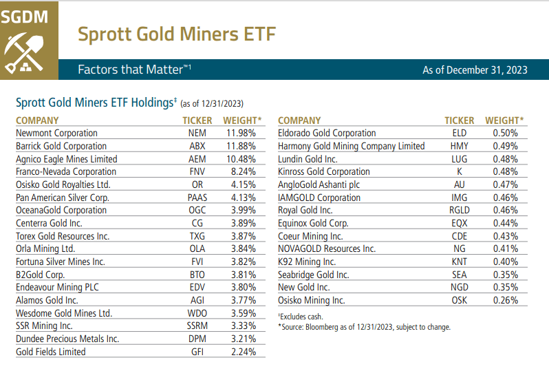

## Table of Contents

## What are Gold ETFs?

Gold ETFs, or Exchange Traded Funds, are a type of investment that lets you buy gold without having to keep physical gold. They work like stocks, which means you can buy and sell them easily on stock exchanges. Each Gold ETF unit represents a certain amount of gold, usually measured in grams. This makes it easier for people to invest in gold because they don't need to worry about storing it safely.

Investing in Gold ETFs can be a good way to diversify your investment portfolio. Gold often goes up in value when other investments, like stocks, go down. This can help protect your money during tough economic times. Also, Gold ETFs are very clear and easy to understand. You can see the price of gold and how your investment is doing at any time. This makes them a popular choice for both new and experienced investors.

## How do Gold ETFs work?

Gold ETFs work by letting you invest in gold without needing to buy and store the actual metal. When you buy a Gold ETF, you're buying shares in a fund that holds gold. Each share represents a small amount of gold, usually measured in grams. The price of the ETF goes up and down with the price of gold on the market. You can buy and sell these shares on a stock exchange, just like you would with regular stocks.

These ETFs are managed by companies that keep the gold in safe places, like vaults. This means you don't have to worry about where to store your gold or how to keep it safe. Instead, you can focus on watching the price of gold and deciding when to buy or sell your shares. This makes investing in gold easier and more convenient for people who want to add gold to their investment mix without the hassle of handling physical gold.

## What are Gold Mining ETFs?

Gold Mining ETFs are a type of investment that let you invest in companies that mine gold, instead of buying gold directly. When you buy shares in a Gold Mining [ETF](/wiki/etf-trading-strategies), you're buying a small piece of many different gold mining companies all at once. This can be a good way to spread out your risk, because if one company does badly, the others might do well and balance it out.

These ETFs work a lot like other ETFs. You can buy and sell them on a stock exchange, just like stocks. The price of the ETF goes up and down based on how well the gold mining companies are doing. If gold prices go up, the mining companies usually make more money, and the ETF's price can go up too. But if gold prices go down, the ETF's price can go down as well. So, it's important to keep an eye on the gold market and the performance of the mining companies when you invest in Gold Mining ETFs.

## How do Gold Mining ETFs differ from Gold ETFs?

Gold Mining ETFs and Gold ETFs are two different ways to invest in gold. Gold ETFs let you buy gold without having to keep the actual metal. When you buy a Gold ETF, you're buying shares that represent a small amount of gold, usually measured in grams. The price of the ETF goes up and down with the price of gold on the market. This means that if the price of gold goes up, the price of your Gold ETF will usually go up too.

On the other hand, Gold Mining ETFs let you invest in the companies that mine gold, not the gold itself. When you buy a Gold Mining ETF, you're buying shares in many different gold mining companies at once. The price of the ETF depends on how well these companies are doing. If gold prices go up, the mining companies usually make more money, which can make the price of the ETF go up. But if the mining companies don't do well, even if gold prices are high, the ETF's price might not go up as much.

Both types of ETFs can be bought and sold on a stock exchange, just like stocks. But they have different risks and rewards. Gold ETFs are more directly tied to the price of gold, while Gold Mining ETFs depend on the performance of the mining companies. So, it's important to think about what you want to achieve with your investment before choosing between them.

## What are the benefits of investing in Gold ETFs?

Investing in Gold ETFs has many benefits. One big benefit is that they are easy to buy and sell. You can trade them on a stock exchange just like stocks, which means you can quickly turn your investment into cash if you need to. This is much easier than trying to sell physical gold, which can take time and effort. Also, Gold ETFs are very clear and easy to understand. You can see the price of gold and how your investment is doing at any time, which makes it easier to make smart choices about when to buy or sell.

Another benefit is that Gold ETFs help you spread out your investments. Gold often goes up in value when other investments, like stocks, go down. This can help protect your money during tough economic times. Plus, you don't have to worry about keeping physical gold safe. The companies that manage Gold ETFs store the gold in secure places, so you can focus on watching the price of gold and making the best choices for your investment.

## What are the risks associated with Gold Mining ETFs?

Investing in Gold Mining ETFs can be risky because they depend on how well the gold mining companies are doing. If these companies run into problems, like high costs, trouble finding gold, or issues with their mines, the price of the ETF can go down. This means you might lose money even if the price of gold is going up. Also, the stock market can be unpredictable, and the prices of the mining companies' stocks can go up and down a lot, which can make the ETF's price move around a lot too.

Another risk is that Gold Mining ETFs are not as directly tied to the price of gold as Gold ETFs are. While the price of gold can affect how much money the mining companies make, other things like how well they run their business, the cost of mining, and even what's happening in the world can have a big impact too. This means that even if gold prices are high, the ETF might not do as well as you hope. So, it's important to think about these risks and maybe talk to a financial advisor before you decide to invest in Gold Mining ETFs.

## How can one start investing in Gold ETFs?

To start investing in Gold ETFs, first, you need to open a brokerage account if you don't already have one. A brokerage account is like a special bank account that lets you buy and sell investments like stocks and ETFs. You can choose from many different brokerage companies, so pick one that fits your needs. Once your account is set up, you'll need to add money to it. This money will be what you use to buy the Gold ETFs.

After your account is funded, you can start buying Gold ETFs. Look for the Gold ETF you want to invest in by searching for its name or ticker symbol on your brokerage's website or app. Some popular Gold ETFs are the SPDR Gold Shares (GLD) and the iShares Gold Trust (IAU). Once you find the ETF you want, decide how many shares you want to buy and place your order. After that, you can keep an eye on the price of gold and decide when to buy more or sell your shares.

## What factors should be considered when choosing a Gold Mining ETF?

When choosing a Gold Mining ETF, it's important to look at the companies that make up the ETF. You want to pick an ETF that includes a good mix of big and small mining companies. This can help spread out your risk. Also, check the costs of the ETF, like the expense ratio. This is how much you pay each year to own the ETF. A lower expense ratio means you keep more of your money.

Another thing to think about is how the ETF has done in the past. Look at its performance over different times, like one year, three years, and five years. This can give you an idea of how it might do in the future, but remember, past results don't guarantee future success. Also, consider the ETF's strategy. Some ETFs focus on big, stable companies, while others might invest in smaller, riskier ones that could grow a lot. Choose one that matches your goals and how much risk you're willing to take.

## How do Gold ETFs and Gold Mining ETFs perform in different economic conditions?

Gold ETFs and Gold Mining ETFs can behave differently depending on what's happening in the economy. Gold ETFs are more directly tied to the price of gold. When the economy is shaky, like during a recession, people often turn to gold as a safe place to put their money. This can make the price of gold go up, and as a result, the value of Gold ETFs can go up too. But when the economy is doing well, people might put their money into other investments like stocks, and the price of gold might not go up as much, which can affect the performance of Gold ETFs.

Gold Mining ETFs, on the other hand, depend not just on the price of gold but also on how well the mining companies are doing. In good economic times, these companies might be able to get more money to grow their business, which can make the ETF's value go up. But in bad economic times, even if the price of gold goes up, the mining companies might have trouble making money because of high costs or other problems. This means that Gold Mining ETFs can be riskier and might not do as well as Gold ETFs when the economy is struggling.

## What are the tax implications of investing in Gold ETFs versus Gold Mining ETFs?

When you invest in Gold ETFs, you need to think about taxes. If you sell your Gold ETF shares for more money than you paid for them, you'll have to pay capital gains tax. How much tax you pay depends on how long you held the shares. If you held them for a year or less, it's a short-term capital gain, and you'll pay your regular income tax rate. If you held them for more than a year, it's a long-term capital gain, and the tax rate is usually lower. Also, some Gold ETFs might give you dividends, which you'll have to pay taxes on too.

Gold Mining ETFs work a bit differently. When you sell your shares, you'll also pay capital gains tax, just like with Gold ETFs. The difference is that Gold Mining ETFs are more like stock ETFs, so they might give you dividends from the mining companies' profits. These dividends can be taxed at a lower rate than regular income if they are qualified dividends. But remember, the tax rules can change, and it's a good idea to talk to a tax advisor to make sure you understand how your investments will be taxed.

## How do fees and expenses compare between Gold ETFs and Gold Mining ETFs?

Gold ETFs usually have lower fees than Gold Mining ETFs. This is because Gold ETFs simply hold gold and track its price, so they don't need to do as much work as managing a bunch of different mining companies. The main fee you'll see with Gold ETFs is the expense ratio, which is a small percentage of your investment that the fund charges each year. For example, popular Gold ETFs like the SPDR Gold Shares (GLD) and the iShares Gold Trust (IAU) have expense ratios around 0.40% and 0.25%, respectively. These fees are taken out of the fund's assets, so they can affect how much money you make over time.

Gold Mining ETFs, on the other hand, often have higher fees because they need to manage and keep an eye on many different mining companies. The expense ratios for Gold Mining ETFs can be higher, sometimes around 0.50% or more. Besides the expense ratio, you might also have to pay other fees, like trading fees when you buy or sell the ETF. These higher fees can add up and take a bigger bite out of your investment returns compared to Gold ETFs. So, when you're choosing between the two, it's important to think about how much you'll be paying in fees and how that might affect your investment over time.

## What advanced strategies can be used when trading Gold and Gold Mining ETFs?

One advanced strategy for trading Gold and Gold Mining ETFs is called hedging. This means you use one type of investment to protect another. For example, if you own a lot of stocks and you're worried about the stock market going down, you could buy some Gold ETFs. If the stock market does go down, gold prices often go up, which can help balance out your losses. Another way to hedge is to own both Gold ETFs and Gold Mining ETFs. If gold prices go up, your Gold ETFs will gain value, but if the mining companies do really well, your Gold Mining ETFs might do even better. This way, you can cover different risks and maybe make more money.

Another strategy is called dollar-cost averaging. This means you put a fixed amount of money into Gold or Gold Mining ETFs at regular times, no matter what the price is. This can help you buy more shares when prices are low and fewer when prices are high, which can lower your average cost over time. It's a good way to spread out your investment and not worry too much about short-term price changes. You can also use technical analysis to try to predict when to buy or sell. This involves looking at charts and patterns to see if the price of the ETF is likely to go up or down. It's more complicated, but some people find it helpful for making trading decisions.

## References & Further Reading

[1]: Bergstra, J., Bardenet, R., Bengio, Y., & Kégl, B. (2011). ["Algorithms for Hyper-Parameter Optimization."](https://papers.nips.cc/paper/4443-algorithms-for-hyper-parameter-optimization) Advances in Neural Information Processing Systems 24.

[2]: ["Advances in Financial Machine Learning"](https://www.amazon.com/Advances-Financial-Machine-Learning-Marcos/dp/1119482089) by Marcos Lopez de Prado

[3]: ["Evidence-Based Technical Analysis: Applying the Scientific Method and Statistical Inference to Trading Signals"](https://www.amazon.com/Evidence-Based-Technical-Analysis-Scientific-Statistical/dp/0470008741) by David Aronson

[4]: ["Machine Learning for Algorithmic Trading"](https://github.com/stefan-jansen/machine-learning-for-trading) by Stefan Jansen

[5]: ["Quantitative Trading: How to Build Your Own Algorithmic Trading Business"](https://www.amazon.com/Quantitative-Trading-Build-Algorithmic-Business/dp/1119800064) by Ernest P. Chan