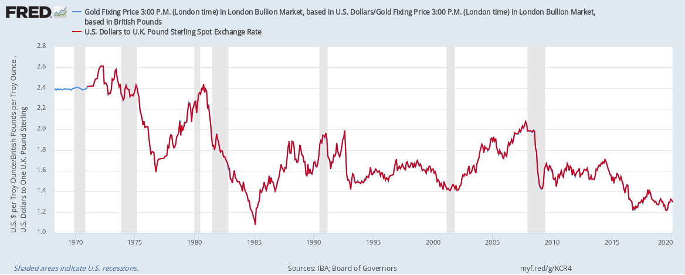

## Table of Contents

## What is gold fixing?

Gold fixing is a process where the price of gold is set at specific times during the day. It happens in major financial centers like London and New York. The goal is to find a price that everyone agrees on, so people can buy and sell gold at that price. This helps keep the gold market stable and fair for everyone involved.

During a gold fixing session, representatives from big banks and other market participants come together. They discuss and adjust the price until the amount of gold people want to buy equals the amount people want to sell. Once they reach this balance, the price is fixed. This fixed price then becomes a reference point for many gold transactions around the world.

## How does the gold fixing process work?

Gold fixing is a way to set the price of gold at certain times of the day. It happens in places like London and New York. During these sessions, people from big banks and other groups who trade gold meet. They talk about what they think the price of gold should be. They keep changing the price until the amount of gold people want to buy is the same as the amount people want to sell. When they find this balance, they set the price, and everyone agrees on it.

This fixed price becomes important because many people use it as a guide for their own gold deals. For example, if you want to buy gold, you might look at the fixed price to decide if it's a good time to buy. The fixing helps keep the gold market fair and stable. It makes sure that everyone has a common price to work with, which can help prevent big surprises or unfair deals in the market.

## Who are the participants in gold fixing?

The participants in gold fixing are usually big banks and other important groups in the gold market. In London, the main banks that take part are called the "London Gold Market Fixing Limited." These banks include big names like Barclays, HSBC, and others. They meet together to talk about the price of gold and make sure it's fair for everyone.

In New York, the process is a bit different. The participants include members of the COMEX division of the New York Mercantile Exchange. These members can be banks, big trading companies, or other financial groups. They all work together to set the price of gold at certain times during the day. This helps keep the gold market stable and fair for everyone who buys and sells gold.

## What is the history of gold fixing?

Gold fixing started a long time ago in London, back in 1919. It was created to help set a fair price for gold that everyone could agree on. At that time, a group of five banks would meet twice a day in a small room at the Rothschild bank. They would talk about the price of gold until they found a price that worked for everyone. This became known as the London Gold Fix, and it helped make the gold market more stable and fair.

Over the years, the way gold fixing works has changed a bit. In the 1960s, the London Gold Fix started to be used more around the world. By the 1980s, the process moved from the Rothschild bank to the London Bullion Market Association. In 2015, the London Gold Fix changed its name to the LBMA Gold Price. Now, instead of meeting in person, participants use a computer system to set the price. Even though the process has changed, the main idea is still the same: to find a fair price for gold that everyone can use.

## How does gold fixing affect bullion trading?

Gold fixing sets a price for gold that many people in the market use. When the price is fixed, it helps people who buy and sell gold know what a fair price is. This makes it easier for them to trade gold because they can use the fixed price as a guide. If someone wants to buy gold, they might look at the fixed price to decide if it's a good time to buy. If someone wants to sell gold, they can use the fixed price to know how much they might get for their gold.

Because the fixed price is used by so many people, it can affect how much gold is bought and sold. If the fixed price is high, people might buy less gold because it's more expensive. If the fixed price is low, more people might want to buy gold because it's cheaper. This can make the amount of gold traded go up or down. Overall, gold fixing helps keep the market stable and fair for everyone who trades gold.

## What are the different types of gold bullion?

Gold bullion comes in different forms, mainly bars and coins. Gold bars are usually made in different sizes, from small ones that weigh just a few grams to big ones that can weigh several kilograms. They are often rectangular and have the weight and purity stamped on them. People like gold bars because they are easy to store and can be worth a lot of money. Gold coins are another type of bullion. They are usually smaller than bars and come in different sizes too. Many gold coins have designs on them and are made by governments or special mints. People like gold coins because they are easy to buy and sell and can be very beautiful.

Both gold bars and gold coins are valued for their gold content, which is usually measured in terms of purity. The purity of gold is often expressed in karats or as a percentage. For example, 24-karat gold is pure gold, while 22-karat gold is mixed with other metals. The higher the purity, the more valuable the gold bullion is. People buy gold bullion as an investment, to save money, or sometimes just because they like collecting gold. No matter the reason, gold bullion is a popular choice because it is seen as a safe and valuable asset.

## How can someone start trading gold bullion?

To start trading gold bullion, you first need to learn about the different types of gold you can buy, like bars and coins. You should also understand how the gold market works and how prices are set. One way to learn is by reading [books](/wiki/algo-trading-books) or websites about gold trading. You can also talk to people who already trade gold and ask them for advice. Once you feel ready, you can start by opening an account with a company that sells gold. Make sure to choose a company that is trusted and has good reviews.

After you have an account, you can start buying gold. You can do this online or by visiting a store that sells gold. When you buy gold, you need to decide if you want to keep it at home or in a safe place like a bank. Some people like to keep their gold at home because they can see it and touch it. Others prefer to keep it in a bank because it is safer. Once you have your gold, you can sell it when the price is right or keep it as an investment for the future. Trading gold can be fun and rewarding if you take the time to learn how to do it well.

## What are the risks associated with bullion trading?

Trading gold bullion can be risky. One big risk is that the price of gold can go up and down a lot. If you buy gold and the price goes down, you might lose money when you sell it. Another risk is that you might buy fake gold. Some people try to sell gold that is not real or is mixed with other metals. If you don't know how to check if gold is real, you could end up losing money. Also, if you keep your gold at home, there is a risk of it being stolen. You need to be careful and keep your gold in a safe place.

Another risk is that you might not know enough about the gold market. If you don't understand how the market works, you might make bad decisions and lose money. It's important to learn about gold trading before you start. Also, some companies that sell gold might charge high fees or not be honest. You need to be careful and choose a good company to work with. Trading gold can be a good way to invest, but you need to be aware of these risks and take steps to protect yourself.

## How do global economic factors influence gold prices?

Global economic factors can have a big impact on the price of gold. When the economy is doing well, people might feel more confident and spend more money on things like stocks and real estate. This can make the price of gold go down because people are not as interested in buying it. But if the economy is not doing well, people might get worried and start buying gold to keep their money safe. This can make the price of gold go up because more people want to buy it.

Another important [factor](/wiki/factor-investing) is inflation. Inflation means that the prices of things are going up, and the value of money is going down. When inflation is high, people might buy gold because it can help protect their money from losing value. Also, interest rates can affect gold prices. If interest rates are low, people might buy more gold because they are not making much money from saving in the bank. But if interest rates are high, people might put their money in the bank instead of buying gold, which can make the price of gold go down.

## What are the strategies for successful bullion trading?

To be successful in bullion trading, you need to learn a lot about the gold market. You should understand how gold prices are set and what can make them go up or down. One good strategy is to keep up with the news. Things like inflation, interest rates, and big events around the world can change the price of gold. Another strategy is to buy gold when the price is low and sell it when the price is high. This can help you make money, but you need to be patient and wait for the right time to buy and sell. It's also important to be careful and not buy too much gold at once. You should only spend money you can afford to lose.

Another important strategy is to choose a good company to buy gold from. Make sure the company is trusted and has good reviews. This can help you avoid buying fake gold or paying too much. You should also think about where to keep your gold. Some people like to keep it at home, but it might be safer to keep it in a bank. Keeping your gold safe is important because it can be stolen. Lastly, don't forget to keep learning. The gold market can change, so you need to keep up with new information and be ready to change your strategies if needed.

## How does regulation impact gold fixing and bullion trading?

Regulation plays a big role in how gold fixing and bullion trading work. Governments and organizations like the London Bullion Market Association (LBMA) make rules to keep the gold market fair and safe. For gold fixing, these rules make sure that the people who set the price do it in a way that is open and honest. They have to follow strict guidelines so that everyone can trust the fixed price. This helps prevent cheating and keeps the market stable. If someone breaks the rules, they can get in big trouble, which makes people more likely to follow them.

For bullion trading, regulations help protect people who buy and sell gold. They make sure that companies that sell gold are honest and that the gold they sell is real. Regulations also help stop money laundering and other crimes that can happen in the gold market. By having these rules, people can feel safer when they trade gold. They know that the market is being watched and that there are steps in place to make sure everything is fair. This can make more people want to trade gold, which is good for the market.

## What advanced tools and technologies are used in bullion trading?

People who trade gold use many advanced tools and technologies to help them make good decisions. One important tool is a trading platform. This is a computer program that lets people buy and sell gold online. It shows them the current price of gold and helps them keep track of their trades. Another tool is a charting software. This software makes graphs that show how the price of gold has changed over time. Traders use these graphs to guess where the price might go next. They also use special computer programs called algorithms to help them buy and sell gold at the best times.

Another technology that helps with bullion trading is the internet. The internet lets people trade gold from anywhere in the world. They can use websites and apps to find out about the gold market and make trades quickly. Some people also use mobile apps on their phones to keep an eye on gold prices and make trades on the go. These tools and technologies make it easier for people to trade gold and help them make better choices about when to buy and sell.

## References & Further Reading

[1]: Bergstra, J., Bardenet, R., Bengio, Y., & Kégl, B. (2011). ["Algorithms for Hyper-Parameter Optimization."](https://dl.acm.org/doi/10.5555/2986459.2986743) Advances in Neural Information Processing Systems 24.

[2]: ["Advances in Financial Machine Learning"](https://www.amazon.com/Advances-Financial-Machine-Learning-Marcos/dp/1119482089) by Marcos Lopez de Prado

[3]: ["Evidence-Based Technical Analysis: Applying the Scientific Method and Statistical Inference to Trading Signals"](https://www.amazon.com/Evidence-Based-Technical-Analysis-Scientific-Statistical/dp/0470008741) by David Aronson

[4]: ["Machine Learning for Algorithmic Trading"](https://github.com/stefan-jansen/machine-learning-for-trading) by Stefan Jansen

[5]: ["Quantitative Trading: How to Build Your Own Algorithmic Trading Business"](https://www.amazon.com/Quantitative-Trading-Build-Algorithmic-Business/dp/1119800064) by Ernest P. Chan

[6]: World Gold Council. ["London Gold Fixing."](https://www.gold.org/news-and-events/press-releases/world-gold-council-forum-discusses-reform-or-replacement-gold-fix)

[7]: London Bullion Market Association. ["LBMA Gold Price."](https://www.lbma.org.uk/prices-and-data/precious-metal-prices)

[8]: Deloitte. ["Blockchain Technology for the Gold Industry."](https://www2.deloitte.com/us/en/pages/financial-services/articles/blockchain-series-deloitte-center-for-financial-services.html)