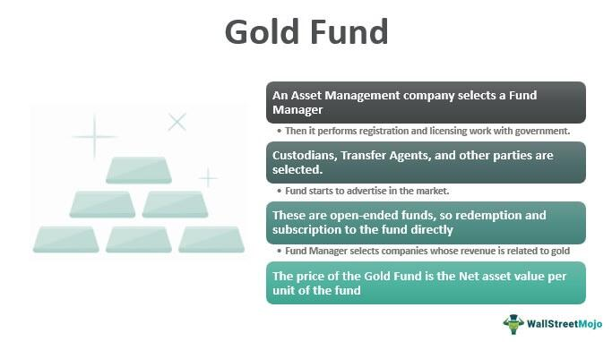

## Table of Contents

## What is a gold fund?

A gold fund is a type of investment fund that focuses on gold and gold-related assets. Instead of buying physical gold, like coins or bars, you invest in a fund that holds gold or invests in companies that mine or deal with gold. This makes it easier for people to invest in gold without having to store and protect the physical metal themselves.

Gold funds can be a good way to diversify your investment portfolio. Gold often goes up in value when other investments, like stocks, go down. This can help protect your money during tough economic times. However, like any investment, gold funds can go up and down in value, so it's important to think carefully and maybe talk to a financial advisor before investing.

## How does a gold fund work?

A gold fund works by pooling money from many investors to buy gold or gold-related assets. Instead of buying gold yourself, you give your money to the fund, and the fund managers use it to buy gold in different forms, like bars, coins, or shares in gold mining companies. This way, you own a part of the fund, and the value of your investment goes up and down with the price of gold.

When you invest in a gold fund, you don't have to worry about storing the gold yourself. The fund takes care of that, which makes it easier for you. Also, because the fund buys a lot of gold at once, it can sometimes get a better price than if you were buying gold on your own. But remember, the value of the fund can change based on the price of gold, so it's important to keep an eye on how your investment is doing.

## What are the benefits of investing in a gold fund?

Investing in a gold fund can be a good way to spread out your money and not put all of it into one type of investment. Gold often goes up in value when other things like stocks go down. This means that if the stock market has a bad day, your gold fund might do better and help balance out your losses. It's like having a safety net for your money during tough economic times.

Another benefit is that you don't have to worry about keeping the gold safe. When you invest in a gold fund, the fund managers take care of storing and protecting the gold. This saves you from the hassle and costs of securing physical gold yourself. Plus, because the fund buys a lot of gold at once, it might get a better price than if you were buying it on your own.

## What are the risks associated with gold funds?

Investing in gold funds can be risky because the price of gold can go up and down a lot. If the price of gold drops, the value of your gold fund will go down too. This means you could lose money if you need to sell your investment when the price of gold is low. It's hard to predict what will happen with gold prices, so it's important to be ready for the possibility that your investment might not do as well as you hope.

Another risk is that gold funds can have fees and costs that can eat into your returns. These might include management fees, which are what you pay the people who run the fund, and other expenses. Over time, these fees can add up and reduce how much money you make from your investment. It's a good idea to look at all the fees before you decide to invest in a gold fund.

Lastly, while gold can be a good way to diversify your investments, it doesn't produce any income like dividends from stocks or interest from bonds. This means that the only way you can make money from a gold fund is if the price of gold goes up. If the price stays the same or goes down, you won't earn anything from your investment. So, it's important to think about this when deciding if a gold fund is right for you.

## How can someone start investing in a gold fund?

To start investing in a gold fund, you first need to choose a fund that fits your goals. There are different types of gold funds, like those that invest in physical gold, gold mining companies, or a mix of both. You can look at different funds and compare them to see which one you like best. You can find gold funds through banks, financial advisors, or online investment platforms. Once you pick a fund, you'll need to open an account with the company that offers it. This usually involves filling out some forms and giving them some personal information.

After you have an account, you can put money into the gold fund. You decide how much you want to invest, and then you buy shares in the fund. The amount you invest will depend on how much money you have and how much risk you're willing to take. Once your money is in the fund, the managers will use it to buy gold or gold-related assets. Remember to keep an eye on your investment and check how it's doing from time to time. If you have any questions or need help, you can always talk to a financial advisor.

## What is the difference between a gold fund and physical gold?

A gold fund and physical gold are two different ways to invest in gold. A gold fund is like a big pot of money from many people that is used to buy gold or things related to gold, like shares in gold mining companies. When you invest in a gold fund, you don't get the actual gold; instead, you get shares in the fund. This means you don't have to worry about storing the gold or keeping it safe. The fund managers take care of all that for you. Also, because the fund buys a lot of gold at once, it might get a better price than if you bought it yourself.

Physical gold, on the other hand, is the actual gold that you can touch, like gold bars or coins. When you buy physical gold, you have to find a safe place to keep it, which can be a hassle and cost money. You might need to pay for a safe deposit box at a bank or buy a home safe. Plus, when you want to sell physical gold, you have to find a buyer and deal with the selling process yourself. With physical gold, you own the gold directly, but it requires more work and responsibility on your part.

## How are gold funds taxed?

When you invest in a gold fund, you have to think about taxes. If you make money from your gold fund, you might have to pay capital gains tax. This tax is on the profit you make when you sell your shares in the fund for more than what you paid for them. How much tax you pay depends on how long you held the shares. If you held them for a year or less, it's called a short-term capital gain, and you pay your regular income tax rate on it. If you held them for more than a year, it's a long-term capital gain, and the tax rate is usually lower.

Gold funds can also have other taxes to think about. Some funds might pay out dividends, which are like shares of the fund's earnings. These dividends can be taxed as regular income. Also, if the fund sells gold and makes a profit, it might have to pay capital gains tax on that profit, and that tax can be passed on to you as the investor. It's a good idea to talk to a tax advisor to understand all the taxes that could come with investing in a gold fund.

## What factors should be considered when choosing a gold fund?

When choosing a gold fund, one of the first things to think about is what kind of gold the fund invests in. Some funds buy physical gold like bars or coins, while others invest in gold mining companies or a mix of both. You should pick a fund that matches what you want to achieve with your investment. Another important [factor](/wiki/factor-investing) is the fees and costs of the fund. All funds have fees, like management fees, which are what you pay the people who run the fund. These fees can eat into your profits, so it's a good idea to look for a fund with low fees.

You should also consider the performance of the fund over time. Check how the fund has done in the past to get an idea of how it might do in the future. Remember, past performance doesn't guarantee future results, but it can give you a clue. Another thing to think about is the fund's risk level. Gold funds can be more or less risky depending on what they invest in. If you don't like taking big risks, you might want a fund that's more focused on physical gold, which can be less risky than investing in gold mining companies. Talking to a financial advisor can help you make a good choice that fits your goals and how much risk you're willing to take.

## How do gold funds perform compared to other investment options?

Gold funds can be a good way to spread out your investments, but they don't always do better than other options like stocks or bonds. Gold prices can go up and down a lot, and this can make gold funds more risky than some other investments. For example, if the economy is doing well, stocks might go up more than gold. But if the economy is struggling, gold might do better because people see it as a safe place to put their money. So, how well a gold fund does compared to other investments can change a lot depending on what's happening in the world and the economy.

Over the long term, stocks have usually done better than gold funds. This is because companies can grow and make more money over time, which can make their stock prices go up. Gold, on the other hand, doesn't grow or produce income, so its value depends only on what people are willing to pay for it. But gold can still be a good part of your investment plan because it can help protect your money during tough times. It's important to think about your goals and how much risk you're willing to take when deciding if a gold fund is right for you compared to other options.

## What are the management fees and costs associated with gold funds?

When you invest in a gold fund, you have to pay management fees. These fees are what you pay the people who run the fund. They can be a percentage of the money you have in the fund, usually between 0.5% and 1.5% every year. This means if you have $10,000 in the fund, you might have to pay between $50 and $150 each year just for the fund to be managed. These fees can add up over time and take away from the money you make from your investment.

Besides management fees, there can be other costs with gold funds. Some funds might charge you when you buy or sell shares, which are called transaction fees. There might also be other expenses like the cost of storing the gold or paying for audits and reports. All these costs together can make a big difference in how much money you keep from your investment. It's a good idea to look at all the fees and costs before you decide to invest in a gold fund.

## How does the global market influence gold fund performance?

The global market can have a big impact on how well a gold fund does. When things are not going well in the world, like during a war or a big economic problem, people often want to buy gold because they think it's safe. This can make the price of gold go up, which is good for gold funds. Also, if the value of money, like the dollar, goes down, gold can become more valuable because it's seen as a way to protect money. But if the world economy is doing well, people might put their money into other things like stocks, and this can make the price of gold go down, which is not good for gold funds.

Another way the global market affects gold funds is through what's happening with interest rates. If interest rates go up, it can make other investments, like bonds, more attractive because they pay more money over time. This can make people less interested in gold, and the price might drop. On the other hand, if interest rates are low, gold might look better to investors because they're not getting much from other places. So, keeping an eye on what's happening around the world and with interest rates can help you understand how a gold fund might do.

## What advanced strategies can be used to optimize returns from gold funds?

To optimize returns from gold funds, one strategy is to use dollar-cost averaging. This means you put a set amount of money into the gold fund at regular times, like every month. By doing this, you buy more shares when the price is low and fewer shares when the price is high. Over time, this can help you pay a lower average price for your shares and get better returns. Another strategy is to keep an eye on economic trends and adjust your investments. If you think the economy might have problems, you might want to put more money into gold funds because gold often does well when other investments are struggling.

Another way to optimize returns is to diversify within the gold fund itself. Some gold funds invest in different kinds of gold assets, like physical gold, gold mining companies, or even gold futures. By choosing a fund that spreads its investments across these different types of assets, you can reduce your risk and possibly get better returns. It's also smart to look at the fees and costs of different gold funds. Picking a fund with lower fees can help you keep more of your returns. Remember, while these strategies can help, investing always has risks, so it's important to do your research and maybe talk to a financial advisor.

## References & Further Reading

[1]: Bergstra, J., Bardenet, R., Bengio, Y., & Kégl, B. (2011). ["Algorithms for Hyper-Parameter Optimization."](https://dl.acm.org/doi/10.5555/2986459.2986743) Advances in Neural Information Processing Systems 24.

[2]: ["Advances in Financial Machine Learning"](https://www.amazon.com/Advances-Financial-Machine-Learning-Marcos/dp/1119482089) by Marcos Lopez de Prado

[3]: ["Evidence-Based Technical Analysis: Applying the Scientific Method and Statistical Inference to Trading Signals"](https://www.amazon.com/Evidence-Based-Technical-Analysis-Scientific-Statistical/dp/0470008741) by David Aronson

[4]: ["Machine Learning for Algorithmic Trading"](https://github.com/stefan-jansen/machine-learning-for-trading) by Stefan Jansen

[5]: ["Quantitative Trading: How to Build Your Own Algorithmic Trading Business"](https://www.amazon.com/Quantitative-Trading-Build-Algorithmic-Business/dp/1119800064) by Ernest P. Chan