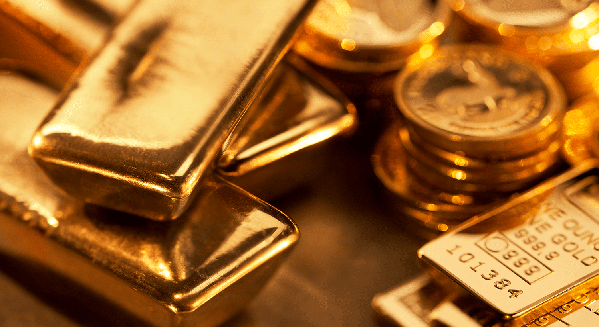

Investing in gold and other precious metals has consistently attracted investors due to their status as safe-haven assets. Historically, these metals have been perceived as reliable stores of value, offering protection against economic downturns and inflation. Gold, in particular, has been revered for its intrinsic value and ability to preserve wealth over centuries. The stability provided by gold and other precious metals makes them attractive, especially during periods of geopolitical tension and financial instability.

In contrast, the modern investment landscape is being transformed by algorithmic trading, which utilizes advanced mathematical models and computational tools to execute trades at high speeds and frequencies. This innovative approach to trading offers several advantages, such as increased efficiency, speed, and the removal of human emotion from trading decisions. Algorithms can analyze vast datasets in real-time, identifying optimal trading opportunities based on predetermined strategies.



This article examines the intersection of precious metals investment and the burgeoning field of algorithmic trading. By integrating these two domains, investors have the opportunity to leverage the safety of gold and other precious metals while benefiting from the efficiency and precision of algorithms. We will discuss the benefits, methods, and technological advancements that facilitate algorithmic trading of gold and precious metals, highlighting how this synergy can potentially revolutionize investment strategies in this sector.

## Table of Contents

## The Allure of Gold and Precious Metals Investment

Gold has been revered as a financial asset for centuries, valued for its intrinsic properties and scarcity. Historically, civilizations have used gold as a symbol of wealth and power, evidenced by its adoption as currency and its role in fortifying national treasuries. The Gold Standard, notably implemented in the 19th and early 20th centuries, was a testament to gold's critical function in facilitating global trade and providing monetary stability. This system linked paper currencies directly to gold, fostering confidence in economic systems until its dissolution in the 1970s.

Investors today turn to precious metals for several rationales. Chief among these is gold's efficacy as a hedge against inflation. Historically, as inflation rises, the purchasing power of fiat currencies declines, whereas gold typically maintains its value, preserving wealth. Math shows that if inflation grows at a rate $i$ and gold appreciates at a rate $g$, wealth preservation is achieved when $g \geq i$.

Currency devaluation presents another compelling reason for investing in gold. When a currency loses value, the price of gold in that currency often increases, thereby protecting investors. For instance, during periods of geopolitical tension or fiscal instability, the demand for gold usually escalates, leading to price appreciation.

Economic uncertainty, marked by volatile markets and geopolitical tensions, further accentuates the allure of gold. In such times, investors gravitate towards gold to mitigate risks in their portfolios, given its reputation as a "safe-haven" asset.

While gold remains the linchpin of precious metal investments, other metals like silver, platinum, and palladium also play vital roles in diversifying portfolios. Silver, often referred to as "poor man's gold," benefits from both industrial demand and its status as a store of value. Its price dynamics can differ from gold, offering portfolio diversification.

Platinum and palladium, apart from their investment appeal, are crucial industrial metals used in automotive catalytic converters and electronics. Their demand is largely driven by industrial applications, which can provide counter-cyclical investment opportunities relative to gold and silver.

Investors thus consider a blend of these metals to optimize their portfolios, balancing gold's stability with the growth potential of silver, platinum, and palladium in various market conditions.

## Understanding Algorithmic Trading

Algorithmic trading, often known as algo trading, refers to the application of computer programs to trade securities in financial markets. These programs execute trades based on pre-defined criteria at speeds and frequencies that would be difficult for a human trader to achieve. By employing algorithms, traders and institutions aim to maximize efficiency, reduce costs, and eliminate the subjectivity inherent in human decision-making.

### What is Algorithmic Trading and How Does It Work?

Algorithmic trading involves the use of advanced mathematical models and automated strategies to execute transactions in financial markets. At its core, [algorithmic trading](/wiki/algorithmic-trading) systematizes trading activities, allowing traders to define rules and strategies that can be backtested on historical data. When the predetermined market conditions are met, the algorithm automatically places orders, ensuring consistency and precision in trade execution.

### Components of a Trading Algorithm

1. **Data Analysis**: At the heart of any trading algorithm is comprehensive data analysis. Algorithms rely on vast datasets to understand market movements, identify trends, and gain insights. This data-driven approach includes examining historical prices, trading volumes, and other relevant financial metrics. Additionally, real-time data feeds provide the current market conditions required for making instantaneous trading decisions.

2. **Strategy Formulation**: Once the data is analyzed, the next step is to formulate a trading strategy. This involves defining the precise rules under which a trade will be executed. Strategies can vary widely, such as statistical arbitrage, market making, trend following, or mean reversion. Each strategy often requires a unique set of conditions, including entry and exit points, position sizing, and risk management protocols.

3. **Execution**: The final component is the execution of trades. A well-designed algorithm ensures that trades are executed at optimal prices while minimizing market impact. Execution algorithms consider factors such as transaction costs and liquidity to achieve the best possible outcome for each trade. 

### Advantages of Algorithmic Trading

The adoption of algorithmic trading offers several distinct advantages:

- **Speed and Efficiency**: Algorithms can process and analyze data, and execute trades in a fraction of a second, far beyond human capabilities. This speed advantage allows traders to capitalize on market inefficiencies before they are corrected.

- **Emotionless Trading**: Emotional biases often influence human decisions, leading to inconsistent trading outcomes. Algorithmic trading eliminates emotional involvement, sticking strictly to the strategy's rules and conditions without deviation.

- **Consistent Execution**: By automating the trading process, algorithms ensure that trades are executed consistently according to the predetermined criteria, reducing the chances of human error and subjectivity.

In summary, algorithmic trading merges technology with finance to create a systematic and efficient approach to trading in financial markets. Its foundation lies in robust data analysis, strategic formulation, and impeccable execution, which together offer unparalleled speed and remove the uncertainty of human emotions in trading decisions.

## Algorithmic Strategies for Precious Metals

Algorithmic trading strategies for precious metals have become increasingly sophisticated, capitalizing on advancements in data analytics and computational power. Among the most prominent strategies used in this domain is trend analysis. Trend analysis involves examining historical price data to identify patterns and predict future price movements. This method is particularly useful in the precious metals market, where assets like gold and silver can display prolonged price trends due to economic and geopolitical factors. For example, a simple moving average (SMA) can be calculated using a Python script to smooth out price fluctuations and identify trends:

```python
import pandas as pd

def moving_average(prices, window_size):
    return prices.rolling(window=window_size).mean()

# Example usage
prices = pd.Series([1800, 1820, 1815, 1830, 1825])  # Sample gold prices
print(moving_average(prices, window_size=3))
```

Pattern recognition is another crucial component of trading algorithms. This involves identifying specific formations such as head and shoulders, double tops, or triangles, which often precede significant price movements. By employing mathematical models or [machine learning](/wiki/machine-learning) techniques, traders can program algorithms to detect these patterns and execute trades accordingly.

Sentiment analysis represents another innovative strategy, leveraging market mood and investor sentiment to inform trading decisions. This approach typically involves analyzing news articles, social media posts, and other textual data sources to gauge public sentiment towards precious metals. Natural language processing (NLP) techniques can process this data, generating sentiment scores that influence trading decisions. For instance, increased positive sentiment towards gold might correlate with rising prices, suggesting a potential buy signal.

Incorporating these strategies enables traders to execute trades based on quantitative analysis rather than intuition, ensuring a more disciplined and potentially profitable approach to trading precious metals. By continuously evolving and integrating new data sources, traders can refine these strategies, maintaining a competitive edge in dynamic markets.

## Integrating AI in Gold Trading Algorithms

Artificial intelligence (AI) is profoundly enhancing trading algorithms used in the precious metals market by providing sophisticated tools for analyzing vast datasets, identifying patterns, and executing trades with heightened accuracy. AI's capacity to process complex data structures and learn from them enables traders to anticipate market movements with improved precision.

AI-driven trading algorithms can utilize machine learning techniques to evaluate historical data and current market trends to predict future price movements. This involves supervised learning, where the algorithm is trained on a dataset containing inputs and their corresponding outputs, enabling it to make predictions based on new data. For example, utilizing regression models can help predict gold prices based on factors like economic indicators, historical prices, and trading volumes:

```python
from sklearn.linear_model import LinearRegression
import numpy as np

# Example data: Historical gold prices and economic indicators
X = np.array([[2020, 1800], [2021, 1850]])  # [Year, Economic Indicator]
y = np.array([1700, 1750])  # Gold prices

# Initialize and train the model
model = LinearRegression()
model.fit(X, y)

# Predict future gold price
future_data = np.array([[2022, 1900]])
predicted_price = model.predict(future_data)
```

Case studies showcase AI's effectiveness in gold trading. One such study involved using neural networks to analyze sentiment from financial news and social media, which influenced gold market movements. Sentiment analysis involves processing natural language data to gauge market sentiment (positive, negative, or neutral) and its potential impact on prices. These insights can guide trading strategies, allowing traders to capitalize on transient market moods.

The future of AI in precious metals trading appears promising, with developments in [deep learning](/wiki/deep-learning) and adaptive algorithms poised to further revolutionize investment strategies. AI's growing ability to continuously learn and adapt suggests a shift towards more autonomous trading systems. These systems could balance portfolios dynamically, react to unprecedented market events, and optimize trades in real-time.

Moreover, AI's evolving role includes enhancing risk management by identifying non-obvious correlations in complex datasets, helping traders mitigate potential losses. As AI technology advances, its integration into trading strategies is expected to become more widespread, offering sophisticated solutions that improve decision-making processes and yield higher returns.

In conclusion, the integration of AI in gold trading algorithms is driving significant advancements in how investors approach the precious metals market. By automating complex analyses and predicting market trends with greater accuracy, AI stands to redefine traditional investment methods, making them more efficient and insightful.

## Risks and Challenges

Algorithmic trading in precious metals presents several risks and challenges that traders must navigate to optimize their investment strategies. One significant risk is the [volatility](/wiki/volatility-trading-strategies) inherent in metal markets. Precious metals such as gold and silver have historically shown significant price fluctuations due to a variety of factors, including geopolitical tensions, changes in economic policies, and currency market movements. This volatility can lead to large, unexpected losses if not managed correctly.

Technical glitches are another potential pitfall in algorithmic trading systems. As these systems rely heavily on technology and software, any failure, whether due to hardware malfunctions, software bugs, or connectivity issues, can lead to incorrect trades or significant financial losses. For instance, a communication delay between the trading platform and the server could result in orders being executed at unfavorable prices. To mitigate such risks, traders can implement robust risk management protocols, such as setting stop-loss orders and regularly updating and testing their software systems.

Data misinterpretation presents another challenge. Algorithms rely on data to analyze market conditions and execute trades. However, incorrect data or errors in data processing can lead the algorithm to make erroneous trading decisions. Ensuring data accuracy and employing thorough [backtesting](/wiki/backtesting) and optimization procedures can help reduce the likelihood of such issues. A solid understanding of statistical validation and performance metrics is crucial for traders to evaluate their algorithms' reliability.

Regulatory concerns and market manipulation issues also pose significant risks. Algorithmic trading is subject to regulations that vary by jurisdiction, and non-compliance can result in legal repercussions and financial penalties. Moreover, high-frequency trading ([HFT](/wiki/high-frequency-trading-strategies)) strategies, sometimes employed in algorithmic systems, have been criticized for creating unfair market advantages and potentially facilitating manipulative practices like "quote stuffing" or "spoofing." Traders must, therefore, remain informed about the regulatory landscape and ensure that their trading practices align with relevant laws and ethical standards.

Addressing these challenges requires diligence and continuous monitoring of both the systems and the markets. Employing advanced machine learning techniques to anticipate market movements and incorporating real-time monitoring tools can enhance the resilience of algorithmic trading systems against these inherent risks.

## Steps to Begin Algorithmic Trading in Precious Metals

Starting algorithmic trading in precious metals involves several critical steps, beginning with choosing the right trading platform and setting up an account. When choosing a trading platform, it is essential to ensure that it supports precious metals markets and provides robust tools for algorithmic trading. Features such as access to real-time data feeds, historical data, backtesting capabilities, and low latency in trade execution are vital. Renowned platforms like MetaTrader, NinjaTrader, or [Interactive Brokers](/wiki/interactive-brokers-api) are popular options that cater to these requirements.

Once a suitable platform is selected, creating and configuring an account is the next step. It's important to ensure that the trading account has permissions to trade in precious metals and is linked to reliable data sources required for executing algorithms effectively. Additionally, traders should ensure that their accounts are adequately funded and comply with any regulatory or margin requirements specific to precious metals trading.

Selecting a Suitable Algorithm

When selecting an algorithm for trading precious metals, traders should consider the algorithm's ability to recognize patterns and respond to market trends efficiently. Algorithms should be adaptable to the unique market conditions of precious metals, including their sensitivity to geopolitical developments and macroeconomic shifts. The chosen algorithm must balance risk and reward effectively, aiming to mitigate the inherent volatility of metal markets. Algorithms that incorporate trend-following and mean-reversion strategies have shown effectiveness in precious metal markets.

Moreover, advanced machine learning algorithms can be utilized for predictive analytics in precious metals trading. For example, algorithms that use supervised learning techniques can predict price movements based on historical data. The following is a simple representation of how one might start with such an algorithm in Python, using libraries like `pandas` for data manipulation and `sklearn` for machine learning:

```python
import pandas as pd
from sklearn.model_selection import train_test_split
from sklearn.ensemble import RandomForestRegressor

# Assume data is a DataFrame containing historical precious metals prices
data = pd.read_csv('historical_metal_prices.csv')
features = data[['feature1', 'feature2', 'feature3']] # Replace with relevant market features
target = data['price']

X_train, X_test, y_train, y_test = train_test_split(features, target, test_size=0.2, random_state=42)

model = RandomForestRegressor(n_estimators=100, random_state=42)
model.fit(X_train, y_train)

price_predictions = model.predict(X_test)
```

Advice for Novice Traders

For novice traders, gaining a comprehensive understanding of both precious metals markets and the mechanics of algorithmic trading is crucial. Beginners should start by educating themselves through courses or [books](/wiki/algo-trading-books) on algorithm development and market analysis specific to precious metals. Practicing with a demo account is highly recommended before risking real capital, as it allows novices to refine their strategies without financial risk.

Additionally, novice traders should focus on developing clear trading plans and risk management strategies to avoid emotional decision-making. Keeping abreast of the latest developments in financial technology and market conditions can also enhance decision-making skills. Novice traders should consider starting with simpler algorithms to grasp the fundamental concepts before advancing to more complex systems.

In summary, selecting the appropriate platform and algorithm, coupled with a strong foundation in market analysis and algorithmic strategies, can significantly enhance one's prospects in algorithmic trading of precious metals. Combining these technical skills with prudent risk management offers the best chance for success in this competitive field.

## Conclusion

Combining gold investment with algorithmic trading offers numerous potential benefits. The primary advantage lies in the increased efficiency and precision of trading operations. Algorithmic systems can process and analyze vast amounts of data rapidly, identifying trends and patterns that may be invisible to the human eye. This capability can lead to more timely and informed decision-making, potentially increasing profitability. Additionally, algorithmic trading reduces the risk of emotional decision-making, a frequent downfall in traditional investing, allowing for more disciplined and consistent trading practices.

Exploring AI and algorithmic trading as part of a diversified investment strategy can significantly enhance an investor's portfolio. Artificial intelligence can improve the accuracy of predictions and risk assessments, further strengthening the reliability of trading strategies in gold and precious metals. By integrating these advanced technologies, investors not only capitalize on the traditional strengths of precious metals as a hedge against inflation and economic instability but also leverage modern computational tools to optimize returns and manage risks effectively.

Looking to the future, the trading landscape for precious metals is poised for substantial evolution. The continuous advancements in AI and machine learning are expected to bring about smarter trading systems capable of adapting to market changes with minimal human intervention. As regulations around algorithmic trading become more robust, there will be a greater emphasis on transparency and ethical considerations. Investors embracing these technologies will likely find themselves at the forefront of the market, equipped to navigate the complexities of an ever-changing economic environment with agility and insight.

## References & Further Reading

[1]: Bergstra, J., Bardenet, R., Bengio, Y., & Kégl, B. (2011). ["Algorithms for Hyper-Parameter Optimization."](https://papers.nips.cc/paper/4443-algorithms-for-hyper-parameter-optimization) Advances in Neural Information Processing Systems 24.

[2]: ["Advances in Financial Machine Learning"](https://www.amazon.com/Advances-Financial-Machine-Learning-Marcos/dp/1119482089) by Marcos Lopez de Prado

[3]: ["Evidence-Based Technical Analysis: Applying the Scientific Method and Statistical Inference to Trading Signals"](https://www.amazon.com/Evidence-Based-Technical-Analysis-Scientific-Statistical/dp/0470008741) by David Aronson

[4]: ["Machine Learning for Algorithmic Trading"](https://github.com/PacktPublishing/Machine-Learning-for-Algorithmic-Trading-Second-Edition) by Stefan Jansen

[5]: ["Quantitative Trading: How to Build Your Own Algorithmic Trading Business"](https://www.amazon.com/Quantitative-Trading-Build-Algorithmic-Business/dp/1119800064) by Ernest P. Chan