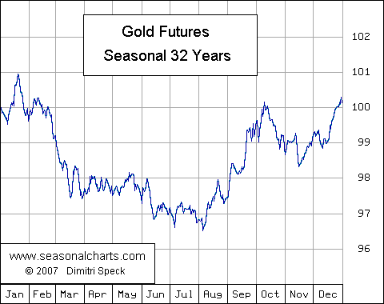

The world of financial derivatives offers various avenues for investment, and gold options are a notable choice. These financial instruments provide investors with the ability to position themselves in the gold market without the need to directly buy or sell the physical commodity. At the core of gold options is the principle that they are contracts granting the right, but not the obligation, to trade gold at a predetermined price at a future date. This opportunity for speculative positioning or hedging within the commodities market can cater to diverse investment objectives.

Gold options function as derivatives, meaning their value is intrinsically linked to the price of gold itself. These options encompass two primary forms: call options, which offer the right to purchase, and put options, which provide the option to sell. The potential for high returns makes gold options attractive, yet they also come with inherent risks tied to market volatility. For investors aiming to leverage price fluctuations without committing to purchasing gold directly, these options present a flexible and sophisticated tool.



A measured approach to investing in gold options helps manage the complexity and volatility of gold markets. Integrating algorithmic trading into gold options strategies can further enhance investment potential. Algorithmic trading allows for expediting trade executions and reduces emotional biases, which is particularly beneficial in the inherently fluctuating gold market. This use of technology aids investors in implementing intricate strategies with precision, thereby optimizing portfolio performance.

A thorough comprehension of gold options and the strategic methodologies involving them can significantly complement an investment portfolio. By carefully balancing the associated opportunities with the risks, investors can effectively harness the power of gold options within their broader investment strategies. Understanding the different mechanisms and attributes of these derivatives is crucial for making informed trading decisions and achieving long-term financial goals.

## Table of Contents

## Understanding Gold Options

A gold option is a derivative contract that grants the holder the right, but not the obligation, to buy or sell a specified amount of gold at a predetermined price, known as the strike price, within a set time frame. The two primary types of gold options are call options and put options. A call option provides the right to purchase gold, while a put option confers the right to sell it. These options offer a flexible approach to trading gold without the necessity of taking physical possession of the bullion.

Gold options can be an appealing component of an investor's portfolio for several reasons. They provide leverage, enabling a greater position size in gold with reduced capital expenditure compared to buying physical gold. This leverage can lead to substantial returns if market conditions are favorable. For example, if an investor purchases a call option for gold at a low premium and gold prices rise significantly, the investor can benefit from the price increase far beyond the initial investment cost.

Differentiating between gold options and gold futures is crucial for investors. While both are derivatives, a gold futures contract obligates the holder to buy or sell gold at a specified future date and price. Unlike options, futures contracts do not provide the flexibility to abstain from the transaction. Consequently, futures tend to involve more risk due to the mandatory execution of the contract upon expiration.

Gold futures also demand a higher initial capital outlay, given the requirement for margin accounts and the possibility of margin calls if market prices move unfavorably. In contrast, the risk in gold options is limited to the premium paid for the option, affording traders clearer risk management parameters.

In summary, understanding the mechanics of gold options and their distinction from gold futures is essential for traders. By recognizing the unique benefits and potential challenges, investors can utilize gold options as a strategic tool within their broader investment landscape.

## Gold Options Investment Strategies

Gold options are a versatile derivative instrument that offers investors a variety of investment strategies to enhance portfolio performance. One of the most significant advantages of gold options is the ability to leverage position size with a minimal capital outlay. This leveraging capability allows investors to gain exposure to gold price movements without the need to own physical gold or invest in futures contracts, making it a cost-effective method of participating in the gold market.

Investors commonly use gold options to hedge against potential losses in their existing gold investments. For instance, if an investor holds physical gold or a futures position, purchasing put options can provide insurance against price declines. A put option grants the holder the right to sell gold at a predetermined price, functioning as a safety net in bearish markets. Conversely, call options can be used to capitalize on anticipated price increases without actually purchasing the commodity.

Various strategies can optimize the use of gold options, each catering to different risk appetites and market views. Strategies like covered calls and protective puts are popular among investors. A covered call strategy involves holding a long position in gold or gold-related assets while simultaneously selling call options. This approach can yield additional income from option premia, albeit at the cost of capping potential upside gains if the gold price exceeds the strike price of the sold options.

Protective puts are another strategy to consider, wherein an investor buys put options to shield an existing asset from significant downside risk. This strategy effectively locks in a sell price for the gold, mitigating the potential losses in the event of a downturn in the market when combined with a long position in gold or related assets.

Incorporating gold options into a diversified investment portfolio can also serve as a risk mitigation tool. Gold has historically been a safe-haven asset, often performing well during economic uncertainty. By adding gold options to a broader investment mix, investors can achieve a balanced exposure that capitalizes on gold's hedging properties while benefiting from the potential upside through options strategies. This dual approach can help smooth out returns over time, providing stability and growth potential across varying economic cycles.

In summary, gold options offer strategic advantages for hedging and potential profit-making. By employing options in a structured manner, investors can reduce risks, protect investments, and capitalize on market opportunities, enhancing the overall resilience and performance of their portfolios.

## Algo Trading in Gold Options

Algorithmic trading, often referred to as algo trading, plays a pivotal role in the execution of trades in the gold options market. At its core, this form of trading relies on computer algorithms to initiate trading decisions, allowing for rapid execution, often within milliseconds. Such speed is vital in volatile markets where prices can fluctuate dramatically in short periods.

One of the primary advantages of algo trading is its ability to implement complex trading strategies devoid of emotional interference that often hampers manual trading. Traders program specific criteria and conditions, such as price, timing, and [volume](/wiki/volume-trading-strategy), into algorithms that automatically execute trades when the conditions are met. This systematic approach ensures consistent strategy application, free from human biases like fear or greed.

Algo trading systems are particularly adept at evaluating multiple market conditions swiftly. They can analyze large data sets, including historical price movements, market indicators, and news feeds, enabling them to adjust strategies in real time. For instance, a simple algorithm might implement a strategy to buy gold options if the price of gold drops by a certain percentage within a given timeframe while simultaneously selling if it surpasses a specified threshold.

The ability to manage risk effectively is another significant benefit of using algorithms in trading. Algorithms can be designed to incorporate risk management techniques such as stop-loss orders, which can automatically [exit](/wiki/exit-strategy) a position if it falls below a certain price point, thus limiting potential losses. Additionally, algorithms can employ diversification strategies by simultaneously managing multiple positions, thereby spreading risk across different assets.

To illustrate, consider a Python strategy using the [backtrader](/wiki/backtrader) library, a popular choice for [algorithmic trading](/wiki/algorithmic-trading) due to its flexibility:

```python
import backtrader as bt

class GoldOptionStrategy(bt.Strategy):
    params = (('short_sma', 10), ('long_sma', 30))

    def __init__(self):
        self.short_sma = bt.indicators.SimpleMovingAverage(self.data.close, period=self.params.short_sma)
        self.long_sma = bt.indicators.SimpleMovingAverage(self.data.close, period=self.params.long_sma)

    def next(self):
        if not self.position:
            if self.short_sma > self.long_sma:
                self.buy(size=10)  # buy 10 gold options
        elif self.short_sma < self.long_sma:
            self.sell(size=10)  # sell 10 gold options

if __name__ == '__main__':
    cerebro = bt.Cerebro()
    cerebro.addstrategy(GoldOptionStrategy)

    # Load your data
    data = bt.feeds.YahooFinanceData(dataname='GOLD', fromdate=datetime(2021, 1, 1), todate=datetime(2022, 1, 1))
    cerebro.adddata(data)

    cerebro.broker.setcash(10000)
    cerebro.run()
```

In this example, the algorithm uses simple moving averages (SMAs) to determine buy and sell signals based on short-term market trends. This kind of strategy enables traders to capitalize on short-term price movements in gold options without being tied to their screens constantly.

In conclusion, the incorporation of algorithms in gold options trading allows for swift execution, removal of emotional biases, adaptation to market changes, and optimized risk management, making it a crucial tool for traders seeking efficiency and precision in their trading activities.

## The Benefits and Risks of Gold Options

Gold options provide a means for traders to engage in the gold market with less capital outlay than required for purchasing physical gold or engaging in futures contracts. This aspect makes them an attractive option for many traders, especially those looking to leverage their positions with a limited budget. However, like any financial instrument, gold options [carry](/wiki/carry-trading) both opportunities for high returns and significant risks.

One of the primary advantages of gold options is the potential for high returns. By leveraging their capital, traders can control larger positions with a relatively small amount of money. For instance, purchasing a call option allows a trader to benefit from the upward movement of gold prices while limiting the potential loss to the premium paid for the option. Similarly, put options enable traders to profit from declining prices.

However, this leverage also introduces considerable risk, particularly in volatile markets. The value of options can fluctuate significantly with market [volatility](/wiki/volatility-trading-strategies), which may result in substantial losses. Additionally, options have expiration dates, which necessitates that the predicted price movement occurs within a set timeframe. Failure to achieve the price movement within the option’s lifespan can lead to the total loss of the premium paid.

Investors must be cognizant of the implications of leverage and volatility when trading gold options. Understanding the "Greeks," which quantify the sensitivity of the option's price to various factors, can be beneficial. For example:

- Delta measures the option's sensitivity to changes in the price of the underlying asset.
- Gamma indicates how delta changes with the price of the underlying asset.
- Theta represents the rate at which an option's value decays as it approaches expiry.

Risk management techniques are vital to minimize potential losses while maximizing potential gains. One common approach is the implementation of stop-loss orders, which automatically close positions when losses reach a predetermined level, thus preventing further financial damage. Diversification can also play a key role by spreading the risk across different assets or strategies, thereby reducing the impact of adverse price movements in any single position.

In conclusion, while gold options offer significant opportunities through leveraged positions and potential high returns, they necessitate a keen awareness of the inherent risks, particularly given market volatility. Proper risk management strategies are crucial for optimizing these financial instruments, making them a potentially valuable component of a diversified investment portfolio.

## Conclusion

Gold options offer a flexible and potentially lucrative pathway for investors seeking exposure to the gold market within the derivatives space. The ability to use algorithmic trading significantly enhances the strategic implementation of gold options, providing traders with a robust toolset for capturing favorable market positions swiftly and efficiently. Algorithmic trading can automate complex strategies, minimize human error, and swiftly respond to market changes, allowing investors to make informed and precise decisions without the emotional biases that often accompany manual trading.

Success in trading gold options, however, requires a thorough comprehension of both the opportunities and risks. The nature of these financial instruments grants the potential for substantial returns, yet also introduces considerable risk, particularly in markets characterized by volatility. Leverage, while amplifying possible gains, can similarly augment losses. Accordingly, a deep understanding of risk management is imperative. Investors need to employ strategies such as hedging and diversifying their portfolios to manage risk effectively. Risk management techniques, including the use of stop-loss orders and position sizing, are vital for protecting investments against downside risk while maximizing upside potential.

A strategically crafted approach, combined with algorithmic trading, positions gold options as a beneficial addition to a diversified investment portfolio. By carefully integrating gold options into an investment strategy, investors can not only hedge against market volatility and potential losses in other investments but also capitalize on the intrinsic opportunities within the derivatives market. With diligent planning, comprehensive knowledge, and strategic implementation, gold options can prove to be a valuable asset in enhancing portfolio performance and achieving long-term investment goals.

## References & Further Reading

[1]: Culp, C. L. (2001). ["The Risk Management Process: Business Strategy and Tactics."](https://archive.org/details/riskmanagementpr0000culp) John Wiley & Sons.

[2]: Black, F., & Scholes, M. (1973). ["The Pricing of Options and Corporate Liabilities."](https://www.cs.princeton.edu/courses/archive/fall09/cos323/papers/black_scholes73.pdf) The Journal of Political Economy, 81(3), 637-654.

[3]: Hull, J. C. (2020). ["Options, Futures, and Other Derivatives."](https://www.amazon.com/Options-Futures-Other-Derivatives-11th/dp/B0B9JS99C2) Pearson.

[4]: Chincarini, L., & Kim, D. (2010). ["Quantitative Equity Portfolio Management: An Active Approach to Portfolio Construction and Management."](https://www.amazon.com/Quantitative-Equity-Portfolio-Management-Construction/dp/0071459391) McGraw-Hill Education.

[5]: Brogaard, J., Hendershott, T., & Riordan, R. (2014). ["High-Frequency Trading and Price Discovery."](https://academic.oup.com/rfs/article-abstract/27/8/2267/1582754) The Review of Financial Studies, 27(8), 2267-2306.