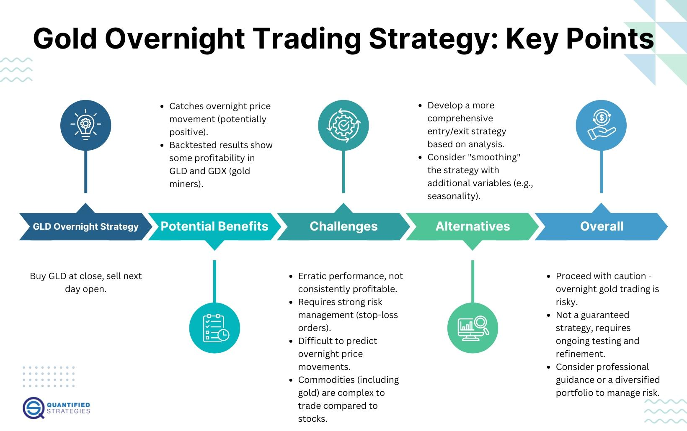

## Table of Contents

## What is gold overnight trading?

Gold overnight trading is when people buy and sell gold outside of regular market hours. Regular market hours are usually during the day, like from 9 AM to 5 PM. But with overnight trading, you can trade gold even when it's late at night or very early in the morning. This is helpful for people in different time zones or those who can't trade during the day.

Trading gold overnight can be good because it lets you react quickly to news or events that happen outside of regular trading times. For example, if something big happens in the world at night, you can buy or sell gold right away instead of waiting until the next day. However, overnight trading can also be riskier. The market might be less active at night, which can make prices move more suddenly and unpredictably. So, it's important to be careful and understand these risks before you start trading gold overnight.

## Why might someone choose to trade gold overnight?

Someone might choose to trade gold overnight because it gives them more flexibility. If they have a job or other commitments during the day, they can still trade gold when it's convenient for them, like at night or early in the morning. This is especially useful for people living in different time zones where the regular trading hours might not match their awake times. For example, if someone lives in a place where the main gold markets are closed during their daytime, they can still trade gold when those markets are open at night.

Another reason is that trading gold overnight can help someone react quickly to big news or events that happen outside regular trading hours. If something important happens in the world at night, like a sudden change in economic policy or a major geopolitical event, the price of gold might change quickly. By trading overnight, someone can buy or sell gold right away instead of waiting until the next day when the price might be different. This can be a big advantage, but it's also important to remember that trading at night can be riskier because the market might be less active and prices can move more suddenly.

## What are the basic principles of an overnight trading strategy for gold?

When you're planning an overnight trading strategy for gold, the first thing to think about is staying informed. You need to keep an eye on news and events that could affect the price of gold, even when the markets are closed. This could be anything from economic reports to big world events. By knowing what's happening, you can make smart choices about when to buy or sell gold. It's also a good idea to set up alerts on your phone or computer so you get notified right away if something important happens.

Another important part of your strategy should be managing risk. Overnight trading can be riskier because fewer people are trading, which can make prices move more suddenly. To help with this, you can use stop-loss orders. These are like safety nets that automatically sell your gold if the price drops to a certain level, so you don't lose too much money. It's also smart to not put all your money into one trade. Instead, spread it out over different trades to reduce the risk. By being careful and planning ahead, you can make the most of trading gold overnight.

## How does the gold market operate during overnight hours?

The gold market during overnight hours works differently than during the day. When the regular trading hours are over, the market doesn't completely stop. Instead, it keeps going but with fewer people trading. This means that the gold market can be less busy at night. Because fewer people are buying and selling, the prices can change more suddenly. If something big happens in the world at night, like a news event, it can make the price of gold go up or down quickly.

Even though the market is less active, you can still trade gold at night. This is helpful for people who can't trade during the day because of their jobs or where they live. If you're in a different time zone, the regular trading hours might not work for you. Trading at night lets you buy or sell gold when it's convenient for you. But remember, trading at night can be riskier because the market is less busy and prices can move more unpredictably. So, it's important to be careful and know what you're doing when you trade gold overnight.

## What are the key factors to consider before starting gold overnight trading?

Before you start trading gold overnight, it's important to understand the risks. The gold market is less busy at night, which means prices can change more suddenly. If something big happens in the world while you're trading, the price of gold might go up or down very quickly. This can be good if you're ready for it, but it can also be bad if you're not careful. So, think about how much risk you're okay with and make sure you have a plan to manage it. Using stop-loss orders can help protect you by automatically selling your gold if the price drops too much.

Another thing to consider is staying informed. Since you'll be trading outside regular hours, you need to keep up with news and events that could affect gold prices. Set up alerts on your phone or computer so you know right away if something important happens. Also, think about your schedule. If you work during the day or live in a different time zone, trading at night might be a good fit for you. But make sure you have the time and energy to watch the market closely, because overnight trading needs more attention than trading during the day.

## What are the risks associated with trading gold overnight?

Trading gold overnight can be riskier than trading during the day. One big reason is that fewer people are trading at night, so the market is less busy. When the market is less busy, the price of gold can change more suddenly. If something big happens in the world at night, like a news event, the price of gold might go up or down very quickly. This can be good if you're ready for it, but it can also be bad if you're not careful. So, you need to be prepared for bigger price swings when you trade gold overnight.

Another risk is that it can be harder to get good information at night. During the day, there are lots of people and news sources giving you information about the market. But at night, there might not be as much information available. This means you might have to make decisions with less information, which can be risky. Also, if you're not used to trading at night, you might be more tired and make mistakes. So, it's important to be careful and have a good plan before you start trading gold overnight.

## How can one manage risk when trading gold overnight?

Managing risk when trading gold overnight is really important because the market can be more unpredictable at night. One way to manage risk is by using stop-loss orders. These are like safety nets that automatically sell your gold if the price drops to a certain level. This can help you avoid losing too much money if the price suddenly goes down. Another way to manage risk is by not putting all your money into one trade. Instead, spread your money out over different trades. This way, if one trade goes bad, you won't lose everything.

It's also a good idea to stay informed about news and events that could affect the price of gold. Set up alerts on your phone or computer so you know right away if something important happens. This can help you make better decisions and react quickly to changes in the market. Remember, trading at night can be riskier because fewer people are trading, so prices can move more suddenly. By being careful and having a good plan, you can manage these risks better and trade gold overnight more safely.

## What technical analysis tools are useful for gold overnight trading?

When you're trading gold overnight, using technical analysis tools can help you make better decisions. One useful tool is the moving average. This tool helps you see the average price of gold over a certain time, like 50 days or 200 days. By looking at the moving average, you can see if the price of gold is going up or down over time. Another helpful tool is the Relative Strength Index (RSI). The RSI tells you if gold is being bought a lot (overbought) or sold a lot (oversold). If the RSI is over 70, it might be a good time to sell because the price might go down soon. If it's under 30, it might be a good time to buy because the price might go up soon.

Another important tool for gold overnight trading is the Bollinger Bands. These bands show you the high and low prices of gold over time and can help you see if the price is moving a lot or staying the same. If the price of gold goes outside the Bollinger Bands, it might mean the price will soon move back inside the bands. This can help you decide when to buy or sell. Also, using candlestick charts can be helpful. These charts show you the opening, closing, high, and low prices of gold for each time period. By looking at the patterns in the candlesticks, you can see if the price might go up or down next. Using these tools together can give you a better idea of what might happen with the price of gold overnight.

## Can you explain how to use moving averages in an overnight gold trading strategy?

When you're trading gold overnight, using moving averages can help you see where the price of gold is going over time. A moving average is just the average price of gold over a certain number of days, like 50 days or 200 days. If you see that the shorter moving average, like the 50-day one, goes above the longer moving average, like the 200-day one, it might mean that the price of gold is starting to go up. This is called a "golden cross," and it could be a good time to buy gold. On the other hand, if the shorter moving average goes below the longer moving average, it's called a "death cross," and it might mean that the price of gold is starting to go down. This could be a good time to sell.

Using moving averages in your overnight trading strategy can help you make better decisions. For example, if you're trading at night and you see that the price of gold is above both the 50-day and 200-day moving averages, it might be a good sign that the price will keep going up. You can use this information to decide when to buy or sell gold. Just remember that moving averages are not perfect, and the price of gold can still change suddenly at night. So, it's a good idea to use moving averages along with other tools, like stop-loss orders, to manage your risk and make the most of your overnight trading.

## What role do economic indicators play in gold overnight trading?

Economic indicators are really important for gold overnight trading. These indicators, like inflation rates, employment numbers, and GDP growth, can tell you a lot about what's happening in the economy. When these numbers come out, they can make the price of gold go up or down. For example, if the inflation rate is higher than expected, people might start buying more gold because it's seen as a safe investment when prices are going up. If you're trading gold overnight, you need to keep an eye on when these economic indicators are released, even if it's in the middle of the night. Knowing what these numbers mean can help you decide if it's a good time to buy or sell gold.

Sometimes, economic indicators can surprise the market. If a report comes out and it's much better or worse than what people were expecting, the price of gold can change a lot very quickly. This is especially true at night when fewer people are trading, so the market can be more sensitive to these surprises. By staying informed about economic indicators and setting up alerts for when they're released, you can react quickly to these changes. This can give you an advantage in your overnight trading, but it also means you need to be careful and ready for sudden price swings.

## How do geopolitical events impact gold prices during overnight trading?

Geopolitical events can have a big impact on gold prices, especially when you're trading overnight. These events, like wars, political changes, or big news from different countries, can make people worried about the economy. When people are worried, they often start buying more gold because it's seen as a safe place to keep their money. If something big happens at night, like a sudden political change or a new conflict, it can make the price of gold go up quickly. Since fewer people are trading at night, these price changes can be even bigger and more sudden than during the day.

So, if you're trading gold overnight, you need to keep an eye on the news and be ready for these changes. Setting up alerts on your phone or computer can help you know right away if something important happens. This way, you can decide quickly if you want to buy or sell gold. But remember, trading at night can be riskier because the market is less busy and prices can move more suddenly. By staying informed and being careful, you can use geopolitical events to your advantage when trading gold overnight.

## What advanced strategies can expert traders use for maximizing profits in gold overnight trading?

Expert traders can use advanced strategies like [scalping](/wiki/gamma-scalping) to make the most of gold overnight trading. Scalping is when you buy and sell gold very quickly, trying to make small profits from small changes in the price. Because the gold market can be less busy at night, prices can move more suddenly. This can be good for scalping because you can take advantage of these quick changes. To do this well, you need to watch the market closely and use technical analysis tools like moving averages and the Relative Strength Index (RSI) to help you decide when to buy and sell. It's also important to use stop-loss orders to protect yourself from big losses if the price suddenly goes against you.

Another strategy experts might use is called swing trading. This is when you hold onto your gold for a few days or weeks, trying to make money from bigger changes in the price. Overnight trading can be good for swing trading because you can react quickly to news and events that happen at night. By staying informed about economic indicators and geopolitical events, you can buy or sell gold at the right times. For example, if you hear about a big political change or a new economic report in the middle of the night, you can use that information to make smart trades. Using both scalping and swing trading together can help you make the most of the opportunities in gold overnight trading, but it's important to be careful and manage your risk well.

## What is Risk Management in Gold Trading?

Effective management of risks is essential for the success of any trading strategy, particularly in the volatile gold market. Various methods exist to mitigate risks, and among these, stop-loss orders and calculated capital at risk assessments are fundamental tools.

Stop-loss orders are predefined levels that automatically trigger selling or buying positions to prevent excessive losses when the market moves unfavorably. For instance, if a trader buys gold at $1,800 per ounce with a stop-loss order set at $1,750, the position will automatically close if the price falls to or below $1,750, thus limiting potential losses.

Calculating permissible capital at risk involves determining the maximum amount of money that a trader is willing to lose on a particular trade or over a specific period. This involves setting a risk percentage per trade relative to the total trading capital. A common rule of thumb is to risk no more than 1-2% of total capital on a single trade. The formula for calculating the position size is:

$$
\text{Position Size} = \left( \frac{\text{Risk per trade} \times \text{Total Capital}}{\text{Trade Risk (difference between entry and stop-loss price)}} \right)
$$

For example, if a trader decides to risk 2% of a $100,000 portfolio with an entry price of $1,800 and a stop-loss price of $1,750, the position size would be:

$$
\text{Position Size} = \left( \frac{2\% \times 100,000}{1,800 - 1,750} \right) = \frac{2,000}{50} = 40 \text{ ounces}
$$

Diversification is another key aspect of risk management. By not putting all investments in one basket or asset class, traders can reduce the impact of a poor-performing asset on their portfolio. In gold trading, this could mean combining gold assets with other commodities, stocks, or bonds to cushion against gold-specific downturns.

Understanding the potential [volatility](/wiki/volatility-trading-strategies) in gold trading is equally important. Gold prices can be influenced by various factors such as geopolitical tensions, inflation rates, and changes in central bank policies. Therefore, traders need to keep abreast of economic indicators and news that might affect gold prices, enabling informed decision-making.

Overall, a comprehensive risk management strategy incorporating stop-loss orders, appropriate capital risk assessments, diversification, and awareness of market volatility can help traders navigate the complexities of the gold market more effectively.

## How can one maximize returns in gold trading?

Maximizing returns in gold trading requires a nuanced approach that combines both technical and [fundamental analysis](/wiki/fundamental-analysis). By leveraging these methodologies, traders can better identify optimal entry and [exit](/wiki/exit-strategy) points, assess risk-reward scenarios, and judiciously manage leverage to capture profits effectively.

Technical analysis involves studying historical price charts and using indicators to predict future price movements. Traders typically employ tools such as moving averages, Fibonacci retracements, and the Relative Strength Index (RSI) to pinpoint advantageous entry and exit points. For instance, a simple moving average (SMA) crossover might signal a potential buying opportunity when a shorter-term SMA crosses above a longer-term SMA:

$$
\text{SMA}_{short} = \frac{1}{n} \sum_{i=0}^{n-1} P_i
$$

where $P_i$ represents the daily closing price, and $n$ is the number of days in the SMA period. Similarly, chart patterns such as head and shoulders or triangles can provide visual cues for potential market reversals or continuations.

Fundamental analysis in gold trading involves evaluating economic indicators, such as inflation rates, currency strength, and central bank policies, which influence gold prices. Traders analyze these factors to predict how they might affect gold demand and supply dynamics. For example, geopolitical tensions or aggressive monetary policies can increase gold's appeal as a safe-haven asset, potentially driving up prices.

To maximize returns, traders often set specific risk-reward ratios to guide their trading decisions. A common practice is to set a risk-reward ratio of at least 1:2, meaning for every dollar risked, the potential return should be two dollars. This approach helps ensure that even if only a portion of trades are successful, overall profitability can be achieved.

Leverage, while offering the potential for amplified returns, must be used with caution. Excessive leverage can lead to significant losses, especially in volatile gold markets. Traders should carefully calculate their leverage levels based on their risk appetite and portfolio size, ensuring that they do not exceed manageable levels:

$$
\text{Leverage} = \frac{\text{Notional Value of Position}}{\text{Equity}}
$$

Moreover, successful gold trading strategies require continuous adaptation and refinement, as market conditions and performance metrics evolve. Implementing [backtesting](/wiki/backtesting) tools can aid traders in assessing the efficacy of their strategies over historical data, allowing adjustments to be made for improved robustness. For example, a Python script utilizing historical price data can simulate trades to evaluate potential outcomes and optimize strategies accordingly. Regularly reviewing and updating strategies ensures that traders remain responsive to market changes, enhancing the potential for consistent returns over time.

By integrating both technical and fundamental insights and maintaining a disciplined, data-driven approach, traders are better positioned to maximize their returns in the gold market.

## References & Further Reading

[1]: Bergstra, J., Bardenet, R., Bengio, Y., & Kégl, B. (2011). ["Algorithms for Hyper-Parameter Optimization."](https://papers.nips.cc/paper/4443-algorithms-for-hyper-parameter-optimization) Advances in Neural Information Processing Systems 24.

[2]: ["Advances in Financial Machine Learning"](https://www.amazon.com/Advances-Financial-Machine-Learning-Marcos/dp/1119482089) by Marcos Lopez de Prado

[3]: ["Evidence-Based Technical Analysis: Applying the Scientific Method and Statistical Inference to Trading Signals"](https://www.amazon.com/Evidence-Based-Technical-Analysis-Scientific-Statistical/dp/0470008741) by David Aronson

[4]: ["Machine Learning for Algorithmic Trading"](https://github.com/stefan-jansen/machine-learning-for-trading) by Stefan Jansen

[5]: ["Quantitative Trading: How to Build Your Own Algorithmic Trading Business"](https://books.google.com/books/about/Quantitative_Trading.html?id=j70yEAAAQBAJ) by Ernest P. Chan