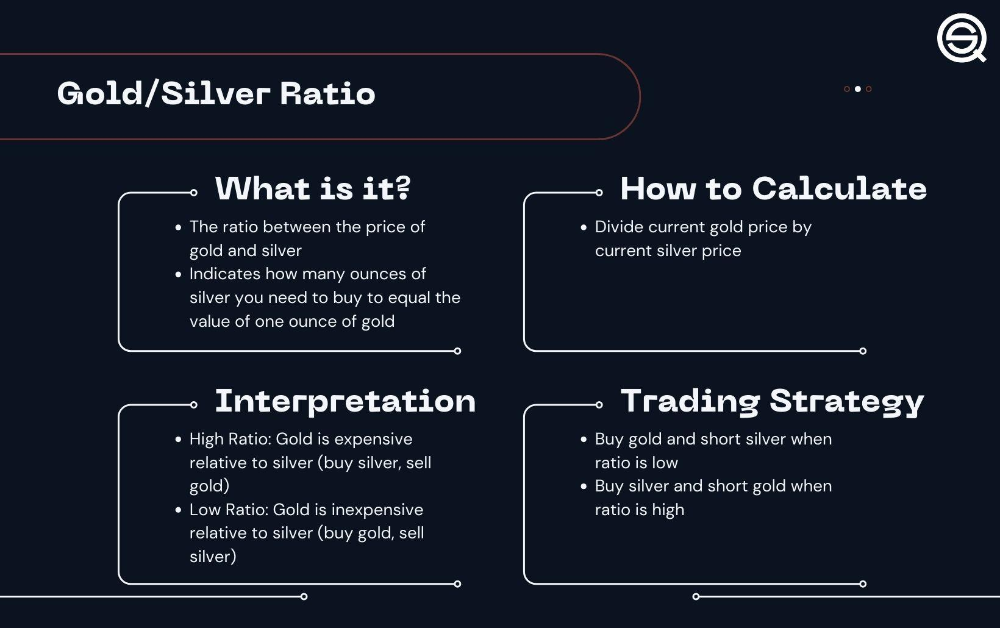

The gold-silver ratio is a prominent metric in the field of trading, offering a quantitative assessment of the relative value between gold and silver. Mathematically defined as the quotient of the current price of gold divided by that of silver, this ratio indicates how many ounces of silver are necessary to purchase one ounce of gold. Traders closely monitor this ratio as it provides insights into market sentiment and potential trading opportunities.

In the sphere of algorithmic trading, the gold-silver ratio holds particular significance. Algorithmic trading involves the use of computer programs to execute trades at high speed based on predetermined criteria. Understanding the dynamics of the gold-silver ratio allows algorithmic traders to enhance their strategies by identifying potential buy and sell opportunities. For example, if the ratio is historically high, it may suggest that silver is undervalued relative to gold, indicating a potential buying opportunity for silver or a selling opportunity for gold.



This article aims to explore the intricacies of the gold-silver ratio and highlight its importance in algorithmic trading. It seeks to provide a comprehensive understanding of how algorithmic traders can leverage the gold-silver ratio to optimize their trading strategies, thereby navigating the complexities of financial markets more effectively.

## Table of Contents

## Understanding the Gold-Silver Ratio

The gold-silver ratio is a financial metric that represents the amount of silver required to purchase one ounce of gold. It is calculated using the formula:

$$
\text{Gold-Silver Ratio} = \frac{\text{Price of Gold (per ounce)}}{\text{Price of Silver (per ounce)}}
$$

Historically, the gold-silver ratio has served as a measure of the relative value between these two precious metals, influencing both trading and investment decisions. This ratio is not static; rather, it fluctuates due to a variety of market dynamics.

One primary [factor](/wiki/factor-investing) that impacts the gold-silver ratio is supply and demand. The supply conditions for gold and silver can vary significantly, influenced by mining output, technological changes, and recycling processes. Demand, on the other hand, is driven by industrial usage, investment needs, and jewelry consumption. For example, silver typically sees higher industrial demand due to its applications in electronics and solar panels, potentially affecting its price differently from gold, which is often sought as a store of value or inflation hedge.

Geopolitical events are another influential factor. Political instability or conflict can lead to economic uncertainty, often causing investors to flock to gold as a safe haven. This increased demand for gold relative to silver can drive the ratio upward. Conversely, periods of economic stability might support industrial activities, enhancing demand for silver and potentially lowering the ratio.

Economic conditions play a crucial role as well. Inflation, interest rates, and currency value fluctuations can all impact the prices of gold and silver. For instance, if inflation is rising, gold might attract more investors looking to preserve their purchasing power, altering the ratio with respect to silver.

In summary, the gold-silver ratio is a dynamic metric shaped by a myriad of factors. Its calculation is straightforward, yet the influences on its value are complex and interconnected, reflecting a wide array of economic and geopolitical variables. Understanding these underlying factors is crucial for traders and investors using the gold-silver ratio as part of their strategies.

## Historical Context and Importance

The gold-silver ratio has been a tool for metal valuation for centuries. Historically, the ratio dates back to ancient times when it was used by governments to stabilize their currencies. This was often achieved by setting a fixed ratio, which was intended to establish balance in the economy by dictating the relative values of gold and silver. For example, during the Roman Empire, the gold-silver ratio was set at 12:1, meaning that one ounce of gold was deemed equivalent in value to twelve ounces of silver.

In more recent history, the gold-silver ratio has been determined by market forces rather than government decrees. The ratio now fluctuates freely based on numerous factors, including market supply and demand dynamics, geopolitical events, and broader economic conditions.

Understanding the historical context of the gold-silver ratio provides valuable insights into its importance. A high gold-silver ratio has historically been interpreted as a sign of economic uncertainty or distress, with investors favoring the safety and stability that gold traditionally offers. Conversely, a lower ratio tends to suggest economic growth and stability, leading investors to seek the higher [volatility](/wiki/volatility-trading-strategies) and potential returns of silver. This dynamic can be attributed to silver's dual role as both a precious metal and an industrial commodity.

Overall, the gold-silver ratio continues to be a significant indicator in financial markets, offering valuable insights into prevailing economic sentiments and guiding investment decisions.

## Using the Gold-Silver Ratio in Algo Trading

Algorithmic traders utilize the gold-silver ratio as a key indicator to identify potential trading opportunities. This ratio, which reflects the price relationship between gold and silver, can serve as a signal to buy or sell these commodities in anticipation of market movements. The gold-silver ratio can be mathematically represented as:

$$
\text{Gold-Silver Ratio} = \frac{\text{Price of Gold per ounce}}{\text{Price of Silver per ounce}}
$$

A common strategy among traders is to apply mean-reversion techniques to the gold-silver ratio. The mean-reversion strategy is based on the assumption that asset prices and their relative value ratios will eventually move back towards their historical averages. When applied to the gold-silver ratio, this approach involves analyzing historical data to determine the average ratio level. If the current ratio deviates significantly from this historical average, it may signal an opportunity to trade.

For instance, if the gold-silver ratio is substantially higher than the historical average, it suggests that gold is overvalued relative to silver. In this scenario, traders might sell gold and purchase silver with the expectation that the ratio will decline towards its historical mean. Conversely, a lower ratio suggests that silver is overvalued relative to gold, prompting traders to sell silver and buy gold.

Algorithmic traders often enhance this basic strategy with additional algorithms to optimize entry and [exit](/wiki/exit-strategy) points. These algorithms can incorporate various technical indicators alongside the gold-silver ratio to refine predictions and improve trade accuracy. Here is a simple Python illustration using a mean-reversion strategy:

```python
# Example Python code for mean-reversion strategy based on gold-silver ratio
import numpy as np
import pandas as pd

# Load historical price data for gold and silver
# Assume df contains 'Date', 'Gold', and 'Silver' columns
df = pd.read_csv('gold_silver_data.csv')

# Calculate the gold-silver ratio
df['Gold_Silver_Ratio'] = df['Gold'] / df['Silver']

# Determine the historical average ratio
historical_average = np.mean(df['Gold_Silver_Ratio'])

# Identify potential buy/sell signals
df['Signal'] = np.where(df['Gold_Silver_Ratio'] > historical_average, 'Sell Gold/Buy Silver',
                        np.where(df['Gold_Silver_Ratio'] < historical_average, 'Buy Gold/Sell Silver', 'Hold'))

# Display the signals
print(df[['Date', 'Gold_Silver_Ratio', 'Signal']])
```

This code snippet calculates the gold-silver ratio from historical data, evaluates its deviation from the historical average, and generates signals accordingly. While the mean-reversion strategy provides a foundation for exploiting the gold-silver ratio in [algorithmic trading](/wiki/algorithmic-trading), it is essential to incorporate other indicators and risk management practices to enhance the robustness and effectiveness of trading systems.

## Backtesting Gold-Silver Ratio Strategies

Backtesting involves the simulation of trading strategies using historical data to determine their potential effectiveness. In the context of the gold-silver ratio, this process is especially pertinent as it allows traders to evaluate strategies based on historical trends in the ratio, which often substitutes for future price movements.

One common strategy involves buying silver when the gold-silver ratio is high and purchasing gold when the ratio is low. The rationale behind this approach is based on historical mean-reversion tendencies: historically, the gold-silver ratio tends to revert to its historical average over time. Therefore, a high ratio could suggest that silver is undervalued compared to gold, while a low ratio might imply the opposite. Here's a basic example of how one might simulate such a strategy in Python:

```python
import pandas as pd

# Sample historical data
data = pd.DataFrame({'date': [...], 'gold_price': [...], 'silver_price': [...]})
data['gold_silver_ratio'] = data['gold_price'] / data['silver_price']

# Strategy parameters
high_threshold = 80  # Arbitrary high ratio indicating silver buy
low_threshold = 50   # Arbitrary low ratio indicating gold buy

# Backtesting results
silver_trades = []
gold_trades = []

for index, row in data.iterrows():
    if row['gold_silver_ratio'] > high_threshold:
        silver_trades.append(('Buy Silver', row['date'], row['silver_price']))
    elif row['gold_silver_ratio'] < low_threshold:
        gold_trades.append(('Buy Gold', row['date'], row['gold_price']))

print("Silver Trades:", silver_trades)
print("Gold Trades:", gold_trades)
```

The results of [backtesting](/wiki/backtesting) such strategies can be mixed, heavily influenced by market conditions and parameter settings. Some periods in history may show clear profitability working with these parameters, while others might not, especially during times of extreme market volatility or when external factors impact the market unpredictably.

Furthermore, accurately backtesting requires careful consideration of transaction costs, slippage, and [liquidity](/wiki/liquidity-risk-premium) constraints, all of which can alter the profitability of trades significantly. It is crucial to adjust parameters in the simulation to align as closely as possible with realistic trading conditions. Additionally, adaptive parameter setting, modifying thresholds according to changing market environments, may improve the strategy's resilience.

## Best Practices for Implementing in Algo Trading

Implementing the gold-silver ratio in algorithmic trading requires strategic planning and precise execution to optimize performance within volatile markets. Here are best practices for incorporating this ratio into trading algorithms:

1. **Careful Parameterization**: The integration of the gold-silver ratio into trading algorithms starts with fine-tuning the parameters used for decision-making. This involves selecting appropriate thresholds for the ratio that trigger buy or sell signals. These thresholds should be derived from historical analysis and be flexible enough to accommodate current market conditions. For instance, a parameter might be set such that if the ratio deviates significantly from its long-term average, it may indicate a trading opportunity.

2. **Continuous Monitoring and Adjustment**: Market conditions are not static, and the effectiveness of any strategy incorporating the gold-silver ratio can fluctuate with market volatility. Traders must continuously monitor the performance of their algorithms and adjust parameters as necessary. Real-time data feeds and advanced analytics can help in dynamically updating the trading rules. Automated systems can be programmed to backtest new parameters periodically, ensuring the strategy remains aligned with current market conditions.

3. **Combining with Other Indicators**: Using the gold-silver ratio in isolation can lead to oversights. By combining this ratio with other technical indicators such as moving averages, RSI (Relative Strength Index), or MACD (Moving Average Convergence Divergence), traders can enhance the robustness of their trading systems. This multi-indicator approach can serve to confirm signals generated by the gold-silver ratio and reduce false positives.

   For example, when the gold-silver ratio indicates a potential buy signal, verifying this signal with other indicators can improve decision-making:

   ```python
   # Example Python pseudocode for combining indicators
   if gold_silver_ratio_signal == 'buy' and RSI < 30 and MACD_signal == 'buy':
       execute_trade('buy', 'gold')
   ```

4. **Risk Management**: While not explicitly a part of algorithm construction, incorporating risk management protocols is essential. This can involve setting stop-loss limits, determining appropriate position sizes, and diversifying trades to mitigate potential losses. Risk management strategies help in minimizing the impact of unexpected market shifts that may not be captured by the gold-silver ratio alone.

By integrating these best practices, algorithmic traders can effectively use the gold-silver ratio while minimizing risks associated with its implementation in a potentially volatile trading landscape. These practices ensure not only the relevance and adaptability of strategies but also align trading decisions with broader market realities.

## Risks and Considerations

Trading based purely on the gold-silver ratio poses significant risks due to its dependency on various dynamic and often unpredictable market conditions. The gold-silver ratio, determined by dividing the current price of gold by the current price of silver, is susceptible to a range of external influences that can swiftly alter its effectiveness as a trading indicator.

One key consideration is the potential impact of policy changes. Regulatory shifts and monetary policies introduced by governments and central banks can have profound impacts on commodity markets. For instance, changes in interest rates or large-scale fiscal interventions can alter investor behavior with respect to precious metals, thereby affecting the gold-silver ratio. Moreover, geopolitical events and global crises, such as wars, economic sanctions, or pandemics, can lead to erratic market movements. During such times, assets like gold are often seen as safe havens, potentially causing the gold-silver ratio to spike unpredictably.

To mitigate these risks, a comprehensive risk management plan is essential for traders utilizing the gold-silver ratio in their strategies. Effective risk management involves setting clear stop-loss limits to curtail potential losses and employing diversification techniques to spread risk across different asset classes or strategies. Incorporating other complementary indicators into decision-making processes can provide a more holistic view of market conditions and improve the robustness of trading strategies.

Additionally, algorithmic traders may consider employing [machine learning](/wiki/machine-learning) models to analyze large datasets and identify patterns that could enhance predictions related to the gold-silver ratio. Using Python, traders could implement risk management by developing algorithms that automatically adjust positions based on predefined risk metrics. For example:

```python
def adjust_position(signal, risk_tolerance, current_position):
    # signal is the algorithm's indicator based on the gold-silver ratio
    # risk_tolerance is a user-defined metric for risk
    # current_position is the trader's current asset holding

    if signal > risk_tolerance:
        # if signal indicates too high a risk, reduce position
        new_position = current_position - (current_position * 0.1)
    else:
        # maintain or increase position within risk limits
        new_position = current_position + (current_position * 0.1)

    return new_position
```

Such algorithmic solutions allow for dynamic adjustments to trading strategies, helping to protect against unexpected market shifts while seeking profitable opportunities. Ultimately, awareness of the inherent risks and an adaptive approach are key to successfully harnessing the gold-silver ratio in trading.

## Conclusion

The gold-silver ratio remains a significant analytical tool for algorithmic traders, offering a metric to evaluate the relative valuation between gold and silver. By calculating this ratio, traders gain insights into current market dynamics, enabling more informed trading decisions. The ratio serves as a fundamental indicator, helping to identify potential buy or sell signals, but it should not be used in isolation. To enhance its effectiveness, integrating the gold-silver ratio with other technical and fundamental indicators is recommended.

Due to the intrinsic volatility and rapid fluctuations in financial markets, ongoing research and strategy adaptation are crucial for algorithmic traders who rely on this ratio. Market conditions are rarely static, necessitating the continuous evaluation and recalibration of trading models. Implementing the gold-silver ratio in a dynamic and responsive trading algorithm can lead to more consistent outcomes, but traders should be prepared to adjust their strategies in response to new data and changing market circumstances.

In summary, while the gold-silver ratio alone offers valuable insights, its integration into a broader, diversified trading strategy enhances robustness. As trading environments evolve, diligent research and adaptive methodologies will be key factors in maintaining the effectiveness of strategies utilizing the gold-silver ratio.

## Frequently Asked Questions (FAQs)

**What is the gold-silver ratio?**

The gold-silver ratio is a numerical value that represents the amount of silver it takes to purchase one ounce of gold. Mathematically, it is expressed as:

$$
\text{Gold-Silver Ratio} = \frac{\text{Price of Gold per ounce}}{\text{Price of Silver per ounce}}
$$

This ratio is a measure of the relative value between gold and silver, offering insights into their historical price dynamics and serving as a tool for investors to assess market conditions. 

**Why is the gold-silver ratio important in trading?**

The gold-silver ratio is important in trading as it provides traders and investors with a historical benchmark to gauge the valuation and purchasing power between these two precious metals. It serves several functions:

1. **Value Assessment**: It helps in assessing the overvaluation or undervaluation of gold and silver in relation to each other.
2. **Market Sentiment Indicator**: Typically, a high ratio suggests that silver is undervalued or gold is overvalued relative to historical norms, and vice versa for a low ratio.
3. **Economic Indicator**: Historically, variations in the gold-silver ratio have been indicative of economic cycles, geopolitical uncertainties, and changes in inflationary pressures.

**How can the gold-silver ratio be used in algorithmic trading?**

In algorithmic trading, the gold-silver ratio can be utilized as a technical indicator to identify trading opportunities. Traders may develop algorithms that apply various strategies, such as:

1. **Mean-Reversion Strategy**: This involves assuming that the ratio will revert to historical averages, thus creating buy or sell signals based on deviations from the mean.

   For instance, an algorithm might be programmed in Python to execute a trade when the ratio exceeds a certain threshold:

   ```python
   if gold_silver_ratio > threshold_high:
       # Code to Buy Silver or Sell Gold
   elif gold_silver_ratio < threshold_low:
       # Code to Buy Gold or Sell Silver
   ```

2. **Trend Following**: Algorithms can be set to follow trends based on the movement of the ratio over specified time periods, adjusting trading positions accordingly.

3. **Risk Management**: By using stop-loss orders and position sizing, algorithms can mitigate risks associated with trading based solely on this ratio.

**What are the risks of trading based on the gold-silver ratio?**

Trading based on the gold-silver ratio entails several risks:

1. **Market Volatility**: The ratio can be influenced by sudden market changes, which can lead to significant price swings in gold and silver.
2. **External Factors**: Policy changes, geopolitical events, and macroeconomic developments can skew the ratio and affect the efficacy of ratio-based trading strategies.
3. **Overreliance**: Depending solely on the ratio without considering other fundamental and technical indicators can lead to flawed decision-making.
4. **Historical Limitations**: While historical data can guide future projections, it does not guarantee future outcomes, making it imperative for traders to adapt their strategies to current market conditions. 

Strategic diversification and comprehensive risk management plans are critical to mitigating these risks and enhancing trading success.

## References & Further Reading

[1]: ["The Guide to the Gold-Silver Ratio"](https://www.investopedia.com/articles/investing/080316/historical-guide-goldsilver-ratio.asp) by Investopedia

[2]: Ferguson, N. (2008). ["The Ascent of Money: A Financial History of the World"](https://wcfia.harvard.edu/publications/ascent-money-financial-history-world) 

[3]: Maheshwari, S. (2020). ["Algorithmic Trading & DMA: An Introduction to Direct Access Trading Strategies"](https://www.amazon.com/Algorithmic-Trading-DMA-introduction-strategies/dp/0956399207)

[4]: Mason, S. J., & Kelleher, J. D. (2018). ["Fundamentals of Machine Learning for Predictive Data Analytics: Algorithms, Worked Examples, and Case Studies"](https://mitpress.mit.edu/9780262029445/fundamentals-of-machine-learning-for-predictive-data-analytics/)

[5]: ["Gold-Silver Ratio Strategy: A Reversion to the Mean"](https://www.investopedia.com/articles/trading/09/gold-silver-ration.asp) by Jamie Germano