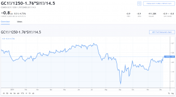

Commodities trading has historically provided investors with an avenue to diversify their portfolios beyond traditional equities and bonds. Among the various commodities, gold and silver futures have gained prominence due to their intrinsic value and historical significance as stores of wealth. These precious metals are often utilized as a hedge against inflation and currency devaluation, serving as safe-haven assets during periods of economic uncertainty.

The trading of gold and silver futures involves standardized contracts, typically executed on exchanges such as COMEX, where participants agree to buy or sell a specified amount of metal at a predetermined price on a future date. This setup allows investors to speculate on price movements without the necessity of owning the physical metals, offering a high degree of leverage that can magnify both gains and losses.



The financial markets have evolved significantly with the advent of technology, particularly through the incorporation of algorithmic trading. Algorithmic trading employs computer algorithms to automate trading processes, executing trades at speeds and efficiencies beyond human capability. In the context of gold and silver futures, algorithmic trading has transformed how these contracts are handled, leveraging complex market data analysis to make swift trading decisions. This technological advancement has not only increased market efficiency but has also opened new avenues for both institutional and individual traders.

The progression towards algorithmic trading in commodities markets presents a multitude of opportunities and challenges. As market dynamics continue to evolve, understanding the impact and deployment of such technology is crucial for participants looking to capitalize on gold and silver futures. Throughout this article, we explore the mechanisms of trading these futures, assessing the influence of algorithmic systems, alongside the inherent risks and rewards.

## Table of Contents

## What Are Gold and Silver Futures?

Gold and silver futures are financial contracts standardized for trading on exchanges such as the Commodity Exchange (COMEX). These futures contracts obligate the buyer to purchase, or the seller to sell, a specified quantity of the precious metal at an agreed-upon price on a predetermined future date. The standardized nature of these contracts ensures that quantity, quality, and delivery terms are consistent across transactions, thereby facilitating a liquid and efficient marketplace.

One of the primary features of gold and silver futures is that they do not usually necessitate the physical possession of the metals. This allows investors the opportunity to speculate on price movements without the logistics and costs associated with storing and insuring physical gold or silver. Instead, these contracts typically settle in cash, reflecting the difference between the contract price and the market price at expiration.

Market participants in gold and silver futures often fall into two main categories: hedgers and speculators. Hedgers, such as mining companies or manufacturers, engage in futures trading to mitigate the risk of price fluctuations which could adversely affect their business operations. For instance, a gold mining company might sell futures contracts to lock in the current price for future production, thus providing financial predictability.

On the other hand, speculators enter the futures market primarily to profit from anticipated price changes. These traders have no intention of taking physical delivery of the metal and instead focus on buying contracts they believe will increase in value or selling short those they expect will decline. The speculative activity is vital for providing [liquidity](/wiki/liquidity-risk-premium) in the futures markets, enabling the efficient execution of trades and price discovery. 

Overall, gold and silver futures play a crucial role in the commodities markets, offering a mechanism for investors to manage risk and capitalize on price movements without the challenges of physical metal transactions.

## Algorithmic Trading in Commodities Futures

Algorithmic trading in commodities futures employs computer algorithms to automate trading processes, enhancing the efficiency and speed of trading particularly in gold and silver markets. This method utilizes computer programs to execute a variety of trading strategies, ranging from simple to sophisticated methods based on mathematical models and historical data.

The core advantage of [algorithmic trading](/wiki/algorithmic-trading) is its capacity to process and analyze vast amounts of market data rapidly and execute trades at speeds beyond the capability of human traders. Algorithms can scan multiple markets simultaneously, detecting patterns and trading opportunities in milliseconds. This allows for the exploitation of market inefficiencies, such as [arbitrage](/wiki/arbitrage) opportunities where discrepancies in pricing are capitalized upon. 

Python, a widely used language in algorithmic trading due to its extensive libraries and ease of use, facilitates the creation and [backtesting](/wiki/backtesting) of trading algorithms. Libraries such as pandas and NumPy assist in data manipulation and numerical processing, while libraries like matplotlib and seaborn help in data visualization. A basic example in Python might include using a [momentum](/wiki/momentum)-based strategy, which could be coded as follows:

```python
import pandas as pd
import numpy as np

# Load market data
data = pd.read_csv("market_data.csv")  # assuming a CSV with appropriate columns

# Calculate momentum
data['Momentum'] = data['Close'].diff(periods=10)

# Generate trading signals
data['Signal'] = np.where(data['Momentum'] > 0, 1, 0)  # 1 for buy, 0 for sell

# Calculate returns
data['Returns'] = data['Close'].pct_change()
data['Strategy'] = data['Signal'].shift(1) * data['Returns']

# Plot strategy performance
import matplotlib.pyplot as plt
data['Strategy'].cumsum().plot()
plt.title('Strategy Performance')
plt.show()
```

The algorithm's ability to evolve alongside technology presents both opportunities and challenges. As computational capabilities continue to advance, so do the algorithms themselves, becoming more adept at complex decision-making and adaptable to rapidly changing markets. This evolution allows individual and institutional traders to better manage trading risks and improve their potential returns.

However, it is crucial to recognize the challenges inherent in algorithmic trading. The high speed of execution can lead to significant [volatility](/wiki/volatility-trading-strategies) and market manipulation concerns. Moreover, the complex nature of these algorithms may require traders to have advanced knowledge in both finance and programming to effectively design and implement them.

The impact of algorithmic trading on commodities futures is profound, offering a new horizon of possibilities for traders and investors. Its integration into the trading ecosystem underscores the importance of technological innovation in financial markets. As such, staying informed about the latest developments in algorithmic trading is vital for those looking to harness these technologies effectively.

## Benefits of Trading Gold and Silver Futures

Futures trading in gold and silver offers a range of benefits that attract both seasoned traders and novices alike. One of the primary advantages is leverage, which allows investors to control a significant amount of gold or silver with a much smaller initial capital outlay. This leverage can lead to substantial returns when market movements are favorable. For instance, if an investor controls a futures contract worth $100,000 with a margin requirement of just $10,000, even a modest increase in the asset's price can yield large percentage gains on the initial investment.

Another benefit of gold and silver futures is the high liquidity of the markets. The futures exchanges where these contracts are traded, such as the Commodity Exchange (COMEX), experience high trading volumes, ensuring that traders can enter and [exit](/wiki/exit-strategy) positions with relative ease. This liquidity minimizes the bid-ask spread, reducing transaction costs and allowing for efficient execution of trades. The ability to quickly adjust positions in response to market conditions is particularly advantageous in the fast-paced environment of futures trading.

Gold and silver futures also provide investors with an effective hedge against economic uncertainty and inflation. During periods of high inflation or economic instability, precious metals tend to retain value better than other assets. This characteristic makes gold and silver attractive as safe-haven investments. By trading futures contracts, investors can lock in prices for future delivery, thereby stabilizing costs and preserving purchasing power in volatile economic climates.

Moreover, futures trading offers the flexibility of short selling, thereby enabling investors to profit from declining markets as well as rising ones. This strategy is beneficial in markets where prices are expected to fall, as traders can sell futures contracts when prices are high and buy them back after a drop. The capacity to engage in both long and short trades enhances the potential for profit in varied market conditions.

In summary, gold and silver futures trading provides significant investment leverage, high market liquidity, and effective hedges against inflation and economic uncertainty. The flexibility of engaging in both buying and selling positions adds to the appeal, making futures an attractive option for traders willing to accept the associated risks and rewards.

## Risks Associated with Gold and Silver Futures Trading

Trading gold and silver futures presents a spectrum of risks that investors must carefully consider. One of the primary risks associated with futures trading is market volatility. Gold and silver prices are subject to fluctuations driven by global economic conditions, geopolitical events, and changes in supply and demand. These fluctuations can lead to substantial financial gains, but they also bear the potential for significant financial losses.

Leverage is another critical [factor](/wiki/factor-investing) in futures trading. Leverage allows traders to control a large position with a relatively small amount of capital. While this can amplify profits, it can equally magnify losses. For instance, if a futures contract provides a leverage ratio of 10:1, a 1% decrease in the price of the metal could result in a 10% loss on the invested capital. This potential for amplified losses necessitates stringent risk management strategies.

Algorithmic trading introduces additional layers of complexity and risk. The algorithms that power these trades are designed to execute orders based on pre-defined criteria, analyzing vast amounts of market data to identify opportunities. However, this approach can expose traders to risks associated with programming errors, system failures, and unintended market impacts. For inexperienced investors, navigating these complexities can be particularly challenging.

Market timing poses a significant risk, especially for those new to futures trading. The ability to predict short-term price movements in highly volatile markets like gold and silver requires both analytical skills and market intuition. Poor timing or misjudging market conditions can lead to premature entries or exits, resulting in financial losses.

Moreover, the futures market operates on a margin system, where the trader is required to maintain a certain level of funds on their trading account. Sudden adverse price movements can trigger margin calls, compelling traders to deposit additional funds or close positions at a loss. This can further exacerbate financial stress during volatile market conditions.

Ultimately, successfully trading gold and silver futures demands a comprehensive understanding of market dynamics, rigorous risk management protocols, and an appreciation for the leverage and complexities inherent in algorithmic trading systems. While these elements introduce significant challenges, careful strategy development and continuous learning can mitigate risks and enhance the potential for successful investments.

## Selecting the Right Trading Platform

When choosing a trading platform for gold and silver futures, there are several critical factors to examine that impact both the efficiency of trading and potential profitability. A well-chosen platform can enhance the trading experience by providing the necessary tools and resources for informed decision-making.

1. **User-Friendliness**: The platform's interface should be intuitive and easy to navigate. Complexities in navigation can lead to misexecution of trades, which can be costly, especially in volatile markets like gold and silver. Features such as customizable dashboards, straightforward order placement, and effective data visualization tools can enhance the user experience.

2. **Commission Rates**: Trading platforms often charge commission fees on transactions. Lower commission rates can save costs in the long term, particularly for high-frequency traders. It's important to evaluate the fee structure to understand any hidden costs and ensure they align with your trading volume and strategies.

3. **Available Trading Tools**: Comprehensive trading tools, including real-time data feeds, analytical tools, and charting capabilities, are essential for executing strategies effectively. Some platforms provide historical data analysis and backtesting features, which are particularly valuable for algorithmic traders. For instance, using Python-based tools like pandas and matplotlib can assist in analyzing trends and testing strategies before executing them on the market.

4. **Algorithmic Trading Capabilities**: Platforms that support algorithmic trading provide an edge by allowing traders to automate processes. This capability can further be enhanced by access to APIs like those available in Python, which enable the development and integration of bespoke trading algorithms tailored to specific objectives.

5. **Mobile Trading Apps**: The ability to trade on-the-go is increasingly important. Mobile applications should provide full functionality akin to their desktop counterparts, ensuring traders can monitor markets, execute trades, and manage their portfolios without restrictions, whenever and wherever needed.

6. **Regulatory Standards**: Security is paramount in trading platforms due to the financial nature of the transactions. Ensuring the platform complies with established regulatory standards is critical. Regulation protects against fraud and ensures the integrity and transparency of the trading process. It is advisable to verify that the platform is regulated by authorities such as the Commodity Futures Trading Commission (CFTC) or other internationally recognized regulators.

Selecting the right platform involves a balance of low costs, extensive resources, and robust security measures. Each trader's choice might differ based on individual preferences and trading strategies, but a platform that aligns with one's trading objectives can significantly influence the success of trading gold and silver futures.

## Conclusion

Trading in gold and silver futures, particularly when algorithmic trading is involved, presents a landscape filled with both potential profits and significant risks. Recognizing and understanding the intricacies of futures contracts is imperative for any trader or investor aiming to navigate this market successfully. A solid grasp of market dynamics, including price fluctuations and economic indicators influencing these commodities, is equally vital.

Algorithmic trading has transformed the commodities market by enhancing trade efficiency and speed, enabling traders to capitalize on minute market inefficiencies. However, the complexity introduced by algorithmic trading requires a sophisticated understanding of both the technology and the underlying market forces. Traders must be adept at developing and deploying strategies that can adapt to rapidly changing conditions.

Furthermore, the inherently volatile nature of futures markets means that risk management is paramount. The leverage used in futures trading can lead to both amplified gains and amplified losses. Therefore, a comprehensive risk management strategy should be in place, encompassing position sizing, diversification, and the use of stop-loss orders to mitigate potential downside.

As with any form of investment, diligent research and strategic planning form the bedrock of successful trading. Engaging with a reliable trading platform that provides necessary tools and adheres to regulatory standards can also provide a robust framework for execution. Investors and traders are urged to remain vigilant and informed, continuously refining their strategies and leveraging technological advancements to maintain a competitive edge.

In summary, trading gold and silver futures with the aid of algorithmic systems requires a deep understanding of both the market and technological complexities. Success hinges on thorough research, well-formulated strategies, and disciplined risk management. This disciplined approach is crucial to navigating the unpredictable waters of this volatile market.

## References & Further Reading

[1]: Hull, J. C. (2014). ["Options, Futures, and Other Derivatives"](https://www.amazon.com/Options-Futures-Other-Derivatives-9th/dp/0133456315). Pearson Education.

[2]: Lopez de Prado, M. (2018). ["Advances in Financial Machine Learning"](https://www.amazon.com/Advances-Financial-Machine-Learning-Marcos/dp/1119482089). Wiley.

[3]: Chan, E. P. (2009). ["Quantitative Trading: How to Build Your Own Algorithmic Trading Business"](https://github.com/ftvision/quant_trading_echan_book). Wiley Trading.

[4]: Narang, R. K. (2013). ["Inside the Black Box: A Simple Guide to Quantitative and High-Frequency Trading"](https://onlinelibrary.wiley.com/doi/book/10.1002/9781118662717). Wiley.

[5]: Fabozzi, F. J., Focardi, S. M., & Fabozzi, T. (2010). ["The Handbook of Commodity Investing"](https://onlinelibrary.wiley.com/doi/book/10.1002/9781119202172). Wiley.

[6]: Aronson, D. R. (2007). ["Evidence-Based Technical Analysis: Applying the Scientific Method and Statistical Inference to Trading Signals"](https://onlinelibrary.wiley.com/doi/book/10.1002/9781118268315). Wiley.