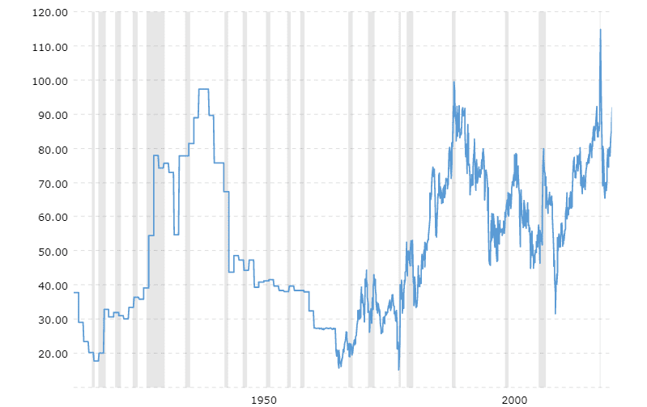

## Table of Contents

## What is the gold-silver ratio?

The gold-silver ratio is the number of ounces of silver it takes to buy one ounce of gold. This ratio changes over time because the prices of gold and silver go up and down. People watch this ratio to help them decide when to buy or sell these metals. For example, if the ratio is high, it means silver is cheaper compared to gold, and some people might choose to buy silver.

Historically, the gold-silver ratio has varied a lot. In the past, it was often around 15 or 16. But in recent years, it has been much higher, sometimes reaching over 80. This means that it takes a lot more silver to buy one ounce of gold now than it did in the past. Investors and traders use this information to make decisions about their investments in gold and silver.

## Why is the gold-silver ratio important?

The gold-silver ratio is important because it helps people understand how the prices of gold and silver are changing compared to each other. This ratio tells you how many ounces of silver you need to buy one ounce of gold. When the ratio is high, it means silver is cheaper compared to gold. When the ratio is low, it means gold is cheaper compared to silver. People who invest in these metals watch this ratio to decide when to buy or sell.

Investors use the gold-silver ratio to make decisions about their money. If the ratio is very high, some investors might think it's a good time to buy silver because it's cheaper compared to gold. If the ratio is low, they might think it's a better time to buy gold. By looking at how the ratio changes over time, investors can try to make smart choices about when to trade their gold and silver. This can help them make more money or protect their investments.

## How has the gold-silver ratio been calculated historically?

The gold-silver ratio has been calculated by dividing the price of gold per ounce by the price of silver per ounce. This gives you the number of ounces of silver needed to buy one ounce of gold. For example, if gold costs $2,000 per ounce and silver costs $25 per ounce, the ratio would be 80. This means you need 80 ounces of silver to buy one ounce of gold.

Historically, the ratio has changed a lot. In ancient times, many places used a ratio around 12 or 13. In the United States, the ratio was set at 15:1 by the Coinage Act of 1792. Over time, as the prices of gold and silver changed, the ratio also changed. In recent years, the ratio has often been much higher, sometimes reaching over 80. This shows that it takes a lot more silver to buy one ounce of gold now than it did in the past.

## What was the average gold-silver ratio in ancient times?

In ancient times, the gold-silver ratio was often around 12 or 13. This means that people needed about 12 or 13 ounces of silver to buy one ounce of gold. Different places had their own ratios, but this was a common range. For example, in ancient Rome, the ratio was around 12. This ratio helped people decide how much silver they needed to trade for gold.

The ratio could change because of how much gold and silver were found or used in a place. If a lot of silver was found, the ratio might go down because silver became more common. If more gold was found, the ratio might go up. Even though the ratio changed, it stayed around 12 or 13 for a long time in many ancient cultures. This made it easier for people to trade and use these metals as money.

## How did the gold-silver ratio fluctuate during the Roman Empire?

During the Roman Empire, the gold-silver ratio was usually around 12. This means that people needed about 12 ounces of silver to buy one ounce of gold. The Romans used this ratio to help them trade and use these metals as money. It was a common way to figure out how much silver to give for gold.

The ratio could change a bit because of how much gold and silver were found or used in the empire. If they found a lot of silver, the ratio might go down a little because silver became more common. If they found more gold, the ratio might go up a bit. But overall, the ratio stayed pretty close to 12 for a long time during the Roman Empire. This helped people know what to expect when trading gold and silver.

## What impact did the discovery of new silver mines in the Americas have on the gold-silver ratio?

The discovery of new silver mines in the Americas, especially in places like Potosí in modern-day Bolivia and Zacatecas in Mexico, had a big effect on the gold-silver ratio. Before these mines were found, the ratio was around 12 or 13. But when a lot of silver started coming from the Americas, it made silver more common. This caused the gold-silver ratio to go up because you needed more silver to buy the same amount of gold.

As more and more silver was brought to Europe from the Americas, the ratio kept changing. By the late 16th and early 17th centuries, the ratio had gone up to around 15 or 16. This meant that people needed more silver to trade for gold than they did before. The increase in silver supply from the Americas changed how people thought about the value of silver compared to gold.

## How did the gold-silver ratio change during the Industrial Revolution?

During the Industrial Revolution, the gold-silver ratio changed a lot. This was because new ways of finding and using metals were invented. More gold and silver were found, but silver was found more often than gold. This made silver more common, so the gold-silver ratio went up. By the late 1800s, the ratio was around 15 or 16, which was higher than before.

The Industrial Revolution also changed how people used money. More countries started using gold and silver as money, which affected their prices. When more silver was used for money, it became more common, and the ratio went up even more. By the end of the 19th century, the ratio was sometimes as high as 30 or 40. This meant people needed a lot more silver to buy gold than they did before the Industrial Revolution.

## What were the key factors influencing the gold-silver ratio in the 20th century?

In the 20th century, the gold-silver ratio was influenced by many things. One big factor was how much gold and silver were found around the world. When more silver was found, the ratio went up because silver became more common. Another factor was how countries used gold and silver for money. In the early 1900s, many countries used the gold standard, which meant they used gold to back their money. This made gold more important and affected the ratio. Later, when countries stopped using the gold standard, it changed how people thought about gold and silver, which also affected the ratio.

Another important factor was what people used gold and silver for. During the 20th century, silver started being used more in industry, like in electronics and photography. This increased the demand for silver and made the ratio go up. Also, big events like wars and economic crises changed how people invested in gold and silver. During hard times, people often bought more gold because it was seen as a safe investment. This made the ratio go up even more. By the end of the 20th century, the gold-silver ratio was often much higher than it had been at the start.

## How has the gold-silver ratio been affected by modern financial markets?

Modern financial markets have changed the gold-silver ratio a lot. People can now buy and sell gold and silver easily through things like futures and exchange-traded funds (ETFs). This means more people are trading these metals, which can make their prices go up and down quickly. When lots of people want to buy gold, its price goes up and the ratio goes up too because you need more silver to buy gold. If lots of people want to buy silver, its price goes up and the ratio goes down.

Also, big news and events can change how people feel about gold and silver. If there's a big problem in the world, like a war or a financial crisis, people often buy more gold because they think it's safe. This makes the price of gold go up and the ratio go up too. On the other hand, if people think the economy is doing well, they might buy more silver because it's used in things like electronics. This can make the price of silver go up and the ratio go down. So, the gold-silver ratio can change a lot because of what's happening in the world and how people feel about it.

## What are the highest and lowest points of the gold-silver ratio in the last 100 years?

In the last 100 years, the gold-silver ratio reached its highest point in March 2020, when it went up to about 123. This happened because of the big problems caused by the COVID-19 pandemic. People were worried about the economy, so they bought a lot of gold because they thought it was safe. This made the price of gold go way up compared to silver, so you needed a lot more silver to buy gold.

The lowest point of the gold-silver ratio in the last 100 years was in 1979, when it went down to about 14. This happened because of a lot of changes in the economy and how people used silver. At that time, silver was used more in industry, like making things, so its price went up a lot compared to gold. This meant you needed less silver to buy gold than at other times.

## How do investors use the gold-silver ratio for making investment decisions?

Investors use the gold-silver ratio to help them decide when to buy or sell gold and silver. They look at the ratio to see if gold or silver is cheaper compared to each other. If the ratio is high, it means silver is cheaper than gold. Some investors might decide to buy more silver because they think it's a good deal. If the ratio is low, it means gold is cheaper than silver, so they might buy more gold. By watching the ratio, investors try to find the best times to trade these metals and make money.

The gold-silver ratio also helps investors see how the prices of gold and silver are changing over time. If the ratio goes up a lot, it might mean that silver will become more valuable soon. Some investors might sell their gold and buy silver, hoping to make money when the ratio goes back down. If the ratio goes down a lot, it might mean that gold will become more valuable. In this case, investors might sell their silver and buy gold. By using the gold-silver ratio, investors can make smarter choices about their investments and try to protect their money.

## What are some advanced statistical methods used to analyze trends in the gold-silver ratio?

Advanced statistical methods help people see patterns in the gold-silver ratio. One way is to use time series analysis, which looks at how the ratio changes over time. This can show if the ratio goes up and down in a regular way or if it changes because of big events like wars or economic problems. Another method is regression analysis, which helps figure out what things affect the ratio. For example, it can show how changes in the economy or how much gold and silver are found around the world can change the ratio.

Another useful method is moving averages, which smooth out the ups and downs in the ratio to show the big picture. By looking at moving averages, investors can see if the ratio is going up or down over time. They can also use something called the Relative Strength Index (RSI) to see if the ratio is too high or too low compared to what it usually is. This can help them decide if it's a good time to buy or sell gold and silver. All these methods help investors understand the gold-silver ratio better and make smarter choices about their money.

## What is the Gold-Silver Ratio and how can it be understood?

The gold-silver ratio is a key metric in the precious metals market, representing how many ounces of silver are required to purchase a single ounce of gold. This ratio serves as a fundamental measure of relative value between the two metals, historically influencing investment decisions and trade dynamics. 

Calculation of the gold-silver ratio is straightforward. It is determined by the formula:

$$
\text{Gold-Silver Ratio} = \frac{\text{Current Price of Gold}}{\text{Current Price of Silver}}
$$

For instance, if the price of gold is $1,800 per ounce and silver is $25 per ounce, the gold-silver ratio would be 72, meaning 72 ounces of silver are needed to purchase one ounce of gold.

While the concept is simple, the value of this ratio is influenced by a variety of economic factors. These include supply-demand dynamics, where fluctuations in mining outputs or industrial consumption may alter availability and pricing of either metal. Market sentiment and investor behavior also play crucial roles; during times of economic uncertainty, investors often seek gold as a "safe haven" asset, potentially increasing the ratio if silver doesn't witness similar demand.

Additionally, broader economic indicators like inflation rates, interest rates, and geopolitical tensions can impact the prices of both gold and silver differently, thereby affecting the ratio. Changes in monetary policy or actions by central banks, which may involve gold reserves, can further contribute to fluctuations.

Understanding the components that influence the gold-silver ratio provides foundational knowledge crucial for its application in financial trading strategies, including [algorithmic trading](/wiki/algorithmic-trading). These insights enable traders to make informed decisions by capitalizing on changes in the ratio resulting from economic activities and market shifts.

## What are the best practices for implementing in algo trading?

Successful integration of the gold-silver ratio into algorithmic trading requires a nuanced approach, emphasizing strategic optimization and real-time adjustments to enhance trading outcomes. The complexities of the market demand that algorithmic traders adopt several best practices to ensure robust trading strategies.

**Employing Multi-Indicator Systems**

To confirm trading signals and minimize false positives, traders are advised to use a multi-indicator approach. This involves combining the gold-silver ratio analysis with other technical indicators such as moving averages, Relative Strength Index (RSI), and Bollinger Bands. By employing a combination of these indicators, traders can validate the signals generated from the gold-silver ratio, thereby reducing the likelihood of erroneous trades. For instance, if a buy signal is generated from a deviation in the gold-silver ratio, corroboration with an RSI value indicating an oversold condition adds confidence to the decision.

**Dynamic Risk Management**

Effective risk management is crucial to navigate the inherent [volatility](/wiki/volatility-trading-strategies) in trading markets, particularly when dealing with commodities like gold and silver. Two key components of dynamic risk management in this context are stop-loss orders and position sizing.

- **Stop-Loss Orders**: Implementing stop-loss orders helps in limiting potential losses by automatically closing a position when the market moves unfavorably. This pre-set order is essential in preserving capital and mitigating large drawdowns during unexpected market conditions. 

- **Position Sizing**: Determining the appropriate position size is vital to manage the risk level associated with each trade. Position sizing can be calculated based on the trader's risk tolerance and the volatility of the market. For instance, a common approach is using the formula:
$$
  \text{Position Size} = \frac{\text{Risk Per Trade}}{\text{Entry Price} - \text{Stop-Loss Price}}

$$

  This strategy ensures that each trade carries a consistent risk percentage relative to the trader's overall portfolio, thus stabilizing potential impacts on the trading account.

**Real-Time Adjustments**

Market conditions can fluctuate rapidly; therefore, real-time data processing and adjustments are crucial. Traders should leverage advanced trading platforms and real-time data feeds to make swift and informed adjustments to their trading algorithms. Machine learning algorithms and [artificial intelligence](/wiki/ai-artificial-intelligence) tools can be integrated to enhance decision-making through pattern recognition and predictive analysis.

By employing these best practices, algorithmic traders can more effectively harness the gold-silver ratio, balancing potential rewards against associated risks, and achieving more consistent trading performance.

## What are Frequently Asked Questions (FAQs)?

What is the gold-silver ratio and how is it calculated?

The gold-silver ratio is a metric used in financial markets to express how many ounces of silver are equivalent in value to one ounce of gold. This ratio is calculated by dividing the current price of gold by the current price of silver:

$$
\text{Gold-Silver Ratio} = \frac{\text{Price of Gold per Ounce}}{\text{Price of Silver per Ounce}}
$$

This calculation is influenced by various economic factors such as supply and demand dynamics and market sentiment, making it a vital tool for investors and traders.

Why is the gold-silver ratio important in trading?

The gold-silver ratio plays a significant role in trading by serving as a barometer of economic conditions. Historically, it has been used to assess market stability and monetary policies. Traders and investors utilize this ratio to identify the relative value of gold and silver, helping to make informed decisions about buying, selling, or holding these precious metals. A higher ratio may indicate that silver is undervalued relative to gold, suggesting potential buying opportunities for silver, and vice versa.

How can the gold-silver ratio be used in algorithmic trading?

In algorithmic trading, the gold-silver ratio is used to develop trading strategies, particularly mean-reversion strategies. These strategies exploit deviations from historical averages of the ratio to anticipate future market movements. By integrating the ratio into algorithmic systems, traders can generate automated buy or sell signals when the ratio deviates from a predefined threshold. Python can be used to implement such strategies, as illustrated below:

```python
def calculate_ratio(gold_price, silver_price):
    return gold_price / silver_price

def generate_trading_signal(current_ratio, historical_average):
    threshold = 0.05  # 5% deviation threshold
    if current_ratio > historical_average * (1 + threshold):
        return "Sell Gold, Buy Silver"
    elif current_ratio < historical_average * (1 - threshold):
        return "Buy Gold, Sell Silver"
    else:
        return "Hold"
```

What are some risks associated with trading based on the gold-silver ratio?

Trading based on the gold-silver ratio carries inherent risks due to market volatility, geopolitical events, and policy changes. These factors can cause abrupt and unpredictable changes in the prices of gold and silver, potentially leading to significant losses. Moreover, over-reliance on the ratio without considering other indicators may result in inaccurate predictions. To mitigate these risks, traders should incorporate comprehensive risk management strategies, such as setting stop-loss orders and using multi-indicator systems to confirm signals before executing trades.

## References & Further Reading

#