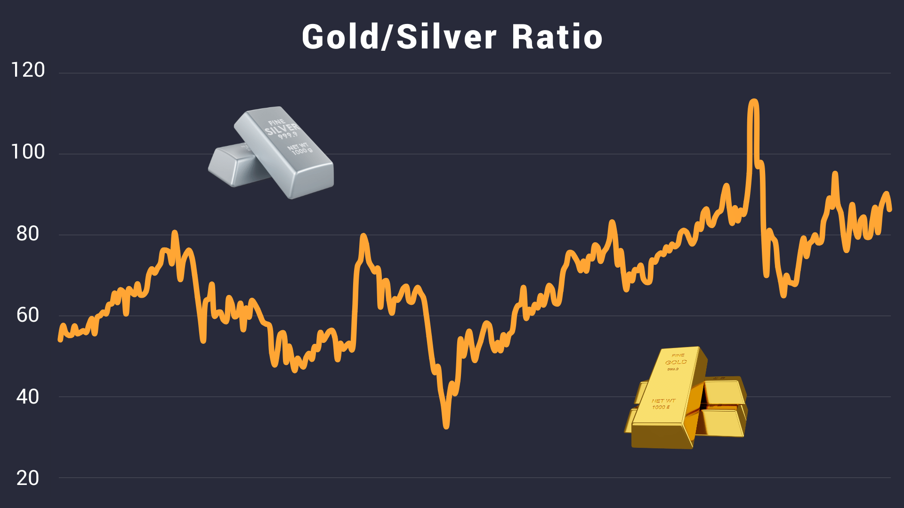

## Table of Contents

## What is the gold-silver ratio?

The gold-silver ratio is a measure that compares the price of gold to the price of silver. It tells us how many ounces of silver you need to buy one ounce of gold. This ratio changes over time because the prices of gold and silver go up and down differently.

People use the gold-silver ratio to make decisions about buying and selling gold and silver. If the ratio is high, it means gold is more expensive compared to silver, and some people might think it's a good time to buy silver. If the ratio is low, it means silver is more expensive compared to gold, and some might think it's a good time to buy gold. The ratio can help investors figure out which metal might be a better buy at any given time.

## How is the gold-silver ratio calculated?

The gold-silver ratio is calculated by dividing the current price of gold per ounce by the current price of silver per ounce. For example, if gold is trading at $1,800 per ounce and silver is trading at $20 per ounce, you divide $1,800 by $20. The result is a ratio of 90, meaning it takes 90 ounces of silver to buy one ounce of gold at those prices.

This ratio changes every day because the prices of gold and silver are always moving. If the price of gold goes up faster than the price of silver, the ratio will get bigger. If the price of silver goes up faster than the price of gold, the ratio will get smaller. Watching the gold-silver ratio can help people decide when to buy or sell gold and silver.

## Why is the gold-silver ratio important for investors?

The gold-silver ratio is important for investors because it helps them understand if gold or silver is a better buy at any given time. When the ratio is high, it means gold is more expensive compared to silver. Some investors might see this as a good time to buy silver, thinking that the price of silver will go up to make the ratio smaller. On the other hand, when the ratio is low, silver is more expensive compared to gold. Investors might then think it's a good time to buy gold, expecting the price of gold to rise and make the ratio bigger.

Watching the gold-silver ratio can also help investors make decisions about trading one metal for the other. For example, if an investor owns gold and the ratio is very high, they might sell some of their gold to buy silver. They hope that when the ratio goes down, they can sell the silver for more gold than they started with. This kind of trading can be a way for investors to try to make more money from the changing prices of gold and silver.

## What historical trends can be observed in the gold-silver ratio?

The gold-silver ratio has changed a lot over time. In ancient times, like during the Roman Empire, the ratio was about 12:1, which means it took 12 ounces of silver to buy one ounce of gold. By the late 19th century, the ratio was around 15:1. But in the 20th century, the ratio started to get bigger. During the 20th century, the ratio went up and down a lot, but it was often around 40:1 to 60:1. In the last few decades, the ratio has been even higher, sometimes going over 80:1.

One big thing that happened was in 1980 when the ratio hit a low of about 17:1. This was because the price of silver went way up because of the Hunt brothers trying to control the silver market. After that, the ratio went up a lot, reaching over 100:1 in the early 1990s. Since then, the ratio has been mostly between 50:1 and 80:1, but it can change quickly. For example, in 2020, the ratio went over 120:1 because of the economic problems caused by the COVID-19 pandemic, but then it came down again.

These changes in the gold-silver ratio show how the prices of gold and silver can be affected by many things, like wars, economic problems, and people trying to control the markets. Investors watch these trends to try to guess what might happen next and make good choices about when to buy or sell gold and silver.

## How does the gold-silver ratio affect investment decisions?

The gold-silver ratio helps investors decide when to buy or sell gold and silver. When the ratio is high, it means gold is more expensive than silver. Some investors might think this is a good time to buy silver because they believe the price of silver will go up and make the ratio smaller. On the other hand, if the ratio is low, it means silver is more expensive than gold. Investors might then think it's a good time to buy gold, hoping that the price of gold will rise and make the ratio bigger. By watching the ratio, investors can try to buy low and sell high.

Investors also use the gold-silver ratio to trade one metal for the other. For example, if an investor owns gold and the ratio is very high, they might sell some of their gold to buy silver. They hope that when the ratio goes down, they can sell the silver for more gold than they started with. This kind of trading can help investors make more money from the changing prices of gold and silver. By understanding how the ratio works, investors can make smarter choices about when to switch between gold and silver in their portfolios.

## What are some common misconceptions about the gold-silver ratio?

A common misconception about the gold-silver ratio is that it stays the same over time. Many people think that if the ratio was 15:1 a long time ago, it should be close to that now. But the truth is, the ratio changes a lot because of many things like wars, economic problems, and how much people want to buy gold and silver. So, it's not a fixed number and can go up and down a lot.

Another misconception is that the gold-silver ratio can predict the future prices of gold and silver perfectly. Some people believe that if the ratio is high, silver will always go up in price, or if it's low, gold will always go up. But the ratio is just one piece of information. It doesn't tell the whole story, and other things can affect the prices of gold and silver. So, while the ratio can help with making guesses about what might happen, it's not a sure thing.

## How has the gold-silver ratio changed in the last decade?

Over the last decade, the gold-silver ratio has been pretty high most of the time. At the start of 2013, the ratio was around 55:1. It went up and down a lot after that. In 2016, it got really high and hit over 80:1. This happened because people were worried about the economy and they wanted to buy gold more than silver. By early 2020, the ratio was around 90:1, but then something big happened.

In March 2020, when the COVID-19 pandemic started, the ratio went way up to over 120:1. This was because everyone was really scared and they wanted to buy gold to feel safe. But after that, the ratio started to come down. By the end of 2020, it was around 70:1. Over the next few years, the ratio stayed between 60:1 and 80:1. So, in the last decade, the gold-silver ratio went up a lot during big economic problems but then came back down a bit.

## Can the gold-silver ratio predict future market trends?

The gold-silver ratio can give us some ideas about what might happen in the future with gold and silver prices, but it can't predict the future perfectly. It's like a tool that helps us see if gold or silver might be a good buy right now. If the ratio is really high, it might mean that silver is cheaper than usual compared to gold. Some people might think this is a good time to buy silver, hoping its price will go up. But the ratio is just one piece of the puzzle. Other things like wars, economic problems, and how much people want to buy gold and silver can change prices too.

So, while the gold-silver ratio can be helpful, it doesn't tell the whole story. It's a bit like trying to guess the weather by looking at the clouds. The clouds can give you a hint, but they don't tell you everything. Investors need to look at a lot of different things to make good choices about buying and selling gold and silver. The ratio can be a good starting point, but it's not the only thing they should think about.

## What are the factors that influence the gold-silver ratio?

The gold-silver ratio is affected by many things. One big factor is how much people want to buy gold and silver. If more people want to buy gold than silver, the price of gold goes up and the ratio gets bigger. This can happen because of things like economic problems or wars. People often think gold is safer in tough times, so they buy more of it. On the other hand, if more people want to buy silver, the price of silver goes up and the ratio gets smaller. This can happen if people think silver will be used more in things like electronics or solar panels.

Another thing that influences the ratio is how much gold and silver are being made. If new gold mines open up and more gold is found, the price of gold might go down because there's more of it. This would make the ratio smaller. But if new silver mines are hard to find, the price of silver might go up because there's less of it. This would make the ratio bigger. Also, changes in money, like inflation or the strength of the dollar, can affect the prices of gold and silver. If the dollar gets weaker, both gold and silver might go up in price, but they might not go up at the same speed, which changes the ratio.

## How do global economic conditions impact the gold-silver ratio?

Global economic conditions can have a big effect on the gold-silver ratio. When the world's economy is doing well, people might want to buy more silver because it's used in things like electronics and solar panels. This can make the price of silver go up and the ratio smaller. But if the economy is not doing well, people might get scared and want to buy more gold because they think it's safer. This can make the price of gold go up faster than silver, making the ratio bigger.

Also, things like inflation and the strength of money can change the gold-silver ratio. If inflation goes up, it means money is worth less, so people might buy more gold and silver to keep their money safe. But gold and silver might not go up at the same speed. If the dollar gets weaker, both gold and silver might go up in price, but if gold goes up more than silver, the ratio gets bigger. So, the gold-silver ratio can move a lot because of what's happening in the world's economy.

## What are the strategies for trading based on the gold-silver ratio?

One strategy for trading based on the gold-silver ratio is to buy silver when the ratio is high. If the ratio is really high, it means gold is a lot more expensive than silver. Some people think this is a good time to buy silver because they hope the price of silver will go up and make the ratio smaller. They might sell their gold to buy silver, and then later sell the silver for more gold than they started with. This is called "reversion to the mean," where people think the ratio will go back to a more normal number.

Another strategy is to buy gold when the ratio is low. If the ratio is really low, it means silver is a lot more expensive than gold. Some people might think this is a good time to buy gold because they hope the price of gold will go up and make the ratio bigger. They might sell their silver to buy gold, and then later sell the gold for more silver than they started with. Both of these strategies are about trying to guess what will happen to the ratio and then making trades to make money from those changes.

A third strategy is to use the gold-silver ratio as just one part of a bigger plan. People might look at other things like how the economy is doing, how much gold and silver are being made, and what other people are doing in the market. They might not make big trades based only on the ratio, but they might use it to help them decide when to buy or sell a little bit of gold or silver. This way, they are not putting all their trust in the ratio alone but using it to help make smarter choices.

## How can advanced statistical models be used to analyze the gold-silver ratio?

Advanced statistical models can be used to analyze the gold-silver ratio by looking at past data to find patterns and make guesses about what might happen next. These models can use things like time series analysis to see how the ratio has changed over time. They can also use machine learning to learn from the data and find things that might not be easy to see just by looking at numbers. By using these models, people can try to understand if the ratio is likely to go up or down in the future and make better choices about buying and selling gold and silver.

Another way advanced statistical models help is by figuring out how different things affect the gold-silver ratio. These models can look at many things at once, like how the economy is doing, how much gold and silver are being made, and even what people are saying on the news. By putting all these things together, the models can tell us which things are most important for changing the ratio. This can help investors make smarter decisions because they can see not just the ratio, but also why it might be changing.

## What is the Gold-Silver Ratio and How Can We Understand It?

The gold-silver ratio is an important financial metric that expresses the number of ounces of silver required to purchase an ounce of gold. This ratio serves as a crucial measure in determining the relative value between the two precious metals. Historically, the gold-silver ratio was used as a benchmark for economic stability and monetary systems in ancient civilizations. For instance, the Roman Empire and Ancient Greece often applied fixed ratios for trading and currency purposes to bring consistency to their economies [^1].

In contemporary financial markets, the gold-silver ratio holds significance for investors as it reflects shifts in market sentiment and supply-demand dynamics. The ratio is influenced by various economic factors, including inflation rates, interest rates, and global financial stability. During periods of economic uncertainty, the ratio often trends higher as investors seek the security of gold, which is traditionally seen as a safe-haven investment. Conversely, a declining ratio may indicate investor confidence in economic growth, as silver, being more volatile and industrially useful, tends to perform better in growth phases.

Investors employ the gold-silver ratio as a tool for making informed investment decisions. By analyzing the ratio's fluctuations, investors can determine the relative value of silver to gold and identify potential entry and [exit](/wiki/exit-strategy) points in the market. For instance, a high gold-silver ratio could signal an overvaluation of gold relative to silver, informing investors to buy silver and sell gold. Conversely, a low ratio might indicate an overvaluation of silver, suggesting a strategy to sell silver and buy gold.

The formula for the gold-silver ratio is straightforward:

$$
\text{Gold-Silver Ratio} = \frac{\text{Price of Gold (per ounce)}}{\text{Price of Silver (per ounce)}}
$$

This simplified representation allows investors to make quick assessments of the relative market values of these metals. Despite its simplicity, the gold-silver ratio's utility extends to more complex applications, like [quantitative trading](/wiki/quantitative-trading) strategies and risk management.

In summary, the gold-silver ratio remains a vital indicator for those involved in trading and investment, offering insights into market psychology and the economic environment. It helps investors assess relative valuations and develop strategies for optimizing their portfolios in response to changing market conditions.

[^1]: "Gold-Silver Ratio," Investopedia, [https://www.investopedia.com/terms/g/gold-silver-ratio.asp](https://www.investopedia.com/terms/g/gold-silver-ratio.asp)

## What are the best practices for implementing in algo trading?

When implementing [algorithmic trading](/wiki/algorithmic-trading) strategies based on the gold-silver ratio, best practices focus on leveraging a multi-indicator approach, dynamic risk management, and real-time data processing. These elements are critical for maximizing the effectiveness and resilience of trading algorithms.

### Multi-Indicator System

Incorporating multiple indicators alongside the gold-silver ratio helps reduce false signals and enhances the confirmation of trading opportunities. A multi-indicator system can integrate technical indicators such as moving averages, Relative Strength Index (RSI), and Bollinger Bands. For instance, when the gold-silver ratio reaches a historically anomalous level, traders might seek confirmation from bullish or bearish signals in the RSI or crossovers in moving averages before executing trades.

Here is a basic Python code snippet demonstrating how to calculate and incorporate moving averages with the gold-silver ratio:

```python
import pandas as pd

# Assuming df is a DataFrame containing 'Gold' and 'Silver' prices
df['Ratio'] = df['Gold'] / df['Silver']

# Calculate the moving averages
df['MA20'] = df['Ratio'].rolling(window=20).mean()
df['MA50'] = df['Ratio'].rolling(window=50).mean()

# Signal when the shorter-term moving average crosses above or below the longer-term one
df['Signal'] = 0
df.loc[df['MA20'] > df['MA50'], 'Signal'] = 1  # Buy signal
df.loc[df['MA20'] < df['MA50'], 'Signal'] = -1 # Sell signal
```

### Dynamic Risk Management

Dynamic risk management involves using tools like stop-loss orders and position sizing to mitigate the risks associated with market [volatility](/wiki/volatility-trading-strategies). Stop-loss orders automatically sell a security when its price reaches a specified threshold, minimizing potential losses. Position sizing involves adjusting the number of shares, contracts, or lots according to the assessed risk and account size, ensuring no single trade disproportionately impacts the portfolio.

Traders often use the following formula for position sizing:

$$
\text{Position Size} = \frac{\text{Account Risk \%} \times \text{Account Balance}}{\text{Stop Loss \%(Risk per Trade)}}
$$

This approach allows traders to adjust their exposure based on risk tolerance and market conditions.

### Real-Time Data Processing

Real-time data processing is essential for ensuring that trading algorithms can adapt quickly to changing market conditions. Algorithms must process incoming data streams efficiently to update calculations of the gold-silver ratio and other indicators instantaneously. Utilizing platforms and tools that support rapid data ingestion and analysis, such as Apache Kafka for data streaming and Python's NumPy and Pandas libraries for processing, ensures the timely execution of trades.

```python
# Example to fetch real-time gold and silver prices (pseudo-code)
from some_data_provider import get_realtime_data

while True:
    gold_price, silver_price = get_realtime_data('gold'), get_realtime_data('silver')
    ratio = gold_price / silver_price
    update_indicators_and_execute_trades(ratio)
```

By integrating these best practices, traders can develop algorithmic strategies that are resilient, adaptive, and more likely to succeed in capturing profitable opportunities in the precious metals market.

## References & Further Reading

[1]: Pilbeam, K. (2018). ["Finance and Financial Markets."](https://link.springer.com/book/10.1007/978-1-349-26273-1) Macmillan International Higher Education.

[2]: Trading Strategy Guides. ["Gold-Silver Ratio Trading Strategy."](https://tradingstrategyguides.com/gold-silver-chart-ratio/)

[3]: Burghardt, G. (2011). ["Managed Futures for Institutional Investors: Analysis and Portfolio Construction."](https://onlinelibrary.wiley.com/doi/book/10.1002/9781118531600) John Wiley & Sons.

[4]: McGuire, S. (2019). ["Algorithmic Trading and the Gold-Silver Ratio."](https://www.quantifiedstrategies.com/gold-silver-chart-ratio-strategy/) Automated Trader. 

[5]: Investopedia. ["Gold-Silver Ratio."](https://www.investopedia.com/articles/trading/09/gold-silver-ration.asp)

[6]: Chan, E. P. (2013). ["Algorithmic Trading: Winning Strategies and Their Rationale."](https://github.com/ftvision/quant_trading_echan_book) Wiley Trading. 

[7]: Boroden, C. (2008). ["Fibonacci Trading: How to Master the Time and Price Advantage."](https://www.amazon.com/Fibonacci-Trading-Master-Price-Advantage/dp/007149815X) McGraw-Hill Education.