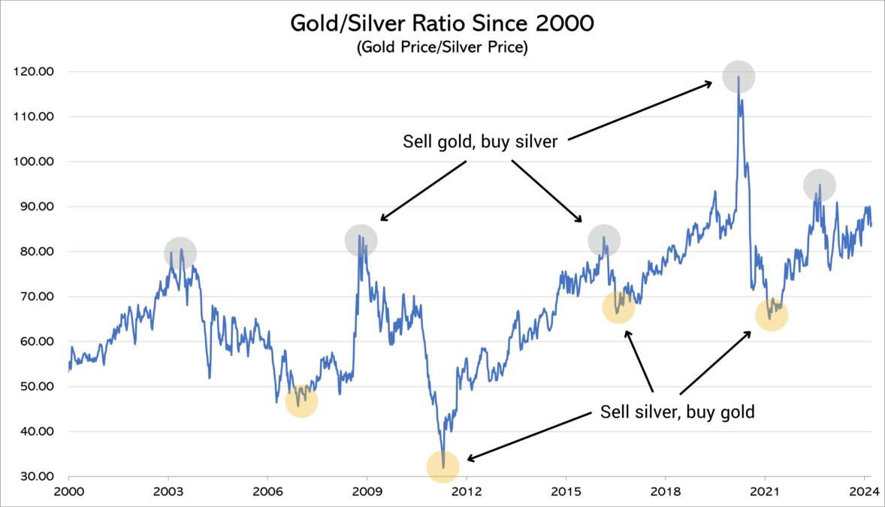

## Table of Contents

## What is the gold-silver ratio?

The gold-silver ratio is a measure that compares the value of gold to the value of silver. It tells you how many ounces of silver you need to buy one ounce of gold. This ratio changes over time because the prices of gold and silver go up and down based on things like how much people want them, how much is available, and what's happening in the world.

People use the gold-silver ratio to help them decide when to buy or sell gold and silver. For example, if the ratio is very high, it means gold is more expensive compared to silver. Some people might think this is a good time to sell gold and buy silver, hoping the ratio will go down later. If the ratio is low, it means silver is more expensive compared to gold, and some might decide to sell silver and buy gold. The ratio has been around for a long time and can be a useful tool for investors.

## How is the gold-silver ratio calculated?

The gold-silver ratio is calculated by dividing the current price of gold per ounce by the current price of silver per ounce. For example, if gold is priced at $1,800 per ounce and silver is priced at $20 per ounce, the gold-silver ratio would be 1,800 divided by 20, which equals 90. This means you would need 90 ounces of silver to buy one ounce of gold at those prices.

This calculation is done using the spot prices of gold and silver, which are the current market prices for immediate delivery of the metals. These prices change every day, and sometimes even every minute, because they are influenced by many factors like supply and demand, economic conditions, and geopolitical events. So, the gold-silver ratio is always changing too, and people watch it closely to help them make decisions about buying or selling gold and silver.

## Why is the gold-silver ratio important for trading?

The gold-silver ratio is important for trading because it helps traders decide when to buy or sell gold and silver. If the ratio is high, it means gold is a lot more expensive than silver. Some traders might see this as a good time to sell their gold and buy silver, thinking that the ratio will go back down. On the other hand, if the ratio is low, it means silver is more expensive compared to gold. Traders might then sell their silver and buy gold, hoping to make a profit when the ratio goes up again.

This ratio can also help traders see trends and make predictions. By looking at how the gold-silver ratio has changed over time, traders can spot patterns and use them to guess what might happen next. This can be really helpful for making smart trading decisions. The gold-silver ratio is like a tool that gives traders a way to compare the two metals and plan their moves in the market.

## What historical trends can we observe in the gold-silver ratio?

Over the years, the gold-silver ratio has gone up and down a lot. In old times, like when the Roman Empire was around, the ratio was usually between 12 and 1. This means you needed about 12 ounces of silver to buy one ounce of gold. But as time went on, the ratio started to change. In the 20th century, the ratio got bigger. For example, in the early 1900s, it was around 17, but by the end of the century, it was often above 50. The biggest change came in the 1990s and early 2000s when the ratio hit over 80, and sometimes even over 100.

In more recent times, the gold-silver ratio has kept changing. During the 2008 financial crisis, the ratio shot up to over 80 because people were really scared and wanted to buy gold. But then, in 2011, it dropped down to about 30 because silver prices went up a lot. Since then, the ratio has been moving around but usually stays between 60 and 80. Traders watch these changes closely because they can help them decide when to buy or sell gold and silver. The ratio shows how the prices of gold and silver move compared to each other, and it's a big part of understanding the market.

## How can beginners start trading based on the gold-silver ratio?

For beginners who want to start trading based on the gold-silver ratio, the first step is to learn about the ratio and how it works. The gold-silver ratio is just a number that shows how many ounces of silver you need to buy one ounce of gold. You can find this number by dividing the price of gold by the price of silver. Beginners should watch this number over time to see how it changes. They can use websites or apps that show the current prices of gold and silver and calculate the ratio for them. This way, they can start to understand when the ratio is high or low and what that might mean for trading.

Once beginners feel comfortable with the gold-silver ratio, they can start making trading decisions. If the ratio is really high, it means gold is a lot more expensive than silver. A beginner might decide to sell their gold and buy silver, hoping that the ratio will go down later and they can make a profit. On the other hand, if the ratio is low, it means silver is more expensive compared to gold. Then, a beginner might sell their silver and buy gold, hoping the ratio will go up again. It's important for beginners to start small and learn as they go, always keeping an eye on the gold-silver ratio to help them make smart choices.

## What are the common strategies used in gold-silver ratio trading?

One common strategy in gold-silver ratio trading is called "ratio trading." This means traders watch the ratio closely and trade when it gets too high or too low. If the ratio is very high, it means gold is a lot more expensive than silver. Traders might sell their gold and buy silver, hoping the ratio will go back down. They can then sell the silver later for more gold if the ratio does go down. If the ratio is very low, it means silver is more expensive compared to gold. Traders might sell their silver and buy gold, hoping the ratio will go up again. They can then sell the gold later for more silver if the ratio does go up. This strategy is all about buying low and selling high based on the ratio.

Another strategy is called "mean reversion." This means traders believe that the gold-silver ratio will go back to its average over time. They look at the history of the ratio to see what the average has been. If the ratio is a lot higher than the average, traders might buy silver and sell gold, thinking the ratio will go back to the average. If the ratio is a lot lower than the average, they might buy gold and sell silver, thinking the ratio will go back up to the average. This strategy is about betting that the ratio will return to normal, and traders can make money if they guess right.

A third strategy is called "diversification." This means traders don't put all their money into one metal. They might keep some gold and some silver in their portfolio. By doing this, they can use the gold-silver ratio to decide when to buy more of one metal or sell some of the other. If the ratio is high, they might buy more silver. If the ratio is low, they might buy more gold. This way, they can take advantage of changes in the ratio without risking too much on one metal. Diversification helps them spread out their risk and make more balanced trading decisions.

## What are the risks associated with trading the gold-silver ratio?

Trading the gold-silver ratio can be risky because the prices of gold and silver can change a lot. If you buy silver when the ratio is high, hoping to sell it later for more gold, you might lose money if the ratio keeps going up instead of going down. The same thing can happen if you buy gold when the ratio is low and it keeps going down. The market can be hard to predict, and even if you think you know what will happen, you might be wrong. This means you could lose the money you put into trading.

Another risk is that trading costs money. You have to pay fees every time you buy or sell gold or silver. If you trade a lot, these fees can add up and eat into your profits. Plus, if you're not careful, you might end up trading too much and losing more money than you make. It's important to think about these costs and make sure they don't take away all your gains. Trading the gold-silver ratio can be a good way to make money, but it's important to understand the risks and be ready for them.

## How does economic news affect the gold-silver ratio?

Economic news can make the gold-silver ratio go up or down. When there is bad news, like a crisis or a war, people often want to buy gold because they think it's safe. This can make the price of gold go up a lot more than the price of silver. When this happens, the gold-silver ratio gets bigger because you need more silver to buy the same amount of gold. On the other hand, good economic news can make people feel more confident. They might want to buy silver more than gold because they think the economy will do well. This can make the price of silver go up faster than the price of gold, making the gold-silver ratio smaller.

Sometimes, the news can also change how much gold and silver are available. For example, if a big mine closes down, there might be less silver to buy, and the price of silver could go up. This would make the gold-silver ratio smaller. Or if a country starts selling a lot of its gold, there might be more gold to buy, and the price of gold could go down. This would also make the gold-silver ratio smaller. So, economic news can have a big effect on the gold-silver ratio by changing what people want to buy and how much of each metal is available.

## What technical indicators are most effective for analyzing the gold-silver ratio?

When you want to analyze the gold-silver ratio, some technical indicators can help you understand what might happen next. One of the most useful indicators is the moving average. It's a line that shows the average price of the gold-silver ratio over a certain time, like 50 days or 200 days. If the gold-silver ratio is above the moving average, it might keep going up. If it's below the moving average, it might keep going down. This can help you decide when to buy or sell based on the trend.

Another good indicator is the Relative Strength Index (RSI). This tells you if the gold-silver ratio is overbought or oversold. If the RSI is over 70, it means the ratio might be too high and could go down soon. If the RSI is under 30, it means the ratio might be too low and could go up soon. By watching the RSI, you can get a sense of when the ratio might change direction. Both the moving average and the RSI can help you make better trading decisions by giving you more information about what the gold-silver ratio might do next.

## How can one use the gold-silver ratio to diversify their investment portfolio?

Using the gold-silver ratio can help you spread out your investments and make your portfolio more balanced. The gold-silver ratio tells you how many ounces of silver you need to buy one ounce of gold. If the ratio is really high, it means gold is a lot more expensive than silver. You might decide to buy more silver because it's cheaper, and this can help balance out your investments. If the ratio is low, it means silver is more expensive compared to gold. Then, you might buy more gold to take advantage of the lower price. By watching the gold-silver ratio, you can decide when to buy more of one metal or the other, which helps keep your investments spread out.

This strategy of using the gold-silver ratio can make your portfolio less risky. If you only have gold and the price of gold goes down, you could lose a lot of money. But if you also have some silver, and the price of silver goes up when gold goes down, you might not lose as much. By keeping an eye on the gold-silver ratio and adjusting your investments, you can protect yourself from big losses. This way, you can have a mix of gold and silver that works well together and helps you feel more secure about your investments.

## What are advanced techniques for predicting shifts in the gold-silver ratio?

One advanced technique for predicting shifts in the gold-silver ratio is using regression analysis. This means looking at past data to find patterns and using those patterns to guess what will happen next. For example, you can look at how the ratio has changed over time and see if there are certain times of the year when it goes up or down. You can also look at how the ratio reacts to big events, like economic news or changes in the market. By studying this data, you can make a model that helps you predict when the ratio might change. This can be really helpful for deciding when to buy or sell gold and silver.

Another technique is using [machine learning](/wiki/machine-learning). This is when you use computers to look at a lot of data and find patterns that are hard for people to see. The computer can learn from the past and make guesses about the future. For example, it might find that the gold-silver ratio goes up when certain things happen in the economy. By using machine learning, you can get a better idea of when the ratio might shift. This can help you make smarter trading decisions and maybe make more money. Both regression analysis and machine learning can be powerful tools for understanding the gold-silver ratio and planning your next move.

## How do global market conditions influence the gold-silver ratio and trading strategies?

Global market conditions can have a big effect on the gold-silver ratio. When the world economy is doing badly, like during a recession or a crisis, people often want to buy gold because they think it's safer. This can make the price of gold go up more than the price of silver. When this happens, the gold-silver ratio gets bigger because you need more silver to buy the same amount of gold. On the other hand, when the world economy is doing well, people might want to buy silver more than gold because they think the economy will keep growing. This can make the price of silver go up faster than the price of gold, making the gold-silver ratio smaller.

Traders need to watch these global market conditions closely to make good trading decisions. If they see bad news coming, like a war or a big economic problem, they might decide to buy more gold before the gold-silver ratio goes up. If they see good news coming, like a strong economy or new jobs, they might buy more silver before the ratio goes down. By understanding how global events can change the gold-silver ratio, traders can plan their moves better and try to make more money. It's all about being ready for what might happen and using that knowledge to trade smart.

## References & Further Reading

[1]: Bergstra, J., Bardenet, R., Bengio, Y., & Kégl, B. (2011). ["Algorithms for Hyper-Parameter Optimization."](https://papers.nips.cc/paper/4443-algorithms-for-hyper-parameter-optimization) Advances in Neural Information Processing Systems 24.

[2]: ["Advances in Financial Machine Learning"](https://www.amazon.com/Advances-Financial-Machine-Learning-Marcos/dp/1119482089) by Marcos Lopez de Prado

[3]: ["Evidence-Based Technical Analysis: Applying the Scientific Method and Statistical Inference to Trading Signals"](https://www.amazon.com/Evidence-Based-Technical-Analysis-Scientific-Statistical/dp/0470008741) by David Aronson

[4]: ["Machine Learning for Algorithmic Trading"](https://github.com/stefan-jansen/machine-learning-for-trading) by Stefan Jansen

[5]: ["Quantitative Trading: How to Build Your Own Algorithmic Trading Business"](https://www.amazon.com/Quantitative-Trading-Build-Algorithmic-Business/dp/1119800064) by Ernest P. Chan