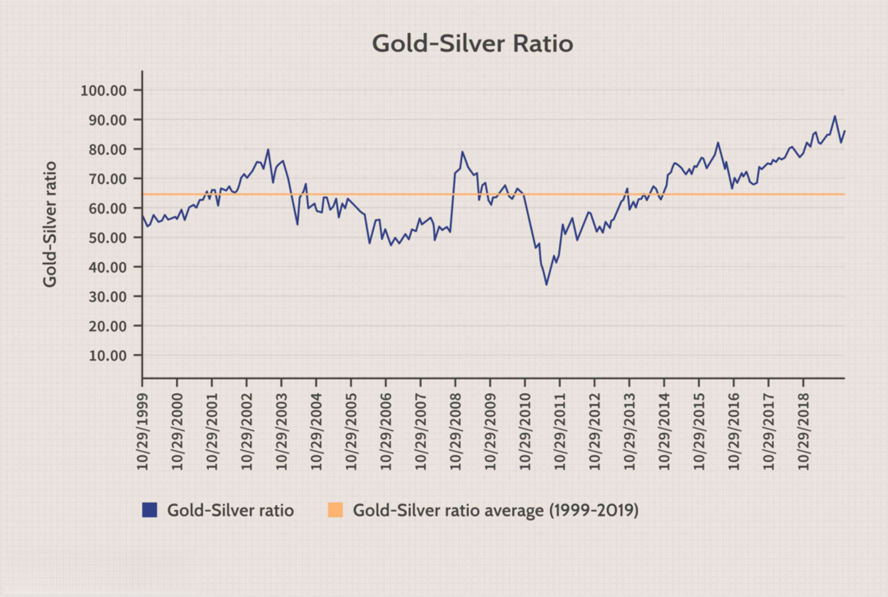

The commodity investment market presents a multitude of opportunities, particularly in precious metals trading. Gold and silver are esteemed assets and have been revered as stores of value throughout history. Their intrinsic financial stability makes them appealing choices for diversifying investment portfolios. In modern financial markets, the gold-silver ratio has become a pivotal metric for investors seeking portfolio equilibrium. This ratio, representing the quantity of silver needed to purchase one ounce of gold, provides insights into relative value and market positioning.

Algorithmic trading, commonly known as algo trading, has dramatically transformed traders' approaches to engaging with commodities like gold and silver. By leveraging advanced computational techniques, traders can systematically analyze market data, identify patterns, and execute trades based on predefined criteria with minimal human intervention. This technological advancement enhances decision-making by offering data-driven strategies and reducing subjective biases.



This article will explore the intricate connections between precious metals trading and algorithmic strategies, focusing on the gold-silver ratio. It will examine how investors can effectively use this ratio within algorithmic frameworks to optimize their trading strategies and achieve better risk-adjusted returns.

## Table of Contents

## Understanding Commodity Investment in Precious Metals

Commodity investment in precious metals, such as gold and silver, has been a cornerstone of financial strategies for centuries, offering a tangible and secure means of preserving wealth. These precious metals possess an intrinsic value, driven by their physical properties, industrial applications, and global perception as safe-haven assets.

Investors frequently turn to gold and silver to diversify their portfolios, a strategy that mitigates risk by spreading investments across various asset classes. This diversification is critical during periods of economic turbulence or market instability, as precious metals often maintain or increase their value when other investment vehicles falter. According to historical data, gold and silver have exhibited a reliable store of value, providing a hedge against inflation and currency depreciation. This characteristic is particularly appealing when financial markets are volatile or economic policies contribute to decreased purchasing power.

The scarcity of these metals underpins their value; gold’s rarity and the complexity of its extraction help sustain its high market price. Despite silver being more abundant, its broad industrial applications, including electronics and solar energy production, contribute to its demand and valuation. The dynamic nature of supply and demand for these metals heavily influences their market prices and the decisions of investors who seek to capitalize on periods of higher demand or constrained supply.

Furthermore, precious metals are considered affordable investments. Options such as fractional bullion coins, exchange-traded funds (ETFs), and mining stocks allow investors with varying budgets to gain exposure to these commodities. This accessibility broadens the investment appeal to a wider audience, from institutional investors to individual savers.

Overall, investing in precious metals provides a strategic avenue for portfolio diversification and risk management. Their historical performance as stores of value, coupled with their intrinsic properties, reinforce their role in a balanced investment strategy.

## The Gold-Silver Ratio: A Key Metric in Precious Metals Trading

The gold-silver ratio is a critical concept in precious metals trading, representing the number of ounces of silver required to purchase one ounce of gold. This ratio serves as a valuable indicator for investors, reflecting historical and current market dynamics influenced by a multitude of economic and market-based factors.

Historically, the gold-silver ratio has demonstrated significant variability. For instance, it has ranged from as low as 15:1 during periods when both metals were used as monetary standards, to as high as 100:1 during times of significant economic upheaval or shifts in monetary policy. This fluctuation provides investors with a strategic tool for evaluating the relative value of these metals. For example, when the ratio is high, it may suggest that silver is undervalued relative to gold, while a low ratio might indicate the opposite.

Investors can gain valuable insights into market sentiment through a comprehensive understanding of the gold-silver ratio. A higher ratio might indicate a stronger preference for gold, often perceived as a safe-haven asset in times of economic uncertainty. Conversely, a lower ratio might signal increased interest in silver, possibly due to industrial demand or investor optimism about economic growth.

The gold-silver ratio is also instrumental in highlighting potential investment opportunities. By analyzing historical data and current market conditions, investors can identify trends and make informed decisions on asset allocation. This might involve leveraging the ratio to execute strategic trades, such as buying silver when the ratio is high and gold when it is low, thus optimizing their portfolio's performance based on anticipated market movements.

Understanding and utilizing the gold-silver ratio requires a deep analysis of various factors, including geopolitical events, currency fluctuations, and economic policies, all of which can directly or indirectly impact the relative pricing of these metals. As such, the gold-silver ratio remains an essential metric for investors seeking to navigate the complexities of precious metals trading and make data-driven investment decisions.

## The Evolution of Trading Strategies: Algorithmic Trading

Algorithmic trading, commonly referred to as algo trading, represents a significant shift from traditional trading practices by employing computer programs to execute trades based on predefined criteria. This form of trading uses algorithms to process large data sets, identify trends, and make data-driven decisions, optimizing the trading outcomes.

In the context of precious metals like gold and silver, algo trading enables the analysis of various market indicators, including price trends, historical data, and [volume](/wiki/volume-trading-strategy) patterns. Algorithms are capable of scanning numerous markets and instruments simultaneously, providing traders with insights that are not easily discernible through manual analysis. This capacity to process and act on large volumes of data enhances the precision of trading decisions, allowing traders to capitalize on favorable conditions while minimizing exposure during adverse market movements.

The use of algorithms in trading also addresses emotional biases that can impact human judgment. Emotions such as fear and greed often lead to irrational trading decisions; however, algorithmic systems follow strict rules and criteria that eliminate emotional involvement. The automation inherent in algo trading facilitates faster execution of trades, ensuring that traders can respond swiftly to market fluctuations. This increased speed not only improves the timing of entries and exits but also ensures adherence to trading strategies.

To illustrate, consider a simple algorithmic strategy for trading based on moving averages. A common setup might involve a short-term moving average (e.g., 50-day) and a long-term moving average (e.g., 200-day). The algorithm could be designed to execute a buy order when the short-term average crosses above the long-term average and a sell order when it crosses below. This basic crossover strategy can be implemented using Python as follows:

```python
import pandas as pd

# Assume 'data' is a pandas DataFrame containing columns 'Date', 'Gold_Price', and 'Silver_Price'
data['Short_MA'] = data['Gold_Price'].rolling(window=50).mean()
data['Long_MA'] = data['Gold_Price'].rolling(window=200).mean()

# Buy signal when short MA crosses above the long MA
data['Signal'] = 0
data['Signal'][50:] = np.where(data['Short_MA'][50:] > data['Long_MA'][50:], 1, 0)

# Generate trading positions
data['Position'] = data['Signal'].diff()

# Example of position: 1 means buy, -1 means sell
print(data[['Date', 'Gold_Price', 'Short_MA', 'Long_MA', 'Signal', 'Position']])
```

This script calculates the short-term and long-term moving averages for gold prices and generates buy and sell signals based on their crossover. In practice, sophisticated algorithms may incorporate additional market variables and utilize [machine learning](/wiki/machine-learning) techniques to refine the accuracy of predictions.

Overall, the evolution of trading strategies through [algorithmic trading](/wiki/algorithmic-trading) introduces unprecedented levels of efficiency, reliability, and speed in trading precious metals. By automating complex analytical tasks, traders are better positioned to navigate the dynamic and often volatile market environments associated with gold and silver trading.

## Integrating Algorithmic Strategies with the Gold-Silver Ratio

Traders employ algorithmic strategies to leverage the gold-silver ratio by executing trades when the ratio achieves historically significant benchmarks. The gold-silver ratio, calculated as the price of gold divided by the price of silver, provides opportunities for traders to identify discrepancies and potential [arbitrage](/wiki/arbitrage) situations. By utilizing algorithmic tools, investors can program systems to automatically initiate trades when certain ratio thresholds are met, removing emotional bias and increasing execution precision.

The integration of quantitative models is crucial for dynamic market adaptation. These models consider a variety of factors, including historical data trends, economic indicators, and market sentiments, allowing for the refinement of trading strategies. By continuously analyzing the fluctuations in the gold-silver ratio, algos can identify patterns that suggest optimal entry and [exit](/wiki/exit-strategy) points. For example, if the historical average of the ratio is 60:1 and it moves to an extreme of 80:1, algorithms might be set to buy silver and sell gold, anticipating a reversion to the mean.

Algorithmic strategies aid traders in maximizing returns by managing risk effectively. By incorporating parameters such as stop-loss limits and profit targets, these systems can mitigate the risk of substantial losses during volatile market conditions. Additionally, they facilitate capitalizing on short-term market movements through high-frequency trading, which is often challenging through manual trading methods.

Moreover, algorithms can be programmed to adapt to new information, ensuring they react not only based on past data but also on real-time news feeds or economic reports. Python, with libraries such as NumPy, pandas, and scikit-learn, allows traders to implement machine learning models that enhance prediction accuracies. An example Python snippet for monitoring the gold-silver ratio might look like:

```python
import pandas as pd
import numpy as np

# Hypothetical data of gold and silver prices
gold_prices = pd.Series([1800, 1825, 1850, 1840])
silver_prices = pd.Series([24, 24.5, 25, 25.5])

# Calculate the gold-silver ratio
gold_silver_ratio = gold_prices / silver_prices

# Define trading thresholds
buy_threshold = 65
sell_threshold = 55

# Make trading decisions based on the gold-silver ratio
trading_signals = ["Buy Silver" if ratio > buy_threshold else "Sell Silver" if ratio < sell_threshold else "Hold" for ratio in gold_silver_ratio]
print(trading_signals)
```

Through such computational strategies, traders enhance their capacity to exploit the gold-silver ratio, aligning decisions with quantitative insights and thereby optimizing their investment outcomes.

## Practical Applications: Trading Platforms and Tools

Numerous platforms enable traders to implement algorithmic trading strategies in the precious metals markets, focusing particularly on the gold-silver ratio. These platforms provide essential infrastructures, allowing traders to exploit market dynamics effectively. Key instruments that traders often utilize include Exchange-Traded Funds (ETFs), futures contracts, and options, each providing unique advantages based on the gold-silver ratio's predictions.

Traders often leverage ETFs as they offer an efficient way to gain exposure to precious metals without the need to own physical quantities. ETFs track the performance of gold and silver prices, and algorithmic models can help identify optimal trading times based on fluctuations in the gold-silver ratio. For instance, if algorithms predict an upward movement in the ratio, traders might favor gold ETFs over silver ETFs.

Futures contracts are another essential tool, allowing traders to lock in purchase or sale prices for future transactions. By using algorithmic strategies tailored to the gold-silver ratio, traders can better anticipate price changes and make more informed decisions regarding contract positions. The predictiveness and speed of algo trading can significantly enhance profitability in futures markets, as these rely heavily on timely entries and exits.

Options provide flexibility as they offer rights without obligations to buy or sell at predetermined prices. This flexibility is beneficial when paired with algorithmic insights into the gold-silver ratio, allowing traders to capitalize on market [volatility](/wiki/volatility-trading-strategies). Leveraging options, especially when the algorithm indicates a possible [breakout](/wiki/breakout-trading) in the ratio, can provide substantial strategic advantages.

Choosing the right tools and services for executing these trades is crucial to maintaining a secure and efficient trading environment. Factors such as transparency, security, and reliability should be paramount when selecting trading platforms. High-quality data feeds, low latency execution, and robust analytics are critical features that traders need to ensure effective functioning of their algorithmic strategies. It's imperative that platforms support comprehensive [backtesting](/wiki/backtesting) capabilities, enabling traders to refine strategies based on historical gold-silver ratio data.

Platforms such as MetaTrader, [Interactive Brokers](/wiki/interactive-brokers-api), and Thinkorswim provide robust infrastructures that cater to these requirements, offering tools and resources tailored to the needs of those trading in the precious metals markets. Additionally, these platforms often integrate with algorithmic trading APIs, allowing for seamless execution of trades based on sophisticated models.

In conclusion, the integration of algorithmic strategies with trading platforms and tools empowers traders to leverage the gold-silver ratio effectively. By employing ETFs, futures contracts, and options, traders can enhance their positions, while the right platform can ensure that the trading process is both reliable and efficient.

## Challenges and Considerations

Algorithmic trading in the precious metals market presents numerous challenges, driven primarily by market unpredictability and technological risks. Unlike traditional trading, where human intuition and experience play a significant role, algo trading relies heavily on the precision and reliability of computational models. Consequently, traders must exercise vigilance in various aspects of their strategy development and execution.

One of the primary challenges is the accuracy of the trading models used. These models are based on historical data and mathematical frameworks; however, they are susceptible to errors if the input data is inaccurate or the market conditions shift unexpectedly. The fragility of these models becomes evident during periods of high volatility, where the assumptions underlying the algorithms may no longer hold true. Thus, constant monitoring and updating of these algorithms are crucial to maintain their relevance and accuracy. Techniques such as backtesting, which involves running the model on historical data, can help identify potential weaknesses before live deployment. Here is a basic Python example for backtesting a strategy using historical price data:

```python
import pandas as pd

# Load historical data
data = pd.read_csv('historical_data.csv')

# Define a simple moving average strategy
def moving_average_strategy(data, short_window=50, long_window=200):
    data['Short_MA'] = data['Close'].rolling(window=short_window).mean()
    data['Long_MA'] = data['Close'].rolling(window=long_window).mean()
    data['Signal'] = 0  # Default signal
    data['Signal'][short_window:] = np.where(data['Short_MA'][short_window:] > data['Long_MA'][short_window:], 1, -1)
    return data

# Backtest the strategy
strategy_data = moving_average_strategy(data)
print(strategy_data[['Close', 'Short_MA', 'Long_MA', 'Signal']])
```

Another consideration is the reliability of data inputs. With the rapid pace of market movements, even minor discrepancies or delays in data acquisition can lead to significant errors in execution. High-quality, real-time data feeds are indispensable for the accuracy of algorithmic strategies. Traders should also be aware of potential biases in historical data that could mislead model predictions.

Risk management is a critical component of algorithmic trading strategies. Given the autonomous nature of algo trading, without proper safeguards, erroneous trades could be executed en masse, leading to substantial financial losses. Effective risk management strategies could include setting stop-loss limits, diversifying trading strategies, and regularly auditing the performance of algorithms.

Furthermore, technological risks such as server downtimes, network failures, or programming errors can significantly affect the efficacy of algorithmic trading. Implementing redundancy, robust testing procedures, and fail-safes can mitigate these risks. Establishing a comprehensive disaster recovery plan ensures the resilience of trading operations in the event of technological failures.

In conclusion, while algorithmic trading in precious metals offers significant potential for enhancing trading efficiency and returns, traders must rigorously address the challenges associated with market unpredictability and technological risks. Developing accurate models, ensuring data accuracy, implementing robust risk management protocols, and mitigating technological risks are vital steps in harnessing the full potential of algorithmic trading in this domain.

## Conclusion

The convergence of commodity investment in precious metals and algorithmic trading creates a powerful platform for investors seeking to optimize their trading strategies. Precious metals like gold and silver have always been considered secure and valuable assets, providing a hedge against market volatility. By integrating algorithmic trading strategies, investors can unlock potentially significant efficiencies in executing trades and analyzing market trends.

A crucial component of this convergence is the gold-silver ratio. This ratio represents how many ounces of silver are required to buy an ounce of gold, serving as a critical indicator for market conditions and a tool for traders to fine-tune their strategies. By capitalizing on shifts in this ratio, traders have the opportunity to gain a strategic edge, maximizing returns while managing risk more effectively.

Algorithmic trading systems enhance this process by relying on advanced quantitative models to interpret vast amounts of data swiftly and accurately. These systems can dynamically adjust trading strategies as market conditions evolve, thus improving decision-making processes and enhancing the potential for profitable outcomes. For instance, Python offers robust libraries like pandas for data manipulation and numpy for numerical calculations, which can be used to develop and backtest trading algorithms that exploit variations in the gold-silver ratio.

```python
import pandas as pd
import numpy as np

# Example of simple model evaluating gold-silver ratio
# Assumes historical_data is a DataFrame with gold and silver prices

def calculate_goldsilver_ratio(historical_data):
    historical_data['Gold-Silver Ratio'] = historical_data['Gold'] / historical_data['Silver']
    return historical_data['Gold-Silver Ratio']

def trading_signal(ratio, threshold=80):
    return np.where(ratio > threshold, 'Buy Silver / Sell Gold', 'Neutral')

# Example input data
data = {
    'Gold': [1900, 1950, 1980],
    'Silver': [25, 24, 26]
}

df = pd.DataFrame(data)
ratios = calculate_goldsilver_ratio(df)
signals = trading_signal(ratios)

print(ratios)
print(signals)
```

Despite the promise algorithmic trading holds, it also demands careful consideration of its complexities. The reliability of data inputs and the accuracy of the models must be upheld to prevent costly trading errors. Additionally, technological risks, including system failures and cyber threats, necessitate robust risk management frameworks.

The ongoing development of financial technology (fintech) continues to refine the landscape of precious metals trading. As fintech solutions evolve, they promise to optimize the execution and analysis of trades further. Ultimately, the integration of algorithmic trading strategies in precious metals markets not only enhances an investor's strategic approach but also fosters a more sophisticated, responsive, and potentially rewarding trading experience.

## References & Further Reading

[1]: Bergstra, J., Bardenet, R., Bengio, Y., & Kégl, B. (2011). ["Algorithms for Hyper-Parameter Optimization."](https://papers.nips.cc/paper/4443-algorithms-for-hyper-parameter-optimization) Advances in Neural Information Processing Systems 24.

[2]: ["Advances in Financial Machine Learning"](https://www.amazon.com/Advances-Financial-Machine-Learning-Marcos/dp/1119482089) by Marcos Lopez de Prado

[3]: ["Evidence-Based Technical Analysis: Applying the Scientific Method and Statistical Inference to Trading Signals"](https://www.amazon.com/Evidence-Based-Technical-Analysis-Scientific-Statistical/dp/0470008741) by David Aronson

[4]: ["Machine Learning for Algorithmic Trading"](https://github.com/stefan-jansen/machine-learning-for-trading) by Stefan Jansen

[5]: ["Quantitative Trading: How to Build Your Own Algorithmic Trading Business"](https://www.amazon.com/Quantitative-Trading-Build-Algorithmic-Business/dp/1119800064) by Ernest P. Chan