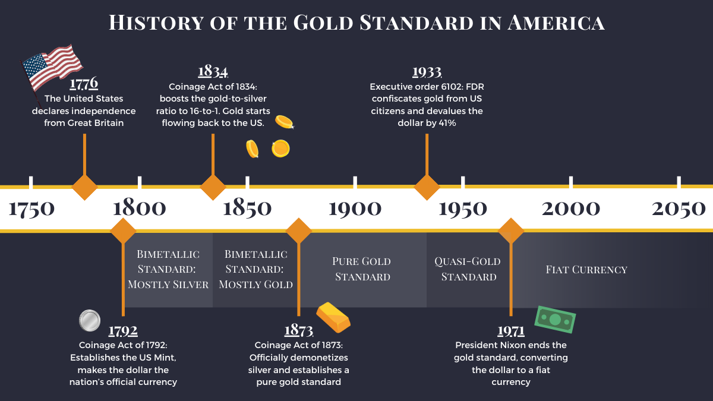

## Table of Contents

## What is the gold standard?

The gold standard is a monetary system where a country's currency is directly linked to gold. This means that the value of the currency is based on a fixed amount of gold. For example, if a country uses the gold standard, its government might say that one unit of its currency is worth a certain amount of gold, like one ounce. People can then exchange their currency for gold at this set rate. The idea behind the gold standard is to keep the value of money stable because gold is seen as a valuable and steady asset.

Countries used the gold standard in the past, but it is not common anymore. One reason is that the supply of gold can be limited, which can make it hard for a country's economy to grow. If a country wants to increase its money supply, it needs more gold, but finding and mining gold can be slow and difficult. Also, the gold standard can make it harder for governments to respond to economic problems, like recessions, because they can't easily change the amount of money in circulation. Today, most countries use a different system called fiat money, where the value of money is not based on gold but on the trust and stability of the issuing government.

## When and where was the gold standard first implemented?

The gold standard was first used in England in the year 1821. Before that, England used other ways to set the value of its money, but in 1821, they decided to link their money directly to gold. This meant that people could exchange their British pounds for gold at a fixed rate.

Other countries started to use the gold standard after England did. By the late 1800s, many countries around the world, like the United States and Germany, had also adopted the gold standard. This helped make trade between countries easier because everyone was using a similar system for their money.

## How did the gold standard work in practice?

Under the gold standard, a country's money was worth a set amount of gold. For example, if the United States was on the gold standard, the government might say that one dollar was worth a certain amount of gold, like one ounce. People could go to a bank and exchange their dollars for gold at this fixed rate. This made the value of money stable because it was tied to something valuable and steady, like gold.

In practice, countries had to keep a lot of gold in their banks to make sure they could exchange money for gold whenever people wanted to. If a country did not have enough gold, it could cause problems. For example, if more people wanted to exchange their money for gold than the country had, it could lead to a crisis. Also, if a country wanted to print more money to help its economy grow, it had to find more gold first, which could be hard and slow. This is why many countries eventually stopped using the gold standard and switched to other ways of managing their money.

## What were the economic benefits of the gold standard?

The gold standard helped keep money stable. When a country used the gold standard, its money was worth a set amount of gold. This made people trust the money more because they knew it was tied to something valuable. If a country's money was stable, it made it easier for businesses to plan and invest because they knew the value of their money would not change much.

Another benefit was that the gold standard made trade between countries easier. When many countries used the gold standard, they all had money that was based on gold. This meant that businesses in different countries could trade with each other more easily because they knew the value of each other's money. It also helped prevent big changes in money values between countries, which could make trade harder.

## What were the drawbacks or limitations of the gold standard?

The gold standard had some big problems. One big problem was that it could make it hard for a country's economy to grow. If a country wanted to make more money, it needed more gold. But finding and getting gold can be slow and hard. So, if a country's economy was growing and needed more money, it might not be able to get enough gold fast enough. This could slow down the economy and make it hard for businesses to grow.

Another problem was that the gold standard could cause big problems if people wanted to exchange their money for gold but the country did not have enough gold. This could lead to a crisis where people lost trust in the money. Also, the gold standard made it hard for governments to help their economies during tough times, like recessions. If the economy was doing badly, the government might want to print more money to help, but it could not do that easily because it needed more gold first.

Overall, the gold standard had some good things about it, like making money stable and trade easier. But it also had big problems that made it hard for economies to grow and respond to problems. This is why most countries stopped using the gold standard and switched to other ways of managing their money.

## How did the gold standard affect international trade?

The gold standard made international trade easier because it helped make money values between countries more stable. When many countries used the gold standard, their money was based on gold. This meant that businesses in different countries could trade with each other more easily. They knew the value of each other's money because it was all tied to gold. This stability helped businesses plan and invest across borders because they did not have to worry about big changes in money values.

However, the gold standard also had some problems for international trade. If a country did not have enough gold, it could cause problems. For example, if more people wanted to exchange their money for gold than the country had, it could lead to a crisis. This could make people lose trust in the money and hurt trade. Also, if the supply of gold was not growing fast enough, it could slow down the growth of the world economy. This could make it harder for countries to trade and grow their economies together.

## What events led to the suspension of the gold standard during World War I?

During World War I, many countries had to spend a lot of money to fight the war. They needed to print more money to pay for things like weapons and soldiers. But, under the gold standard, they could not print more money without more gold. This made it hard for them to keep fighting the war. So, they decided to stop using the gold standard. This let them print more money without needing more gold.

After World War I ended, some countries tried to go back to the gold standard. But, it was hard because the war had changed their economies a lot. They had big debts and their money was not as strong as before. Going back to the gold standard would have made these problems worse. So, many countries decided not to go back to the gold standard and kept using other ways to manage their money.

## How did the interwar period affect the stability of the gold standard?

The interwar period, the time between World War I and World War II, made the gold standard very unstable. After World War I, many countries had big debts and their economies were weak. They tried to go back to the gold standard, but it was hard because their money was not as strong as before. Going back to the gold standard would have made their economic problems worse. So, many countries decided not to go back to the gold standard and kept using other ways to manage their money.

During this time, the world economy was also going through big changes. The Great Depression, which started in 1929, made things even worse. Many countries had to deal with falling prices, high unemployment, and businesses failing. The gold standard made it hard for them to fight these problems because they could not easily change the amount of money in circulation. As a result, more and more countries started to leave the gold standard to try to fix their economies. By the time World War II started, the gold standard was no longer used by most countries.

## What was the role of the Great Depression in the collapse of the gold standard?

The Great Depression played a big role in the collapse of the gold standard. During the Great Depression, which started in 1929, many countries faced falling prices, high unemployment, and businesses failing. The gold standard made it hard for these countries to fight these problems. Under the gold standard, countries could not easily change the amount of money in circulation. If they wanted to print more money to help their economies, they needed more gold, but finding and mining gold was slow and difficult. This made it hard for countries to respond to the economic crisis.

As the Great Depression got worse, more and more countries started to leave the gold standard. They realized that sticking to the gold standard was making their economic problems even worse. By leaving the gold standard, countries could print more money without needing more gold. This helped them try to fix their economies. By the time World War II started, most countries had already stopped using the gold standard because of the economic problems caused by the Great Depression.

## Which countries abandoned the gold standard first, and why?

The United Kingdom was one of the first major countries to abandon the gold standard. This happened in 1931 during the Great Depression. The UK was facing big economic problems like falling prices and high unemployment. Staying on the gold standard made it hard for the UK to fight these problems because they could not easily print more money to help their economy. By leaving the gold standard, the UK could print more money without needing more gold, which they hoped would help fix their economy.

After the UK left the gold standard, other countries followed. For example, the United States left the gold standard in 1933. Like the UK, the US was also struggling with the effects of the Great Depression. The US government realized that staying on the gold standard was making their economic problems worse. By leaving the gold standard, the US could print more money to help businesses and people during the tough economic times. This move helped the US start to recover from the Great Depression.

## What were the long-term effects of abandoning the gold standard on global economies?

Abandoning the gold standard had big effects on global economies. It let countries print more money without needing more gold. This helped them fight economic problems like the Great Depression. Countries could now use different ways to manage their money, like changing interest rates or spending more on public projects. This made it easier for them to help their economies grow and recover from tough times. It also made it possible for countries to work together to manage the world economy, like through organizations like the International Monetary Fund.

However, leaving the gold standard also had some challenges. Without the gold standard, money was not tied to something valuable like gold anymore. This meant that the value of money could change more easily, which could lead to inflation if too much money was printed. Countries had to be careful about how they managed their money to keep it stable. Over time, most countries switched to using fiat money, where the value of money is based on trust in the government. This new system helped economies grow and adapt, but it also needed good management to keep money stable and prevent big economic problems.

## How has the concept of the gold standard influenced modern monetary policy?

The idea of the gold standard still affects how countries manage their money today. Even though no country uses the gold standard anymore, it taught us a lot about keeping money stable. The gold standard showed that tying money to something valuable like gold can make people trust it more. Today, countries use different ways to keep their money stable, like setting interest rates and controlling how much money is in circulation. They learned from the gold standard that it's important to have a stable money system so businesses and people can plan and invest without worrying about big changes in money value.

However, the gold standard also showed us the problems of linking money too closely to gold. It can slow down an economy if there's not enough gold to support growth. This is why modern monetary policy focuses on flexibility. Central banks can now change the amount of money in circulation to help the economy grow or to fight problems like recessions. They don't need more gold to do this. So, while the gold standard helped us understand the importance of money stability, it also showed us the need for a system that can adapt to economic changes.

## References & Further Reading

[1]: Bordo, M. D., & Eichengreen, B. (1998). ["The rise and fall of a barbarous relic: The role of gold in the international monetary system."](https://papers.ssrn.com/sol3/papers.cfm?abstract_id=226183) National Bureau of Economic Research Working Paper No. 6436.

[2]: Eichengreen, B. J. (2008). ["Globalizing Capital: A History of the International Monetary System,"](https://www.jstor.org/stable/j.ctt7pfmc) Princeton University Press.

[3]: Flandreau, M. (1996). ["The French Crime of 1873: An Essay on the Emergence of the International Gold Standard, 1870-1880."](https://www.jstor.org/stable/2123513) The Journal of Economic History.

[4]: ["Golden Fetters: The Gold Standard and the Great Depression, 1919-1939"](https://books.google.com/books/about/Golden_Fetters.html?id=Qk1flhynCD8C) by Barry Eichengreen.

[5]: ["The Gold Standard in Theory and History,"](https://www.taylorfrancis.com/books/edit/10.4324/9780203978870/gold-standard-theory-history-barry-eichengreen-marc-flandreau) edited by Barry Eichengreen and Marc Flandreau.

[6]: Hendershott, T., & Riordan, R. (2011). ["Algorithmic Trading and Information."](https://faculty.haas.berkeley.edu/hender/ATInformation.pdf) The Review of Financial Studies.

[7]: Lewis, M. (1999). ["Moneyball: The Art of Winning an Unfair Game"](https://www.amazon.com/Moneyball-Art-Winning-Unfair-Game/dp/0393324818) explores decision-making and data analysis, applicable to financial market strategies.

[8]: ["The Great Depression: An International Disaster of Perverse Economic Policies,"](https://www.jstor.org/stable/1060826) by Thomas E. Hall and J. David Ferguson.

