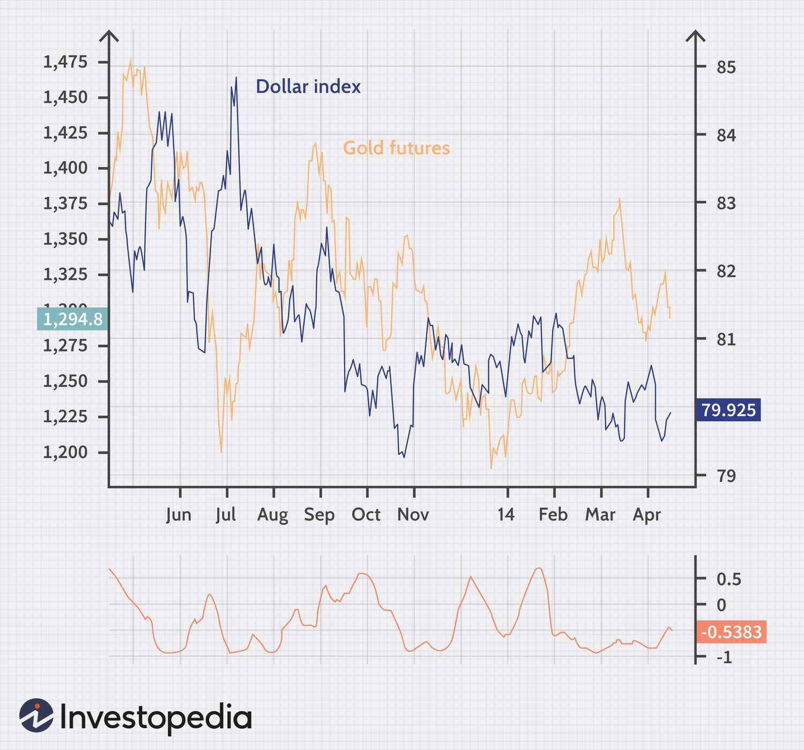

The gold standard represents a monetary framework wherein a country's currency maintains its value by being directly linked to a specific quantity of gold. This peg to gold ensures that the currency holds intrinsic value, arguably providing a safeguard against rampant inflation and currency depreciation. Historically, different civilizations have relied on gold as a symbol of wealth and stability, from the use of gold coins in ancient civilizations to its adoption as a universal benchmark for trade and economic stability in the modern era.

The gold standard gained prominence in the 19th century, when countries sought to stabilize their currencies through a common anchor. Under this system, the amount of money circulating in an economy corresponded to the amount of gold held in reserve by the government. This relationship aimed to prevent governments from printing excessive amounts of money, thereby maintaining price stability and consumer confidence.

However, the gold standard's rigidity also made economies vulnerable to demand and supply shocks, as the fixed nature of the currency supply could not adjust to changing economic conditions. These limitations eventually led to its collapse in the 20th century. This article aims to trace the historical trajectory of the gold standard, evaluating the reasons for its rise, challenges that led to its downfall, and the subsequent shift towards algorithmic trading in today's financial markets.

The transition from a gold-backed currency to a fiat-based system introduced new dynamics in global finance, including increased volatility and complexity. In this environment, algorithmic trading has emerged, leveraging technological advancements to optimize trading strategies. This modern evolution in finance acknowledges the constraints of the gold standard, embracing innovation to navigate and capitalize on new market realities. By examining these developments, this article provides insight into the interplay between historical monetary systems and contemporary financial advancements.

## Table of Contents

## The Gold Standard: A Historical Overview

The gold standard, a monetary system where a country's currency or paper money has a value directly linked to gold, was first adopted in the 19th century. England was at the forefront of this monetary innovation, establishing the gold standard during the 1820s under the guidance of influential economists like David Ricardo, who argued for the benefits of gold in promoting monetary stability and facilitating international commerce.

The primary advantage of the gold standard was its ability to provide a stable economic environment, which was particularly beneficial for international trade. By ensuring that currencies were backed by a specific quantity of gold, it promoted trust in the value of money and reduced the risks associated with currency fluctuations. This stability was paramount for fostering international trade as it eliminated the uncertainties and exchange rate risks, thereby facilitating long-term trade agreements between nations.

The adoption of the gold standard by other major economies followed suit, creating a widespread international system of gold-backed currencies that enhanced global economic integration. During the late 19th and early 20th centuries, the gold standard contributed significantly to the period of economic growth seen across many industrial nations, often referred to as the first era of globalization.

Despite its benefits, the gold standard was not immune to challenges. Various historical events, particularly the two World Wars and the Great Depression, exposed the inherent vulnerabilities of the system. World War I necessitated massive government spending, leading many countries to suspend the gold standard temporarily to finance military expenditures without the constraints of fixed currency-to-gold ratios. The Great Depression further tested the system; as economies contracted, countries struggled to maintain gold reserves, leading to competitive devaluations and increased protectionism.

Moreover, the gold standard's fixed exchange rate system limited the flexibility of governments to respond to domestic economic crises through monetary policy. This rigidity often exacerbated economic downturns, as it prevented countries from adjusting their monetary supply to manage unemployment or stimulate growth during periods of economic distress. Consequently, various nations began abandoning the gold standard, seeking more flexible monetary policies to tackle domestic and global economic challenges.

In summary, while the gold standard fostered economic stability and international trade during its time, its eventual oscillation in the face of significant global upheavals underscored its limitations in accommodating the dynamic needs of modern economic systems.

## The Fall of the Gold Standard

The fall of the gold standard was a significant turning point in global economic history, marked by a series of events and decisions that underscored its limitations. The gold standard linked a country's currency to a specific quantity of gold, constraining monetary policy flexibility. This rigidity became apparent during the Great Depression and World War II, periods that demanded dynamic and adaptable economic responses.

The Great Depression of the 1930s exposed the inherent inflexibility of the gold standard. As economies contracted, countries tied to gold were forced to maintain fixed currency values. This restriction inhibited their ability to implement expansionary monetary policies, such as increasing money supply to boost economic activity. Consequently, nations experienced prolonged economic stagnation and soaring unemployment rates. In response, several countries, including the United States and the United Kingdom, abandoned the gold standard in the early 1930s to regain monetary control and stimulate growth.

World War II further strained the gold standard framework. The massive expenditures required for wartime efforts led to significant international financial imbalances. Countries faced heightened difficulties in maintaining gold reserves to back their currencies while simultaneously managing war-related costs. As a result, the system's viability was questioned, necessitating a reevaluation of international monetary policies.

In an attempt to address post-war economic challenges and maintain exchange rate stability, the Bretton Woods Agreement was established in 1944. This agreement created a new international monetary framework wherein currencies were pegged to the US dollar, and the dollar itself remained convertible to gold at $35 per ounce. However, this arrangement did not entirely eliminate the limitations of the gold standard, as the dollar's convertibility to gold imposed constraints on US monetary policy.

By the late 1960s, the US faced mounting balance of payments deficits and dwindling gold reserves. These pressures culminated in President Richard Nixon's decision in 1971 to suspend the dollar's convertibility into gold. This action effectively ended the Bretton Woods system and marked the transition to fiat currency systems, where currency values are determined by market dynamics rather than a fixed gold reference.

The transition to fiat currencies allowed for greater economic flexibility and adaptability. Monetary authorities could now adjust interest rates and influence money supply without the constraints imposed by gold reserves. While this shift resolved some issues associated with the gold standard, it introduced new challenges related to currency valuation and inflation control.

In conclusion, the inherent inflexibility of the gold standard, highlighted by economic and geopolitical events such as the Great Depression and World War II, led to its eventual decline. The shift to fiat currency systems following President Nixon's 1971 decision provided a more adaptable monetary framework, albeit with its own set of challenges in managing economic stability.

## Algorithmic Trading and Modern Market Dynamics

In the decades following the dissolution of the gold standard, financial markets experienced heightened [volatility](/wiki/volatility-trading-strategies) and complexity. This new environment laid the foundation for [algorithmic trading](/wiki/algorithmic-trading), a method of executing trades using pre-programmed instructions that account for variables such as timing, price, and [volume](/wiki/volume-trading-strategy). The volatility provided opportunities for traders to leverage price discrepancies in the market, and technological advancements facilitated sophisticated and rapid decision-making processes.

One major technological advancement has been the rise of high-frequency trading ([HFT](/wiki/high-frequency-trading-strategies)), a subset of algorithmic trading that executes a large number of orders at extremely fast speeds. These trades capitalize on very small price differences which humans are unable to exploit due to their slower reaction times. The capability of processing trades in milliseconds—or even microseconds—has transformed market dynamics, making it possible for trades to happen at speeds that were previously unattainable.

Algorithmic trading enhances market efficiency by increasing [liquidity](/wiki/liquidity-risk-premium) and narrowing bid-ask spreads. This efficiency arises because algorithms can process vast amounts of data far more quickly and accurately than a human trader, leading to optimized buying and selling decisions. Market participants can enter and [exit](/wiki/exit-strategy) positions with minimal impact on market prices, contributing to a more stable and balanced trading environment.

However, algorithmic trading is not without its challenges. One major concern is market manipulation, which can occur when algorithms are used to create fake demand or supply, misleading other market participants about the true state of the market. This practice, known as spoofing, has prompted regulatory scrutiny. Additionally, the reliance on algorithmic systems introduces systemic risks; technical glitches or erroneous algorithms can lead to significant market disruptions, as exemplified by the 2010 "Flash Crash" when the Dow Jones Industrial Average briefly plummeted by nearly 1,000 points.

Despite these challenges, the integration of technology and finance continues to evolve, pushing the boundaries of market dynamics. Algorithmic trading represents both a culmination of technological advancements and a window into future market evolution, where data-driven decision-making will likely play an increasingly pivotal role. Understanding these mechanisms is crucial for adapting to and thriving in contemporary financial markets.

## Conclusion

The gold standard, once heralded for providing monetary stability through a fixed quantity of gold as currency backing, ultimately succumbed to its inherent limitations. The rigidity of a system tethered to a finite resource meant it could not adequately respond to the fluid demands of modern economic realities, especially during periods of crisis like the Great Depression and World War II. Such inflexibility highlighted the need for a more adaptable monetary framework, paving the way for fiat currency systems that offer central banks greater control over monetary policy.

Algorithmic trading, emerging as a transformative force in contemporary finance, represents the technological evolution from traditional market practices. By leveraging advanced algorithms and computing power, it enhances market efficiency and liquidity, allowing for rapid responses to market dynamics that were previously unattainable. Unlike the static nature of the gold standard, algorithmic trading introduces a level of dynamism and adaptability essential for modern financial markets. However, this innovation is not without its challenges, such as the potential for market manipulation and the systemic risks posed by high-frequency trading.

Comprehending the contrasts and connections between historical monetary systems like the gold standard and modern financial innovations such as algorithmic trading is crucial for effectively navigating today's complex financial landscape. Understanding past monetary systems provides insights into their operational strengths and weaknesses, informing current and future financial strategies. Similarly, recognizing the potential and pitfalls of algorithmic trading is essential for leveraging its benefits while mitigating its risks. This historical and modern knowledge synthesis equips policymakers, financial professionals, and market participants with the tools needed to adapt to and thrive in the evolving landscape of global finance.

## References & Further Reading

[1]: Bordo, M. D., & Eichengreen, B. (1998). ["The rise and fall of a barbarous relic: The role of gold in the international monetary system."](https://papers.ssrn.com/sol3/papers.cfm?abstract_id=226183) National Bureau of Economic Research Working Paper No. 6436.

[2]: Eichengreen, B. J. (2008). ["Globalizing Capital: A History of the International Monetary System,"](https://www.jstor.org/stable/j.ctt7pfmc) Princeton University Press.

[3]: Flandreau, M. (1996). ["The French Crime of 1873: An Essay on the Emergence of the International Gold Standard, 1870-1880."](https://www.jstor.org/stable/2123513) The Journal of Economic History.

[4]: ["Golden Fetters: The Gold Standard and the Great Depression, 1919-1939"](https://books.google.com/books/about/Golden_Fetters.html?id=Qk1flhynCD8C) by Barry Eichengreen.

[5]: ["The Gold Standard in Theory and History,"](https://www.taylorfrancis.com/books/edit/10.4324/9780203978870/gold-standard-theory-history-barry-eichengreen-marc-flandreau) edited by Barry Eichengreen and Marc Flandreau.

[6]: Hendershott, T., & Riordan, R. (2011). ["Algorithmic Trading and Information."](https://faculty.haas.berkeley.edu/hender/ATInformation.pdf) The Review of Financial Studies.

[7]: Lewis, M. (1999). ["Moneyball: The Art of Winning an Unfair Game"](https://www.amazon.com/Moneyball-Art-Winning-Unfair-Game/dp/0393324818) explores decision-making and data analysis, applicable to financial market strategies.

[8]: ["The Great Depression: An International Disaster of Perverse Economic Policies,"](https://www.jstor.org/stable/1060826) by Thomas E. Hall and J. David Ferguson.