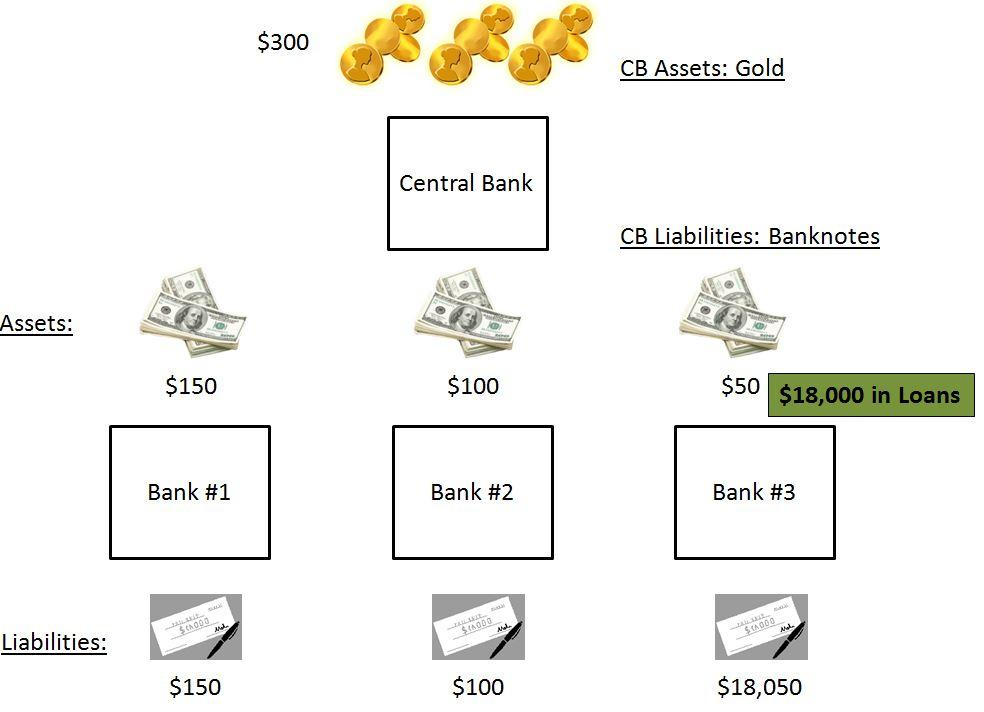

The monetary system has undergone profound transformations over the centuries, shaping the economic landscape across the globe. Initially, economies relied on bartering before evolving into systems characterized by the gold standard and fiat currency. This article examines how these economic frameworks and the advent of algorithmic trading influence contemporary financial systems.

In the early stages of the global economy, the gold standard served as a pivotal mechanism. It established a definitive value for currencies based on a fixed weight of gold, promoting stability and certainty in international trade and finance. While this system offered numerous advantages, such as minimizing exchange rate fluctuations, its inherent rigidity eventually led to its downfall. The inflexibility in adjusting monetary policies posed significant challenges during economic downturns, prompting a shift to more adaptable systems.

The transition to fiat currencies marked a substantial shift, allowing governments to regulate money supplies without the constraints of gold reserves. This shift provided increased flexibility in managing economies, enabling responses to inflation and other economic variables. With currencies no longer tied to a specific commodity, monetary policies could be more effectively tailored to the changing economic climate. However, this newfound flexibility came with its own set of challenges, raising concerns about inflation control and currency stability.

Simultaneously, the rise of financial technologies revolutionized trading strategies, particularly through the adoption of algorithmic trading. This approach leverages computational algorithms to execute trades at unprecedented speeds, capitalizing on market inefficiencies and volatility. The integration of algorithmic trading into modern financial markets has significantly impacted liquidity and efficiency, yet it also poses risks related to market manipulation and systemic stability.

By evaluating these historical contexts and technological innovations, we aim to provide a comprehensive understanding of their implications for monetary policy, economic stability, and trading strategies. This exploration highlights the ongoing evolution of financial systems and the complex interplay between traditional economic models and contemporary technological advancements.

## Table of Contents

## The Gold Standard: Historical Context and Mechanisms

The gold standard refers to a monetary system where a nation's currency value is directly tied to a specific amount of gold. This system saw extensive adoption in the 19th century, with countries stipulating that their currency could be exchanged for a predetermined amount of the precious metal. One of the primary advantages of the gold standard was the economic stability it granted, as it inherently limited the ability of governments to inflate currency supplies and thus controlled inflation. Additionally, the uniform value of currency in terms of gold minimized exchange rate risks, thereby facilitating international trade.

Historically, the gold standard provided a framework for predictable monetary policy. Before World War I, many of the world's strongest economies committed to this system by maintaining large gold reserves to back their currencies. The classical gold standard era (approximately 1870-1914) is often associated with a relatively stable economic environment, as it reduced the likelihood of hyperinflation and allowed for the relatively free movement of goods, capital, and labor. This system was characterized by fixed exchange rates, as each currency was defined by a certain weight of gold.

Despite these benefits, the gold standard's rigid nature posed significant limitations. As economies expanded and contracted, the inflexibility of tying currency to a fixed gold amount hampered governments from effectively responding to economic shocks and recessions. The requirement to back currency with gold meant that the money supply was essentially at the mercy of gold mining and reserves, making it difficult for countries to adjust their money supply independently of their gold reserves. This rigidity was particularly problematic during periods of economic distress, as it restricted the ability of central banks to inject [liquidity](/wiki/liquidity-risk-premium) into the markets or enact counter-cyclical monetary policies. The inability to adapt quickly to changes led to the system's gradual decline.

The decline of the gold standard began with World War I, as countries suspended the system to print more money and fund war efforts. Attempts to restore it in the interwar period proved challenging. The interwar gold standard (approximately 1925-1931) saw significant imbalances and ultimately culminated in its collapse during the Great Depression. Under the pressures of unemployment and deflation, countries found it increasingly difficult to maintain fixed gold parities and eventually opted for more flexible monetary systems. The final nail in the coffin was during the Bretton Woods Conference after World War II, where a new system of fixed exchange rates was established, relying on the U.S. dollar (which was convertible to gold for foreign central banks) rather than direct gold convertibility for all currencies.

The transition away from the gold standard was motivated by the need for more flexible monetary policies that could adapt to the changing economic realities of the 20th century. The ability to control and expand the money supply without being limited by gold reserves enabled countries to better manage economic cycles, albeit with new challenges related to fiat currency, such as inflation control and currency valuation.

In summary, while the gold standard provided economic stability and facilitated international trade through fixed exchange rates, its rigid framework ultimately limited governmental response to economic crises. As nations encountered these challenges, they progressively moved towards fiat currencies, which allowed for more adaptive and responsive monetary policy approaches.

## Transition from Gold Standard to Fiat Money

The transition from a gold-backed monetary system to fiat currency signified a profound transformation in global finance. Historically, currencies were directly tied to a specific quantity of gold, providing a tangible measure of value and facilitating international trade. However, the limitations of the gold standard, such as its rigidity in monetary policy and inability to accommodate the growing economic complexities, led to its decline.

Fiat currency, unlike its gold-backed predecessor, is not anchored by a physical commodity. Instead, it derives its value from government regulation and trust in the issuing authorities. This flexibility allows governments to manage money supply, engage in monetary policy interventions, and adapt to current economic conditions more effectively.

The abandonment of the gold standard gained [momentum](/wiki/momentum) in the mid-20th century, culminating in a pivotal moment in 1971 when the United States severed its currency's ties to gold entirely under President Richard Nixon's administration. This decision, known as the "Nixon Shock," effectively dismantled the Bretton Woods system, which had governed international monetary relations since the end of World War II. The move ushered in an era where fiat money became the norm, and currency values were determined by market forces and government policies rather than a fixed gold price.

The transition to fiat money introduced several challenges for global economies. One of the primary concerns was managing inflation, as the absence of gold backing removed the natural constraint on money supply. Central banks faced the task of controlling inflationary pressures through interest rates and other monetary tools. Additionally, maintaining currency stability became crucial, as exchange rates were now more susceptible to market fluctuations without the stabilizing influence of gold parity.

In response to these challenges, monetary policies evolved significantly. Central banks gained greater authority to implement strategies aimed at achieving economic goals, such as full employment and stable prices. Tools like open market operations, reserve requirements, and discount rates became integral in regulating economic activity.

Overall, the shift from the gold standard to fiat money allowed for a more dynamic and adaptable economic environment. It empowered governments to address the demands of modern economies, although it also required careful management to mitigate potential pitfalls like unchecked inflation and currency [volatility](/wiki/volatility-trading-strategies). This evolution in monetary systems has played a crucial role in shaping the financial landscape we navigate today.

## Algorithmic Trading: Evolution and Market Impact

Algorithmic trading, often termed algo trading, is a transformative innovation in financial markets. It leverages computer algorithms to execute trades with notable efficiency and speed, significantly differing from traditional trading practices that predominantly rely on human decision-making. Central to [algorithmic trading](/wiki/algorithmic-trading) is its ability to process vast quantities of data at exceptional speeds, react to market conditions in real-time, and execute a large [volume](/wiki/volume-trading-strategy) of trades with minimal human intervention.

The primary advantage of algorithmic trading lies in its capacity to exploit the volatility and complexity inherent in modern fiat money systems. These systems allow market participants to capitalize on market inefficiencies that might be imperceptible to human traders. Given the intricate web of global financial markets and the rapid information dissemination enabled by digital platforms, algo trading proves particularly effective in navigating this complexity to identify and act on profitable opportunities.

A notable subset of algorithmic trading is high-frequency trading ([HFT](/wiki/high-frequency-trading-strategies)), which is characterized by processing trades at extremely high speeds measured in milliseconds or microseconds. The adoption of HFT has markedly transformed market dynamics. It enhances market liquidity by ensuring that buy and sell orders are executed swiftly, thus narrowing bid-ask spreads and reducing transaction costs. However, the rapid pace of trades facilitated by HFT also magnifies concerns regarding market manipulation and systemic risks. Instances such as the 2010 Flash Crash highlight the potential for severe market disruptions driven by algorithmic trades that operate on feedback loops without adequate safeguards.

The integration of algorithmic trading into current financial systems yields both opportunities and challenges. On one hand, algorithms contribute to greater market efficiency by optimizing price discovery processes and offering investors a wider range of strategic options. On the other hand, they heighten the need for stringent regulatory frameworks to mitigate risks associated with automatic trading systems. The concerns regarding transparency and fairness necessitate a balance between innovation and the safeguarding of market integrity.

The future implications of algo trading are profound, with technological advancements continuing to shape its trajectory. Machine learning and [artificial intelligence](/wiki/ai-artificial-intelligence) are increasingly employed to enhance algorithm sophistication, enabling them to learn from historical data and predict future market trends with higher accuracy. As a result, financial institutions are likely to integrate more advanced data analytics and predictive modeling to refine their trading strategies.

In conclusion, algorithmic trading embodies a significant shift in how financial markets operate, blending advanced technology with traditional market principles. As it continues to evolve, its impact on market liquidity, efficiency, and regulatory landscapes will be pivotal in defining the future of global trading ecosystems. Further research and adaptive policies will be crucial in leveraging this technological frontier while mitigating potential risks.

## Comparative Analysis: Gold Standard vs. Modern Economic Systems

The comparative analysis between the gold standard and modern fiat systems involves examining their respective impacts on economic stability, policy implementation, and international trade. Each system offers distinctive advantages and challenges that have shaped economic strategies over time.

The gold standard's principal advantage was its role in providing economic stability. By tying currency value directly to a fixed quantity of gold, it assured that inflation remained low and stable, as governments were restricted in their ability to print more money than their gold reserves would allow. This constraint discouraged excessive monetary expansion and mitigated the risk of hyperinflation. However, this rigidity also limited the ability of governments to respond to economic shocks or recessions, as they could not easily adjust monetary supply to stabilize the economy.

Conversely, modern fiat systems offer significant flexibility in monetary policy implementation. Central banks can influence money supply and interest rates without the restriction of gold reserves, enabling them to address economic fluctuations through tools such as quantitative easing or [interest rate](/wiki/interest-rate-trading-strategies) adjustments. This adaptability is particularly valuable in times of financial crisis, where rapid monetary response can prevent economic downturns. However, this flexibility presents the risk of inflation if monetary policies are not carefully managed.

In terms of international trade, the gold standard reduced exchange rate risks, providing a stable exchange environment for international transactions. Every currency was interconvertible with the other based on the fixed price of gold, thereby simplifying international trade and investment. Yet, this system could not easily accommodate economies with differing growth rates and productivity levels, often resulting in economic imbalances and trade tensions.

Modern fiat systems, while more complex, allow for floating exchange rates determined by market forces. This system reflects the relative strength of different economies and can adjust to changing economic conditions, promoting more equitable international trade dynamics. However, it introduces the challenge of currency volatility, which can disrupt international trade by affecting cost projections and profit margins.

The lessons learned from both systems emphasize the importance of balance in financial strategies. The gold standard's discipline in maintaining monetary stability is still valued, while the flexibility of fiat systems is crucial for adapting to contemporary economic challenges. By understanding the strengths and weaknesses of these two systems, modern economic policies can be tailored to promote both stability and growth in an increasingly interconnected global economy.

## Conclusion

Both the historical gold standard and modern fiat currencies have profoundly impacted global economics, each leaving a distinct imprint on monetary systems. The transition from the gold standard, which provided monetary stability by pegging currencies to a specific gold quantity, to fiat currency was driven by the former's inherent limitations. The gold standard's rigidity constrained governments' ability to respond to economic fluctuations and crises, necessitating a more flexible approach to monetary policy. This shift empowered central banks to use monetary tools such as interest rate adjustments and quantitative easing to manage economic conditions proactively, catering to the evolving demands of modern economies.

Algorithmic trading signifies another significant evolution in financial markets, leveraging technological advances to execute trades with increased precision and speed. This trading style thrives on the volatility and complexity inherent in fiat money systems, allowing traders to exploit market inefficiencies. High-frequency trading, an algorithmic trading branch, has transformed market dynamics by facilitating rapid trade execution, which improves market liquidity but also raises concerns about potential manipulations and systemic risks.

The integration of historical monetary systems and modern technological advancements remains crucial for maintaining economic stability and effectively implementing monetary policies. Understanding the strengths and weaknesses of past systems, such as the gold standard, provides valuable lessons that continue to inform contemporary financial strategies. Looking ahead, economic success will hinge on our ability to comprehend and adapt old systems' insights to new challenges using cutting-edge technologies, ensuring resilience and growth in an ever-changing economic landscape. It is this blend of historical understanding and technological progress that will guide the future of global finance.

## References & Further Reading

Bordo, M. D., & Eichengreen, B. (1998). "The rise and fall of a barbarous relic: The role of gold in the international monetary system." National Bureau of Economic Research Working Paper No. 6436. This working paper provides an insightful analysis of how gold was once central to the international monetary system and the factors that led to its eventual decline. Accessible at: [NBER](https://www.nber.org/papers/w6436).

Eichengreen, B. J. (2008). "Globalizing Capital: A History of the International Monetary System." Princeton University Press. This book offers a comprehensive history of the international monetary system from the gold standard era to the current fiat-based system, detailing how economic policies and global finance have evolved over time.

Hendershott, T., & Riordan, R. (2011). "Algorithmic Trading and Information." The Review of Financial Studies. This paper examines the impact of algorithmic trading on financial markets, focusing on how it affects information dissemination and market efficiency.

Investopedia articles on "The Gold Standard", "Fiat Money", and "Algorithmic Trading". These articles provide an accessible introduction to key concepts in monetary systems and modern trading techniques. They are useful for understanding the basics and gaining foundational knowledge. Visit [Investopedia](https://www.investopedia.com).

Philadelphia Fed Research in Focus: "Lessons Learned from the Gold Standard: Implications for Inflation, Output, and the Money Supply". This publication explores the historical lessons of the gold standard and their implications for current economic policies, particularly with respect to managing inflation and monetary supply dynamics. Accessible at: [Philadelphia Fed](https://www.philadelphiafed.org/research-and-data/publications/research-in-focus/).