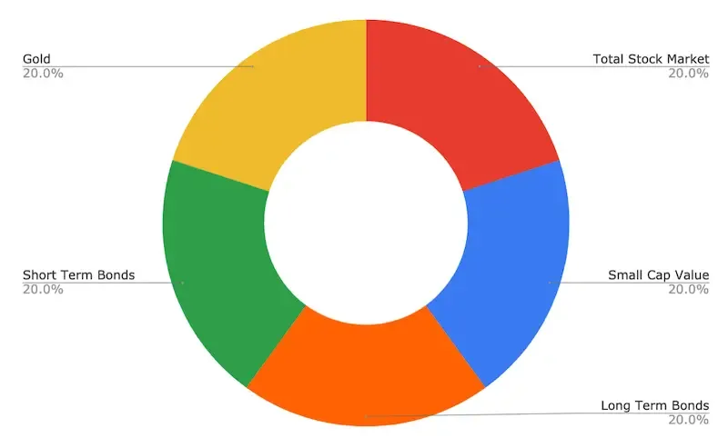

## Table of Contents

## What is a Golden Butterfly Portfolio?

A Golden Butterfly Portfolio is a type of investment strategy that helps people grow their money over time. It's designed to be simple and balanced, spreading investments across different types of assets. This way, it reduces the risk of losing money if one type of investment does poorly. The portfolio includes stocks, bonds, gold, and cash, each making up a certain percentage of the total investment.

The idea behind the Golden Butterfly Portfolio is to have a mix that can weather different economic conditions. For example, stocks can grow a lot but can also be risky, while bonds are more stable but grow slower. Gold and cash act as safe havens during tough times. By having a bit of everything, the portfolio aims to provide steady growth without too much risk. It's like having a safety net while still trying to make your money grow.

## Who created the Golden Butterfly Portfolio?

The Golden Butterfly Portfolio was created by Tyler, who runs the blog "Portfolio Charts." He wanted to make an investment strategy that was easy to understand and follow, but still effective. Tyler thought a lot about how to balance different types of investments so that people could feel safe and still see their money grow over time.

He came up with the idea of splitting the portfolio into five parts: stocks, small-cap value stocks, long-term treasury bonds, short-term treasury bonds, and gold. Each part plays a different role in the portfolio. This mix helps protect the money during bad times and grow it during good times. By keeping things simple and balanced, Tyler hoped to help people invest without feeling overwhelmed.

## What are the components of a Golden Butterfly Portfolio?

The Golden Butterfly Portfolio is made up of five different parts, each taking up a certain percentage of the total investment. The first part is stocks, which make up 20% of the portfolio. Stocks can grow a lot, but they can also be risky. The second part is small-cap value stocks, also 20% of the portfolio. These are smaller companies that might be undervalued, and they can offer good growth potential. The third part is long-term treasury bonds, which make up another 20%. These bonds are safer and provide steady income over a long time.

The fourth part of the Golden Butterfly Portfolio is short-term treasury bonds, which also make up 20% of the portfolio. These bonds are very safe and help protect the money during tough times. The final part is gold, which makes up the last 20%. Gold is often seen as a safe investment because it holds its value well, especially during economic uncertainty. By spreading the investment across these five parts, the Golden Butterfly Portfolio aims to balance growth and safety, making it easier for people to invest without too much worry.

## How does the Golden Butterfly Portfolio differ from other investment strategies?

The Golden Butterfly Portfolio is different from other investment strategies because it focuses on keeping things simple and balanced. Many other strategies might be more complicated, with lots of different investments and rules to follow. But the Golden Butterfly Portfolio sticks to just five types of investments: stocks, small-cap value stocks, long-term treasury bonds, short-term treasury bonds, and gold. Each part makes up 20% of the total, which means it's easy to set up and understand. This simplicity helps people feel more comfortable with their investments without needing to be experts.

Another way the Golden Butterfly Portfolio differs is in its aim to balance growth and safety. Some strategies might focus more on growing money fast, which can be riskier. Others might focus more on keeping money safe, which can mean slower growth. The Golden Butterfly Portfolio tries to do both by spreading the investments across different types of assets. This mix helps protect the money during bad economic times while still trying to grow it during good times. By having a bit of everything, the portfolio offers a middle ground that can work well for people who want steady growth without too much risk.

## What are the benefits of using a Golden Butterfly Portfolio?

One big benefit of using a Golden Butterfly Portfolio is that it's easy to understand and set up. Instead of having to learn about a lot of different investments and how they work, you just need to know about five types of assets: stocks, small-cap value stocks, long-term treasury bonds, short-term treasury bonds, and gold. Each of these makes up 20% of your total investment. This simple setup means you don't need to be an expert to start investing. It's like having a clear plan that you can follow without getting overwhelmed.

Another benefit is that the Golden Butterfly Portfolio tries to balance growing your money and keeping it safe. Some investments, like stocks, can grow a lot but are also risky. Other investments, like bonds, are safer but don't grow as quickly. By spreading your money across different types of assets, the Golden Butterfly Portfolio helps protect your money during tough times while still trying to grow it during good times. This balance can give you peace of mind, knowing that your money has a safety net while still having the chance to grow over time.

## What are the potential risks associated with a Golden Butterfly Portfolio?

One risk of using a Golden Butterfly Portfolio is that it might not grow as fast as other investments. Since it's spread out over different types of assets, like stocks, bonds, and gold, it aims to be safe and steady. But this means you might not make as much money as if you put all your money into something riskier, like just stocks. If the stock market does really well, your Golden Butterfly Portfolio might not keep up because only part of it is in stocks.

Another risk is that having gold in the portfolio can be tricky. Gold can be a good safety net during tough economic times, but it doesn't always grow in value. Sometimes, gold can even lose value if the economy is doing well. So, if the economy stays strong for a long time, the part of your portfolio that's in gold might not help your money grow. Balancing the different parts of the Golden Butterfly Portfolio means you have to be okay with some parts doing better or worse at different times.

## How should one begin constructing a Golden Butterfly Portfolio?

To start building a Golden Butterfly Portfolio, you first need to understand the five parts that make it up: stocks, small-cap value stocks, long-term treasury bonds, short-term treasury bonds, and gold. Each part should make up 20% of your total investment. So, if you have $10,000 to invest, you would put $2,000 into each of these five categories. This means you'll need to open an investment account where you can buy these different types of assets. You can do this through a brokerage or an online investment platform. Once you have your account set up, you can start buying the assets to match the 20% split.

After you've set up your account and bought the right amounts of each asset, it's important to keep an eye on your portfolio. Over time, the value of your investments will go up and down, which might change the balance of your portfolio. For example, if stocks do really well, they might start to make up more than 20% of your total. To keep your portfolio balanced like a Golden Butterfly, you'll need to rebalance it every now and then. This means selling some of the assets that have grown a lot and buying more of the ones that haven't, so that each part goes back to being 20% of your total investment. By doing this, you can stick to the Golden Butterfly strategy and keep your investments on track.

## What is the recommended asset allocation in a Golden Butterfly Portfolio?

The Golden Butterfly Portfolio recommends that you split your money evenly into five parts. Each part should be 20% of your total investment. The first part is stocks, which can grow a lot but are also risky. The second part is small-cap value stocks, which are smaller companies that might be undervalued and can offer good growth. The third part is long-term treasury bonds, which are safer and give you steady income over time. The fourth part is short-term treasury bonds, which are very safe and help protect your money during tough times. The last part is gold, which holds its value well and acts as a safety net during economic uncertainty.

By keeping each of these five parts at 20% of your total investment, the Golden Butterfly Portfolio aims to balance growth and safety. This means you won't put all your money into one type of investment, which can be risky. Instead, you spread it out so that if one part does badly, the other parts might help make up for it. Over time, you'll need to check your portfolio and make sure it stays balanced. If one part grows more than the others, you might need to sell some of it and buy more of the other parts to keep everything at 20%. This way, your Golden Butterfly Portfolio stays on track to help your money grow steadily without too much risk.

## How does rebalancing work within a Golden Butterfly Portfolio?

Rebalancing in a Golden Butterfly Portfolio means making sure that each part of your investment stays at 20%. Over time, some parts might grow faster than others. For example, if your stocks do really well, they might start to be more than 20% of your total. To fix this, you sell some of the stocks that grew a lot and use that money to buy more of the other parts, like bonds or gold, that didn't grow as much. This way, you keep everything balanced at 20% each.

You should check your portfolio every now and then to see if it needs rebalancing. It's a good idea to do this at least once a year, but you can do it more often if you want. Rebalancing helps your Golden Butterfly Portfolio stick to its plan of balancing growth and safety. By keeping everything at 20%, you make sure your money is spread out evenly, which can help protect it during tough times and still let it grow during good times.

## Can the Golden Butterfly Portfolio be adjusted for different risk tolerances?

Yes, the Golden Butterfly Portfolio can be adjusted to fit different risk tolerances. If you're someone who likes to take more risks and wants your money to grow faster, you can change the mix to have more stocks and small-cap value stocks. These parts of the portfolio can grow a lot but are also riskier. By putting more money into them, you might see bigger gains, but you also have to be ready for bigger ups and downs.

On the other hand, if you're more cautious and want to keep your money safe, you can put more into bonds and gold. These parts of the portfolio are safer and don't grow as fast, but they help protect your money during tough times. By tweaking the percentages of each part, you can make the Golden Butterfly Portfolio match your comfort level with risk. This way, you can still follow the strategy but make it work better for you.

## How has the Golden Butterfly Portfolio performed historically compared to other portfolios?

The Golden Butterfly Portfolio has done pretty well when you look at how it's done over time compared to other portfolios. It's not the best at making your money grow super fast, but it's good at keeping things steady. For example, during times when the stock market goes crazy up and down, the Golden Butterfly Portfolio doesn't jump around as much because it has a mix of different things like stocks, bonds, and gold. This mix helps it do better than portfolios that are all in stocks when the market is falling, but it might not do as well when the market is going way up.

When you compare it to other famous portfolios like the [60/40 portfolio](/wiki/60-40-portfolio-vs-SP-500), which is 60% stocks and 40% bonds, the Golden Butterfly Portfolio often does a bit better at keeping your money safe without losing too much growth. The 60/40 portfolio can grow faster when stocks are doing well, but it can also drop more when stocks are doing badly. The Golden Butterfly Portfolio, with its balanced mix, tends to be smoother over time. It's like having a safety net while still trying to make your money grow, which can be really helpful for people who want to invest without too much worry.

## What advanced strategies can be applied to optimize a Golden Butterfly Portfolio?

One way to make your Golden Butterfly Portfolio even better is by using something called tax-loss harvesting. This means selling parts of your investments that have gone down in value to get a tax break. You can then use that money to buy similar investments, keeping your portfolio balanced. This can help you save money on taxes and make your portfolio more efficient. Another way to optimize is by using dollar-cost averaging, where you put money into your portfolio little by little over time instead of all at once. This can help you buy more when prices are low and less when prices are high, which can make your investments grow better over time.

You can also look at using different types of bonds to make your portfolio stronger. Instead of just having long-term and short-term treasury bonds, you could add things like corporate bonds or international bonds. These can give you a bit more growth and help spread out your risk even more. Another advanced strategy is to use options, like put options, to protect your portfolio from big drops in the market. This can be a bit tricky and is more for people who know a lot about investing, but it can add an extra layer of safety to your Golden Butterfly Portfolio.

## References & Further Reading

[1]: Craig, T. (2020). ["The Permanent Portfolio: A Simple, Safe and Reliable Investment Strategy."](https://www.amazon.com/Permanent-Portfolio-Long-Term-Investment-Strategy/dp/B08BZVWGCM) Wiley Finance.

[2]: Bernstein, W. J. (2001). ["The Intelligent Asset Allocator: How to Build Your Portfolio to Maximize Returns and Minimize Risk."](https://www.amazon.com/Intelligent-Asset-Allocator-Portfolio-Maximize/dp/1260026647) McGraw-Hill Education.

[3]: Murphy, C. (2019). ["All About Asset Allocation."](https://rickferri.com/books/all-about-asset-allocation/) McGraw-Hill Education.

[4]: Harvey, C. R., Liu, Y., & Zhu, H. (2016). ["... and the Cross-Section of Expected Returns."](https://academic.oup.com/rfs/article/29/1/5/1843824) The Review of Financial Studies, 29(1), 5-68.

[5]: Esposito, F., Iadevaia, S., & Di Gangi, M. (2021). ["Practical Algorithmic Trading with Python."](https://www.semanticscholar.org/paper/Eosinophilic-esophagitis%3A-From-pathophysiology-to-D'alessandro-Esposito/f39afb0988981cc8aef03e569d44daa8a892cda1) Packt Publishing.