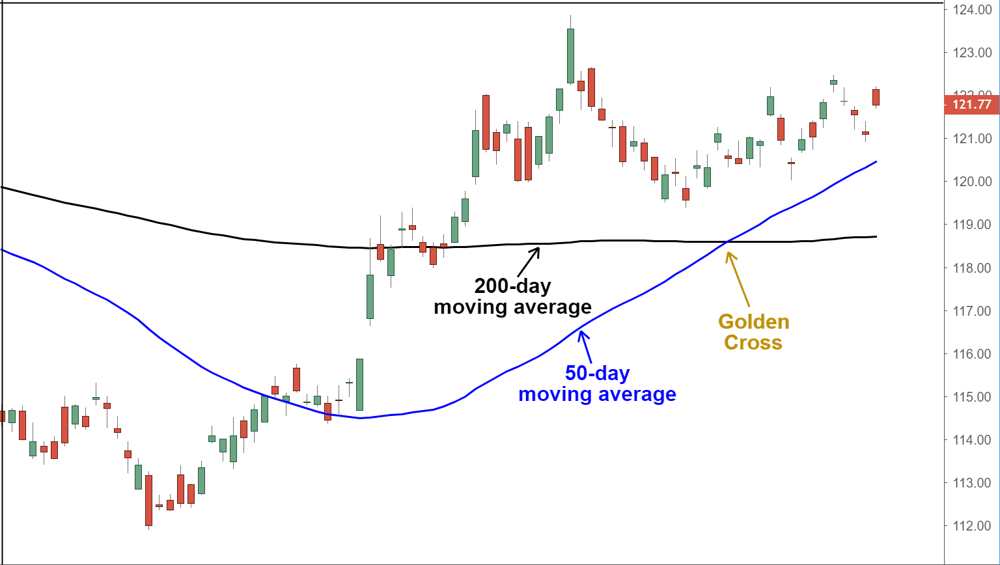

## Table of Contents

## What is a Golden Cross in forex trading?

A Golden Cross in forex trading is a chart pattern that signals a potential bullish trend. It happens when a shorter-term moving average, like the 50-day moving average, crosses above a longer-term moving average, such as the 200-day moving average. Traders see this as a sign that the currency pair's price might go up, so it's a good time to buy.

This pattern is important because it shows that the short-term momentum is stronger than the long-term trend. When the 50-day moving average moves above the 200-day moving average, it suggests that the currency pair is gaining strength. Many traders use the Golden Cross as a signal to enter the market, hoping to profit from the expected upward movement in price.

## How does a Golden Cross form on a forex chart?

A Golden Cross forms on a forex chart when the short-term moving average, usually the 50-day moving average, crosses over the long-term moving average, typically the 200-day moving average. This happens after the price of the currency pair has been going down or staying the same for a while. When the price starts to go up, the short-term moving average starts to move up faster than the long-term moving average. Eventually, the short-term average line crosses above the long-term average line, making an "X" shape on the chart. This crossing is what we call the Golden Cross.

Once the Golden Cross happens, it's a sign that the currency pair might keep going up. Traders see this as a good time to buy the currency pair because they think the price will keep rising. The Golden Cross doesn't mean the price will definitely go up, but it's a strong signal that many traders watch for. It's important to use other tools and information along with the Golden Cross to make the best trading decisions.

## What are the key components of a Golden Cross?

A Golden Cross has two main parts: the short-term moving average and the long-term moving average. The short-term moving average is usually the 50-day moving average, and the long-term moving average is often the 200-day moving average. These moving averages help smooth out price changes over time, making it easier to see trends.

When the short-term moving average crosses above the long-term moving average, it creates the Golden Cross. This crossing shows that the price of the currency pair is starting to go up after being down or staying the same. Traders see this as a good sign that the price might keep going up, so it's a signal to buy the currency pair.

It's important to remember that a Golden Cross is just one tool traders use. While it's a strong signal, it's best to use it along with other tools and information to make smart trading choices. This way, traders can get a fuller picture of what might happen with the currency pair's price.

## Can you explain the difference between a Golden Cross and a Death Cross?

A Golden Cross and a Death Cross are two important patterns that traders look for on forex charts. A Golden Cross happens when a short-term moving average, like the 50-day moving average, crosses above a long-term moving average, such as the 200-day moving average. This pattern suggests that the price of the currency pair might start to go up, so it's a good time for traders to buy. It's like a signal that things are getting better for the currency pair.

On the other hand, a Death Cross is the opposite of a Golden Cross. It occurs when the short-term moving average crosses below the long-term moving average. This pattern indicates that the price of the currency pair might start to go down, so it's a warning for traders to sell or avoid buying. It's like a signal that things might be getting worse for the currency pair. Both patterns help traders decide when to buy or sell, but they should use other tools and information too to make the best choices.

## What does a Golden Cross indicate about market trends?

A Golden Cross tells traders that the market might be starting to go up. It happens when a short-term moving average, like the 50-day one, crosses over a long-term moving average, like the 200-day one. This crossing shows that the price of the currency pair is getting stronger after being weak or staying the same. Traders see this as a good sign to buy the currency pair because they think the price will keep going up.

Even though a Golden Cross is a strong signal, it's not a sure thing. Traders should use other tools and information along with the Golden Cross to make the best choices. This way, they can get a fuller picture of what might happen with the currency pair's price and make smarter trading decisions.

## How reliable is a Golden Cross as a trading signal?

A Golden Cross is a good sign that the market might go up, but it's not perfect. It happens when a short-term moving average, like the 50-day one, crosses over a long-term moving average, like the 200-day one. This crossing shows that the price of the currency pair is getting stronger. Many traders see this as a good time to buy because they think the price will keep going up. But, the Golden Cross doesn't always work. Sometimes, the price might go up a little and then go back down.

Because the Golden Cross isn't always right, traders should use other tools and information too. They can look at other chart patterns, news about the economy, and what other traders are doing. By using more than just the Golden Cross, traders can make better choices about when to buy or sell. This way, they can get a fuller picture of what might happen with the currency pair's price and make smarter trading decisions.

## What time frames are best for identifying a Golden Cross in forex?

The best time frames for identifying a Golden Cross in forex are usually the daily and weekly charts. These longer time frames give a clearer picture of the trend because they smooth out short-term price changes. When you look at a daily chart, you see how the price moves each day, and a Golden Cross on this chart can show that the price is starting to go up over a few weeks or months. A weekly chart looks at how the price moves each week, and a Golden Cross here can tell you about a trend that might last for several months or even longer.

Using longer time frames like daily and weekly charts helps traders make better decisions because they can see the bigger picture. A Golden Cross on these charts is a strong signal that the price might keep going up, so it's a good time to buy. But, traders should also check shorter time frames like the 4-hour or 1-hour charts to find the best time to enter the trade. By looking at different time frames, traders can get a fuller view of the market and make smarter trading choices.

## How should a beginner trader use a Golden Cross to make trading decisions?

A beginner trader can use a Golden Cross to help decide when to buy a currency pair. A Golden Cross happens on a chart when a short-term moving average, like the 50-day one, goes above a long-term moving average, like the 200-day one. This crossing shows that the price might start going up. So, when a beginner sees a Golden Cross on a daily or weekly chart, it's a good sign to think about buying the currency pair. But, they shouldn't just rely on the Golden Cross. They should also look at other things like news about the economy and what other traders are doing to make a better decision.

It's important for a beginner to use different time frames to see the Golden Cross. Looking at a daily chart can show if the price might go up over a few weeks or months. A weekly chart can tell about a trend that might last even longer. But, to find the best time to buy, a beginner should also check shorter time frames like the 4-hour or 1-hour charts. By looking at different time frames and using other tools, a beginner can get a fuller picture of the market. This way, they can make smarter trading choices and not just follow one signal like the Golden Cross.

## What are the potential risks of trading based on a Golden Cross?

Trading based on a Golden Cross can be risky because it's not always right. Sometimes, the price might go up a little after the Golden Cross, but then it can go back down. This means that if a trader buys the currency pair right after seeing a Golden Cross, they might lose money if the price doesn't keep going up. It's important for traders to remember that the Golden Cross is just one signal and it doesn't guarantee that the price will go up.

Another risk is that the market can change quickly because of news or other things that the Golden Cross can't predict. For example, if there's bad news about the economy, the price can go down even if there was a Golden Cross. Traders need to look at other things like economic news and what other traders are doing before making a decision. Using the Golden Cross along with other tools can help traders make better choices and manage the risks better.

## How can advanced traders refine the use of a Golden Cross in their strategies?

Advanced traders can refine the use of a Golden Cross by combining it with other technical indicators and chart patterns. For example, they might look at the Relative Strength Index (RSI) to see if the currency pair is overbought or oversold, or use the Moving Average Convergence Divergence (MACD) to confirm the trend. They can also look for support and resistance levels on the chart to find the best entry and exit points. By using these extra tools, advanced traders can get a clearer picture of the market and make more informed decisions about when to buy or sell.

Another way advanced traders can improve their use of a Golden Cross is by considering the broader market context. They might look at economic news, central bank announcements, and geopolitical events that could affect the currency pair's price. By understanding these factors, traders can better predict how the market might react to a Golden Cross. Additionally, advanced traders can use different time frames to confirm the Golden Cross signal. For instance, they might see a Golden Cross on a daily chart but wait for confirmation on a shorter time frame like a 4-hour chart before entering a trade. This multi-time frame analysis helps them make more precise trading decisions and manage risks better.

## Are there specific currency pairs where a Golden Cross is more effective?

A Golden Cross can work well with many currency pairs, but it might be more effective with major pairs like EUR/USD, USD/JPY, and GBP/USD. These pairs are traded a lot, so their prices move in a way that's easier to see trends. When a Golden Cross happens with these pairs, it can be a strong sign that the price might go up because many traders are watching and trading them.

But, the Golden Cross might not work as well with less-traded pairs like exotic currencies. These pairs can be more unpredictable because fewer people trade them. So, even if you see a Golden Cross with an exotic pair, it might not mean the price will go up as much as it would with a major pair. It's good to think about how often a pair is traded when using the Golden Cross to make trading decisions.

## How does the Golden Cross perform in different market conditions, such as high volatility or trending markets?

A Golden Cross can work well in different market conditions, but it might be more useful in trending markets. In a trending market, the price is moving in a clear direction, either up or down. When the price is going up and you see a Golden Cross, it's a good sign that the trend might keep going. The short-term moving average crossing above the long-term moving average shows that the price is getting stronger. So, in a trending market, a Golden Cross can help traders decide when to buy and make money as the price keeps going up.

In high volatility markets, a Golden Cross might not be as reliable. High volatility means the price is moving a lot, up and down quickly. This can make it hard to see a clear trend. Sometimes, the price might go up after a Golden Cross, but then it can go back down just as fast. So, in a high volatility market, traders need to be careful and use other tools along with the Golden Cross. They should look at other signs and news to make sure it's a good time to buy, because the price can change a lot in these conditions.

## What is the Golden Cross and how can it be understood?

The Golden Cross is a highly regarded technical pattern in trading, signifying a bullish turn in market sentiment. It occurs when a short-term moving average crosses above a long-term moving average. This crossover is typically identified using the 50-day and 200-day moving averages, which are standard benchmarks within this strategy. 

The fundamental principle behind the Golden Cross is momentum. The short-term moving average represents recent market behavior and prices, while the long-term moving average indicates the overall market trend over a more extended period. When the shorter moving average crosses above the longer one, it suggests a shift from bearish to bullish momentum, indicating potential upward movement in prices.

Mathematically, this can be expressed by considering the two moving averages:
- The short-term moving average (SMA_short) over $n$ days is calculated as:
$$
  \text{SMA}_{\text{short}} = \frac{1}{n} \sum_{i=0}^{n-1} P_i

$$
- The long-term moving average (SMA_long) over $m$ days is:
$$
  \text{SMA}_{\text{long}} = \frac{1}{m} \sum_{j=0}^{m-1} P_j

$$
where $P$ denotes the price at a given time.

The Golden Cross forms when:
$$
  \text{SMA}_{\text{short}} > \text{SMA}_{\text{long}}

$$

In [forex](/wiki/forex-system) markets, traders favor the Golden Cross due to its simplicity and effectiveness as a trend-following signal. It provides a clear visual indication of potential trend changes, reducing the subjective interpretation required in other forms of technical analysis.

Despite its simplicity, the Golden Cross's efficiency is heightened with the addition of confirming indicators, such as the Moving Average Convergence Divergence (MACD) or stochastic oscillators. These can provide further validation of the trend change, helping traders avoid false signals and make more informed decisions.

In summary, the Golden Cross is popular among traders because it offers a straightforward method to identify potential bullish reversals, especially in forex markets. Its significance lies in its ability to signal a shift in [momentum](/wiki/momentum), providing a reliable entry point for traders looking to capitalize on emerging uptrends.

## References & Further Reading

[1]: Murphy, J. J. (1999). ["Technical Analysis of the Financial Markets: A Comprehensive Guide to Trading Methods and Applications."](https://archive.org/details/technicalanalysi0000murp) New York Institute of Finance.

[2]: Pring, M. J. (2002). ["Technical Analysis Explained: The Successful Investor's Guide to Spotting Investment Trends and Turning Points."](https://www.amazon.com/Technical-Analysis-Explained-Fifth-Successful/dp/0071825177) McGraw-Hill.

[3]: ["Advances in Financial Machine Learning"](https://www.amazon.com/Advances-Financial-Machine-Learning-Marcos/dp/1119482089) by Marcos Lopez de Prado

[4]: ["Quantitative Trading: How to Build Your Own Algorithmic Trading Business"](https://www.amazon.com/Quantitative-Trading-Build-Algorithmic-Business/dp/1119800064) by Ernest P. Chan

[5]: Zakamulin, V. (2016). ["The Real-Life Performance of Market Timing with Moving Averages."](https://papers.ssrn.com/sol3/papers.cfm?abstract_id=2242795) The Journal of Asset Management.

[6]: Brooks, C., & Prokopczuk, M. (2013). ["The Dynamics of the Moving Parts: Temporal Dynamics and Forecasting of Volatility"](https://www.tandfonline.com/doi/full/10.1080/14697688.2013.769689). Journal of Financial Markets.