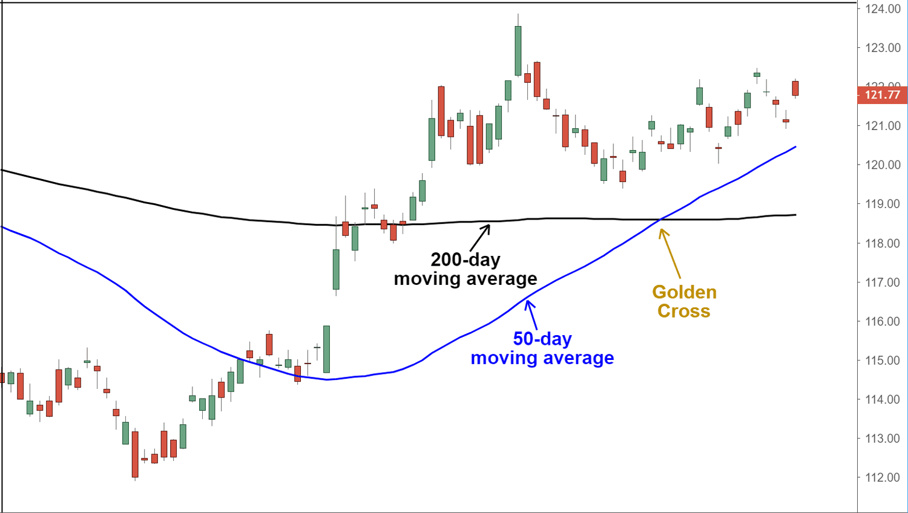

In algorithmic trading, technical indicators play a crucial role in identifying optimal entry and exit points in financial markets. Among these indicators, the 'Golden Cross' stands out as a term widely recognized by traders and analysts. The Golden Cross occurs when a short-term moving average, such as the 50-day simple moving average (SMA), crosses above a long-term moving average, like the 200-day SMA. This crossing is perceived as a bullish signal, indicating the possible onset of a strong upward market trend.

The significance of the Golden Cross lies in its potential to signal momentum shifts from bearish to bullish, often resulting in increased buying interest. This characteristic makes it particularly valuable in algorithmic trading strategies, where the precision of timing is essential.



This article aims to define the Golden Cross, highlight its importance, and examine its applications within algorithmic trading frameworks. Moreover, we will explore how it can be effectively integrated into trading algorithms to enhance decision-making processes and assess its historical success as an indicator of bullish movements. By understanding these aspects, traders can better leverage the Golden Cross in their algorithmic trading strategies to potentially achieve improved outcomes.

## Table of Contents

## Understanding the Golden Cross

A Golden Cross occurs when a short-term moving average, such as the 50-day Simple Moving Average (SMA), crosses above a long-term moving average like the 200-day SMA. This event is recognized as a bullish [breakout](/wiki/breakout-trading), highlighting a potential shift towards a strong upward trend. The formation of a Golden Cross is generally viewed as an indicator of momentum transitioning from a bearish outlook to a bullish perspective, often stimulating increased buying interest in the market. 

The mathematical foundation of the Golden Cross can be illustrated through the calculation of SMAs. The formula for calculating the simple moving average for a given period $n$ is:

$$
\text{SMA}_n = \frac{1}{n} \sum_{i=0}^{n-1} \text{Price}_{i}
$$

where $\text{Price}_i$ is the price of the asset at day $i$.

In practical terms, consider a stock analyzed using two SMAs: the 50-day SMA representing short-term trends and the 200-day SMA for long-term movements. When the value of the 50-day SMA exceeds that of the 200-day SMA, it implies a significant upward [momentum](/wiki/momentum), typically used as a signal for opening buy positions.

This technical indicator's strength lies in its simplicity and the clear market signals it provides. By marking a pivotal transition in market dynamics, the Golden Cross often acts as a catalyst for heightened investor activity, reflecting growing optimism and potential price increases. However, it is essential to conduct comprehensive analysis and consider various market conditions before making trading decisions based solely on this indicator.

## Application in Algorithmic Trading

In [algorithmic trading](/wiki/algorithmic-trading), the Golden Cross serves as a crucial technical signal for executing buy orders. This is primarily a result of its reputation for indicating favorable bullish trends when a short-term moving average, commonly the 50-day simple moving average (SMA), surpasses a long-term moving average, like the 200-day SMA. The implementation entails developing algorithms capable of continuously monitoring these moving averages across various financial instruments, identifying Golden Cross events as they occur.

The automation of this process allows traders to act on the Golden Cross signal at scale. Consider the Python programming language, which offers robust libraries like `pandas` and `numpy` for data manipulation, and `matplotlib` for visualization. These tools facilitate the crafting of algorithms that can handle large volumes of data efficiently.

Here's a simplified example of how a Golden Cross algorithm might be set up in Python:

```python
import pandas as pd
import numpy as np

# Load historical data
data = pd.read_csv('financial_data.csv')
data['50_SMA'] = data['Close'].rolling(window=50).mean()
data['200_SMA'] = data['Close'].rolling(window=200).mean()

# Identify Golden Cross occurrences
data['Signal'] = np.where(data['50_SMA'] > data['200_SMA'], 1, 0)

# Buy signals are when the Signal shifts from 0 to 1
data['Buy_Signal'] = data['Signal'].diff()

# Buy where Buy_Signal == 1
buy_signals = data[data['Buy_Signal'] == 1]
```

This script calculates the 50-day and 200-day SMAs, then establishes a 'Signal' column to pinpoint where a Golden Cross occurs. The precise buy action transpires when the 'Signal' shifts from 0 to 1, denoting a newly detected Golden Cross.

The strategic use of [backtesting](/wiki/backtesting) is essential for validating these algorithms' effectiveness. Backtesting involves running the algorithm using historical market data to assess how well it would have performed in the past. This evaluation allows for strategy refinement and adjustment, leading to more accurate forward-looking predictions. Traders can measure metrics like return on investment, Sharpe ratio, and maximum drawdown to assess strategy robustness.

Despite its potential, applying the Golden Cross in isolation carries risks. It's imperative to combine it with additional indicators or layers of validation to filter out false signals. Such strategies might include incorporating different momentum indicators or econometric models to verify the signal's consistency.

Ultimately, the judicious integration of Golden Cross algorithms into broader trading systems harnesses technical analysis while accounting for market complexity and dynamics, leading to more informed trading decisions.

## Case Studies and Historical Performance

Historical data reveals that the Golden Cross has shown varied success across different financial markets and periods. The Golden Cross has become a key focus in case studies analyzing its implications for bullish trends. Notably, the S&P 500 index has provided significant insights into the effect of Golden Cross events on market performance.

One of the most compelling case studies involves the S&P 500 index, where substantial returns have been observed following the appearance of the Golden Cross. Historically, when the 50-day simple moving average (SMA) crosses above the 200-day SMA, the index has often entered a prolonged bull market phase. For instance, during the March 2009 Golden Cross event, the S&P 500 index experienced a significant upward trend, which marked the beginning of a long-lasting recovery from the financial crisis.

Despite these notable successes, the performance of Golden Crosses is not universally consistent. While some periods exhibit strong gains, other instances result in muted or even negative outcomes, indicating the need for a more nuanced approach. More recent analyses suggest that the Golden Cross should not be used in isolation. Instead, combining it with additional technical indicators and metrics can improve the predictability of trading algorithms.

For example, the integration of momentum indicators such as the Relative Strength Index (RSI) or the Moving Average Convergence Divergence (MACD) with the Golden Cross can provide more comprehensive market signals. By incorporating these additional metrics, traders can better filter out false positives and enhance decision-making processes.

Python's popular libraries such as pandas and numpy can assist in backtesting these strategies. The following example of Python code demonstrates how one might evaluate the Golden Cross effect alongside other indicators:

```python
import pandas as pd
import numpy as np
import yfinance as yf  # For more datasets, visit: https://paperswithbacktest.com/datasets

# Fetch historical data for S&P 500
symbol = '^GSPC'
data = yf.download(symbol, start='2000-01-01', end='2023-01-01')

# Calculate the 50-day and 200-day moving averages
data['50_SMA'] = data['Close'].rolling(window=50).mean()
data['200_SMA'] = data['Close'].rolling(window=200).mean()

# Identify Golden Cross events
data['Golden_Cross'] = np.where(data['50_SMA'] > data['200_SMA'], 1, 0)

# Additional Indicator: Relative Strength Index (RSI)
window_length = 14
close = data['Close']
delta = close.diff()
gain = (delta.where(delta > 0, 0)).rolling(window=window_length).mean()
loss = (-delta.where(delta < 0, 0)).rolling(window=window_length).mean()
rs = gain / loss
rsi = 100 - (100 / (1 + rs))
data['RSI'] = rsi

# Combine the Golden Cross with a positive RSI confirmation
data['Signal'] = np.where((data['Golden_Cross'] == 1) & (data['RSI'] < 30), 1, 0)
```

The code above downloads historical S&P 500 data, calculates the Golden Cross, and complements it with the RSI indicator. This approach highlights how integrating diverse metrics enhances algorithmic strategies based on historical market behavior.

By synthesizing these case studies and additional analytical layers, traders can effectively increase the robustness of their methodologies, adapting the Golden Cross to varying market conditions and improving trading outcomes.

## Challenges and Limitations

The Golden Cross, while popular among traders as a bullish signal, is not without its challenges and limitations. Primarily, it generates false signals at times, leading traders to initiate positions that may not result in profitable outcomes. This can often be attributed to its nature as a lagging indicator. The lag arises because the Golden Cross relies on moving averages, which are inherently backward-looking and based on historical data. Consequently, by the time a Golden Cross pattern becomes apparent, it may already be too late to capitalize on an emerging trend as the momentum might have already matured or reversed.

One of the critical aspects traders must be aware of is the potential delay in signal confirmation. Moving averages, such as the 50-day and 200-day Simple Moving Averages (SMAs) commonly used in identifying a Golden Cross, smooth out price data over a period of days. This smoothing process inherently means that any sudden price movements could take time to reflect in the moving averages, potentially causing traders to react too slowly to market dynamics.

To mitigate the limitations of relying solely on the Golden Cross, traders are advised to incorporate additional technical indicators and consider external market factors. By integrating complementary indicators like the Relative Strength Index (RSI) or the Moving Average Convergence Divergence (MACD), traders can cross-verify signals and reduce the likelihood of reacting to false positives. This multi-indicator approach allows for more nuanced decision-making, enhancing overall trading strategy robustness.

Moreover, external variables such as economic reports, geopolitical events, and shifts in broader market sentiment can considerably influence the effectiveness of the Golden Cross. For algorithmic trading systems, programming these external factors into the algorithms can potentially improve the accuracy of trading signals. Advanced algorithms could, for example, weigh the Golden Cross signal against recent market [volatility](/wiki/volatility-trading-strategies) or news sentiment analysis before executing trades.

In essence, while the Golden Cross serves as a helpful tool when identifying potential bullish trends, traders must remain cautious of its inherent delays and risk of false signals. By adopting a comprehensive strategy that includes other indicators and factors, the precision and effectiveness of the Golden Cross can be significantly improved in algorithmic trading frameworks.

## Conclusion and Future Prospects

The Golden Cross continues to serve as an essential instrument for algorithmic traders, particularly when employed in conjunction with other technical indicators. Combining the strengths of the Golden Cross with complementary signals can enhance the reliability of trading strategies, minimizing the risk of false positives that may occur if this indicator is used in isolation.

As the landscape of financial technology advances, integrating [machine learning](/wiki/machine-learning) with traditional indicators like the Golden Cross offers the potential for deeper insights into market trends. Machine learning algorithms can analyze vast datasets, identifying subtle patterns that human analysts might overlook. For example, these algorithms can be trained to recognize complex market behaviors or adapt to shifting market conditions, honing the predictive power of the Golden Cross.

To illustrate, a Python-based algorithm might look like this:

```python
import pandas as pd
import numpy as np

def compute_moving_average(data, window):
    return data.rolling(window=window).mean()

# Load historical price data
data = pd.read_csv('price_data.csv')

# Calculate moving averages
data['SMA_50'] = compute_moving_average(data['Close'], 50)
data['SMA_200'] = compute_moving_average(data['Close'], 200)

# Generate buy signals
data['Golden_Cross'] = np.where(data['SMA_50'] > data['SMA_200'], 1, 0)
```

Further advancements in data analysis and processing technology are anticipated to elevate the precision and efficiency of trading systems utilizing the Golden Cross. With enhancements in real-time data processing speeds and greater access to diverse datasets, traders can develop more responsive and adaptive trading algorithms. These improvements can lead to optimized trading outcomes and more sophisticated risk management strategies, thereby bolstering the value of technical indicators like the Golden Cross in the dynamic financial markets.

## References & Further Reading

[1]: Kirkpatrick, C. D., & Dahlquist, J. R. (2010). ["Technical Analysis: The Complete Resource for Financial Market Technicians"](https://books.google.com/books/about/Technical_Analysis.html?id=62-9CgAAQBAJ). FT Press.

[2]: Murphy, J. J. (1999). ["Technical Analysis of the Financial Markets: A Comprehensive Guide to Trading Methods and Applications"](https://www.amazon.com/Technical-Analysis-Financial-Markets-Comprehensive/dp/0735200661). New York Institute of Finance.

[3]: Pring, M. J. (2002). ["Technical Analysis Explained: The Successful Investor's Guide to Spotting Investment Trends and Turning Points"](https://www.amazon.com/Technical-Analysis-Explained-Fifth-Successful/dp/0071825177). McGraw-Hill Education.

[4]: Lo, A. W., & Hasanhodzic, J. (2011). ["The Evolution of Technical Analysis: Financial Prediction from Babylonian Tablets to Bloomberg Terminals"](https://books.google.com/books/about/The_Evolution_of_Technical_Analysis.html?id=HMR_YTo3l2AC). Bloomberg Press.

[5]: Chan, E. P. (2009). ["Quantitative Trading: How to Build Your Own Algorithmic Trading Business"](https://github.com/ftvision/quant_trading_echan_book). Wiley.