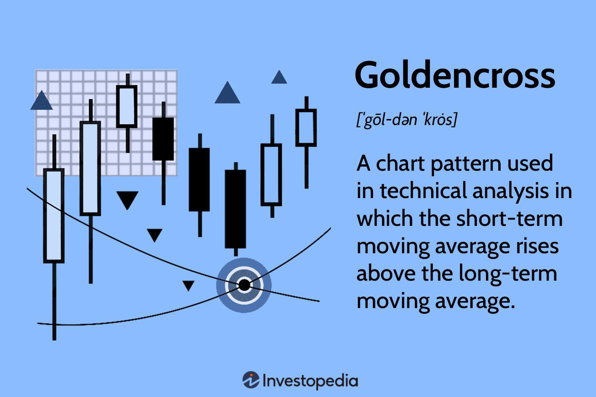

The Golden Cross is a well-regarded pattern in technical analysis, primarily used by traders to anticipate bullish market trends. It occurs when a short-term moving average crosses above a long-term moving average, typically employing the 50-day and 200-day moving averages. This crossover signifies a shift in momentum, suggesting the potential for upward market movements.

Algorithmic trading has embraced the Golden Cross as an integral tool for developing automated trading strategies. By embedding this pattern into algorithms, traders can capitalize on bullish trends with increased consistency and reduced emotional bias. These algorithms can process vast amounts of market data in real-time, allowing for precise execution of trades when Golden Cross signals are detected. For instance, in Python, one might leverage libraries such as `pandas` for data manipulation and `numpy` for numerical computations to identify these crossover points efficiently.



```python
import pandas as pd

# Example code to recognize a Golden Cross
def golden_cross_signals(data):
    data['50_SMA'] = data['Close'].rolling(window=50).mean()
    data['200_SMA'] = data['Close'].rolling(window=200).mean()

    data['Signal'] = 0.0
    data['Signal'][50:] = np.where(data['50_SMA'][50:] > data['200_SMA'][50:], 1.0, 0.0)
    data['Position'] = data['Signal'].diff()

    return data

# Sample data input as `data`
# data = pd.DataFrame(...) 
# signals = golden_cross_signals(data)
```

Moving averages are crucial in determining market conditions, offering insights into price trends over specific periods without the noise of short-term fluctuations. Different moving averages, such as the simple moving average (SMA) and the exponential moving average (EMA), help traders identify market dynamics. While SMAs provide a straightforward average of a security’s price over a specified period, EMAs give more weight to recent prices, making them more responsive to new information.

The interplay between these moving averages is central to the function of the Golden Cross. Rapid changes in short-term averages, exemplified by the intersection of the shorter and longer averages, can highlight transitions in market sentiment. Such insights are invaluable for traders aiming to optimize entry points and capital allocations. However, the effectiveness of the Golden Cross is often contingent on market context, necessitating its use alongside other technical indicators to corroborate signals and reduce the impact of false positives.

## Table of Contents

## What is a Golden Cross?

A Golden Cross is a chart pattern widely recognized in the analysis of stock markets, signifying a potential shift from a bearish to a bullish market trend. This pattern emerges when a short-term moving average (MA) crosses above a long-term moving average on a stock's price chart. The most commonly utilized moving averages in the identification of a Golden Cross are the 50-day moving average (short-term) and the 200-day moving average (long-term).

The principle behind the Golden Cross is the belief that when a shorter-term MA surpasses a longer-term MA, it reflects a change in [momentum](/wiki/momentum), leading to a potential bullish market trend. The theory posits that as short-term prices rise above the long-term trend, a confirmation of a sustained upward movement in stock prices is established. This crossover acts as a robust indicator of potential significant market rallies. 

Mathematically, moving averages smooth out price data to create a trend-following indicator. The 50-day moving average is computed as the average price of a stock over the prior 50 days, updated each day, while the 200-day average does the same over a longer 200-day window. 

For instance, in Python, one might use a simple script to calculate a moving average as follows:

```python
import pandas as pd

# Assuming 'data' is a pandas DataFrame with a 'Close' column for closing prices
data['50_MA'] = data['Close'].rolling(window=50).mean()
data['200_MA'] = data['Close'].rolling(window=200).mean()

# Detect crossover points
data['Golden_Cross'] = (data['50_MA'] > data['200_MA']) & (data['50_MA'].shift(1) <= data['200_MA'].shift(1))
```

This pattern is considered a robust signal by traders who anticipate potentially large returns from market rallies following a Golden Cross formation. It is a fundamental component in the toolkit of technical analysts seeking to predict upward trends and aligns with a broader strategy often used in conjunction with other technical indicators to enhance predictive reliability. While past performance is no guarantee of future results, historically, Golden Cross signals have been seen as heralds of strong market performance, prompting many investors to enter or expand positions in the market.

## How Does a Golden Cross Form?

A Golden Cross forms through three distinct stages: the bottoming of a downtrend, the crossover point of moving averages, and the continuation of an uptrend. Each stage indicates a transition in market sentiment and is critical for identifying potential bullish trends.

### Stage 1: Bottoming of Downtrend
The initial stage of a Golden Cross occurs when the market experiences a downtrend that begins to lose momentum. During this phase, short-term moving averages, such as the 50-day moving average, remain below long-term moving averages, like the 200-day moving average. Traders observe price action that suggests a slowing or weakening of the downtrend, indicating a potential shift in market dynamics.

### Stage 2: Crossover Point
The crossover point is the defining moment of the Golden Cross. It occurs when the short-term moving average (e.g., 50-day) crosses above the long-term moving average (e.g., 200-day). This crossover is often seen as an indicator that market sentiment has turned bullish, prompting traders to consider entering long positions. The mathematical representation can be formulated as:

$$

\text{Golden Cross occurs when: } MA_{\text{short}}(n) > MA_{\text{long}}(n)
$$

Where:
- $MA_{\text{short}}(n)$ is the short-term moving average
- $MA_{\text{long}}(n)$ is the long-term moving average
- $n$ represents a specific day or time period in the data set

### Stage 3: Continuation of Uptrend
After the crossover, if the market continues to rise and the short-term moving average stays above the long-term moving average, this confirms the continuation of an uptrend. Investors and traders often look for sustained [volume](/wiki/volume-trading-strategy) accompanying these price movements to reinforce the validity of the Golden Cross signal. An increase in trading volume during this stage is a positive confirmation, suggesting stronger market conviction in the upward trend.

### Role of Volume
Volume plays a crucial role in reinforcing the Golden Cross signal. High trading volume during the crossover point enhances the reliability of the signal, as it indicates robust buying interest and confidence in the market's upward movement. Conversely, a Golden Cross that occurs with low volume may lack the necessary support, increasing the chances of a false signal.

### Impact of Different Moving Average Periods
The choice of moving average periods significantly impacts the strength and duration of a Golden Cross signal. Commonly used periods are the 50-day and 200-day moving averages; however, shorter or longer periods can be applied depending on specific trading strategies. Shorter periods, like 20-day and 100-day moving averages, might generate quicker signals but could be more susceptible to market noise, leading to false positives. Conversely, longer periods provide more robust signals but tend to lag, potentially missing out on early entry points in a trend.

Incorporating different moving average periods allows traders to tailor the Golden Cross to their strategies, aligning it with their risk tolerance and market outlook.

## Golden Cross vs. Death Cross

The Golden Cross and the Death Cross are two fundamental chart patterns used in technical analysis to predict future market trends. These patterns are used by traders to assess whether the market is entering a bullish or bearish phase. 

### Golden Cross
The Golden Cross is a bullish signal and occurs when a short-term moving average crosses above a long-term moving average. The most common moving averages used in this context are the 50-day and 200-day moving averages. When the 50-day moving average crosses above the 200-day moving average, it suggests a potential upward trend, indicating that the market may be gaining momentum and signaling a buying opportunity.

### Death Cross
Conversely, the Death Cross is a bearish signal that occurs when a short-term moving average crosses below a long-term moving average. Using the same moving averages, if the 50-day moving average dips below the 200-day moving average, it suggests a potential downward trend, signaling that the market may be losing momentum and possibly indicating a selling opportunity.

### Support and Resistance Levels
In both the Golden Cross and Death Cross, support and resistance levels play a crucial role. After a Golden Cross, the long-term moving average can act as a support level. This suggests that prices may not fall below it easily, and any market corrections might find support at this level. On the other hand, following a Death Cross, the long-term moving average often becomes a resistance level, wherein price rallies could find resistance and fail to break through.

Understanding these support and resistance dynamics is essential because they offer critical levels where traders might expect reversals or consolidations, thus helping in setting stop-loss orders and target levels more effectively. Both patterns remind traders that while these signals can offer valuable insights, they are most reliable when used in the context of broader market analysis and not as standalone predictors.

## Golden Cross Trading Strategies

Golden Cross trading strategies involve leveraging the signal generated when a short-term moving average crosses above a long-term moving average, commonly the 50-day and 200-day moving averages. This signal indicates a potential shift from a bearish to a bullish market trend, offering traders various strategic opportunities.

### Double Bottom Pattern Strategy
The double bottom pattern is a bullish reversal pattern often used in conjunction with a Golden Cross. This pattern typically forms after a prolonged downtrend, consisting of two distinct lows at approximately the same price level. Traders look for a Golden Cross signal to confirm the pattern's reversal indication. The double bottom's neckline acts as a resistance level, and a [breakout](/wiki/breakout-trading) above this resistance further reinforces the potential for an uptrend. By combining the Golden Cross with the double bottom pattern, traders aim to enter trades that capitalize on the start of a bullish trend, potentially maximizing gains.

### EMA/SMA Crossover Strategy
The use of exponential moving averages (EMA) and simple moving averages (SMA) together can enhance the Golden Cross strategy. EMAs give more weight to recent prices, thus reacting more swiftly to price changes compared to SMAs. A popular approach is observing the crossover between short-term EMAs and long-term SMAs. When a short-term EMA, like the 21-day, crosses above a long-term SMA, like the 200-day, traders receive an early signal of a bullish trend. This method allows more agility in trading, enabling traders to initiate positions earlier based on EMA's prompt signal while still relying on the robust confirmation of the SMA's long-term trend.

### Minimizing False Signals
False signals are a significant concern with any moving average-based strategy due to their lagging nature. To mitigate these, traders often use additional technical indicators alongside the Golden Cross. Indicators like the Relative Strength Index (RSI), Moving Average Convergence Divergence (MACD), or volume analysis can provide additional confirmation. For instance, if an RSI reading indicates overbought conditions, traders might hold off on acting on a Golden Cross signal, reducing the likelihood of entering a trade as the market starts to revert.

Here is an example of using Python to confirm a Golden Cross signal with RSI:

```python
import pandas as pd
import talib

# Assuming 'data' is a DataFrame with stock prices and 'close' is the closing price column
short_term_ma = talib.SMA(data['close'], timeperiod=50)
long_term_ma = talib.SMA(data['close'], timeperiod=200)
rsi = talib.RSI(data['close'], timeperiod=14)

# Identify Golden Cross
data['golden_cross'] = (short_term_ma > long_term_ma) & (rsi < 70)

# Filter potential trades
potential_trades = data[data['golden_cross']]
print(potential_trades)
```

### Trading During Pullbacks
Traders who utilize the Golden Cross might also look for pullbacks to optimize entry points. A pullback offers an opportunity to enter a trade at a more favorable price as market prices temporarily reverse against the primary trend. After a Golden Cross has been identified, a trader waits for a pullback to a key level, such as a recent support line or the 50-day moving average itself, before entering a long position. This approach helps in achieving a better risk-reward ratio.

In conclusion, Golden Cross trading strategies offer multiple ways to exploit market trends. By combining with patterns like the double bottom, utilizing EMA/SMA crossovers, and confirming signals with other indicators, traders can enhance the reliability of their trades and strategically enter positions during favorable conditions.

## Limitations of the Golden Cross

The Golden Cross, a widely recognized chart pattern in technical analysis, is inherently subject to certain limitations due to the use of moving averages. One of its primary constraints is its lagging nature. The Golden Cross typically involves the crossing of two moving averages, such as the 50-day and 200-day moving averages. Moving averages are derived from historical price data, meaning they respond to price changes with a delay. Consequently, by the time a Golden Cross forms, significant price movement may have already occurred, potentially resulting in missed entry opportunities for traders.

Due to this lagging characteristic, the Golden Cross can sometimes produce false signals, particularly in volatile or sideways-moving markets. In such environments, prices may rapidly fluctuate above and below moving averages, leading to a series of crossover events that do not correspond to a sustainable bullish trend. This can mislead traders into making premature or unwarranted trading decisions based on unreliable signals.

To enhance the reliability of trading decisions using the Golden Cross, traders often combine it with other technical analysis tools. For instance, incorporating momentum indicators like the Relative Strength Index (RSI) or the Moving Average Convergence Divergence (MACD) can help confirm a crossover's validity by providing additional context on market momentum and trend strength. Additionally, examining volume trends during a Golden Cross formation can offer insights; a significant increase in trading volume during the crossover typically suggests stronger confirmation of the bullish signal.

The efficacy of the Golden Cross also depends significantly on prevailing market conditions. In trending markets, where sustained price movements occur over longer periods, the Golden Cross tends to be more reliable. However, in ranging or consolidated markets, where price fluctuations are confined within a narrow band, the Golden Cross may frequently generate misleading signals. During such periods, prices often oscillate around moving averages without establishing a clear trend, leading to multiple false crossovers.

For traders looking to implement the Golden Cross strategy effectively, understanding these limitations is crucial. They must remain vigilant in adapting their analyses and strategy to the specific characteristics of the market environment they are engaging with. By acknowledging the inherent delays and potential for false signals, and by utilizing complementary indicators, traders can better manage risks and improve their decision-making processes.

## Case Studies and Examples

Golden Cross signals have played crucial roles in historical market trends, providing insights into potential bullish phases. An analysis of these occurrences gives a deeper understanding of their effectiveness and limitations.

### Successful Golden Cross Instances

#### Example 1: The S&P 500, March 2009
Following the financial crisis of 2008, the S&P 500 witnessed a significant Golden Cross in March 2009. The 50-day moving average crossed above the 200-day moving average, which traders interpreted as a signal of recovery. This crossover marked the beginning of a prolonged bull market, with the S&P 500 appreciating considerably over the subsequent years. The robust increase in trading volume during this period reinforced the validity of the signal, aligning with a broader economic recovery.

#### Example 2: Tesla, May 2013
Tesla experienced a notable Golden Cross in May 2013. As the company's stock surged, the 50-day moving average overtook the 200-day moving average, signaling a bullish trend. This event preceded a substantial increase in stock price, coinciding with Tesla's impressive financial performance and market sentiment. The amplification of trading volume further validated the bullish breakout, making this a classic example of the Golden Cross in action.

### Failed Golden Cross Example

#### Example 3: The Japanese Nikkei 225, August 2015
Despite numerous successful signals, not all Golden Crosses lead to sustained rallies. In August 2015, the Nikkei 225 index generated a Golden Cross which initially seemed promising. However, the anticipated bullish momentum failed to materialize, largely due to macroeconomic factors such as China's stock market turmoil and weak global demand. The lesson from this failed signal is the importance of considering external economic factors alongside technical indicators. The initial increase in volume faded quickly, further highlighting the need for confirmation from multiple indicators.

### Visualization in Real Market Data

To visualize the Golden Cross, consider the following Python code which utilizes historical stock data and plots moving averages:

```python
import yfinance as yf  # For more datasets, visit: https://paperswithbacktest.com/datasets
import matplotlib.pyplot as plt

# Download historical data for a stock (e.g., Apple)
stock_data = yf.download('AAPL', start='2020-01-01', end='2021-12-31')

# Calculate the 50-day and 200-day moving averages
stock_data['50_MA'] = stock_data['Close'].rolling(window=50).mean()
stock_data['200_MA'] = stock_data['Close'].rolling(window=200).mean()

# Plot the data
plt.figure(figsize=(14, 7))
plt.plot(stock_data['Close'], label='Apple Close Price', color='black')
plt.plot(stock_data['50_MA'], label='50-Day MA', color='blue')
plt.plot(stock_data['200_MA'], label='200-Day MA', color='orange')
plt.title('Golden Cross Example on Apple')
plt.xlabel('Date')
plt.ylabel('Price')
plt.legend()
plt.show()
```

This code retrieves historical data for Apple Inc. and computes the moving averages. The plotted chart demonstrates how the Golden Cross appears when the 50-day moving average crosses above the 200-day moving average.

### Lessons Learned

From these case studies, traders learn to:

1. Verify Golden Cross signals using supplementary indicators, such as trading volume and broader economic indicators, to minimize false positives.
2. Recognize that not every Golden Cross will lead to a market rally, emphasizing the need for a comprehensive analysis incorporating various factors.
3. Utilize the historical context to understand how these patterns behave under different economic conditions.

Successful Golden Cross signals are often corroborated by increased trading volume and favorable macroeconomic conditions. However, their reliability is not absolute, necessitating the use of a combination of technical and [fundamental analysis](/wiki/fundamental-analysis) for informed trading decisions.

## Conclusion

The Golden Cross serves as a vital tool for traders seeking to identify and capitalize on potential bullish market trends. By observing the crossover of a short-term moving average, typically the 50-day, over a longer-term moving average, usually the 200-day, traders can gain insights into significant trend reversals favoring an upward momentum. This signal, recognized for its predictive qualities, is highly regarded in technical analysis for its ability to suggest a shift from bearish to bullish sentiment.

Despite its efficacy, relying solely on the Golden Cross may not suffice due to its lagging nature, which can sometimes produce false signals. Therefore, it is crucial to employ this indicator alongside other technical analysis tools to enhance trading outcomes. Combining the Golden Cross with indicators such as the Relative Strength Index (RSI), support and resistance levels, or volume analysis can provide a more comprehensive market overview, thus minimizing the risk of erroneous decisions.

Continued learning and practice in technical analysis are indispensable for those engaging in the dynamic field of trading. Understanding the intricacies of tools like the Golden Cross and integrating them with broader analysis techniques enables traders to navigate market complexities more effectively. By developing a nuanced approach that leverages multiple indicators, traders can make informed decisions, optimizing their trading strategies to align with market conditions.

## FAQs

### FAQs

**Address common questions about the applicability and reliability of the Golden Cross.**

1. **What is the applicability of the Golden Cross in trading?**

   The Golden Cross is a widely recognized signal that can suggest an onset of a bullish market trend. However, its applicability varies with market conditions and asset types. It is most effective in trending markets rather than in volatile, sideways markets where the pattern may generate false signals. Traders often supplement the Golden Cross with other indicators, such as volume trends or momentum oscillators, to validate its signals before making trading decisions.

2. **How reliable is the Golden Cross as a trading signal?**

   While the Golden Cross can reliably indicate a potential upward shift in market sentiment, it is not infallible. Its reliability is often reinforced by the presence of other bullish indicators. Notably, the Golden Cross is a lagging indicator, meaning it reflects past price movements rather than predicting future ones. Consequently, its signals may sometimes appear after the initial phase of a price increase, potentially missing some component of the early growth in an uptrend.

**Discuss typical time frames for Golden Cross validity.**

Typically, the Golden Cross involves two key moving averages: the 50-day simple moving average (SMA) as the short-term indicator and the 200-day SMA as the long-term indicator. These time frames are commonly used because they balance responsiveness with reliability, smoothing out short-term [volatility](/wiki/volatility-trading-strategies) while capturing long-term trends. However, shorter or longer moving averages can be employed depending on the trader’s strategy, market conditions, or the specific asset. For [day trading](/wiki/day-trading-spy) or shorter investments, traders might consider using a 15-day and a 50-day SMA to capture more immediate trends.

**Explain the significance of moving average periods in the accuracy of the Golden Cross signal.**

The periods chosen for moving averages are crucial in defining the sensitivity and accuracy of the Golden Cross. Shorter moving average periods, such as a 20-day and 50-day SMA, provide quicker signals but can increase the risk of false positives during volatile periods. Conversely, longer periods, like the traditional 50-day and 200-day SMA, offer greater stability and are more likely to confirm meaningful, sustained shifts in market direction, albeit at the cost of delayed signals. Traders must select moving average periods that align with their investment horizon and risk tolerance to refine the effectiveness of Golden Cross signals in their trading strategies.

## References & Further Reading

[1]: Murphy, J. J. (1999). ["Technical Analysis of the Financial Markets: A Comprehensive Guide to Trading Methods and Applications"](https://drive.google.com/file/d/1OcDrGakDhaejT7J7xGEE3HHKy7xmrafy/preview). New York Institute of Finance.

[2]: Pring, M. J. (2014). ["Technical Analysis Explained: The Successful Investor's Guide to Spotting Investment Trends and Turning Points"](https://www.amazon.com/Technical-Analysis-Explained-Fifth-Successful/dp/0071825177). McGraw-Hill Education.

[3]: Aronson, D. R. (2007). ["Evidence-Based Technical Analysis: Applying the Scientific Method and Statistical Inference to Trading Signals"](https://onlinelibrary.wiley.com/doi/book/10.1002/9781118268315). John Wiley & Sons.

[4]: Kirkpatrick, C. D., & Dahlquist, J. R. (2010). ["Technical Analysis: The Complete Resource for Financial Market Technicians"](https://ptgmedia.pearsoncmg.com/images/9780134137049/samplepages/9780134137049.pdf). FT Press.

[5]: Jansen, S. (2020). ["Machine Learning for Algorithmic Trading: Predictive models to extract signals from market and alternative data for systematic trading strategies with Python, 2nd Edition"](https://www.amazon.com/Machine-Learning-Algorithmic-Trading-alternative/dp/1839217715). Packt Publishing.

[6]: Chan, E. P. (2009). ["Quantitative Trading: How to Build Your Own Algorithmic Trading Business"](https://github.com/ftvision/quant_trading_echan_book). Wiley Trading.