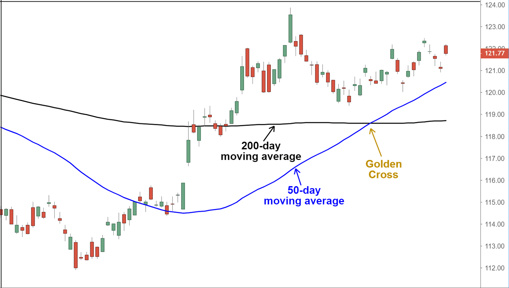

## Table of Contents

## What is a Golden Cross pattern in stock trading?

A Golden Cross pattern in stock trading is a signal that happens when a short-term moving average, usually the 50-day moving average, crosses above a long-term moving average, typically the 200-day moving average. This event is considered a bullish sign, meaning that traders think the price of the stock might go up. It's called "Golden" because it's seen as a good, positive thing in the stock market.

When a Golden Cross happens, many traders see it as a time to buy the stock because they believe the price will keep going up. They use this pattern to help decide when to invest. But, it's important to remember that no signal is perfect. Sometimes, even with a Golden Cross, the stock price might not go up as expected. So, traders often look at other information too, not just this one pattern.

## How does a Golden Cross differ from a Death Cross?

A Golden Cross and a Death Cross are two opposite patterns in stock trading. A Golden Cross happens when a short-term moving average, like the 50-day moving average, goes above a long-term moving average, such as the 200-day moving average. This is seen as a good sign because it suggests that the stock's price might keep going up, so traders might want to buy the stock.

On the other hand, a Death Cross is the opposite. It occurs when the short-term moving average, like the 50-day moving average, goes below the long-term moving average, such as the 200-day moving average. This is considered a bad sign because it suggests that the stock's price might keep going down. When traders see a Death Cross, they might decide to sell the stock or avoid buying it.

Both patterns are used by traders to help make decisions, but they are not perfect. Sometimes, the stock might not follow the expected trend after a Golden or Death Cross. That's why traders usually look at other information too, not just these patterns, to make the best choices.

## What are the key components of a Golden Cross pattern?

The key components of a Golden Cross pattern are a short-term moving average and a long-term moving average. Usually, the short-term moving average is the 50-day moving average, and the long-term moving average is the 200-day moving average. The pattern starts when the stock's price goes up and the short-term moving average begins to get closer to the long-term moving average.

The Golden Cross happens when the short-term moving average actually crosses above the long-term moving average. This crossing is what makes the pattern complete. Traders see this as a sign that the stock's price might keep going up, so it's a good time to buy the stock. But, it's important to remember that the Golden Cross is just one tool traders use, and it's not perfect. They look at other things too to make the best choices.

## Can you explain the significance of the 50-day and 200-day moving averages in a Golden Cross?

The 50-day and 200-day moving averages are important numbers in a Golden Cross because they help traders see how a stock is doing over time. The 50-day moving average shows the average price of the stock over the last 50 days. It's a short-term look at how the stock has been doing. The 200-day moving average shows the average price over the last 200 days, which is a longer time. It gives a bigger picture of the stock's performance.

When the 50-day moving average goes above the 200-day moving average, it's called a Golden Cross. This is a good sign for traders because it means the stock's price has been going up more quickly lately than it has over the longer term. Traders think this might mean the stock will keep going up, so it's a good time to buy. But, it's not perfect. Sometimes the stock might not keep going up after a Golden Cross, so traders look at other things too to make sure they're making the best choice.

## How can a beginner identify a Golden Cross on a stock chart?

To identify a Golden Cross on a stock chart, a beginner needs to look at two lines on the chart: the 50-day moving average and the 200-day moving average. The 50-day moving average is a line that shows the average price of the stock over the last 50 days. The 200-day moving average is a line that shows the average price over the last 200 days. These lines help you see how the stock has been doing over time.

A Golden Cross happens when the 50-day moving average line crosses above the 200-day moving average line. This crossing means the stock's price has been going up more quickly lately than it has over the longer term. When you see this happen on the chart, it's a sign that the stock might keep going up, and it could be a good time to buy the stock. But remember, it's not a perfect signal, so it's good to look at other things too before making a decision.

## What does a Golden Cross indicate about future stock price movements?

A Golden Cross indicates that a stock's price might go up in the future. It happens when the 50-day moving average, which shows the stock's price over the last 50 days, crosses above the 200-day moving average, which shows the stock's price over the last 200 days. This crossing means the stock's price has been going up more quickly lately than it has over the longer term. Traders see this as a good sign and might decide to buy the stock because they think it will keep going up.

However, a Golden Cross is not a perfect signal. Sometimes, even after a Golden Cross, the stock's price might not go up as expected. This is why traders look at other things too, not just the Golden Cross, to make the best choices about buying or selling stocks. It's important to use the Golden Cross along with other information to get a better idea of what might happen with the stock's price in the future.

## Are there any historical examples where a Golden Cross accurately predicted a bullish market trend?

One good example of a Golden Cross predicting a bullish market trend happened in early 2009. After the big financial crisis in 2008, the stock market was really down. But in March 2009, the 50-day moving average for the S&P 500 crossed above the 200-day moving average. This Golden Cross was a sign that the market might start going up again. And it did! The market started a long bull run that lasted for years, showing that the Golden Cross was right about the market getting better.

Another example was in late 2016. The market had been kind of flat for a while, but then in November, right after the U.S. election, the 50-day moving average for the Dow Jones Industrial Average crossed above the 200-day moving average. This Golden Cross happened and then the market started going up a lot. The Dow Jones kept going up for a long time after that, showing that the Golden Cross was a good sign that the market was going to do well.

## What are the limitations and potential false signals of using a Golden Cross for trading?

Using a Golden Cross to decide when to buy or sell stocks can be helpful, but it's not perfect. One big problem is that it can give false signals. This means the stock's price might not go up after a Golden Cross happens. Sometimes, the price might go up a little but then go back down. This can trick traders into buying the stock when it's not a good time. Also, the Golden Cross might happen too late. By the time the 50-day moving average crosses above the 200-day moving average, the stock's price might already be high, and the best time to buy could be over.

Another limitation is that the Golden Cross doesn't tell you everything about the stock. It's just one piece of information. Stocks can be affected by lots of other things like company news, the economy, or world events. So, relying only on the Golden Cross can miss important details. Traders need to look at other things too, like the company's earnings, what's happening in the world, and other stock chart patterns. This helps them make better choices and avoid getting tricked by a Golden Cross that doesn't lead to the stock going up like expected.

## How should a trader incorporate a Golden Cross into a broader trading strategy?

A trader should use a Golden Cross as just one part of a bigger trading plan. When a Golden Cross happens, it's a good sign that the stock's price might go up, but it's not perfect. So, traders need to look at other things too. They should check the company's earnings to see if the business is doing well. They should also keep an eye on the news to see if anything big is happening in the world that could affect the stock. And they should look at other patterns on the stock chart to get a fuller picture of what's going on.

By using the Golden Cross along with other information, traders can make better choices. If everything else looks good and the Golden Cross happens, it might be a good time to buy the stock. But if other things look bad, like the company is losing money or there's bad news, then the Golden Cross might not be a good sign to follow. It's all about putting together a lot of pieces of information to make the smartest trading decisions.

## What technical indicators complement a Golden Cross to improve trading decisions?

To make better trading choices when using a Golden Cross, traders can look at other technical indicators. One helpful indicator is the Relative Strength Index (RSI). The RSI shows if a stock is overbought or oversold. If the RSI is over 70, it might mean the stock's price is too high and could go down soon. If it's under 30, it might mean the stock's price is too low and could go up. Using the RSI with a Golden Cross can help traders decide if it's really a good time to buy the stock.

Another useful indicator is the Moving Average Convergence Divergence (MACD). The MACD helps traders see if the stock's price is gaining or losing strength. When the MACD line crosses above the signal line, it's a sign that the stock's price might keep going up. This can match well with a Golden Cross, making traders more confident that the stock's price will rise. By looking at both the Golden Cross and the MACD, traders can get a clearer picture of what might happen next with the stock's price.

## Can you provide a case study of a stock that experienced a Golden Cross and the subsequent market performance?

In early 2016, Apple Inc. (AAPL) experienced a Golden Cross. The 50-day moving average crossed above the 200-day moving average in February of that year. At the time, Apple's stock price was around $95. After the Golden Cross, Apple's stock started to go up. By the end of 2016, the stock price had climbed to about $115, showing a clear bullish [trend following](/wiki/trend-following) the Golden Cross. This case shows how a Golden Cross can be a good sign for a stock's future performance.

However, it's important to look at other things too, not just the Golden Cross. During this time, Apple was doing well with its business. They were selling a lot of iPhones and other products, and their earnings were strong. The overall market was also doing well, which helped Apple's stock price go up. So, while the Golden Cross was a good sign, it was just one part of why Apple's stock did well after the Golden Cross happened.

## How do different market conditions affect the reliability of the Golden Cross pattern?

Different market conditions can change how reliable the Golden Cross pattern is. In a strong bull market, where lots of stocks are going up, a Golden Cross can be a good sign that a stock will keep going up too. This is because the whole market is doing well, so it's easier for individual stocks to follow the trend. But, in a bear market, where lots of stocks are going down, a Golden Cross might not be as reliable. The stock might go up for a little bit after the Golden Cross, but then go back down because the overall market is not doing well.

In a sideways market, where stock prices are not really going up or down a lot, a Golden Cross can be tricky. It might happen, but the stock might not go up much after it. This is because the market is not moving strongly in any direction, so the Golden Cross might not mean as much. Traders need to look at other things too, like the company's earnings and news, to decide if the Golden Cross is a good sign in different market conditions.

## How does a Golden Cross form?

A Golden Cross forms through three distinct stages: the bottoming of a downtrend, the crossover point of moving averages, and the continuation of an uptrend. Each stage indicates a transition in market sentiment and is critical for identifying potential bullish trends.

### Stage 1: Bottoming of Downtrend
The initial stage of a Golden Cross occurs when the market experiences a downtrend that begins to lose [momentum](/wiki/momentum). During this phase, short-term moving averages, such as the 50-day moving average, remain below long-term moving averages, like the 200-day moving average. Traders observe price action that suggests a slowing or weakening of the downtrend, indicating a potential shift in market dynamics.

### Stage 2: Crossover Point
The crossover point is the defining moment of the Golden Cross. It occurs when the short-term moving average (e.g., 50-day) crosses above the long-term moving average (e.g., 200-day). This crossover is often seen as an indicator that market sentiment has turned bullish, prompting traders to consider entering long positions. The mathematical representation can be formulated as:

$$

\text{Golden Cross occurs when: } MA_{\text{short}}(n) > MA_{\text{long}}(n)
$$

Where:
- $MA_{\text{short}}(n)$ is the short-term moving average
- $MA_{\text{long}}(n)$ is the long-term moving average
- $n$ represents a specific day or time period in the data set

### Stage 3: Continuation of Uptrend
After the crossover, if the market continues to rise and the short-term moving average stays above the long-term moving average, this confirms the continuation of an uptrend. Investors and traders often look for sustained [volume](/wiki/volume-trading-strategy) accompanying these price movements to reinforce the validity of the Golden Cross signal. An increase in trading volume during this stage is a positive confirmation, suggesting stronger market conviction in the upward trend.

### Role of Volume
Volume plays a crucial role in reinforcing the Golden Cross signal. High trading volume during the crossover point enhances the reliability of the signal, as it indicates robust buying interest and confidence in the market's upward movement. Conversely, a Golden Cross that occurs with low volume may lack the necessary support, increasing the chances of a false signal.

### Impact of Different Moving Average Periods
The choice of moving average periods significantly impacts the strength and duration of a Golden Cross signal. Commonly used periods are the 50-day and 200-day moving averages; however, shorter or longer periods can be applied depending on specific trading strategies. Shorter periods, like 20-day and 100-day moving averages, might generate quicker signals but could be more susceptible to market noise, leading to false positives. Conversely, longer periods provide more robust signals but tend to lag, potentially missing out on early entry points in a trend.

Incorporating different moving average periods allows traders to tailor the Golden Cross to their strategies, aligning it with their risk tolerance and market outlook.

## References & Further Reading

[1]: Murphy, J. J. (1999). ["Technical Analysis of the Financial Markets: A Comprehensive Guide to Trading Methods and Applications"](https://drive.google.com/file/d/1OcDrGakDhaejT7J7xGEE3HHKy7xmrafy/preview). New York Institute of Finance.

[2]: Pring, M. J. (2014). ["Technical Analysis Explained: The Successful Investor's Guide to Spotting Investment Trends and Turning Points"](https://www.amazon.com/Technical-Analysis-Explained-Fifth-Successful/dp/0071825177). McGraw-Hill Education.

[3]: Aronson, D. R. (2007). ["Evidence-Based Technical Analysis: Applying the Scientific Method and Statistical Inference to Trading Signals"](https://onlinelibrary.wiley.com/doi/book/10.1002/9781118268315). John Wiley & Sons.

[4]: Kirkpatrick, C. D., & Dahlquist, J. R. (2010). ["Technical Analysis: The Complete Resource for Financial Market Technicians"](https://ptgmedia.pearsoncmg.com/images/9780134137049/samplepages/9780134137049.pdf). FT Press.

[5]: Jansen, S. (2020). ["Machine Learning for Algorithmic Trading: Predictive models to extract signals from market and alternative data for systematic trading strategies with Python, 2nd Edition"](https://www.amazon.com/Machine-Learning-Algorithmic-Trading-alternative/dp/1839217715). Packt Publishing.

[6]: Chan, E. P. (2009). ["Quantitative Trading: How to Build Your Own Algorithmic Trading Business"](https://github.com/ftvision/quant_trading_echan_book). Wiley Trading.