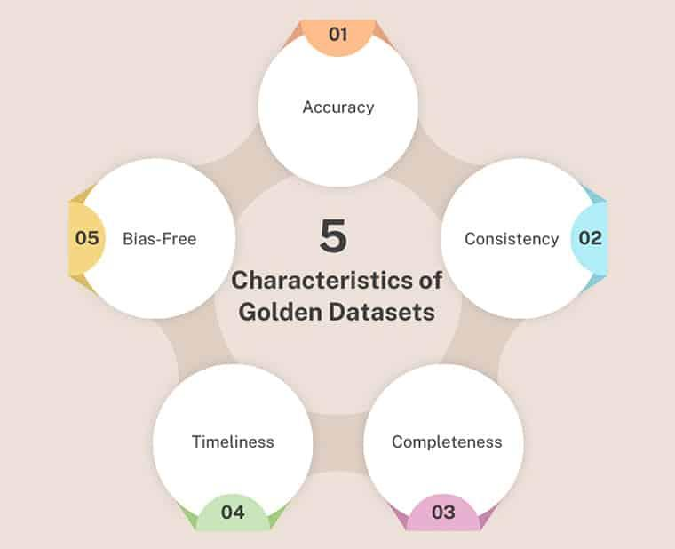

## Table of Contents

## What is a Golden Dataset in the context of machine learning?

A Golden Dataset in machine learning is a high-quality, carefully curated set of data used as a benchmark for training and evaluating machine learning models. It contains examples that are known to be accurate and representative of the problem the model is trying to solve. By using a Golden Dataset, developers can ensure that their models are learning from the best possible examples, which helps improve the model's performance and reliability.

Creating a Golden Dataset involves a lot of work. Experts need to go through the data carefully, making sure it is clean, accurate, and free from errors. They might also need to label the data correctly, which means adding information that tells the model what each piece of data represents. Once the Golden Dataset is ready, it can be used to train models and check how well they are doing. This helps make sure that the models are learning the right things and can be trusted to work well in real situations.

## Why is a Golden Dataset important for machine learning models?

A Golden Dataset is really important for machine learning models because it helps make sure the models learn the right things. When you train a model, you want it to learn from good examples. A Golden Dataset is like a collection of the best examples you can find. By using this dataset, you can be sure that your model is learning from accurate and reliable data. This makes the model better at doing its job and helps it make fewer mistakes.

Another reason a Golden Dataset is important is that it helps you check how well your model is doing. When you have a set of data that you know is correct, you can use it to test your model. If the model does well on the Golden Dataset, you can be more confident that it will work well in real situations too. This is important because it helps you trust the model and use it for important tasks where accuracy matters a lot.

## How is a Golden Dataset different from a regular training dataset?

A Golden Dataset is different from a regular training dataset because it is made very carefully. A regular training dataset might have some mistakes or not be as accurate. But a Golden Dataset is checked and cleaned by experts to make sure it is the best quality possible. They go through each piece of data and make sure it is correct and useful for teaching the model. This means that a Golden Dataset is more reliable and can help the model learn better.

Another way a Golden Dataset is different is that it is used as a benchmark. This means it is a standard that you can use to see how good your model is. A regular training dataset is just used to teach the model, but a Golden Dataset can also be used to test it. When you use a Golden Dataset to test your model, you can see if it is learning the right things and how well it is doing. This helps you trust the model more and know that it will work well in real situations.

## What are the key characteristics of a Golden Dataset?

A Golden Dataset has a few important features that make it special. It is made up of data that is very accurate and free from mistakes. Experts check each piece of data carefully to make sure it is correct. This means the dataset is clean and reliable. It also has the right labels, which are the pieces of information that tell the model what each piece of data means. Having good labels is important because it helps the model learn the right things.

Another key characteristic of a Golden Dataset is that it is representative. This means it includes examples that cover all the different kinds of situations the model might need to handle. It is not just a bunch of similar examples, but a mix that shows the model what it might see in real life. This helps the model learn to work well in many different situations. Also, a Golden Dataset is often used as a benchmark, which means it is a standard that you can use to see how good your model is. By testing your model with a Golden Dataset, you can be sure it is learning well and will work well in the real world.

## How can one create a Golden Dataset for a machine learning project?

To create a Golden Dataset for a [machine learning](/wiki/machine-learning) project, you need to start by gathering a lot of data that is related to the problem you want to solve. This data should come from different sources and cover all the different situations your model might need to handle. Once you have the data, you need to clean it. This means going through the data and removing any mistakes or errors. You might need to fix some of the data or throw away parts that are not good enough. After cleaning, you need to label the data. Labels are important because they tell the model what each piece of data means. You should make sure the labels are correct and consistent across the whole dataset.

After you have cleaned and labeled the data, you need to get experts to check it. These experts will go through the data carefully to make sure everything is accurate and useful. They might need to make some changes or add more data to make the dataset even better. Once the experts are happy with the dataset, you can use it as your Golden Dataset. This dataset will be your standard for training and testing your model. By using a Golden Dataset, you can make sure your model is learning from the best possible examples, which will help it work well in real situations.

## What are the common challenges in maintaining a Golden Dataset?

Creating and keeping a Golden Dataset can be tough. One big challenge is making sure the data stays accurate and up-to-date. As time goes by, things can change, and what was correct before might not be correct anymore. This means you need to keep checking the dataset and updating it when needed. It can take a lot of time and effort to do this, especially if you have a lot of data to go through.

Another challenge is making sure the dataset stays clean and free from mistakes. Even after you have cleaned and labeled the data carefully, errors can still happen. Maybe someone made a mistake when they were labeling the data, or maybe some new data came in that has problems. You need to keep watching the dataset and fixing any mistakes you find. This can be hard because it requires a lot of attention to detail and can be very time-consuming.

Lastly, keeping the dataset representative can be difficult. The world is always changing, and new situations can come up that your model needs to handle. You need to make sure your Golden Dataset includes examples of these new situations. This means you might need to add new data to the dataset or change some of the old data. Keeping the dataset representative helps make sure your model will work well in real life, but it can be a big challenge to do this right.

## How does a Golden Dataset impact model performance and reliability?

A Golden Dataset helps make machine learning models work better and be more reliable. When you train a model with a Golden Dataset, it learns from the best examples. These examples are checked and cleaned by experts, so they are very accurate and useful. This means the model can learn the right things and make fewer mistakes. It's like giving the model the best teacher possible, which helps it do its job well.

Using a Golden Dataset also helps you trust the model more. When you test the model with the Golden Dataset, you can see how well it is doing. If the model does well on this high-quality data, you know it will probably work well in real situations too. This is important because it makes the model more reliable. You can feel confident using the model for important tasks where accuracy matters a lot.

## Can you explain the process of validating a Golden Dataset?

Validating a Golden Dataset means checking to make sure it is good enough to use for training and testing machine learning models. You start by having experts go through the data carefully. They look at each piece of data to see if it is correct and useful. They also check the labels to make sure they are right. If they find any mistakes, they fix them. This helps make sure the dataset is clean and accurate.

After the experts have checked the data, you can use the Golden Dataset to test your model. You run the model on the dataset and see how well it does. If the model does well, it means the dataset is good and the model is learning the right things. If the model does not do well, you might need to go back and check the dataset again. Maybe there are some mistakes that need to be fixed, or maybe you need to add more data to make the dataset better. By validating the Golden Dataset, you can be sure it will help your model work well and be reliable.

## What role does a Golden Dataset play in model retraining and updates?

A Golden Dataset is really important when you need to retrain or update your machine learning model. When new data comes in or things change, you might need to teach your model again to make sure it stays accurate. Using a Golden Dataset for this helps a lot because it is made of the best examples. These examples are checked and cleaned by experts, so they are very accurate and useful. When you retrain your model with a Golden Dataset, it learns from the best possible data, which helps it stay good at its job and make fewer mistakes.

Also, a Golden Dataset helps you check how well your updated model is doing. After you retrain the model, you can test it with the Golden Dataset to see if it is still learning the right things. If the model does well on this high-quality data, you can be sure it will work well in real situations too. This is important because it helps you trust the model more and know that it will keep being reliable even after updates.

## How do organizations ensure the quality and integrity of their Golden Dataset?

Organizations make sure their Golden Dataset is good by having experts check the data carefully. These experts go through each piece of data to see if it is correct and useful. They also check the labels to make sure they are right. If they find any mistakes, they fix them. This helps keep the dataset clean and accurate. Organizations might also use special tools and methods to help with this process. They might use software that can find and fix errors in the data automatically. This helps make sure the dataset stays high-quality and reliable.

Another way organizations keep their Golden Dataset good is by updating it regularly. Things can change over time, and new data might come in that is important. By adding new data and fixing old data, organizations can make sure their Golden Dataset stays useful and accurate. They might also test the dataset often to see if it is still working well. If they find any problems, they fix them right away. This helps make sure the dataset stays a good standard for training and testing machine learning models.

## What are some advanced techniques for optimizing a Golden Dataset?

Organizations can use advanced techniques like active learning to make their Golden Dataset even better. Active learning means choosing the most important data to add to the dataset. This helps make the dataset more useful without adding too much extra data. Another technique is [data augmentation](/wiki/data-augmentation), which means making new data from the data you already have. For example, if you have pictures, you can rotate them or change their colors to make new pictures. This can help make the dataset more diverse and cover more situations.

Another way to optimize a Golden Dataset is by using techniques like cross-validation. This means splitting the dataset into different parts and testing the model on each part. This helps make sure the dataset is good and the model is learning well. Organizations might also use ensemble methods, which means combining different models to make a better one. By using these advanced techniques, organizations can make their Golden Dataset even better and help their machine learning models work well and be reliable.

## How can the concept of a Golden Dataset be applied in different machine learning domains?

The idea of a Golden Dataset can be used in many different areas of machine learning. In healthcare, for example, a Golden Dataset could be a collection of accurate medical records and images that help train models to diagnose diseases better. Experts would check each record and image to make sure they are correct and useful. This helps the model learn the right things and make fewer mistakes when it is used to help doctors. In finance, a Golden Dataset might include high-quality data about stock prices and market trends. By using this dataset, models can learn to predict the market more accurately. The dataset would be kept up-to-date and checked regularly to make sure it stays reliable.

In the field of natural language processing, a Golden Dataset could be a set of carefully labeled texts that help models understand and generate human language better. Experts would go through each text to make sure the labels are correct and the data is useful. This helps the model learn to understand different languages and contexts more accurately. For image recognition, a Golden Dataset might include a diverse set of high-quality images with correct labels. By training models on this dataset, they can learn to recognize different objects and scenes more reliably. No matter the domain, using a Golden Dataset helps make machine learning models work better and be more trustworthy.

## References & Further Reading

[1]: Samuel, A. L. (1959). ["Some Studies in Machine Learning Using the Game of Checkers"](https://ieeexplore.ieee.org/document/5392560). IBM Journal of Research and Development.

[2]: LeCun, Y., Bengio, Y., & Hinton, G. (2015). ["Deep Learning."](https://www.nature.com/articles/nature14539) Nature, 521(7553), 436-444.

[3]: Quinlan, J. R. (1986). ["Induction of Decision Trees."](https://link.springer.com/article/10.1007/BF00116251) Machine Learning, 1(1), 81-106.

[4]: Amershi, S., Begel, A., Bird, C., et al. (2019). ["Software Engineering for Machine Learning: A Case Study."](https://ieeexplore.ieee.org/document/8804457) IEEE/ACM 41st International Conference on Software Engineering: Software Engineering in Practice (ICSE-SEIP).

[5]: Recht, B., Roelofs, R., Schmidt, L., & Shankar, V. (2019). ["Do ImageNet Classifiers Generalize to ImageNet?"](https://arxiv.org/abs/1902.10811) arXiv preprint arXiv:1902.10811.

[6]: Koh, P. W., Sagawa, S., Marklund, H., Xie, S. M., Zhang, M., Balsubramani, A., ... & Liang, P. (2021). ["Wilds: A Benchmark of in-the-Wild Distribution Shifts."](https://arxiv.org/abs/2012.07421) International Conference on Machine Learning, PMLR.

[7]: Northcutt, C. G., Athalye, A., & Mueller, J. (2021). ["Pervasive Label Errors in Test Sets Destabilize Machine Learning Benchmarks."](https://arxiv.org/abs/2103.14749) arXiv preprint arXiv:2103.14749.