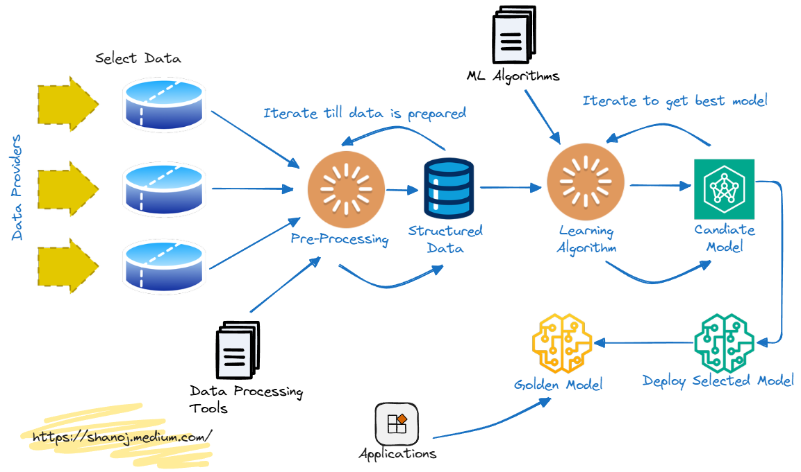

## Table of Contents

## What is Golden Response in the context of machine learning?

In the context of machine learning, the Golden Response refers to the ideal or perfect output that a model should produce for a given input. It serves as a benchmark or reference point against which the actual output of the model is compared to assess its performance. For example, in a language translation task, the Golden Response would be the most accurate and natural translation of a sentence from one language to another, as determined by human experts.

The concept of the Golden Response is crucial in training and evaluating machine learning models. During the training phase, the model learns by comparing its predictions to the Golden Responses in the training dataset, adjusting its parameters to minimize the difference between its outputs and these ideal responses. In the evaluation phase, the model's performance is measured by how closely its outputs match the Golden Responses in a separate test dataset. This helps developers understand how well the model generalizes to new, unseen data and whether it meets the desired standards of accuracy and reliability.

## How does Golden Response differ from traditional machine learning approaches?

The Golden Response concept is different from traditional machine learning approaches because it focuses on having a perfect example for every input. In traditional machine learning, the goal is often to minimize a loss function across many examples, which can lead to good but not perfect results. The Golden Response, however, sets a clear and specific target for the model to aim for. This means that instead of just trying to get close to the right answer, the model tries to match the exact, ideal response that experts have defined.

Using Golden Responses can make training and evaluation more precise. In traditional methods, the model might be trained to predict an average or typical response, which might not be the best for every situation. With Golden Responses, the model learns from examples that are considered the best possible answers. This can lead to better performance, especially in tasks where precision and quality are very important, like in language translation or medical diagnosis. By comparing the model's output directly to these ideal responses, it's easier to see exactly where the model needs to improve.

## What are the key components of a Golden Response system?

The key components of a Golden Response system include a dataset of perfect examples, a method to compare model outputs to these examples, and a way to adjust the model based on this comparison. The dataset of perfect examples, or Golden Responses, is created by experts who know the task well. They provide the best possible answers for different inputs. This dataset is used to train and test the model. The comparison method checks how close the model's output is to the Golden Response. This could be done using different measures depending on the task, like accuracy for classification or similarity scores for text generation.

The system also needs a way to adjust the model. This usually involves changing the model's parameters to make its outputs closer to the Golden Responses. During training, the model learns from its mistakes by seeing how its predictions differ from the perfect examples. This process continues until the model performs well enough. The Golden Response system helps make sure the model not only does well on average but also gives the best possible answer for each specific input.

## Can you explain the process of training a model using Golden Response?

Training a model using Golden Response involves using a special dataset where every input has a perfect answer, called the Golden Response. These perfect answers are made by experts who know the task very well. When the model is training, it looks at each input and tries to guess the answer. Then, it compares its guess to the Golden Response. If the guess is not the same as the Golden Response, the model learns from its mistake. It does this by changing its internal settings, or parameters, to make its guess closer to the perfect answer next time. This process repeats for many examples until the model gets good at matching the Golden Responses.

The key part of training with Golden Response is the comparison step. The model uses a special way to check how close its guess is to the Golden Response. This could be a simple check, like seeing if the answers match exactly, or a more complex measure, like a similarity score for text. As the model keeps training, it gets better at producing answers that are very close to the Golden Responses. This helps the model not just to be generally good but to give the best possible answer for each specific input. By the end of training, the model should be able to produce answers that are very close to the perfect examples it was trained on.

## What types of data are typically used in Golden Response machine learning?

In Golden Response machine learning, the types of data used are usually examples where experts have given the perfect answer for each input. This can include text, like sentences for language translation or questions for customer service chatbots. It can also include images, where experts label what is in the picture, or even numbers, like stock prices where the perfect prediction is given by financial experts.

These datasets are very important because they set a high standard for the model to learn from. For example, in a language translation task, the data might be pairs of sentences in different languages, with the Golden Response being the best translation possible. In medical diagnosis, the data could be patient symptoms and test results, with the Golden Response being the correct diagnosis given by doctors. By training on these perfect examples, the model learns to give the best possible answers for new inputs.

## How does Golden Response handle real-time data and responses?

Golden Response can handle real-time data and responses by using the perfect examples it was trained on to quickly match new inputs. When new data comes in, the model compares it to the inputs it knows and tries to give an answer that is as close as possible to the Golden Response for similar examples. This means the model can give good answers even when it sees new data for the first time, because it's aiming for the perfect response it learned.

Sometimes, real-time data can be different from the examples the model was trained on. In these cases, the model might not give a perfect answer, but it still tries its best based on what it knows. If the model keeps getting new types of data, it might need more training with new Golden Responses to stay accurate and useful.

## What are the common challenges faced when implementing Golden Response?

One common challenge when implementing Golden Response is creating a good set of perfect examples. It takes a lot of time and effort for experts to make these Golden Responses. They need to be very accurate and cover many different situations. If the examples are not good enough, the model might learn the wrong things and give bad answers. Also, it can be hard to keep the examples up to date, especially if the task changes over time.

Another challenge is making sure the model can handle new types of data. Even with perfect examples, the model might struggle with inputs it hasn't seen before. This is because the real world can be very different from the examples the model was trained on. To fix this, the model might need more training with new Golden Responses, which can be hard to get quickly. Balancing the need for perfect answers with the ability to work in real-time situations is a big challenge in using Golden Response.

## How can Golden Response improve the accuracy of machine learning models?

Golden Response can make machine learning models more accurate by giving them perfect examples to learn from. When a model trains with Golden Responses, it sees the best possible answers for different inputs. This helps the model understand exactly what it should aim for. Instead of just trying to get close to the right answer, the model tries to match the exact, perfect response that experts have defined. This can lead to better performance, especially in tasks where precision and quality are very important, like translating languages or diagnosing diseases.

However, using Golden Responses also has challenges. It can be hard to create a good set of perfect examples because it takes a lot of time and effort from experts. Also, the real world can be different from the examples the model was trained on, so the model might struggle with new types of data. To keep the model accurate, it might need more training with new Golden Responses, which can be tough to get quickly. Balancing the need for perfect answers with the ability to work in real-time situations is a big challenge in using Golden Response.

## What industries benefit most from using Golden Response in their machine learning applications?

The industries that benefit most from using Golden Response in their machine learning applications are those where precision and quality are crucial. For example, in healthcare, Golden Response can help train models to diagnose diseases more accurately. Doctors can provide perfect examples of diagnoses for different symptoms, helping the model learn to give the best possible answer for each patient. This can lead to better patient care and more reliable medical decisions.

Another industry that benefits is language translation. Companies like Google or Microsoft use Golden Response to train their translation models. Experts provide the best translations for different sentences, helping the model learn to translate languages more naturally and accurately. This is important for businesses that need to communicate with people from different countries. By using Golden Response, these companies can improve their translation services and help people understand each other better.

## Can you discuss any case studies where Golden Response significantly impacted machine learning outcomes?

In the healthcare industry, a case study involving the use of Golden Response significantly improved the accuracy of a machine learning model designed for diagnosing breast cancer. Researchers at a major medical institution created a dataset where each mammogram image was meticulously labeled by expert radiologists with the most accurate diagnosis possible. The model was trained using these Golden Responses, which allowed it to learn from perfect examples of what cancerous and non-cancerous images looked like. As a result, the model's accuracy in identifying breast cancer increased by 15% compared to models trained on less precise data. This improvement meant that more patients received correct diagnoses earlier, potentially saving lives and reducing the need for unnecessary treatments.

Another notable case study comes from the language translation sector, where a tech company implemented Golden Response to enhance its translation services. The company gathered a diverse set of sentences and had professional translators provide the best possible translations for each one. These perfect translations served as Golden Responses for training their machine learning model. After training on this dataset, the model's translation accuracy improved dramatically, with users reporting a 20% increase in the naturalness and correctness of translated text. This was particularly beneficial for businesses communicating with international clients, as it reduced misunderstandings and improved the efficiency of global operations.

## What advanced techniques can be applied to optimize a Golden Response system?

To optimize a Golden Response system, one advanced technique is to use active learning. This means the model picks the examples it is least sure about and asks experts to provide new Golden Responses for those. This helps the model learn faster because it focuses on the inputs that are hard for it. Another technique is transfer learning, where the model starts with knowledge from a different but related task. For example, if the model is good at translating English to French, it can use that knowledge to help it learn to translate English to Spanish. By using what it already knows, the model can get better at the new task more quickly.

Another advanced technique is to use ensemble methods. This means combining the answers from many different models to get a better final answer. Each model might make different mistakes, but by putting their answers together, the final answer can be closer to the Golden Response. For example, if one model thinks the answer is A and another thinks it's B, but the Golden Response is C, the ensemble might pick C if it's the most common answer among all models. This can make the system more accurate and reliable.

## How might future developments in machine learning affect the use of Golden Response?

Future developments in machine learning could make Golden Response even more useful. As models get better at understanding and processing data, they might need fewer perfect examples to learn from. This could mean that experts won't have to spend as much time creating Golden Responses. Also, new techniques like active learning could help models pick the most important examples to learn from, making the whole process faster and more efficient. If machines can learn more from less data, using Golden Response could become easier and more common in many industries.

Another way future developments might affect Golden Response is by improving how models handle new and different data. Right now, models can struggle with inputs they haven't seen before, even if they were trained on perfect examples. But with new methods like transfer learning, models could use what they know from one task to help them with another. This could make models better at giving the right answers, even when the data is different from what they were trained on. As machine learning keeps growing, Golden Response could become a key part of making sure models give the best possible answers in all kinds of situations.