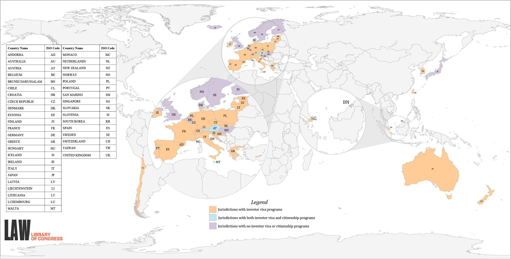

Golden Visa programs have emerged as a notable global trend, offering individuals a pathway to obtain residency through investment in a host country. These programs have gained traction due to their dual appeal: facilitating geographical and economic mobility for investors and providing economic benefits to host nations. Countries such as Portugal, Greece, and Spain have particularly capitalized on this, offering residency, and in some cases, eventual citizenship, in exchange for significant investments in real estate or government bonds. This trend has been fueled by increasing globalization and the desire for geographical diversification, as well as the potential for lifestyle enhancements in nations with stable economies and favorable living conditions.

Concurrently, the investment landscape has been dynamically transformed by the advent of algorithmic trading, a sophisticated method that leverages computer programs to execute trades at high speed and frequency based on complex mathematical models. Algorithmic trading utilizes large volumes of data and advanced analytics to optimize investment strategies, reduce human error, and enhance market efficiency. This modern strategy highlights an intersection with Golden Visa programs, where algorithmic trading's financial optimization can play a role in the funding and enhancement of investments aimed at securing residency.

This intersection of Golden Visa programs and algorithmic trading reflects broader investment strategies where financial innovation meets traditional residency incentives. Investors are increasingly looking at multifaceted approaches that marry innovative financial strategies with global mobility solutions. Understanding both areas is significant for investors seeking to maximize returns while also obtaining global residency rights.

The purpose of this article is to explore the synergy between Golden Visa programs and algorithmic trading, examining how they can collectively offer strategic benefits to investors. By dissecting this intersection, we aim to provide insights into the evolving landscape of residency by investment, enhanced by cutting-edge trading technologies, underscoring the importance of informed decision-making in this dynamic environment.

## Table of Contents

## Understanding Golden Visa Programs

Golden Visa programs, also known as residency by investment schemes, provide foreign investors the opportunity to acquire residency, often with the prospect of citizenship, by making significant financial contributions to a host country. These programs originated in the 1980s and gained traction as countries sought to attract foreign capital to stimulate economic growth. Portugal, one of the pioneers in this realm, launched its Golden Visa program in 2012, paving the way for numerous other nations to adopt similar policies.

Countries offering Golden Visa programs present diverse benefits to attract investors. Portugal, for instance, offers a residency permit with the opportunity for permanent residency or citizenship after five years, provided certain conditions are met. The program also grants visa-free travel within the Schengen Zone, access to quality healthcare, and favorable tax regimes. Spain, Greece, Malta, and Cyprus are other European countries with notable Golden Visa initiatives.

The requirements and application processes vary across nations but typically involve real estate investment, business development, or significant capital contributions. Portugal, for instance, requires a minimum real estate investment of €500,000 or a capital transfer of at least €1 million as part of its Golden Visa criteria. In contrast, Greece offers residency with a minimum property investment of €250,000. Such processes usually entail submitting relevant financial and legal documentation, proving the legality and source of funds, and adhering to the host country's regulatory framework.

Golden Visa programs bear a substantial socio-economic impact on host countries. Economically, these programs boost real estate markets, generate jobs, and increase tax revenues. For example, Portugal has seen billions of euros flowing into its economy, revitalizing urban areas and driving growth. On a societal level, these programs encourage cultural exchange and potentially lead to improved infrastructure and services funded by the influx of foreign capital.

Successful Golden Visa applicants often leverage these opportunities to strategically position themselves in more stable or prosperous environments. A notable example is the case of Chinese investors in Portugal, who comprise a significant portion of Golden Visa beneficiaries. Their investments have not only contributed to personal gains, such as educational prospects for their children and business integration into European markets, but also to the broader economic rejuvenation of urban areas in Portugal.

## Residency by Investment: A Growing Trend

Residency by investment programs have gained significant traction globally due to various factors. The primary driver is the increasing desire for global mobility and the ability to access multiple countries with ease. High-net-worth individuals (HNWIs) seek to capitalize on the benefits of holding residency or citizenship in a foreign country, including visa-free travel, favorable tax regimes, and business opportunities.

Golden Visa programs, as a subset of residency by investment initiatives, are particularly popular, but it's crucial to compare them with other options available on the market. While Golden Visas typically require real estate investment or donation to government-approved funds, other programs might focus on job creation, intellectual or artistic contributions, and even contributions to national development projects. Each option presents unique advantages and drawbacks that appeal to different investor profiles based on their personal goals and priorities.

One notable advantage of pursuing residency through investment is access to better education and healthcare systems, which can be a significant motivator for families. Financial benefits, such as tax incentives, are also a compelling [factor](/wiki/factor-investing), particularly in jurisdictions with favorable fiscal policies for foreign investors. However, potential downsides include the initial capital requirement, the complexity of the application processes, and ongoing obligations like maintaining the investment or residency status.

Long-term benefits for investors extend beyond the immediate residency status. Over time, individuals may qualify for citizenship, offering a more permanent solution with additional rights such as voting or running for government office. However, challenges remain, such as understanding and adhering to the legal requirements of dual nationality or the potential for geopolitical instability impacting the security and benefits associated with their investment.

Geopolitical shifts can heavily influence the future of these programs. Changes in government policy, international relations, or economic conditions can alter the attractiveness or feasibility of existing residency by investment options. For instance, increased political scrutiny or economic sanctions might render certain regions less appealing. Conversely, emerging markets experiencing growth could become new hotspots for investment-driven immigration.

In conclusion, as political and economic landscapes evolve, the demand for residency by investment programs is expected to continue growing. Understanding these options' nuances helps investors make informed decisions that align with their long-term goals and risk tolerance, balancing immediate residency benefits with potential geopolitical uncertainties.

 to Algorithmic Trading

Algorithmic trading refers to the use of computer programs and algorithms to execute trades in financial markets. It automates the process of trading by using pre-defined criteria derived from quantitative analysis to make decisions. These criteria can include a wide array of quantitative and statistical models, where trades are executed at high speed and frequency, taking advantage of patterns and opportunities that are difficult for human traders to detect.

Technology plays a crucial role in [algorithmic trading](/wiki/algorithmic-trading). Advanced computing power, complex algorithms, and vast amounts of data lying at the core of its functionality allow traders to analyze numerous variables and execute trades in fractions of a second. The integration of data analytics enables algorithms to consider factors such as price, timing, and [volume](/wiki/volume-trading-strategy) for optimal decision-making. This analysis can include historical data, real-time market conditions, and predictive modeling. For example, a basic algorithmic strategy might use moving averages to buy or sell when a shorter-term moving average crosses a longer-term moving average.

The advantages of algorithmic trading over traditional methods are numerous. Primarily, it eliminates human error and emotions, reducing the likelihood of irrational decisions driven by fear or greed. Algorithms can execute trades much faster than any human trader, leveraging even the slightest market inefficiencies for profit. Additionally, algorithmic trading allows for increased [liquidity](/wiki/liquidity-risk-premium) and tighter spreads in the market, often resulting in lower transaction costs for traders.

However, algorithmic trading is not without its risks and considerations. High-frequency trading, a subset of algorithmic trading, can contribute to market [volatility](/wiki/volatility-trading-strategies). This volatility was evidenced in events like the 2010 Flash Crash, where the Dow Jones Industrial Average dropped by about 1,000 points within minutes. Also, as algorithms can act based on erroneous data or flawed models, there's risk in relying solely on automated systems without adequate oversight. Traders must also contend with the risk of "overfitting," where algorithms are optimized for past data and fail to perform in real-time environments.

Recent trends in the algorithmic trading space show a growing integration of [machine learning](/wiki/machine-learning) and [artificial intelligence](/wiki/ai-artificial-intelligence) to enhance predictive accuracy. Moreover, the utilization of natural language processing (NLP) allows algorithms to discern sentiment from news articles, social media, and other text-based data, impacting trading decisions. As the field evolves, there is also an increased focus on ethical considerations and regulatory compliance, given the pace at which technology and markets change.

In summary, algorithmic trading is a sophisticated investment strategy that leverages technology and data analytics to improve trading efficiency and accuracy. While it offers significant advantages over traditional trading methods, understanding its risks and staying abreast of the latest trends and developments are essential for effective utilization.

## The Intersection of Golden Visa Programs and Algorithmic Trading

Golden Visa programs, designed to attract foreign investment by granting residency or citizenship in return, present a unique opportunity for investors to leverage modern financial instruments like algorithmic trading. Algorithmic trading, which uses computer algorithms to execute trades based on pre-set conditions, offers a method to potentially generate high returns quickly, which can be directed towards securing residency through investment.

**Funding and Enhancing Golden Visa Investments**

Algorithmic trading strategies can be structured to enhance or even fund Golden Visa investments. For instance, investors employing high-frequency trading ([HFT](/wiki/high-frequency-trading-strategies)) systems can capitalize on small price movements. This can generate substantial cumulative gains if the strategies are robust and market conditions are favorable. The liquidity and automation involved in algorithmic trading often outpace traditional investment methods, thus providing the necessary capital for Golden Visa eligibility within shortened timelines. 

Additionally, algorithmic trading allows diversification across various asset classes and geographies, mitigating risks and enhancing the prospects of meeting the investment thresholds required by different Golden Visa schemes. For example, an algorithm can be designed to trade equities, currencies, and commodities simultaneously, providing a hedge against market volatilities that might otherwise disrupt an investment plan pegged to Golden Visa requirements.

**Risks and Rewards**

However, the application of algorithmic trading to support Golden Visa investments is not devoid of risks. Market volatility, algorithmic failures, and regulatory challenges can pose significant detriments. High volatility could result in unexpected losses, while technical glitches in algorithms might execute undesirable trades. Moreover, regulatory environments concerning algorithmic trading and foreign investments vary widely across borders, adding layers of complexity.

On the reward side, successful algorithmic trading can yield high returns that enable investors to not only meet but exceed the financial thresholds for Golden Visa programs. The returns can also be used to maintain the investment beyond initial requirements or diversify into additional assets, enhancing the investor's financial portfolio.

**Scenarios and Examples**

Consider a scenario where an investor aims to meet a €500,000 investment requirement for a Golden Visa in Portugal. Using a well-optimized algorithm that targets currency [arbitrage](/wiki/arbitrage), the investor could steadily increase their capital over several months or years, eventually accumulating the necessary funds. Alternatively, in cases where investors have access to significant seed capital, algorithmic strategies might multiply their funds rapidly, allowing for fast-track investment qualifications.

**Role of Financial Advisors**

Financial advisors play a crucial role in guiding investors through the complexities of integrating algorithmic trading with Golden Visa investments. They analyze market trends, assess the risks of specific trading strategies, and ensure compliance with international trade and investment regulations. By providing expertise, they help investors frame strategies that align with their residency objectives and financial goals.

**Future Implications**

As algorithmic trading continues to evolve, its synergy with Golden Visa investments could redefine how high-net-worth individuals approach residency and asset growth. Enhanced technology, coupled with robust financial strategies, could streamline residency acquisition processes, making them more accessible. For high-net-worth individuals, this dual approach offers the potential for significant economic and lifestyle benefits. As both countries and markets adapt to these advancements, the intersection of residency by investment and algorithmic trading is poised to offer novel opportunities. 

In conclusion, leveraging algorithmic trading strategies for Golden Visa investments requires careful planning and strategic insight. The intersection of these two domains offers promising pathways for growth, but it demands astute management and professional guidance to maximize benefits.

## Legal and Financial Considerations

When considering Golden Visa programs, understanding the legal framework is crucial for potential investors. Each country offering these programs has unique regulations that define the eligibility criteria, investment requirements, and duration of the residency permit. Key considerations include ensuring the investment source is legal and transparent, as countries typically perform due diligence and background checks to prevent money laundering and other illicit activities. This can involve demonstrating the legality of funds through bank statements or tax returns.

Financial regulations impacting algorithmic trading vary considerably across jurisdictions. Investors must navigate an array of national and international regulations designed to ensure market stability and protect against systemic risks. In the United States, for instance, algorithmic trading is overseen by bodies such as the Securities and Exchange Commission (SEC) and the Commodity Futures Trading Commission (CFTC). These organizations impose strict compliance requirements, including real-time monitoring of trades and maintaining an audit trail for algorithms used in trading. Investors must ensure they comply with similar regulations in other jurisdictions where they operate.

For those obtaining residency through investment, tax implications are a critical consideration. Residency can alter an individual's tax obligations significantly, influencing the taxation of global income, wealth, and inheritance. Investors should assess the tax treaties between their home country and the host nation of their Golden Visa program to mitigate potential double taxation issues. Additionally, some countries offer favorable tax regimes for new residents, which could present savings opportunities for high-net-worth individuals.

Compliance with both legal and ethical standards is essential in these investment strategies. Ethical considerations might involve evaluating the impact of investments on the host country's economy and society, and ensuring that algorithmic trading practices do not inadvertently contribute to market manipulation or instability. To align with ethical standards, investors could adopt measures like incorporating impact assessments or engaging with transparent reporting mechanisms.

To navigate these complexities, investors require resources and professional services. Engaging with legal experts specializing in immigration law can aid in understanding specific Golden Visa requirements. Similarly, working with tax advisors familiar with international tax law ensures compliance and optimization of tax liabilities. Financial advisors with expertise in algorithmic trading can provide insights into the regulatory landscape and advice on risk management strategies. Many investors choose to partner with wealth management firms that offer integrated services, combining expertise in legal, tax, and financial advisory to streamline the investment process and ensure due diligence is maintained across all facets of the strategy. 

In conclusion, effectively leveraging the opportunities offered by Golden Visa programs and algorithmic trading requires comprehensive understanding and navigation of various legal and financial considerations. By approaching these opportunities with a strategic and informed mindset, investors can maximize benefits while adhering to necessary compliance standards across multiple jurisdictions.

## Conclusion

Golden Visa programs and algorithmic trading represent two dynamic facets of modern strategic investment. Their synergy lies in leveraging the flexibility and opportunities offered by residency through investment, along with the precision and efficiency of advanced trading algorithms. The synchronization of these approaches allows investors not only to secure residency in preferred jurisdictions, often with beneficial economic conditions, but also to enhance their investment portfolios through cutting-edge trading technologies.

One of the fundamental benefits of this dual approach is the diversification it offers. By participating in a Golden Visa program, investors gain access to new markets and potential tax advantages, further supported by algorithmic trading strategies that can maximize returns and manage risks effectively across global financial markets. However, challenges persist, such as the complexity of meeting legal and regulatory requirements across different jurisdictions, and the inherent risks associated with high-frequency trading algorithms.

The confluence of Golden Visa programs and algorithmic trading necessitates ongoing research and professional guidance. Investors are encouraged to seek consultation from legal and financial experts to navigate the intricacies of international regulations and trading practices. Understanding the nuances of these strategies ensures informed decision-making, ensuring that investments are both secure and optimized for growth.

Looking to the future, the integration of residency investments with modern trading methods is poised to evolve, driven by advances in technology and shifts in geopolitical landscapes. The adaptability of algorithmic trading combined with the strategic placement of residency investments through Golden Visa programs offers a robust framework for high-net-worth individuals to enhance and secure their global asset portfolios.

In conclusion, as the landscape of global investment opportunities continues to expand, the intersection of Golden Visa programs and algorithmic trading presents a compelling avenue for investors. Readers are encouraged to explore these opportunities further, to strategically position themselves within the global market and reap the benefits of a sophisticated and diversified investment approach.

## References & Further Reading

[1]: ["Advances in Financial Machine Learning"](https://www.amazon.com/Advances-Financial-Machine-Learning-Marcos/dp/1119482089) by Marcos Lopez de Prado

[2]: ["Quantitative Trading: How to Build Your Own Algorithmic Trading Business"](https://www.amazon.com/Quantitative-Trading-Build-Algorithmic-Business/dp/1119800064) by Ernest P. Chan

[3]: ["Algorithmic Trading and DMA: An introduction to direct access trading strategies"](https://archive.org/details/algorithmictradi0000john) by Barry Johnson

[4]: Aizenman, J., & Nguyen, H. (2022). ["Global financial integration and risk sharing after 2008's crisis."](https://www.sciencedirect.com/science/article/pii/S002219961100105X) Journal of International Money and Finance, 119.

[5]: ["The Big Four European Golden Visas: A Critical Legal Analysis"](https://www.researchgate.net/publication/351483780_Are_golden_visas_a_golden_opportunity_Assessing_the_economic_origins_and_outcomes_of_residence_by_investment_programs_in_the_EU) by Dimitry Kochenov and Martijn van den Brink in the European Law Journal

[6]: Pisani, F., & Polbot, N. (2021). ["Migration of the rich: the impact of Golden visas in the European Union."](https://www.semanticscholar.org/paper/The-geopolitics-of-the-European-Green-Deal-Leonard-Pisani-Ferry/2ca757c5b5de94711fb84a67396be1ff4beb055d) Bank of England Underground Blog.