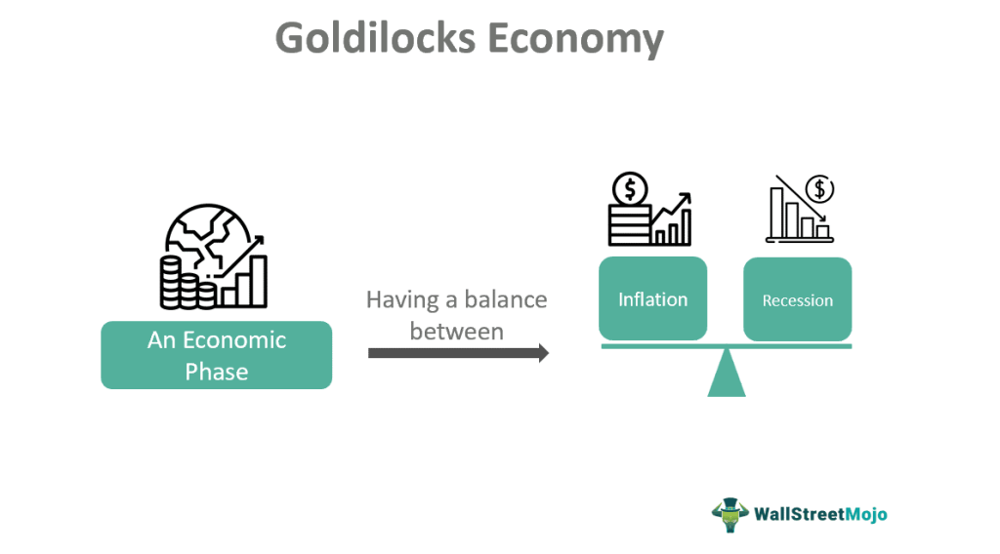

In the ever-evolving landscape of global economics, achieving a harmonious balance between growth and sustainability stands as a central challenge for policymakers, economists, and financial institutions. This challenge is encapsulated in the concept of the Goldilocks Economy, where economic conditions are 'just right'—neither too hot, leading to inflation, nor too cold, resulting in stagnation. Drawing inspiration from the renowned fairy tale, the Goldilocks Economy embodies an ideal state that many nations strive to maintain, characterized by balanced growth, low inflation, and minimal unemployment.

The notion of the Goldilocks Economy has become increasingly relevant in modern financial strategies. As global markets face volatility due to technological disruptions, geopolitical tensions, and unexpected events, maintaining an equilibrium is more critical than ever. This delicate balance is not only a theoretical aspiration but a practical necessity to ensure long-term prosperity and stability in global markets.



Algorithmic trading, or algo trading, has emerged as a significant tool in the quest for a Goldilocks Economy. By leveraging sophisticated computer algorithms to execute trades at high speeds, algo trading enhances market liquidity and reduces disruptions that could tip the economic scales. It operates on the principle of ensuring efficiency and stability in financial transactions, thereby supporting the conditions necessary for sustainable economic growth.

As we navigate the complexities of modern finance, the synergy between economic theories like the Goldilocks Economy and technological advancements, such as algorithmic trading, becomes increasingly crucial. By aligning these elements, it is possible to craft a modern financial landscape that upholds the principles of stability and growth, ensuring a prosperous future amid the challenges of globalization and technological change.

## Table of Contents

## Understanding the Goldilocks Economy

The Goldilocks Economy describes an economic environment where growth is balanced and moderate, maintaining low inflation and minimal unemployment. This balance aims to create favorable conditions for economic stability without triggering the adverse effects of economic overheating, such as runaway inflation, or economic stagnation, such as high unemployment and negative growth rates.

### Indicators and Conditions of a Goldilocks Economy

A Goldilocks Economy is generally indicated by:

1. **Moderate GDP Growth**: Steady growth in Gross Domestic Product (GDP) without sharp accelerations or declines. Economic growth should ideally hover at a rate that supports job creation and consumption without pushing the economy beyond its sustainable capacity.

2. **Low Inflation**: Price stability is crucial. Typically, central banks aim for an inflation rate around 2%, which is seen as conducive to business planning and consumer confidence. Keeping inflation in check prevents the erosion of purchasing power and investment value.

3. **Low Unemployment**: Full employment does not imply zero unemployment, but rather a rate that reflects the natural movement of the workforce, often considered to be around 4-6% in many economies.

4. **Interest Rate Stability**: Interest rates that are neither too high nor too low to avoid excessive borrowing costs and encourage prudent lending and investment behaviors.

### Historical Examples

A historical example of a Goldilocks Economy can be seen in the United States during the mid-to-late 1990s. This period was characterized by:

- **Sustained GDP Growth**: The U.S. experienced continuous economic expansion without extreme fluctuations.
- **Inflation Control**: Inflation rates remained steady and within the targets set by the Federal Reserve.
- **Low Unemployment**: Unemployment rates fell to record lows, accompanied by rising productivity.

During this time, the integration of technology and globalization contributed to efficiency improvements and cost reductions, which sustained the economic conditions envisioned in a Goldilocks Economy. This period is often cited as a testament to effective economic management and policy alignment that supported sustainable growth.

In conclusion, understanding the Goldilocks Economy requires analyzing the precise interplay between growth, inflation, and employment. It remains a challenging yet rewarding state to achieve and sustain due to the dynamic nature of global markets and the myriad factors that influence economic stability.

## Economic Balance and Sustainable Growth

Achieving economic balance is central to sustainable growth, offering the foundation for long-term prosperity. Central to this concept is the synchronization of fiscal and monetary policies, which work to buffer economies against the extremes of inflation and unemployment. Policymakers and economists dedicate significant resources to creating and maintaining conditions that support a Goldilocks Economy, one that is neither too hot to cause rampant inflation nor too cold to result in stagnation and unemployment.

Central banks, through monetary policy, adjust interest rates and control money supply to influence economic activity. Lower interest rates can stimulate borrowing and investing, whereas higher rates may curb excessive growth and inflation. Concurrently, fiscal policy involves government spending and taxation decisions designed to influence economic output. A balanced fiscal approach entails investing in public goods and infrastructure while managing national debt levels judiciously.

Maintaining economic equilibrium amidst global uncertainties presents notable challenges. Geopolitical tensions, trade disputes, and sudden changes in commodity prices all pose risks to achieving a balanced economy. Additionally, the rapid pace of technological change, while driving growth, can also disrupt labor markets, creating disparities that complicate economic management.

Key strategies for promoting sustainable economic growth increasingly emphasize investment in technology and green energy. These investments not only foster innovation and create jobs but also contribute to reducing carbon footprints, aligning economic objectives with environmental sustainability goals. Technological advancements such as [artificial intelligence](/wiki/ai-artificial-intelligence), automation, and clean energy technologies are spearheading this transformation. For instance, increasing the efficiency of renewable energy sources like solar and wind can reduce reliance on fossil fuels, mitigating climate change while supporting economic growth.

In the context of economic theory, sustainable growth can be represented by the Solow Growth Model, which includes variables for labor, capital, and technology that all contribute to economic output. A simplified version of this model can be expressed as:

$$
Y = A \cdot K^\alpha \cdot L^{1-\alpha}
$$

Where $Y$ is the total economic output, $A$ represents technology, $K$ is the capital stock, $L$ is labor, and $\alpha$ is the output elasticity of capital, reflecting the contribution of capital to economic growth. Enhancing $A$ through innovation and technology can lead to higher $Y$, reflecting economic growth.

Python code can simulate scenarios based on this model, allowing policymakers to test different investment strategies in technology and capital:

```python
def solow_growth(tech, capital, labor, alpha=0.3):
    return tech * (capital ** alpha) * (labor ** (1 - alpha))

# Example values
tech_level = 1.2
capital_stock = 1000
labor_force = 500
output = solow_growth(tech_level, capital_stock, labor_force)
print(f"Total Economic Output: {output}")
```

By understanding and applying these strategies and models, nations can aim to achieve a Goldilocks Economy, balancing growth and sustainability in a continuously evolving world.

## The Role of Algorithmic Trading in Modern Economies

Algorithmic trading, often referred to as algo trading, leverages sophisticated computer algorithms to execute financial transactions at high speed, bringing notable efficiency and precision to financial markets. These algorithms are designed to analyze vast datasets quickly, enabling traders to make decisions based on real-time data and intricate market patterns. The primary advantage of this approach is its capacity to manage complex tasks efficiently, significantly reducing the time it takes to execute trades compared to traditional methods.

Algo trading plays a critical role in stabilizing markets, particularly during volatile conditions. By providing [liquidity](/wiki/liquidity-risk-premium), these algorithms help maintain equilibrium between buying and selling pressures, ensuring that market disruptions are minimized. Liquidity, a fundamental metric in financial markets, refers to the ease with which an asset can be bought or sold without affecting its price. Algorithmic trading contributes to liquidity through high-frequency trading ([HFT](/wiki/high-frequency-trading-strategies)), which involves executing thousands of trades in fractions of a second. This constant stream of trades helps to stabilize prices and narrow bid-ask spreads, which are the differences between the highest price a buyer is willing to pay and the lowest price a seller is willing to accept.

Furthermore, [algorithmic trading](/wiki/algorithmic-trading) aligns with the objectives of a Goldilocks Economy by promoting stability and reducing market inefficiencies. By dynamically assessing pricing and liquidity conditions, algo trading helps preempt scenarios where the economy might 'overheat' or 'cool down', thus maintaining conditions that are 'just right'. This is particularly beneficial in markets that are susceptible to sudden shifts due to unexpected news or events.

However, the use of algorithmic trading is not without its risks and ethical considerations. One significant risk pertains to the potential for market manipulation. Algorithms, if not properly regulated, can be used to engage in practices such as quote stuffing, where a large number of orders are placed to create an illusion of demand or supply, thus manipulating prices. A well-documented instance of concern was the "Flash Crash" of May 6, 2010, when the Dow Jones Industrial Average plunged nearly 1,000 points and recovered within minutes, largely attributed to automated trading systems exacerbating market [volatility](/wiki/volatility-trading-strategies).

Ethical considerations also arise from the unequal access to algorithmic trading technology. Larger financial institutions often have more resources to develop and implement complex trading systems, potentially leading to an unlevel playing field. Regulatory bodies are continuously working to address these issues to ensure fair and transparent market conditions.

Measures such as implementing circuit breakers, which halt trading if a market index moves beyond predefined thresholds, and establishing strict guidelines for algorithm development and testing are essential to mitigate these risks. Additionally, ongoing innovation in [machine learning](/wiki/machine-learning) and artificial intelligence holds promise for even more robust systems that can better anticipate market needs and respond accordingly, further supporting stable economic conditions.

In summary, algorithmic trading stands as a pivotal component in modern economies, with its dual capabilities of enhancing market liquidity and mitigating volatility. While challenges remain, particularly concerning ethical and regulatory issues, its advancement and integration into the broader economic landscape signify a substantial opportunity for sustaining the balanced growth emblematic of a Goldilocks Economy.

## Challenges and Risks of Achieving a Goldilocks Economy

Maintaining a Goldilocks Economy, where growth is balanced and sustainable, is inherently fraught with challenges. Such an economy relies on precise economic conditions that must be continuously monitored and managed to avoid overheating or stagnation. One of the primary obstacles in achieving this balance is geopolitical tension. Political instability and conflict can disrupt trade, alter market dynamics, and deter investment. For instance, trade wars, such as the tariff disputes between major economies, can lead to increased costs for businesses and consumers, ultimately impacting economic growth and stability.

Another significant challenge is technological disruption. While technological advancements drive economic efficiency and growth, they can also lead to job displacement and increased inequality if not managed correctly. The rapid pace of innovation demands constant adaptation of the workforce and economic policies to counteract these disruptive effects. For example, the rise of automation and artificial intelligence has prompted debates about the future of work and the necessity of reskilling programs to maintain employment levels and economic balance.

Unexpected market shifts also pose a threat to a Goldilocks Economy. Financial markets are inherently volatile and can be influenced by sudden changes in investor sentiment, fluctuations in currency values, or unexpected financial crises. Economic policies must, therefore, be flexible and robust to address such volatility. This requires a combination of prudent fiscal management and adaptable monetary policies that can respond quickly to unexpected changes.

The global crises, such as pandemics and trade wars, further complicate the challenge of sustaining a Goldilocks Economy. The COVID-19 pandemic, for instance, highlighted the vulnerabilities in global supply chains and the need for resilience in economic systems. It forced policymakers to adopt unconventional monetary and fiscal measures to stabilize economies. Similarly, trade wars can escalate beyond mere tariffs, affecting global supply chains and causing broader economic disruptions. These crises accentuate the need for international cooperation and policy alignment to sustain economic equilibrium.

In response to these challenges, economic policies and financial technologies must evolve. Policymakers need to prioritize adaptive strategies that anticipate potential risks and swiftly address emerging economic issues. Embracing innovation in financial technologies, such as real-time data analytics and blockchain, can provide tools for more efficient economic management. For example, advanced data analytics can enhance the prediction of economic trends, allowing for preemptive adjustments in policy.

Ultimately, the pursuit of a Goldilocks Economy is a dynamic process, requiring ongoing vigilance and innovation. By addressing geopolitical, technological, and market-related challenges, economies can better navigate the complexities of maintaining balanced growth and stability.

## Future Prospects: Innovations and Adaptations

Looking ahead, the integration of new technologies will play a pivotal role in achieving economic balance. Emerging trends and technologies such as artificial intelligence (AI) and blockchain are poised to have a significant impact on future scenarios of the Goldilocks Economy. These technologies offer opportunities for increased efficiency, transparency, and adaptability in economic management.

Artificial intelligence has the potential to transform economic systems by enhancing decision-making processes. AI can analyze vast amounts of data to identify economic trends, predict market behaviors, and optimize resource allocation. For instance, machine learning algorithms can be used to develop predictive models for inflation and employment rates, two critical indicators of a Goldilocks Economy. The implementation of AI could lead to more precise fiscal and monetary policies, allowing for quicker adjustments to maintain economic equilibrium.

In addition to AI, blockchain technology presents a unique opportunity to enhance transparency and trust in financial transactions. By utilizing decentralized ledgers, blockchain can improve the security and efficiency of transactions, reducing the risk of fraud and errors. This technology could be applied to various sectors, including supply chain management and international trade, helping to stabilize economic activities and promote sustainable growth. Moreover, blockchain's capability to facilitate smart contracts can streamline processes and reduce costs, contributing to a balanced economic environment.

Adapting traditional economic models to incorporate these technological advancements requires strategic adjustments. Economists and policymakers need to be proactive in embracing these innovations to stay ahead of potential disruptions. One approach could be to integrate AI-driven analytics into existing economic forecasting models. By doing so, governments and businesses can make more informed decisions to support economic balance and growth.

Furthermore, fostering collaboration between technology developers and economic institutions can accelerate the integration of AI and blockchain into economic frameworks. Encouraging public-private partnerships and investing in research and development can drive technological adoption and innovation. By leveraging these emerging technologies, economies can improve their resilience to global uncertainties and enhance their capacity for sustainable development.

Ultimately, the potential of artificial intelligence and blockchain in economic management highlights the importance of continuous technological adaptation. As these technologies evolve, their integration into economic systems will play a crucial role in maintaining the delicate balance of a Goldilocks Economy. Through strategic planning and investment in innovation, economies can achieve a more stable and sustainable future.

## Conclusion

The pursuit of a Goldilocks Economy embodies the quest for a harmonious balance between economic growth and stability. This ideal occurs when economic policies are finely tuned to maintain an environment where growth is sustainable without triggering inflationary pressures or leading to economic stagnation. Synchronicity between economic policy and technological innovation plays a crucial role in achieving and maintaining this balance. Policymakers must effectively coordinate fiscal and monetary measures while embracing technological advancements that enable a more efficient and responsive economic framework.

Algorithmic trading, a prominent technological advancement, exemplifies the intersection of finance and innovation. Its capacity to execute large volumes of trades at high speeds enhances market liquidity and can mitigate the risks associated with market volatility. As this technology continues to evolve, its contribution to sustaining economic equilibrium becomes increasingly significant. By improving market dynamics, algorithmic trading can help maintain the stability necessary for a Goldilocks Economy.

While the path to a Goldilocks Economy is fraught with challenges, such as geopolitical uncertainties and technological disruptions, continuous adaptation and innovation provide viable avenues for overcoming these hurdles. The integration of emerging technologies like artificial intelligence and blockchain offers promising prospects for sustainable growth. These technologies can optimize economic management processes, provide predictive insights, and enhance the transparency and efficiency of financial systems.

Ultimately, the Goldilocks Economy remains a pivotal guiding concept for navigating the complexities of modern finance. Achieving this elusive balance requires not only strategic economic policies but also a willingness to embrace technological innovations that can transform economic landscapes. With ongoing efforts, there is significant potential for fostering environments where both growth and stability coexist, driving long-term prosperity and resilience in the global economy.

## References & Further Reading

[1]: ["The Goldilocks Economy"](https://www.investopedia.com/terms/g/goldilockseconomy.asp) by The Economist

[2]: Mishkin, F.S. (2007). ["The Economics of Money, Banking, and Financial Markets"](https://www.pearsonhighered.com/assets/preface/0/1/3/4/0134855388.pdf) (8th ed.). Pearson.

[3]: ["Advances in Financial Machine Learning"](https://www.amazon.com/Advances-Financial-Machine-Learning-Marcos/dp/1119482089) by Marcos Lopez de Prado

[4]: Harris, L. (2003). ["Trading and Exchanges: Market Microstructure for Practitioners"](https://www.amazon.com/Trading-Exchanges-Market-Microstructure-Practitioners/dp/0195144708) Oxford University Press.

[5]: Chan, E.P. (2008). ["Quantitative Trading: How to Build Your Own Algorithmic Trading Business"](https://github.com/ftvision/quant_trading_echan_book) Wiley Trading.