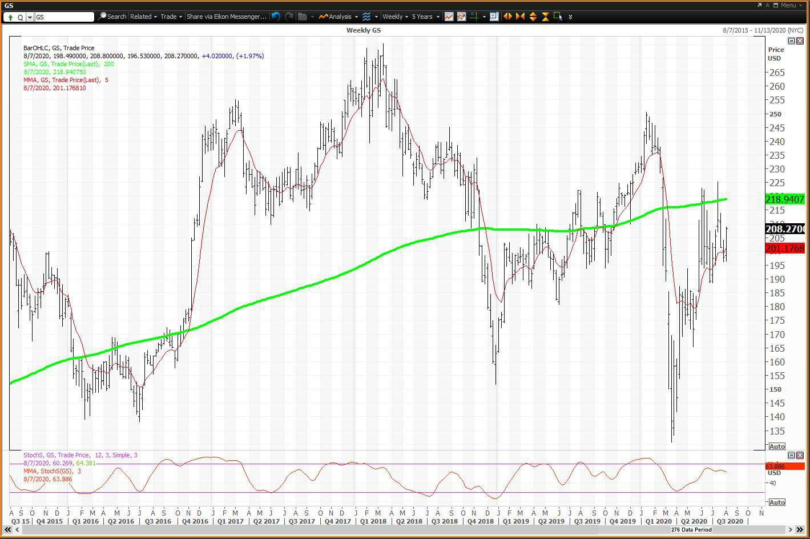

Goldman 360 is a groundbreaking financial services platform pioneered by Goldman Sachs. It is designed to transform investment management and enhance trading performance. This sophisticated platform is tailored to meet the needs of investment managers and financial professionals by providing a wide array of services that streamline complex financial operations and decision-making processes. As digital transformation gains momentum, financial platforms like Goldman 360 have become essential components of contemporary investment strategies. They facilitate real-time data access, algorithmic trading, and comprehensive portfolio management.

Goldman 360 distinguishes itself by integrating advanced technological solutions with Goldman Sachs' extensive experience in finance to deliver superior investment management services. By offering tools that enhance research capabilities, automate trading, and optimize investment strategies, the platform addresses the rapidly evolving demands of the financial services industry. This article will examine the features, advantages, and impact of Goldman 360, highlighting its role in reshaping the financial services sector.

## Table of Contents

## What Is Goldman 360?

Goldman 360 is a sophisticated financial services platform developed by Goldman Sachs, designed to enhance money management and trading efficiency. As a versatile business platform, it offers an integrated environment where financial professionals can manage investment portfolios, execute trades, and perform complex financial analyses.

A key feature of Goldman 360 is its comprehensive research database. This database includes a wealth of investment ideas and extensive research, empowering investment managers with the insights necessary to make informed decisions. By providing access to detailed investment research, the platform enables users to stay ahead of market trends and leverage data-driven strategies to optimize their portfolios.

Trade execution and order management are pivotal services offered by Goldman 360. The platform provides advanced tools that facilitate the seamless execution of trades, enabling users to react swiftly to market movements. With an efficient order management system, it ensures that trades are processed accurately, thereby reducing the likelihood of errors and enhancing overall trading performance.

Goldman 360 also supports complex portfolio calculations, a critical component for sophisticated investment management. Users can perform intricate financial calculations and analyses that help in assessing and optimizing portfolio performance. This functionality is particularly beneficial for developing strategies that align with specific investment goals and risk tolerances.

In essence, Goldman 360 represents the culmination of Goldman Sachs’ extensive experience in financial technology and investment banking. The platform's comprehensive suite of tools and services positions it as a leader in digital transformation within the financial services industry, enabling professionals to navigate the complexities of modern markets with greater agility and insight.

## Goldman Sachs Overview

Goldman Sachs, established in 1869, is a prominent entity in global finance and investment banking. Over the years, the firm has built a reputation for offering a wide range of financial services. These services include mergers and acquisitions, asset management, and securities underwriting, making it a versatile player in the industry.  

In the arena of mergers and acquisitions, Goldman Sachs provides advisory services to clients across various sectors, helping them navigate complex transactions and strategic partnerships. This division of the firm plays a critical role in facilitating corporate restructuring and growth initiatives, leveraging its extensive experience and market insights to deliver optimal outcomes.  

Asset management is another core area where Goldman Sachs excels. With a focus on delivering value to clients, the firm manages a vast array of assets across equities, fixed income, and alternative investments. Their strategies are tailored to meet specific client needs, supported by rigorous research and risk management practices. This service not only enhances capital growth for clients but also contributes significantly to the firm's revenue stream.  

As a key market maker, Goldman Sachs ensures [liquidity](/wiki/liquidity-risk-premium) in the markets by consistently providing bid and ask prices, thereby supporting efficient market operations. Its role as a primary dealer in U.S. Treasury securities underscores its importance in financial markets, facilitating the purchase and sale of government securities on behalf of clients. This market-making activity not only stabilizes financial markets but also generates substantial revenue for the firm.  

Investment management and [market making](/wiki/market-making) are pivotal to Goldman Sachs' revenue generation strategy. These functions enable the firm to maintain a robust financial standing, even amidst fluctuating market conditions. By harnessing its global networks and advanced financial technology, Goldman Sachs continues to uphold its status as a leader in financial services, adeptly navigating the intricate landscapes of investment banking and asset management.

## Exploring the Features of Goldman 360

Goldman 360 is designed to deliver a comprehensive and intuitive experience for managing financial portfolios and investments. At the core of its functionalities is a unified dashboard that presents users with detailed views of their financial portfolios. This feature enables investment managers and financial professionals to access and analyze their investment holdings seamlessly. The platform's robust analytics tools provide personalized investment recommendations, using advanced data analysis techniques to distill actionable insights from vast amounts of financial data. Users are empowered to make informed investment decisions tailored to their specific goals and risk tolerance.

One of the significant advantages of Goldman 360 is its mobile accessibility. Investors are no longer tethered to their desktops or office environments; they can manage and optimize their investment portfolios efficiently, no matter where they are. This flexibility ensures that users can respond promptly to market fluctuations and make strategic moves as necessary.

In terms of security, Goldman 360 incorporates several advanced features to protect user data. Encryption safeguards the transmission and storage of sensitive information, ensuring that data remains confidential and invulnerable to unauthorized access. Additionally, the platform employs multi-[factor](/wiki/factor-investing) authentication, adding an extra layer of security by requiring users to verify their identities through multiple credentials. This dual approach not only augments the security posture of Goldman 360 but also enhances user confidence in the platform's ability to protect their valuable financial information.

## Automated Trading with Goldman 360

Goldman 360 is designed to optimize [algorithmic trading](/wiki/algorithmic-trading) by applying advanced algorithms that elevate decision-making processes. The core of algorithmic trading lies in the use of complex mathematical models and high-speed computations to execute trades with minimal human intervention. This approach allows for rapid decision-making, essential in the fast-paced trading environment.

Real-time market analysis is a crucial component of Goldman 360, providing users with continuous data feeds. These live data streams enhance trading activities by offering up-to-the-minute information, enabling quick adaptations to changing market conditions. The integration of live data feeds ensures that traders have access to the latest market trends, which is vital for making informed decisions.

The platform's automation capabilities significantly streamline complex trading strategies. Through automation, repetitive and time-consuming tasks are handled efficiently, allowing traders to focus on strategy refinement and performance optimization. For instance, Goldman 360 can automate the execution of trades based on pre-set conditions, such as price thresholds or timing, thus minimizing the need for manual oversight.

Risk management is another key feature within Goldman 360, with dedicated tools designed to identify and mitigate potential trading risks. These tools employ sophisticated algorithms to analyze market [volatility](/wiki/volatility-trading-strategies) and assess the risk profile of different trading positions. By providing insights into potential risks, the platform empowers traders to adjust their strategies proactively, ensuring a more robust approach to risk management.

Incorporating cutting-edge algorithmic technology, real-time data analytics, and comprehensive risk management, Goldman 360 offers a holistic solution for enhancing trading efficacy and decision-making quality.

## Leveraging Data Analytics for Informed Decision Making

Goldman 360 employs data analytics as a cornerstone of its platform to deliver actionable insights that enhance investment strategies. The platform leverages sophisticated algorithms to analyze extensive datasets, providing users with a granular understanding of market dynamics. This data-driven approach is instrumental in refining risk management practices and predicting market trends more accurately. By incorporating historical and real-time data, Goldman 360 facilitates the development of predictive models that estimate future price movements and volatilities, aiding in the identification of optimal entry and [exit](/wiki/exit-strategy) points in trading.

Big data analytics substantially elevates the client experience by offering tailored financial advice. The platform captures and processes diverse data streams to identify patterns and correlations, which are then translated into personalized investment recommendations. This customization ensures that the advice provided aligns closely with individual investor profiles and objectives, enhancing decision-making and fostering client satisfaction.

Moreover, data analytics is pivotal in the construction and optimization of investment portfolios. Advanced analytical tools assess asset performance metrics and correlations, enabling the formulation of strategies that maximize returns while minimizing risks. Portfolio managers can utilize these insights to balance portfolios, hedge against potential losses, and capitalize on market opportunities. By automating these complex calculations and simulations, Goldman 360 allows financial professionals to iterate their strategies more efficiently, ensuring portfolios remain aligned with evolving market conditions.

Overall, the integration of data analytics within Goldman 360 not only empowers investment managers with superior foresight and precision but also underscores the platform's commitment to leveraging technology for the benefit of its clients.

## Enhancing Customer Experience with Goldman 360

Goldman 360 is designed to provide a superior customer experience by offering personalized financial services tailored to the specific needs of each client. The platform achieves this through several key features that contribute to a comprehensive and interactive user experience.

A notable advantage of Goldman 360 is its seamless integration with other financial systems. This capability enables users to gain a holistic view of their financial portfolios, as the platform consolidates data from various sources. Such integration not only enhances the accuracy of financial analysis but also simplifies the management of diverse investments, allowing clients to make informed decisions with ease.

Real-time financial information is another critical feature of Goldman 360. By offering up-to-the-minute data on market trends and changes, the platform ensures that clients remain informed about the latest developments. This immediacy empowers investors to respond swiftly to market fluctuations, optimizing their investment strategies and capitalizing on emerging opportunities.

Additionally, Goldman 360 provides interactive tools and educational resources aimed at improving clients' financial literacy. These resources include tutorials, webinars, and simulation tools that offer insights into market dynamics and investment strategies. By equipping clients with the knowledge to navigate complex financial landscapes, the platform fosters a more informed and confident investor base.

Through these features, Goldman 360 enhances the customer experience by delivering personalized, integrated, and interactive financial services. This approach not only adds value to client relationships but also positions Goldman 360 as a leader in the rapidly evolving financial services sector.

## Security and Compliance in the Digital Era

Goldman 360 prioritizes security with a multi-faceted approach that incorporates advanced encryption techniques and continuous system monitoring. The platform employs cutting-edge cryptographic protocols to ensure data integrity and confidentiality, safeguarding sensitive information from potential breaches. These encryption methodologies are designed to protect user data both in transit and at rest, ensuring that unauthorized parties cannot access confidential information.

In addition to robust encryption practices, Goldman 360 implements rigorous continuous monitoring systems. This involves real-time surveillance of all platform activities to detect and respond to anomalies or suspicious behaviors promptly. The monitoring framework is equipped with intelligent algorithms that can identify potential security threats and trigger immediate corrective actions, thereby minimizing the risk of data breaches and ensuring the platform remains secure.

Compliance is another cornerstone of Goldman 360’s security architecture. The platform integrates comprehensive compliance modules that ensure adherence to stringent industry regulations and standards, including those set by financial authorities and data protection agencies globally. These modules are continually updated to reflect the latest regulatory changes, enabling Goldman 360 to maintain compliance and mitigate legal risks effectively. 

The strong emphasis on data privacy is fundamental to building trust with users. Goldman 360 employs a privacy-by-design approach, which integrates data protection measures into the core architecture of the platform. This approach ensures that personal information is collected, processed, and stored in compliance with privacy laws, such as the General Data Protection Regulation (GDPR). By aligning with these regulations, Goldman 360 reinforces user confidence in its ability to protect personal data.

Efforts in ensuring security and compliance establish Goldman 360 as a dependable solution amidst the growing landscape of digital threats. By maintaining a robust security posture, Goldman 360 not only protects its clients’ investments and personal data but also fortifies its reputation as a leader in providing secure, compliant financial services in the digital era.

## Conclusion

Goldman 360 exemplifies leadership in digital transformation within the financial services sector. By seamlessly integrating portfolio management, research analysis, and automated trading, Goldman 360 is reshaping the investment landscape. This comprehensive integration facilitates improved decision-making, enhances operational efficiency, and streamlines complex financial processes.

The platform's robust architecture ensures that users can manage portfolios effectively and gain access to deep investment insights. Through intelligent automation, Goldman 360 significantly enhances the client experience, providing a higher level of personalization and responsiveness than traditional investment platforms. This approach allows financial professionals to optimize investment strategies rapidly and efficiently, leveraging real-time data and advanced analytics.

Moreover, as digital transformation continues to accelerate, Goldman 360 sets a benchmark in delivering advanced financial services solutions. It meets the rising demands for security and compliance, addressing the critical need for stringent data protection and regulatory adherence in today's digital economy. Consequently, Goldman 360 not only promises improved operational effectiveness but also establishes new standards for client satisfaction in financial services.

## References & Further Reading

[1]: Marcos López de Prado. ["Advances in Financial Machine Learning"](https://www.amazon.com/Advances-Financial-Machine-Learning-Marcos/dp/1119482089). Wiley, 2018.

[2]: Stefan Jansen. ["Machine Learning for Algorithmic Trading"](https://github.com/stefan-jansen/machine-learning-for-trading). Packt Publishing, 2018.

[3]: David Aronson. ["Evidence-Based Technical Analysis: Applying the Scientific Method and Statistical Inference to Trading Signals"](https://www.amazon.com/Evidence-Based-Technical-Analysis-Scientific-Statistical/dp/0470008741). Wiley, 2007.

[4]: Ernest P. Chan. ["Quantitative Trading: How to Build Your Own Algorithmic Trading Business"](https://www.amazon.com/Quantitative-Trading-Build-Algorithmic-Business/dp/0470284889). Wiley, 2008.

[5]: J. Bergstra, R. Bardenet, Y. Bengio, & B. Kégl. ["Algorithms for Hyper-Parameter Optimization."](https://dl.acm.org/doi/10.5555/2986459.2986743) Advances in Neural Information Processing Systems 24, 2011.