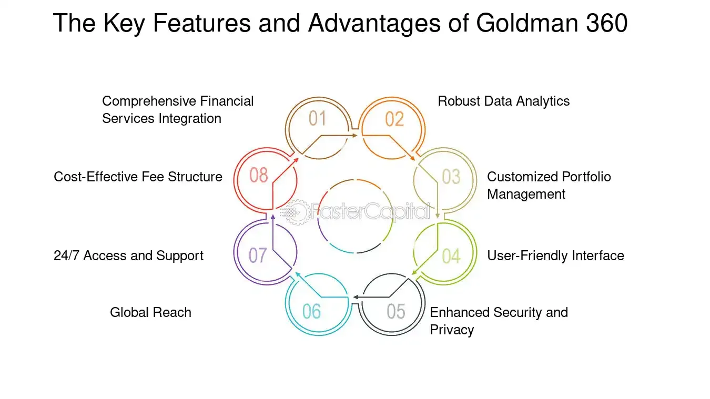

## Table of Contents

## What is Goldman 360?

Goldman 360 is a service provided by Goldman Sachs, a big bank. It helps businesses manage their money better. With Goldman 360, companies can see all their money in one place, even if it is in different banks. This makes it easier for them to know how much money they have and where it is.

The service also helps businesses move their money around quickly and safely. It can connect to other financial tools that companies use, making everything work together smoothly. This can save businesses time and help them make better decisions about their money.

## Who can use Goldman 360?

Goldman 360 is made for businesses that want to keep track of their money easily. Any company, big or small, can use it if they need to see all their money in different banks in one place. It's helpful for businesses that have money spread out and want to manage it better.

The service is also good for companies that move money around a lot. They can use Goldman 360 to send and receive money quickly and safely. It's useful for any business that wants to save time and make smart choices about their money.

## How does Goldman 360 work?

Goldman 360 works by connecting to all the different banks where a business keeps its money. It brings all this information together into one easy-to-use place. This means a company can see how much money it has in total, no matter where it is kept. It's like having a map that shows all your money in one view, which makes it easier to understand and manage.

The service also helps businesses move their money around. If a company needs to send money to another bank or pay someone, Goldman 360 can do it quickly and safely. It can also connect with other tools that businesses use for their money, like accounting software. This makes everything work together smoothly, saving time and helping businesses make better decisions about their money.

## What are the key features of Goldman 360?

Goldman 360 helps businesses by bringing all their money from different banks into one place. This makes it easy for them to see how much money they have in total. They don't have to log into different bank accounts to check their money. It's like having a single window to look at all their money.

The service also lets businesses move their money around quickly and safely. If they need to send money to another bank or pay someone, they can do it fast. Goldman 360 can also work with other tools that businesses use, like accounting software. This helps everything run smoothly and saves time. It's great for businesses that want to make smart choices about their money.

## How does Goldman 360 benefit users?

Goldman 360 helps businesses by making it easy to see all their money in one place. Instead of checking different bank accounts, businesses can use Goldman 360 to see how much money they have in total. This saves time and helps them understand their money better. It's like having a clear map of all their money, which makes managing it much easier.

The service also lets businesses move their money quickly and safely. If they need to pay someone or send money to another bank, they can do it fast. Plus, Goldman 360 can connect with other tools that businesses use, like accounting software. This makes everything work together smoothly, helping businesses save time and make smart decisions about their money.

## What are the costs associated with using Goldman 360?

Using Goldman 360 might cost money, but the exact price can change depending on what a business needs. Some businesses might pay a monthly fee to use the service, while others might pay based on how much they use it. It's a good idea for businesses to talk to Goldman Sachs to find out the exact cost for them.

The cost of using Goldman 360 can be worth it for businesses that want to save time and make better decisions about their money. By seeing all their money in one place and moving it quickly, businesses can work more efficiently. Even though there is a cost, the benefits of using Goldman 360 might help businesses save money in the long run.

## How does Goldman 360 compare to other financial management tools?

Goldman 360 is a special tool made by Goldman Sachs that helps businesses see all their money in one place, even if it's in different banks. This is different from other financial management tools that might only connect to one bank or not give a full picture of a business's money. With Goldman 360, businesses can move their money quickly and safely, which is helpful for companies that need to send money often. It also works well with other tools businesses use, like accounting software, making everything run smoothly.

Other financial management tools might focus more on things like budgeting, tracking expenses, or helping with taxes. These tools can be good for businesses that need help in those areas, but they might not offer the same level of money movement and connection to different banks that Goldman 360 does. So, while other tools have their own strengths, Goldman 360 is great for businesses that want to see all their money in one place and move it around easily.

## What kind of security measures does Goldman 360 have in place?

Goldman 360 takes keeping your money safe very seriously. They use strong security measures to protect businesses' information and money. When businesses use Goldman 360, their data is kept safe with encryption, which is like a secret code that keeps information private. This means that even if someone tries to get into the system, they can't read the information without the right key.

The service also uses multi-[factor](/wiki/factor-investing) authentication, which means businesses need more than just a password to log in. They might need a code sent to their phone or another way to prove it's really them. This makes it much harder for anyone else to get into a business's account. Goldman 360 also keeps an eye on all the money moving in and out, watching for anything that looks strange or wrong, so they can stop any problems before they get big.

## Can Goldman 360 be integrated with other financial systems?

Goldman 360 can be connected to other financial systems that businesses use. This means it can work together with tools like accounting software, making everything run smoothly. When a business uses Goldman 360, it can send and receive information to and from these other systems, helping to keep all their financial data in one place.

This integration is helpful because it saves time and reduces mistakes. Instead of entering the same information into different systems, businesses can do it once and let Goldman 360 handle the rest. This makes managing money easier and helps businesses make better decisions because they have all their financial information in one spot.

## What are some real-world examples of Goldman 360 in use?

A small business called "GreenGrocers" uses Goldman 360 to keep track of their money. They have accounts in different banks, and before using Goldman 360, it was hard to know how much money they had in total. Now, with Goldman 360, they can see all their money in one place. This helps them plan better and make sure they have enough money for things like buying more fruits and vegetables. It also makes it easy for them to pay their suppliers quickly and safely.

Another example is a tech company called "TechWave." They use Goldman 360 to move money around the world. TechWave has offices in different countries, and they need to send money to pay their workers and buy things they need. With Goldman 360, they can do this quickly and know that their money is safe. It also connects with their accounting software, so all their financial information stays up to date and easy to manage.

## What future developments can we expect for Goldman 360?

In the future, Goldman 360 might get even better at helping businesses. They could add new features that make it easier to see money in different ways, like charts and graphs. They might also let businesses do more things with their money, like investing it in new ways or getting loans faster. These changes could make Goldman 360 even more useful for companies of all sizes.

Another thing that could happen is that Goldman 360 might connect with even more tools that businesses use. Right now, it works with accounting software, but in the future, it could work with tools for things like payroll or taxes. This would make it easier for businesses to keep all their money information in one place and save even more time. By making these improvements, Goldman 360 could help businesses work better and make smarter choices about their money.

## How can users maximize their experience with Goldman 360?

To get the most out of Goldman 360, businesses should make sure they connect all their bank accounts to the service. This way, they can see all their money in one place and understand their total financial situation better. It's also important to use the money movement features often. If a business needs to pay someone or move money to another bank, doing it through Goldman 360 can save time and keep everything safe.

Another way to make the most of Goldman 360 is by connecting it to other tools that the business uses, like accounting software. This helps everything work together smoothly and makes managing money easier. Businesses should also keep an eye on the new features that Goldman Sachs might add to Goldman 360. Trying out these new features can help businesses find even more ways to save time and make smarter decisions about their money.

## References & Further Reading

[1]: Marcos López de Prado. ["Advances in Financial Machine Learning"](https://www.amazon.com/Advances-Financial-Machine-Learning-Marcos/dp/1119482089). Wiley, 2018.

[2]: Stefan Jansen. ["Machine Learning for Algorithmic Trading"](https://github.com/stefan-jansen/machine-learning-for-trading). Packt Publishing, 2018.

[3]: David Aronson. ["Evidence-Based Technical Analysis: Applying the Scientific Method and Statistical Inference to Trading Signals"](https://www.amazon.com/Evidence-Based-Technical-Analysis-Scientific-Statistical/dp/0470008741). Wiley, 2007.

[4]: Ernest P. Chan. ["Quantitative Trading: How to Build Your Own Algorithmic Trading Business"](https://www.amazon.com/Quantitative-Trading-Build-Algorithmic-Business/dp/0470284889). Wiley, 2008.

[5]: J. Bergstra, R. Bardenet, Y. Bengio, & B. Kégl. ["Algorithms for Hyper-Parameter Optimization."](https://dl.acm.org/doi/10.5555/2986459.2986743) Advances in Neural Information Processing Systems 24, 2011.