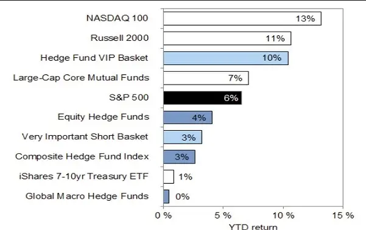

## Table of Contents

## What is Goldman Sachs?

Goldman Sachs is a big bank and financial company that helps people and businesses with money. It was started in 1869 by a man named Marcus Goldman. The company is based in New York City but works all over the world. They do things like helping companies sell stocks, giving loans, and giving advice on how to manage money.

The company is known for being very smart about money and business. They work with big companies, governments, and rich people to help them make good choices with their money. Goldman Sachs also has a part of the company that helps regular people with their money, like saving for the future or buying a house. They are one of the biggest and most important banks in the world.

## What are hedge funds?

Hedge funds are special investment funds that rich people and big organizations use to try to make more money. They are different from regular investment funds because they can use many different strategies to make money, not just buying and selling stocks. Hedge funds often try to make money no matter if the stock market goes up or down. They do this by using complicated methods like betting against stocks or using borrowed money to make bigger investments.

These funds are usually only for people who have a lot of money because they can be risky. The people who run hedge funds, called fund managers, are paid a lot of money if they do well. They charge fees to the people who invest in their funds, often taking a percentage of the profits they make. Because hedge funds can be risky, they are not as tightly controlled by the government as other types of investments, which is why they are usually only for experienced investors.

## What does it mean for a stock to be 'most-loved' by hedge funds?

When a stock is called 'most-loved' by hedge funds, it means that many hedge fund managers think it's a good investment. They believe the company behind the stock will do well and make them money. Hedge funds often do a lot of research and use special strategies to pick stocks, so if lots of them are buying a particular stock, it's a sign that they think it's a smart choice.

Being 'most-loved' can make a stock more popular and might even make its price go up because more people want to buy it. But it's important to remember that just because hedge funds like a stock doesn't mean it's guaranteed to do well. Investing always has risks, and even the smartest hedge fund managers can be wrong sometimes. So, it's good to be careful and do your own research before deciding to invest in a stock, even if it's a favorite of hedge funds.

## How does Goldman Sachs identify the most-loved stocks by hedge funds?

Goldman Sachs looks at what hedge funds are doing to figure out which stocks they like the most. They check the reports that hedge funds have to file with the government, which show what stocks they own. By seeing which stocks many hedge funds are buying and holding, Goldman Sachs can tell which ones are popular. They also talk to people who work at hedge funds to get more information about why they like certain stocks.

Once Goldman Sachs has all this information, they make a list of the stocks that are most popular with hedge funds. This list can help other investors see which stocks might be good to buy. But, it's important to remember that just because hedge funds like a stock doesn't mean it will always go up in value. Stocks can be risky, and even the best research can be wrong sometimes.

## What are the criteria used by Goldman Sachs to determine which stocks are favored by hedge funds?

Goldman Sachs looks at what hedge funds are buying and holding to figure out which stocks they like the most. They do this by checking the reports that hedge funds have to file with the government, which show what stocks they own. If many hedge funds are buying and keeping a certain stock, Goldman Sachs can tell that it's popular among them. They also talk to people who work at hedge funds to get more information about why they like certain stocks.

Once Goldman Sachs has all this information, they put together a list of the stocks that are most popular with hedge funds. This list can help other investors see which stocks might be good to buy. But it's important to remember that just because hedge funds like a stock doesn't mean it will always go up in value. Stocks can be risky, and even the best research can be wrong sometimes.

## Can you list some of the current most-loved stocks by hedge funds according to Goldman Sachs?

Goldman Sachs says that right now, hedge funds really like stocks like Microsoft and Amazon. These companies are big in technology and do a lot of different things, from making software to selling stuff online. Hedge funds think these companies will keep growing and making more money, so they want to own their stocks.

Another stock that hedge funds love is NVIDIA. This company makes chips that are important for computers and video games. Hedge funds think that as more people use computers and play games, NVIDIA will do well. They are betting that this stock will go up in value.

These are just a few examples. Remember, what hedge funds like can change over time, and just because they like a stock doesn't mean it's guaranteed to do well. It's always a good idea to do your own research before you decide to buy any stock.

## How has the list of most-loved stocks by hedge funds changed over the past year?

Over the past year, the list of most-loved stocks by hedge funds has seen some big changes. At the start of the year, hedge funds were really into tech stocks like Apple and Alphabet. They thought these companies would keep growing because more people were working from home and using technology. But as the year went on, some hedge funds started to look at other types of stocks too. They began to like energy stocks more because oil and gas prices were going up. So, companies like ExxonMobil and Chevron started to show up on the list of most-loved stocks.

By the end of the year, the list had changed even more. Hedge funds were still interested in tech, but they also started to pay attention to healthcare stocks. Companies like UnitedHealth Group and Pfizer became more popular because people were still worried about health after the big health crisis. Also, some hedge funds started to like financial stocks more, like JPMorgan Chase and Bank of America, because they thought the economy was getting better and people would need more banking services. So, the list of most-loved stocks by hedge funds changed a lot over the year, showing that they are always looking for new opportunities to make money.

## What impact does being on the list of most-loved stocks have on a company's stock performance?

When a stock is on the list of most-loved stocks by hedge funds, it can make the stock's price go up. This happens because more people want to buy the stock. If hedge funds like a stock, other investors might think it's a good idea to buy it too. This can make the stock more popular and increase its demand. But, it's not always a sure thing. Sometimes, the stock might already be very expensive because so many people want it, and if it gets too expensive, it might not go up much more.

On the other hand, being on the list can also bring more attention to the company. This can make people look more closely at the company and its business. If they like what they see, they might keep buying the stock, which can help the price stay high. But if something goes wrong with the company, or if people start to think the stock is too expensive, the price can go down fast. So, being on the list can be good for a company's stock, but it also comes with some risks.

## How can investors use the information about most-loved stocks by hedge funds in their investment strategy?

Investors can use the information about most-loved stocks by hedge funds to help them decide which stocks to buy. If many hedge funds like a stock, it might mean that the stock has a good chance of going up in value. Hedge funds often do a lot of research, so following their choices can give investors some good ideas. But, investors should not just copy what hedge funds do. They should look at the reasons why hedge funds like a stock and see if it fits with their own goals and how much risk they are willing to take.

It's also important for investors to remember that just because a stock is loved by hedge funds, it doesn't mean it will always do well. Stocks can be risky, and even the smartest hedge funds can be wrong sometimes. So, investors should use this information as one part of their research, but they should also look at other things like the company's financial health, how the industry is doing, and what is happening in the economy. By combining all this information, investors can make smarter choices about where to put their money.

## What are the risks associated with investing in stocks favored by hedge funds?

Investing in stocks that hedge funds like can be risky. One big risk is that these stocks might already be very expensive. When lots of hedge funds buy a stock, the price can go up a lot. If you buy the stock when it's already high, you might not make as much money as you hoped. Also, if everyone decides to sell the stock at the same time, the price can drop fast, and you could lose money.

Another risk is that hedge funds can be wrong. Even though they do a lot of research, they can make mistakes. If they think a stock will go up but it doesn't, you could lose money if you followed their lead. Also, hedge funds might change their minds and sell the stock, which can make the price go down. So, it's important to do your own research and not just follow what hedge funds are doing.

It's also good to remember that hedge funds might use different strategies than regular investors. They might borrow money to buy more stocks or use other complicated methods. These strategies can be risky and might not be right for everyone. So, while it can be helpful to know which stocks hedge funds like, it's important to think about your own goals and how much risk you're willing to take before you invest.

## How do the investment strategies of hedge funds influence the selection of most-loved stocks?

Hedge funds use many different ways to make money, and these ways help them decide which stocks they like the most. They might look at a company's numbers to see if it's doing well, or they might try to guess what will happen in the future based on what's happening now. Sometimes, hedge funds use special strategies like borrowing money to buy more stocks or betting that a stock's price will go down. All these different ways of thinking about stocks help them pick the ones they think will make them the most money.

When lots of hedge funds like the same stock, it can become one of the most-loved stocks. This happens because hedge funds share information and ideas with each other, and if many of them think a stock is a good choice, it gets more attention. But, the stocks they pick can change as they learn new things or as the world changes. So, the most-loved stocks by hedge funds are always shifting based on what the hedge funds are thinking and doing at any given time.

## What advanced analytics or proprietary data does Goldman Sachs use to track hedge fund investments?

Goldman Sachs uses special tools and information to keep track of what hedge funds are doing with their money. They look at reports that hedge funds have to send to the government, which show which stocks they own. These reports help Goldman Sachs see which stocks are popular with hedge funds. They also use their own special data, like information from talking to people who work at hedge funds. This helps them understand why hedge funds like certain stocks and what they might do next.

By putting all this information together, Goldman Sachs can make a list of the stocks that hedge funds love the most. They use fancy computer programs and math to figure out patterns and trends in what hedge funds are buying and selling. This helps them give good advice to other investors who want to know which stocks might be good to buy. But, it's important to remember that even with all this special information, investing in stocks can still be risky.

## What is the understanding of hedge funds?

Hedge funds are sophisticated investment pools designed to maximize returns through active investment strategies. Unlike mutual funds, hedge funds have the flexibility to invest in a diverse array of asset classes such as stocks, bonds, derivatives, currencies, and more. This versatility allows hedge funds to pursue strategies like long and short equity, event-driven, macroeconomic trends, and [arbitrage](/wiki/arbitrage), among others. The overarching aim is to achieve absolute returns, meaning they seek to generate positive returns irrespective of overall market conditions.

The structure and strategies of hedge funds are typically leveraged to enhance performance and manage risk. For instance, a long/short equity strategy involves buying undervalued stocks while selling overvalued ones, aiming to capitalize on both upward and downward market movements. This dual approach can be represented mathematically as:

$$
\text{Net Exposure} = \text{Long Exposure} - \text{Short Exposure}
$$

Hedge funds often employ significant amounts of leverage to amplify their investments, which can be both a source of high returns and high risk. Investors in hedge funds are typically required to meet certain wealth criteria, as [hedge fund](/wiki/hedge-fund-trading-strategies) investments are less regulated and entail a higher level of risk.

Analyzing hedge fund portfolios offers valuable insights into current market trends and which stocks are performing well. Hedge funds are required to file their stock holdings quarterly with the Securities and Exchange Commission in the form of 13F filings. By examining these filings, analysts can identify patterns such as common stock picks and emerging sectors. This data often reveals the market strategies of successful funds and can guide other investors in their decision-making processes.

## References & Further Reading

[1]: Stulz, R.M. (2007). ["Hedge Funds: Past, Present, and Future."](https://www.jstor.org/stable/30033723) Journal of Economic Perspectives, 21(2), 175-194.

[2]: Lopez de Prado, M. (2018). ["Advances in Financial Machine Learning."](https://www.amazon.com/Advances-Financial-Machine-Learning-Marcos/dp/1119482089) Wiley.

[3]: Aronson, D. R. (2006). ["Evidence-Based Technical Analysis: Applying the Scientific Method and Statistical Inference to Trading Signals."](https://www.amazon.com/Evidence-Based-Technical-Analysis-Scientific-Statistical/dp/0470008741) Wiley.

[4]: Jansen, S. (2020). ["Machine Learning for Algorithmic Trading: Predictive models to extract signals from market and alternative data for systematic trading strategies with Python."](https://github.com/stefan-jansen/machine-learning-for-trading) Packt Publishing.

[5]: Chan, E. P. (2009). ["Quantitative Trading: How to Build Your Own Algorithmic Trading Business."](https://github.com/ftvision/quant_trading_echan_book) Wiley. 

[6]: Aldridge, I. (2013). ["High-Frequency Trading: A Practical Guide to Algorithmic Strategies and Trading Systems."](https://www.amazon.com/High-Frequency-Trading-Practical-Algorithmic-Strategies/dp/1118343506) Wiley. 

[7]: Benos, E., & Sagade, S. (2016). ["High-frequency trading behaviour and its impact on market quality: evidence from the UK equity market."](https://papers.ssrn.com/sol3/papers.cfm?abstract_id=2184302) Bank of England Working Paper No. 509.

[8]: Patterson, S. (2012). ["Dark Pools: The Rise of the Machine Traders and the Rigging of the U.S. Stock Market."](https://www.amazon.com/Dark-Pools-Machine-Traders-Rigging/dp/0307887189) Crown Business.