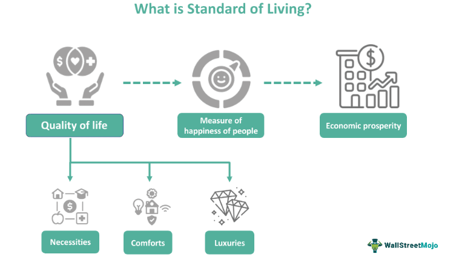

Algorithmic trading has become a cornerstone of modern financial markets, fundamentally altering how assets are traded. Defined as the use of computer algorithms to execute trading orders at speeds and magnitudes beyond human capability, algorithmic trading enables the swift and efficient processing of vast amounts of data. Its importance has risen with the increasing complexity and globalization of financial markets, where speed and precision can significantly impact profitability.

Central to trading, particularly in securities and commodities, is the concept of 'good delivery.' This term refers to the delivery of a product that meets the predefined standards set for its quantity, quality, and condition at the time of transaction. Good delivery is crucial in ensuring a smooth transfer of assets and maintaining trust between trading parties. In securities trading, it implies that the delivered security complies with the terms of the contract. In the commodities market, particularly with precious metals like gold, good delivery becomes even more critical due to the intrinsic value of the asset involved.

Gold standards criteria play a pivotal role in influencing good delivery in global trade markets. Historically, the gold standard system defined the value of a country's currency in terms of a fixed quantity of gold, which facilitated international trade by providing a universal measure of value. Although the traditional gold standard has been abandoned, the principles it introduced continue to influence trade practices, especially in the certification of gold's purity and quality for good delivery.

This legacy is most apparent in the practices established by the London Bullion Market Association (LBMA), which provides a Good Delivery List that certifies which gold refiners produce gold bars that meet the highest international standards. The criteria developed by the LBMA ensure that gold traded in global markets retains its quality and trustworthiness, impacting its valuation and trade credibility. These standards have set a benchmark not only for commodities like gold but also for practices in securities trading, where ensuring a good delivery remains a critical element for maintaining market integrity and efficiency.

## Table of Contents

## Understanding Gold Standards

Gold standards have played a crucial role in global economics, historically serving as a system where the value of a country's currency was directly linked to a specified amount of gold. This system emerged in the 19th century and gained prominence as countries sought to stabilize their monetary systems and facilitate international trade. By tying currency values to gold, nations aimed to enhance economic predictability and reduce inflationary pressures. The predictability of this value system enabled governments and businesses to plan with confidence, fostering international trade and investment.

Over time, the rigidity of the gold standard led to its decline, most notably with the collapse of the Bretton Woods system in 1971 when the United States terminated the convertibility of the dollar to gold. This decision pivoted global economies to adopt fiat currencies, which derive value by government regulation or law rather than physical commodities like gold.

The London Bullion Market Association (LBMA) plays an instrumental role in establishing contemporary gold standards. Founded in 1987, the LBMA sets global benchmarks for the quality of gold traded on international markets. The association's stringent criteria ensure that gold bars meet specific requirements related to size, weight, purity, and origin. This standardization fosters trust and reliability, critical for participants in the gold market, from miners to refiners and traders.

Central to the LBMA's work is the Good Delivery List, an internationally recognized catalog of refineries that meet the association's rigorous standards. Gold bars from these certified refiners are considered "Good Delivery" and are universally accepted among market participants. This status not only affirms the quality and purity of the gold but also impacts its valuation and credibility in the market. Good Delivery bars are typically 400-troy-ounce bars with a minimum fineness of 995 parts per thousand, ensuring high-quality and broadly accepted trading assets.

The Good Delivery List's impact extends beyond assuring quality. By maintaining such a list, the LBMA provides a framework that upholds market confidence, facilitating seamless transactions and improving [liquidity](/wiki/liquidity-risk-premium) in gold trading. This system plays a vital role, especially as global gold trading evolves with new technological advancements and market demands.

In summary, while the traditional gold standard has been phased out, the principles underpinning it continue to influence modern economic frameworks through organizations like the LBMA. By upholding rigorous standards, the LBMA ensures that gold remains a credible and valuable asset in the financial markets.

## Criteria for Good Delivery

Good delivery in gold markets is a cornerstone of ensuring the integrity and trustworthiness of gold transactions globally. The London Bullion Market Association (LBMA) sets forth stringent criteria that must be met for gold bars to be accepted as "good delivery" on key trading platforms. These standards are vital for maintaining a consistent quality and ensuring that gold transactions can proceed smoothly and with minimal risk.

One of the primary criteria for good delivery is the fineness of the gold bar. LBMA mandates that gold bars must have a minimum fineness of 995 parts per thousand, meaning the gold content must be at least 99.5%. This high level of purity is crucial in guaranteeing that the gold bar's intrinsic value is upheld, fostering trust among traders and stakeholders.

Markings on the gold bars are another critical [factor](/wiki/factor-investing). Each bar must bear specific markings that identify the refiner, the bar's purity, weight, and a unique serial number. These markings serve as a verification tool and help facilitate trade by providing a clear indicator of the bar's provenance and authenticity. This transparency is essential for both buyers and sellers to accurately assess the value of the asset they are trading.

The weight and dimensions of gold bars are also standardized under the LBMA's good delivery criteria. Typically, a good delivery gold bar weighs between 350 to 430 troy ounces, with the standard weight being approximately 400 troy ounces. The dimensions for a standard gold bar generally measure around 210 x 165 x 55 mm. These specifications ensure that all bars are uniform, which aids in storage, handling, and assessment across various platforms and jurisdictions.

These criteria collectively ensure the quality of gold bars and underpin the trust necessary for smooth and efficient transactions. By adhering to these standards, the LBMA facilitates a reliable gold market where trading partners can be assured of the quality and legitimacy of the gold being exchanged. This not only protects the reputation of the market but also contributes to the overall stability of global financial systems reliant on gold as a commodity.

In summary, the criteria stipulated by the LBMA for good delivery of gold bars — including fineness, markings, weight, and dimensions — are essential for maintaining the highest standards of quality and trust in global gold transactions.

## Good Delivery in Securities Trading

Good delivery in securities trading refers to the set of standards and procedures that guarantee the seamless transfer of financial instruments between buyers and sellers. This ensures that transactions are completed efficiently and accurately, which is vital for maintaining trust and integrity in the financial markets.

The criteria for determining good delivery can vary significantly across different markets and types of securities. For example, equities, bonds, and other tradable securities may have specific regulations and requirements depending on the market they are traded in. These criteria may include the proper transfer of ownership, the existence of a valid and clean title, and the absence of any legal attachments or conflicting claims on the security. The differences in criteria can be attributed to the regulatory environment and the intrinsic characteristics of the securities themselves. Equities, for example, may emphasize shareholder rights and voting procedures, whereas bonds might focus more on interest payments and maturity dates.

Modern electronic exchanges have played a crucial role in streamlining the good delivery process. These platforms facilitate the quick and accurate transfer of ownership through automated systems, reducing the potential for human error and fraud. Electronic exchanges employ various technologies, such as blockchain and distributed ledger technology (DLT), to ensure that securities are delivered as per the agreed-upon terms without any discrepancies. Moreover, these technologies facilitate real-time settlement and verification, which enhance the speed and reliability of transactions.

The automation provided by electronic exchanges not only improves operational efficiency but also ensures compliance with regulatory standards across different jurisdictions. By employing a standardized process for the validation and settlement of trades, electronic platforms help mitigate counterparty risks and enhance market liquidity. As a result, the implementation of good delivery practices in securities trading contributes significantly to the stability and integrity of financial markets worldwide.

## Algorithmic Trading and Good Delivery

Algorithmic trading represents the complex application of computer algorithms to execute trades based on predetermined strategies, often at speeds and frequencies that are impossible for human traders. This form of trading exploits the efficiencies gained from technology, with a growing dependence on the seamless execution of trades, a process known as "good delivery." In this context, good delivery ensures that the transfer of securities or commodities between parties occurs smoothly, reliably, and with minimum intervention.

Standardized good delivery systems are crucial for [algorithmic trading](/wiki/algorithmic-trading) because these algorithms operate on precision timing and exactness. By relying on standardized systems, algorithmic trade systems can minimize operational risks and avoid delays that could potentially impact trading outcomes. This is especially critical in high-frequency trading environments, where a split-second discrepancy can lead to significant financial discrepancies.

Algorithms gain multiple benefits from standardized good delivery, primarily through risk minimization and trade precision enhancement. Risk is often mitigated through the use of uniform criteria and protocols that govern the delivery process. When these standards are adhered to, transactions are more predictable, allowing for algorithms to adjust calculations and trading strategies in real time with enhanced confidence.

Good delivery criteria, such as those outlined by organizations like the London Bullion Market Association (LBMA), also play an integral role in algorithmic trading strategies. Incorporating such criteria in algorithmic models ensures compliance to the established standards and fosters reliability. For instance, a gold trading algorithm might automatically verify the LBMA certification of bullion before executing a buy or sell order, ensuring the transaction adheres to all regulatory and standards-based requirements.

The integration of good delivery in algorithmic trading extends to the development of smart contracts within blockchain technology, where predefined conditions must be met for a trade to be executed. This intersection of high standards and cutting-edge technology is central to maintaining trust and integrity within digital and traditional trading platforms. Consequently, in an era where speed and accuracy are paramount, the alignment of algorithmic trading strategies with good delivery standards provides a robust framework for efficient and reliable trading activities.

## Challenges and Developing Trends

The maintenance of gold standards and the good delivery process has historically faced several challenges, and these issues persist in today's markets. One of the primary challenges is ensuring quality control amidst increasing global demand. The high [volume](/wiki/volume-trading-strategy) of transactions and the diverse origins of gold require stringent compliance with established standards to preserve trust among market participants. Inconsistencies in gold purity, weight, and provenance can undermine the credibility of transactions, leading to potentially significant financial losses.

The influence of fluctuating regulations across countries also presents complications. Different jurisdictions may impose varying standards or regulations for trading and delivery, creating barriers to seamless international trade. This regulatory fragmentation necessitates enhanced harmonization efforts and the establishment of universal standards to facilitate smoother cross-border transactions.

Advancements in automation and technology offer promising solutions to some of these challenges. Automation in the good delivery processes ensures increased accuracy and efficiency, minimizing human errors that could compromise transaction integrity. Blockchain technology, in particular, has garnered attention for its potential to enhance transparency and traceability in gold trading. By creating immutable records of each transaction, blockchain can help ensure compliance with good delivery standards and facilitate easier audits.

Moreover, technological innovations such as [artificial intelligence](/wiki/ai-artificial-intelligence) (AI) and [machine learning](/wiki/machine-learning) (ML) are increasingly employed to improve the precision of these processes. Algorithms can rapidly detect anomalies or deviations from the expected delivery standards, providing real-time alerts to mitigate discrepancies. The implementation of AI and ML can significantly reduce the risk of errors, ensuring transactions adhere to established criteria for good delivery.

As we move further into the era of digital trading, the future of good delivery standards will likely shift towards greater reliance on decentralized technologies and smart contracts. These technologies can automate the enforcement of delivery criteria, ensuring that transactions occur only when all predetermined conditions are met. Such a system enhances not only compliance but also the speed at which trades can be executed.

The integration of these cutting-edge technologies represents an evolution of the good delivery standards that could reshape their application in the financial markets. However, it requires substantial investment and a coordinated approach from both industry stakeholders and regulatory bodies to realize its full potential. This future outlook is predicated on balancing the innovative possibilities of digital technologies while maintaining the core principles that have historically governed gold standards and good delivery practices.

## Conclusion

Gold standards and good delivery play a pivotal role in maintaining the integrity and efficiency of trading sectors worldwide. These criteria establish a baseline for the quality and authenticity of traded assets, whether it be gold, securities, or other commodities. The gold standard, historically a cornerstone in monetary systems, has evolved to underpin credibility in financial transactions through organizations like the London Bullion Market Association (LBMA). The LBMA's Good Delivery List, for instance, ensures that gold bars meet stringent specifications, thereby safeguarding investors against fraud and maintaining market stability.

In financial markets, the concept of good delivery extends beyond commodities to facilitate the seamless exchange of securities. It ensures that transactions are completed with precision and without dispute, which is crucial for both traditional trading floors and modern electronic exchanges. Algorithmic trading, which depends on speed and accuracy, significantly benefits from these standardized systems. By relying on well-defined good delivery criteria, algorithms can execute trades with reduced risk and increased efficiency, enhancing overall market liquidity and stability.

As global markets continue to evolve with advancements in technology, so too do the criteria and processes surrounding good delivery. Automation and digitalization are leading to more robust and streamlined operations, yet they also introduce new challenges in maintaining standards. Navigating these changes will be essential for sustaining the trust and efficacy of trading systems.

In conclusion, gold standards and good delivery are integral to the orderly functioning of financial markets. They serve as foundational mechanisms that enable both traditional and algorithmic trading to operate smoothly and reliably. As these systems continue to evolve in the digital age, they will play a crucial role in shaping the future of market efficiencies and global trade dynamics.

## References & Further Reading

[1]: ["LBMA Good Delivery Rules"](https://www.lbma.org.uk/publications/good-delivery-rules) - London Bullion Market Association.

[2]: Domowitz, I., & Steil, B. (2001). ["Automation, Trading Costs, and the Structure of the Securities Trading Industry."](https://www.nomurafoundation.or.jp/en/wordpress/wp-content/uploads/2014/09/19971011_Ian_Domowitz_-_Benn_Steil.pdf) Brookings-Wharton Papers on Financial Services.

[3]: Hendershott, T., Jones, C. M., & Menkveld, A. J. (2011). ["Does Algorithmic Trading Improve Liquidity?"](https://onlinelibrary.wiley.com/doi/full/10.1111/j.1540-6261.2010.01624.x) The Review of Financial Studies, 24(8), 2124-2154.

[4]: Skjeltorp, J. A., & Ødegaard, B. A. (2011). ["The Market Microstructure of the Oslo Stock Exchange."](https://onlinelibrary.wiley.com/doi/abs/10.1111/j.1540-6261.2010.01628.x) In: Encyclopedia of Financial Models.

[5]: Weron, R. (2014). ["Electricity Price Forecasting: A Review of the State-of-the-Art with a Look into the Future."](https://www.sciencedirect.com/science/article/pii/S0169207014001083) SSRN Electronic Journal.