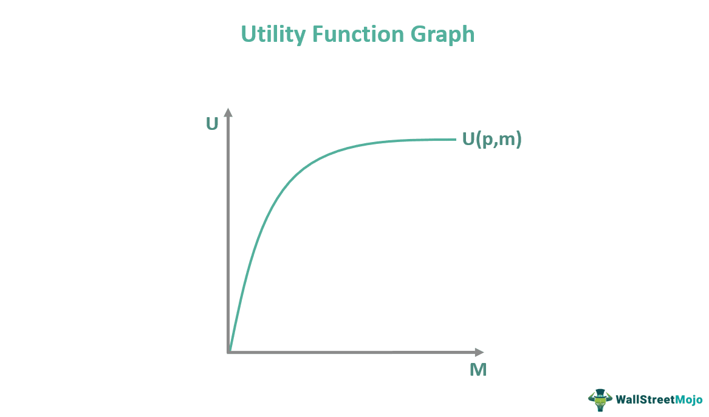

Algorithmic trading has significantly transformed the landscape of financial markets, offering numerous advantages such as increased trading speed, reduced transaction costs, and enhanced decision-making capabilities. Utilizing complex algorithms and mathematical models, algorithmic trading enables investors to execute orders with precision and efficiency, often surpassing human capabilities. Among the diverse range of strategies employed in algorithmic trading, the Good This Month (GTM) order type stands out due to its unique features and potential benefits. GTM orders, as the name suggests, remain active until the end of the current month, providing traders with an opportunity to capitalize on monthly market movements and trends.

In recent years, the integration of subscription models into algorithmic trading has emerged as a powerful combination, offering profound implications for traders. Subscription models in trading typically involve paying a recurring fee to access sophisticated trading algorithms, platforms, and tools. This model democratizes access to powerful trading technologies, allowing traders to leverage advanced strategies without substantial upfront investments.



By combining GTM orders with a subscription-based approach to algorithmic trading, investors can further enhance their decision-making processes. This synergy facilitates the automation of investment strategies based on specific timeframes, such as month-end evaluations, thereby allowing traders to focus on strategy development rather than manual order management. This combination of subscription models and GTM orders not only provides flexibility and adaptability but also offers the potential for traders to optimize their financial strategies and boost profitability.

The exploration of this interconnected framework aims to shed light on how these tools can be leveraged to optimize trading strategies. By doing so, investors stand to gain from improved operational efficiencies and potentially increase their returns in the dynamic financial markets.

## Table of Contents

## Understanding the Subscription Model in Trading

Subscription models have become increasingly prominent across various sectors, with trading being no exception. These models facilitate access to advanced trading algorithms and platforms through a recurring monthly fee, thereby democratizing advanced trading tools that were previously available primarily to institutional investors.

One of the main benefits of subscription-based trading platforms is the access they provide to premium features, such as sophisticated charting tools, algorithmic backtesting facilities, and real-time market alerts. These features enhance traders' ability to make informed decisions by delivering timely data and analysis directly to their chosen devices. Furthermore, many subscription services offer community support, where traders can interact with peers, discuss strategies, and share insights. This collaborative environment can provide significant educational value and potentially improve trading outcomes.

A significant advantage of subscription models is the ability they give traders to experiment with various trading strategies without incurring substantial upfront costs. Instead of investing heavily in proprietary trading infrastructure or hiring a team to develop and maintain algorithms, traders can leverage existing resources shared through the subscription service. This model lowers the barrier to entry for individual and small-scale traders, who can now compete more effectively within the financial markets.

The flexibility inherent in subscription-based models is another appealing aspect for traders. Unlike traditional software purchases or bespoke algorithm development, subscription services usually permit users to cancel or modify their plans according to their current needs and financial standing. This adaptability means that traders can tailor their access to resources in line with changing market conditions or personal trading goals, ensuring that they only pay for what they actually utilize.

In essence, subscription models are transforming the trading landscape by providing scalable and flexible access to cutting-edge tools. This approach facilitates a more inclusive trading environment, empowering traders of all scales to experiment, learn, and optimize their strategies without the need for significant financial commitments.

## Exploring GTM Orders in Algorithmic Trading

Good This Month (GTM) orders are a type of limit order that are designed to expire at the end of a calendar month. These orders are particularly advantageous for traders aiming to leverage end-of-month trends often observed in financial markets. By setting expiration dates to align with the monthly cycle, traders can strategically position their portfolios to take advantage of potential price movements or [liquidity](/wiki/liquidity-risk-premium) changes as institutions rebalance their assets or adjust their holdings.

GTM orders assist in managing market exposure and capital allocation by permitting traders to specify the maximum buying or minimum selling price for securities within a defined timeframe. This specific expiration mechanism ensures that orders are automatically canceled at month's end if not executed, providing a clear delineation for traders managing financial exposure. This method of order placement fits well within broader trading strategies that seek to minimize manual oversight and reduce the risk of human error.

The integration of GTM orders with [algorithmic trading](/wiki/algorithmic-trading) leverages the systematic and data-driven approach of algorithms to automate decision-making. Algorithms can be programmed to place GTM orders based on predefined conditions such as technical indicators, price patterns, or fundamental metrics. For instance, a Python script can be written to automatically submit GTM orders when certain moving average crossovers occur, aligning with a strategy that capitalizes on end-of-month patterns:

```python
import datetime
import trading_platform

def create_gtm_order(symbol, price, quantity, side):
    today = datetime.datetime.now()
    end_of_month = (datetime.date(today.year, today.month+1, 1) - datetime.timedelta(days=1)).day
    expiration_date = today.replace(day=end_of_month)

    order = trading_platform.Order(
        symbol=symbol,
        price=price,
        quantity=quantity,
        side=side,  # 'buy' or 'sell'
        expiration_date=expiration_date
    )

    return order

# Example usage
gtm_order = create_gtm_order(symbol="AAPL", price=150.0, quantity=10, side="buy")
trading_platform.submit_order(gtm_order)
```

By automating the placement of GTM orders, traders can focus on crafting strategy parameters and refining decision rules rather than handling the logistical aspects of order management. This can lead to more consistent execution and allows traders to efficiently scale their operations without diluting attention across many trades.

GTM orders thus provide a structured approach to market engagement, enabling traders to exploit time-based strategies systematically and strategically. This integration of GTM orders within algorithmic frameworks enhances both precision and strategic flexibility, making them a valuable instrument for modern traders seeking to harness end-of-month market dynamics.

## Advantages of Integrating Subscription Models with GTM in Algo Trading

Integrating Good This Month (GTM) orders within a subscription model for algorithmic trading offers a host of advantages for traders seeking to optimize their strategies and improve execution. One primary benefit of this integration is the ability for subscribers to receive continuous algorithm improvements that are tailored to evolving market conditions. Such enhancements are pivotal for executing trades more efficiently, thereby potentially increasing profitability.

Subscribers, by participating in a subscription model, gain cost-effective access to advanced trading tools and insights. These resources often include cutting-edge algorithms, data analytics, and real-time processing capabilities that might otherwise be financially prohibitive. The use of these tools enables traders to maintain a competitive edge without the need for significant upfront investment.

Additionally, these models facilitate the testing and refinement of trading strategies through the access to historical data and market simulations. Traders can utilize this data to backtest and validate their strategies, ensuring that they align with both past performance and projected market trends. For example, using historical data, one could code a simple [backtesting](/wiki/backtesting) script in Python:

```python
import pandas as pd
import numpy as np

# Load historical data into a DataFrame
data = pd.read_csv('historical_data.csv')

# Simple moving average strategy
data['SMA'] = data['Close'].rolling(window=20).mean()
data['Signal'] = np.where(data['Close'] > data['SMA'], 1, 0)

# Calculate returns
data['Returns'] = data['Close'].pct_change()
data['Strategy'] = data['Signal'].shift(1) * data['Returns']

# Strategy Performance
cumulative_returns = (1 + data['Strategy']).cumprod() - 1
print(f"Cumulative Return: {cumulative_returns[-1]:.2%}")
```

Moreover, the subscription model offers access to a community of like-minded traders, fostering a collaborative environment where ideas and insights can be exchanged. This communal aspect allows traders to dive deeper into market trends and share lessons learned, creating opportunities for joint strategy development and refinement.

In conclusion, integrating GTM orders within a subscription model not only keeps algorithmic strategies up-to-date and aligned with market dynamics but also enhances the overall trading experience. This approach empowers traders with the necessary tools, data, and community support to maximize their trading outcomes.

## Challenges and Considerations

Integrating subscription models with Good This Month (GTM) orders in algorithmic trading offers numerous opportunities, yet it necessitates meticulous planning and forethought. One of the primary challenges involves evaluating the credibility and performance history of algorithm providers. Investors should conduct rigorous due diligence, assessing past performances, and understanding the provider's reputation within the trading community. This assessment can include analyzing performance metrics such as Sharpe ratio, which measures the trade-off between risk and return, or conducting backtesting on historical data to ensure the algorithm's reliability.

Risk management forms another critical aspect of implementing GTM within subscription models. Traders must develop comprehensive risk management strategies to avoid overexposure and potential losses. For instance, using techniques like Value at Risk (VaR) could quantify the potential maximum loss over a specific time frame, providing a statistical measure of risk exposure. Moreover, diversification of assets and strategic allocation can mitigate risk, ensuring that adverse movements in the market do not disproportionately affect the trader's portfolio.

Staying informed about market trends is also vital as they can significantly influence GTM strategies. Continuous market monitoring and analysis are necessary to adapt trading tactics to changing conditions. This can involve using tools such as moving averages to determine trend directions or employing sentiment analysis to gauge market sentiment based on news and social media feeds. By remaining vigilant, traders can preemptively adjust their strategies to align with prevailing market dynamics.

Lastly, users should be flexible and ready to adapt their approach based on feedback and results from their trading activities. Subscription models often provide valuable insights and analytics that traders can leverage to refine their strategies. Integrating a feedback loop mechanism allows for the continuous improvement of trading tactics. For example, employing a [machine learning](/wiki/machine-learning) model such as a [reinforcement learning](/wiki/reinforcement-learning) algorithm could enable the system to learn from both successes and mistakes, optimizing decision-making over time. 

Careful consideration of these challenges ensures that the combination of GTM orders with subscription models in algorithmic trading becomes a powerful tool, enhancing both strategy execution and financial outcomes.

## Conclusion

The combination of subscription models and Good This Month (GTM) orders within algorithmic trading offers significant advantages to traders seeking to enhance their market engagement and financial outcomes. By leveraging these tools, traders can effectively capitalize on end-of-month trends, which are often marked by predictable market behaviors due to portfolio rebalancing and financial reporting deadlines.

Subscription models provide traders with continuous access to advanced algorithms that are regularly updated to adapt to market conditions. This adaptability is crucial for optimizing trading performance and resource allocation. The automation provided by GTM orders allows traders to set strategic entry and [exit](/wiki/exit-strategy) points, minimizing manual intervention and enabling them to focus on strategy refinement. This is particularly beneficial for handling complex strategies that require precise execution timing.

Furthermore, the use of subscription models in trading lowers the barrier to accessing sophisticated trading tools, allowing traders to test various strategies and measure their effectiveness using historical data. This flexibility facilitates continuous improvement and fine-tuning of trading approaches, which is essential for maximizing profitability and managing risks effectively.

To fully reap the benefits of these innovations, traders must ensure careful integration of subscription-based algorithms with their GTM trading strategies. This involves not only selecting credible algorithm providers with proven performance histories but also staying informed about current market trends that could impact GTM strategies. Flexibility and adaptability are key, as traders need to adjust their strategies based on evolving market conditions and feedback from trading outcomes.

Embracing these advanced trading tools through subscription models and GTM orders can lead to more effective trading practices by enhancing decision-making processes and optimizing financial strategies. The result is a potential increase in profitability and more robust risk management, paving the way for improved financial outcomes. By continuously refining and adapting their approach, traders can maintain a competitive edge in the dynamic landscape of algorithmic trading.

## References & Further Reading

[1]: ["Advances in Financial Machine Learning"](https://www.amazon.com/Advances-Financial-Machine-Learning-Marcos/dp/1119482089) by Marcos Lopez de Prado

[2]: ["Evidence-Based Technical Analysis: Applying the Scientific Method and Statistical Inference to Trading Signals"](https://www.amazon.com/Evidence-Based-Technical-Analysis-Scientific-Statistical/dp/0470008741) by David Aronson

[3]: ["Machine Learning for Algorithmic Trading"](https://github.com/stefan-jansen/machine-learning-for-trading) by Stefan Jansen

[4]: ["Quantitative Trading: How to Build Your Own Algorithmic Trading Business"](https://www.amazon.com/Quantitative-Trading-Build-Algorithmic-Business/dp/1119800064) by Ernest P. Chan