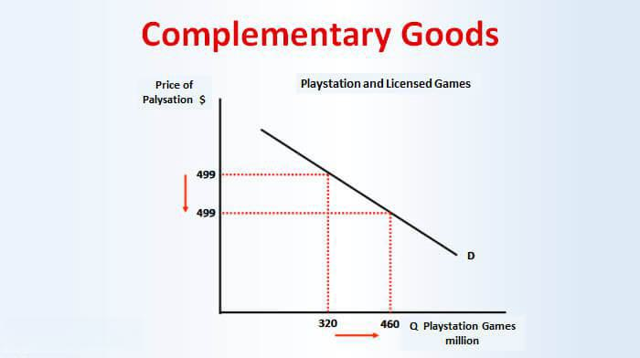

## Table of Contents

## What does 'Good Through' mean in the context of trading and finance?

In trading and finance, 'Good Through' is a term used to describe an order that remains active until a specific date. When you place a 'Good Through' order, you are telling your broker that you want the order to stay open and be executed any time before the date you set. This is useful if you are not in a hurry to buy or sell and you want to wait for the right price or market conditions.

For example, if you want to buy a stock but think the price might drop in the next two weeks, you can set a 'Good Through' order that lasts until the end of those two weeks. If the stock price drops to your target price within that time, the order will be executed automatically. This way, you don't have to keep checking the market every day.

## How is a 'Good Through' order different from other types of orders?

A 'Good Through' order is different from other types of orders because it lasts until a specific date you choose. Other common types of orders include 'Day Orders' and 'Good Till Canceled' orders. A 'Day Order' only lasts for the trading day it is placed. If it doesn't get filled by the end of the day, it expires. On the other hand, a 'Good Till Canceled' order stays active until you decide to cancel it, which could be days, weeks, or even months later.

The main difference between a 'Good Through' order and these other types is the control over the duration. With a 'Good Through' order, you set a specific end date, giving you more flexibility than a 'Day Order' but less permanence than a 'Good Till Canceled' order. This can be useful if you have a clear timeline in mind for when you want your order to be active. For example, if you think a stock will reach your target price within the next month, you can set a 'Good Through' order to last until the end of that month, without worrying about it staying open indefinitely.

## Can you explain the basic mechanics of setting up a 'Good Through' order?

Setting up a 'Good Through' order is pretty easy. You start by choosing the stock or asset you want to buy or sell. Then, you decide on the price you're willing to pay or accept. After that, you tell your broker or use your trading platform to set the order as a 'Good Through' order. You'll need to pick the date you want the order to last until. This could be a few days, weeks, or even months away, depending on what you think will happen with the stock price.

Once you've set everything up, you submit the order. The order will then stay open until either it gets filled at your chosen price, or until the 'Good Through' date you set arrives. If the stock reaches your price before the date, the order will be filled automatically. If it doesn't, the order will expire at the end of the day you chose. This way, you don't have to keep watching the market every day, and you can set it up to work while you focus on other things.

## What are the common time frames for 'Good Through' orders?

People often use 'Good Through' orders for different lengths of time, depending on what they want. Some might set it for just a few days if they think the price will change soon. Others might choose a few weeks if they're waiting for a bigger market shift. It all depends on what the person thinks will happen with the stock price.

A lot of traders like to set 'Good Through' orders for one to two weeks. This gives them enough time to see if the price will move in their favor without leaving the order open for too long. But some might go for a month or even longer if they're really patient and believe the stock will eventually hit their target price.

## In what situations would a trader use a 'Good Through' order?

A trader might use a 'Good Through' order when they have a clear idea of when they think a stock will reach their target price. For example, if a trader believes a stock will drop to a certain price within the next two weeks, they can set a 'Good Through' order to last until the end of that period. This way, they don't have to watch the market every day and can go about their other business, knowing the order will be filled if the price hits their target.

Another situation where a 'Good Through' order is useful is when a trader wants to buy or sell a stock but isn't in a hurry. They might have a price in mind but are okay waiting a bit longer for the right market conditions. By setting a 'Good Through' order, they can choose a date that gives the market enough time to move in their favor, without the order staying open indefinitely. This can be helpful for those who want more control over when their order is active but don't want to commit to a 'Good Till Canceled' order.

## How does a 'Good Through' order affect trading strategies?

A 'Good Through' order can really help traders by letting them set a specific time for their orders. This means they can plan their trading better. If a trader thinks a stock will hit a certain price in a few weeks, they can set a 'Good Through' order to last until then. This way, they don't have to watch the market all the time and can focus on other things. It's like setting a timer for when you want to buy or sell, which can make trading easier and less stressful.

Using a 'Good Through' order also helps traders stick to their plans. Sometimes, the market can change a lot, and it's easy to get tempted to change your mind. But with a 'Good Through' order, you've set a clear time frame for your trade. This can help you stay patient and wait for the right moment, instead of making quick decisions that might not be the best. It's a way to keep your trading strategy on track and not get swayed by short-term market swings.

## What are the potential risks and benefits of using 'Good Through' orders?

Using 'Good Through' orders can be helpful because they let you set a specific time for your trade. This means you don't have to watch the market all the time. You can just set the order and go do other things. It's also good because it helps you stick to your plan. If you think a stock will reach a certain price in a few weeks, you can set the order to last until then. This way, you don't rush into buying or selling just because the market is moving a lot.

But there are some risks too. One risk is that the market might move a lot right after you set your 'Good Through' order. If the stock price goes up or down quickly, your order might not get filled at the best time. Another risk is that you might miss out on other chances. If you set your order to last for a long time, you might not see other good times to buy or sell. So, it's important to think about these things when you use 'Good Through' orders.

## How do different trading platforms handle 'Good Through' orders?

Different trading platforms handle 'Good Through' orders in slightly different ways, but the main idea is the same. When you want to set a 'Good Through' order, you usually pick the stock or asset you want to trade, set the price you're okay with, and then choose the date you want the order to last until. Some platforms might have a special button or option for 'Good Through' orders, while others might let you type in the date yourself. It's important to check how your platform works so you know how to set it up right.

Once you've set up your 'Good Through' order, the platform will keep it open until either your price gets hit or the date you chose comes up. If the stock reaches your price before the date, the order will be filled automatically. If it doesn't, the order will expire at the end of the day you picked. Some platforms might send you a reminder or a message when your order is about to expire, but others might not. It's always good to keep an eye on your orders and know what to expect from your trading platform.

## Are there any specific regulations or compliance issues related to 'Good Through' orders?

When it comes to 'Good Through' orders, there aren't many specific regulations that are just about them. But, they do have to follow the general rules that all trading orders follow. These rules are set by places like the Securities and Exchange Commission (SEC) in the U.S. or other financial regulators around the world. The main thing is that brokers have to make sure they handle all orders fairly and honestly, no matter what type of order it is.

One thing to keep in mind is that some trading platforms might have their own rules about 'Good Through' orders. For example, they might have limits on how long you can set an order to last. It's a good idea to check with your trading platform to see if there are any special rules you need to know. This way, you can make sure you're following all the rules and using 'Good Through' orders the right way.

## How can 'Good Through' orders be optimized for better trading performance?

To make 'Good Through' orders work better for trading, it's important to pick the right time frame. If you think a stock will hit your target price soon, like in a few days or a week, set the order to last just that long. This way, you won't miss out if the price moves quickly. But if you think it might take longer, like a few weeks or even a month, you can set the order to last until then. This gives the market enough time to move in your favor without leaving the order open forever.

Another way to use 'Good Through' orders better is to keep an eye on the market and be ready to change your order if things change. Sometimes, the market can move a lot, and your first guess about when the stock will hit your price might not be right. If you see the stock moving in a different way than you expected, you can cancel your 'Good Through' order and set a new one with a different time frame or price. This way, you can stay flexible and make sure your trading plan stays on track.

## What advanced techniques can traders use with 'Good Through' orders to enhance their market position?

Traders can use 'Good Through' orders to set up a strategy called 'laddering.' This means setting multiple 'Good Through' orders at different price levels and with different end dates. For example, if you want to buy a stock, you can set one order at a lower price to last a few days, another at a slightly higher price to last a week, and maybe a third at an even higher price to last a month. This way, you can catch the stock at different prices as it moves, giving you more chances to buy at a good price.

Another advanced technique is to use 'Good Through' orders as part of a stop-loss strategy. If you own a stock and want to protect your gains, you can set a 'Good Through' order to sell the stock at a certain price, but only if it drops to that level within a set time. This can help you limit your losses if the stock price goes down suddenly. By combining 'Good Through' orders with other types of orders, like stop-loss orders, you can create a more complete trading plan that helps you manage risk and take advantage of market movements.

## How do 'Good Through' orders integrate with algorithmic trading systems?

'Good Through' orders can be used in algorithmic trading systems to help automate trading strategies. In these systems, traders can set up their 'Good Through' orders as part of a larger set of rules that the computer follows. The algorithm can be programmed to place 'Good Through' orders at certain times or when specific market conditions are met. This way, the trader doesn't have to keep watching the market and can let the computer handle the orders automatically. It's like setting a timer for your trades, which can make trading easier and more efficient.

Using 'Good Through' orders in [algorithmic trading](/wiki/algorithmic-trading) can also help traders test and improve their strategies. By setting up different 'Good Through' orders with various time frames and prices, the algorithm can try out different scenarios to see what works best. For example, the system might place several 'Good Through' orders at different price levels and see which ones get filled. This data can then be used to adjust the trading strategy to make it more effective. So, 'Good Through' orders can be a useful tool in algorithmic trading to help automate and refine trading plans.

## What are the key points to understand about expiration terms and product validity?

Expiration terms and product validity are essential concepts across various domains, including both consumer goods and financial markets. In consumer goods, expiration terms ensure the safety and quality of products, providing consumers with information on when a product may no longer be fit for use. Such terms are vital for perishable items, where consuming goods past their expiration can pose health risks. This establishes a clear linkage between regulatory standards and consumer protection, emphasizing a product's end of useful life.

In financial markets, these ideas find relevance in the form of the shelf life of financial products, particularly in derivatives such as options and futures. These instruments come with specified expiration dates which are critical in trading strategies. Unlike consumer goods, where expiration signifies a decrease in product utility, in financial markets, an approaching expiration date opens up specific trading windows impacting the instrument's liquidity and pricing dynamics.

Options are contracts that give the holder the right, but not the obligation, to buy or sell an underlying asset at a predetermined price on or before a specific date. Futures are standardized contracts obliging the buying or selling of assets at a predetermined future date and price. Both instruments derive their value partly from their expiration dates, which influence their time value and intrinsic value. The time value diminishes as expiration approaches, known as time decay ($\Theta$), compelling traders to be acutely aware of these temporal dynamics.

$$
\Theta = \frac{\partial \text{Option Price}}{\partial \text{Time}}
$$

This formula reflects how the price of an option may change as the expiration date nears, signifying time decay's influence on trading strategies. 

For traders, understanding expiration terms is critical for making informed decisions. It impacts their ability to gauge potential profitability from trades and enables them to adjust their strategies according to approaching expiration dates. This requires a comprehensive understanding of market behavior and [liquidity](/wiki/liquidity-risk-premium) adjustments that occur as expiration nears. 

Expiration terms also affect liquidity, as trading activity often increases approaching expiration, especially during "expiry weeks," when many contracts settle simultaneously. This can lead to [volatility](/wiki/volatility-trading-strategies) spikes, requiring traders to adjust their risk management strategies accordingly. 

Trader proficiency in leveraging this knowledge can significantly influence trading outcomes. For instance, predicting how the underlying asset will behave as expiration approaches allows traders to align their actions with market movements, optimizing their strategies for better returns. Understanding when and how to exercise contracts, adjust positions, or roll over contracts is vital for effective trading strategy execution.

In summary, expiration terms and product validity in financial markets require traders to maintain a nuanced understanding of the temporal aspects of their instruments. This knowledge is pivotal in executing trades that mitigate risks and capitalize on market opportunities shaped by the lifecycles of financial products.

## What is the Case Study about Algorithmic Trading in Expiry Date Management?

Spoiltracker is a noteworthy example illustrating the use of algorithms in managing the expiration of products, notably perishable items. The system leverages advanced computational techniques to accurately predict the shelf life of products. This predictive capability aids businesses in maintaining optimal inventory levels, minimizing waste, and ensuring product quality.

The algorithms used by Spoiltracker incorporate various data inputs such as historical sales data, environmental factors, and product-specific characteristics to enhance the accuracy of shelf life predictions. Through [machine learning](/wiki/machine-learning) models, these algorithms can adapt over time, continuously improving their predictive performance. For instance, a common approach is linear regression, which can model the relationship between shelf life and influencing factors. Given a set of training data, such an algorithm may estimate the shelf life ($y$) using a formula of the form:

$$
y = \beta_0 + \beta_1 x_1 + \beta_2 x_2 + ... + \beta_n x_n
$$

where $x_1, x_2, ..., x_n$ represent different influencing variables, and $\beta_0, \beta_1, ..., \beta_n$ are the coefficients learned by the model.

Similarly, in the financial sector, algorithmic systems predict option expiration impacts, optimizing trading strategies around these temporal constraints. Financial markets demonstrate high volatility, particularly as options approach their expiration date, leading to phenomena such as time decay in options pricing. A common pricing model applied here is the Black-Scholes model, which provides a theoretical estimate of the price of options, incorporating factors like volatility ($\sigma$), [interest rate](/wiki/interest-rate-trading-strategies) ($r$), and time to expiration ($\tau$).

In the domain of algorithmic trading, strategies are adjusted using quantitative models that assess these variables. For example, traders might use Python to automate strategy adjustments based on calculations of the Greeks—derivatives of the option pricing model that describe the sensitivity of the price to these factors. A simple Python snippet for calculating the Delta (sensitivity to the underlying asset price) could look like:

```python
from scipy.stats import norm
import numpy as np

def delta(S, K, T, r, sigma):
    d1 = (np.log(S / K) + (r + 0.5 * sigma**2) * T) / (sigma * np.sqrt(T))
    return norm.cdf(d1)
```

Here, $S$ represents the current stock price, $K$ the strike price, $T$ the time to expiration, $r$ the risk-free interest rate, and $\sigma$ the volatility.

Both Spoiltracker and financial algorithms demonstrate how data-driven methods can enhance decision-making processes, optimizing outcomes by effectively managing expiration implications. Whether predicting the best time to rotate stock or adjusting a trading portfolio in anticipation of expiration-induced market shifts, these algorithmic solutions provide substantial value in both sectors.

## How should one strategically select expiry dates in algorithmic trading?

Selecting the optimal expiry date for financial instruments in algorithmic trading is a multifaceted decision that requires careful consideration of market conditions and risk preferences. This decision-making process directly impacts the profitability and risk management of trading strategies.

Traders leverage a combination of analytical tools and financial models to align expiry choices with their trading objectives. One key [factor](/wiki/factor-investing) in this alignment is the concept of volatility. Volatility, often quantified by the Greek symbol $\sigma$, represents the degree of variation of a trading instrument's returns. Higher volatility increases the potential for significant price movements, making the timing of the expiry date crucial. Traders may use tools like the Black-Scholes Model to estimate the impact of volatility on option pricing. The formula for an option's price under the Black-Scholes framework considers variables such as the asset's price, the option's strike price, time to expiration, and volatility:

$$
C = S_0 N(d_1) - X e^{-rt} N(d_2)
$$

Where:
- $S_0$ is the current price of the underlying asset
- $X$ is the strike price of the option
- $t$ is the time to expiration
- $r$ is the risk-free interest rate
- $N()$ is the cumulative distribution function of the standard normal distribution
- $d_1$ and $d_2$ are calculated as:
  \[ d_1 = \frac{\ln(S_0 / X) + (r + \sigma^2 / 2)t}{\sigma \sqrt{t}}
$$
  \[ d_2 = d_1 - \sigma \sqrt{t}
$$

Time decay, another critical aspect, refers to the reduction in the value of an option as it approaches its expiry date. Known as the theta ($\theta$) of an option, this factor cancels out the time value, especially as the expiration date nears. Understanding and managing theta is essential for traders aiming to mitigate the erosion of an option's value over time.

Advanced analytical tools, such as Monte Carlo simulation and machine learning models, assist traders in forecasting market conditions and testing various expiration scenarios. Python libraries, such as NumPy and pandas, play a pivotal role in processing and analyzing large datasets to optimize expiry strategies.

For example, a Python script might use Monte Carlo methods to simulate various price paths of an asset and evaluate the impact of different expiry dates:

```python
import numpy as np

# Parameters
S0 = 100  # Initial asset price
mu = 0.05  # Expected return
sigma = 0.2  # Volatility
r = 0.01  # Risk-free rate
T = 1.0  # Time to expiration in years
num_simulations = 10000  # Number of simulations

# Monte Carlo Simulation
np.random.seed(42)
simulated_paths = S0 * np.exp((mu - (sigma**2) / 2) * T + sigma * np.random.normal(size=(num_simulations,)) * np.sqrt(T))

# Analyze the resulting payoff for different expiry dates
payoff = np.maximum(simulated_paths - S0, 0)  # Call option payoff
estimated_price = np.mean(payoff) * np.exp(-r * T)

print(f"Estimated Option Price: {estimated_price:.2f}")
```

In essence, selecting an optimal expiry date in algorithmic trading requires blending theoretical models with empirical analysis to accommodate changing market conditions and align with strategic trading objectives. Through the use of sophisticated algorithms and computational models, traders can enhance their decision-making processes, mitigating risks and capitalizing on profit-generating opportunities.

## What is the conclusion?

Mastering the management of expiration terms within algorithmic trading is crucial for optimizing market strategies. The integration of sophisticated algorithms allows traders to effectively address the challenges associated with time decay and market volatility. Algorithms can continuously process vast datasets, swiftly adjusting trading positions in response to imminent expiration dates. This dynamic capability enhances the trader's ability to manage risks and seize market opportunities.

For example, consideration of time decay, also known as theta, is vital for traders dealing with options. Theta measures the rate at which options lose value as they approach expiration. By understanding this decay, algorithmic systems can better time trade execution to maximize profitability. Furthermore, volatility, denoted by sigma (σ), is another critical factor. Algorithms can adjust strategies in real-time based on volatility forecasts to mitigate risk or exploit potential gains.

The formula for time decay in options, often expressed as:

$$
\Theta = \frac{d(V)}{d(t)}
$$

where $V$ is the value of the option and $t$ is time, highlights the sensitivity of option pricing to time. Advanced algorithms can factor in these calculations, among others, to optimize trading strategies.

As algorithmic trading technologies evolve, we anticipate further refinement in managing expiration dates. Enhancements in machine learning and [artificial intelligence](/wiki/ai-artificial-intelligence) could lead to greater precision in predicting and responding to market movements. Self-learning algorithms may eventually forecast market trends with increasing accuracy and adapt to changes at an unprecedented speed, thereby improving expiration date strategy formulation. Consequently, traders equipped with cutting-edge tools stand to gain a formidable advantage in navigating the complexities of financial markets.

## References & Further Reading

Hull, J. C. (2018). *Options, Futures, and Other Derivatives*. Pearson Education. This book provides an extensive look into derivatives, covering key concepts necessary for understanding financial instruments like options and futures, their expiration terms, and their impact on market strategies.

Narang, R. K. (2013). *Inside the Black Box: A Simple Guide to Quantitative and High Frequency Trading*. This book examines the inner workings of algorithmic and high-frequency trading systems, offering insights into how algorithms handle tasks such as expiry date management and adjusting to market dynamics.

Chan, E. P. (2008). *Quantitative Trading: How to Build Your Own Algorithmic Trading Business*. Chan provides a practical guide to starting and operating an algorithmic trading business, discussing both strategy development and execution, including the role of expiration dates in financial instruments.

Lopez de Prado, M. (2018). *Advances in Financial Machine Learning*. This work explores the intersection of financial markets and advanced machine learning techniques, highlighting how these tools can improve expiry date management and enhance trading strategies.

Glasserman, P. (2004). *Monte Carlo Methods in Financial Engineering*. Glasserman's book is a comprehensive guide to the application of Monte Carlo simulation in finance, which can be utilized for pricing options and managing risk associated with their expiration. 

These resources provide foundational and advanced insights into the interaction of expiration terms, algorithmic trading, and risk management, essential for anyone looking to deepen their understanding of these complex topics.

