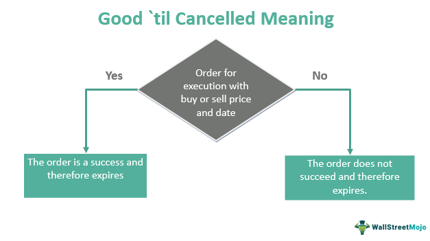

## Table of Contents

## What is a Good 'Til Canceled (GTC) order?

A Good 'Til Canceled (GTC) order is a type of order you can place with a broker to buy or sell a stock. It stays active until you decide to cancel it or until the order is filled. This is different from a day order, which only lasts for one trading day.

Using a GTC order can be helpful if you want to buy or sell a stock at a specific price but don't want to keep checking the market every day. For example, if you want to buy a stock but only if the price drops to a certain level, you can set a GTC order at that price. The order will stay active until the stock reaches that price or you cancel it.

## How does a GTC order differ from other types of orders?

A GTC order is different from other types of orders because it stays active until you cancel it or it gets filled. Other common types of orders include day orders and immediate-or-cancel (IOC) orders. A day order only lasts for the trading day it's placed on. If it doesn't get filled by the end of the day, it expires. An IOC order, on the other hand, tries to fill the order right away, and any part of the order that can't be filled immediately is canceled.

GTC orders are useful if you want to buy or sell a stock at a specific price but don't want to watch the market every day. For example, if you want to buy a stock but only if it drops to a certain price, you can set a GTC order at that price. It will stay active until the stock reaches that price or you decide to cancel it. In contrast, day orders and IOC orders are better if you want to make quick trades or if you only want the order to be active for a short time.

## What are the benefits of using a GTC order?

Using a GTC order can be really helpful if you want to buy or sell a stock at a certain price but don't want to check the market every day. With a GTC order, you can set the price you want, and the order will stay active until the stock reaches that price or you decide to cancel it. This means you don't have to keep an eye on the market all the time, which can save you a lot of time and effort.

Another benefit of GTC orders is that they give you more control over your trades. If you see a stock that you think is a good buy but it's currently too expensive, you can set a GTC order at a lower price. This way, if the stock price drops to your target, your order will be filled automatically. It's a great way to make sure you don't miss out on a good opportunity just because you weren't watching the market at the right time.

## Can you provide an example of when to use a GTC order?

Imagine you're interested in buying shares of a company called ABC Corp. You've been watching the stock, and you think it's a good buy, but right now, it's trading at $50 per share. You believe that if the price drops to $45, it would be a great time to buy. Instead of checking the stock price every day, you can set a GTC order to buy ABC Corp at $45 per share. This way, your order will stay active until the stock reaches $45 or you decide to cancel it. You won't miss the chance to buy at your desired price, and you don't have to keep an eye on the market all the time.

Another example is if you own shares of XYZ Inc., and you want to sell them, but only if the price goes up to $75 per share. You can set a GTC order to sell your shares at $75. This means your order will remain active until the stock price hits $75 or you choose to cancel it. It's a handy way to make sure you sell at the price you want without having to watch the market constantly.

## What are the potential risks associated with GTC orders?

One risk with GTC orders is that you might forget about them. Since they stay active until you cancel them or they get filled, it's easy to lose track of them. If the market changes and you no longer want to buy or sell at the price you set, you could end up with a trade you don't want. It's a good idea to check on your GTC orders regularly to make sure they still fit with your plans.

Another risk is that your broker might have rules about GTC orders that you need to know. Some brokers might only let GTC orders stay active for a certain amount of time, like 30 or 90 days. If you don't know these rules, your order might get canceled without you realizing it. Always read the fine print and understand your broker's policies to avoid surprises.

## How long does a GTC order remain active?

A GTC order, or Good 'Til Canceled order, stays active until you decide to cancel it or until it gets filled. This means it can last for days, weeks, or even months, depending on when the stock reaches the price you set or when you decide to cancel the order.

However, some brokers have rules about how long a GTC order can stay active. For example, some might only allow GTC orders to last for 30 or 90 days. It's important to check with your broker to know their specific rules so you don't get surprised if your order gets canceled.

## Can a GTC order be modified or canceled after it's placed?

Yes, you can change or cancel a GTC order after you place it. If you decide you want to buy or sell at a different price, you can go into your account and update the order. Or, if you change your mind and don't want to buy or sell the stock anymore, you can cancel the order completely.

It's good to keep an eye on your GTC orders and make sure they still match what you want to do. Markets can change, and what seemed like a good price before might not be the best now. Checking and adjusting your orders can help you stay in control of your trades.

## What should investors consider before placing a GTC order?

Before placing a GTC order, investors should think about how long they want the order to stay active. Some brokers might only let GTC orders last for a certain time, like 30 or 90 days. If you don't know this, your order might get canceled without you knowing. It's important to check with your broker to understand their rules so you don't miss out on a trade you want.

Investors should also consider if the price they set for the GTC order still makes sense as time goes on. The market can change, and what seemed like a good price before might not be the best now. It's a good idea to keep an eye on your GTC orders and be ready to change or cancel them if needed. This way, you can make sure your trades still fit with your plans.

## How do brokerage firms handle GTC orders?

Brokerage firms handle GTC orders by keeping them active until the investor cancels them or they get filled. This means the order stays in the system, waiting for the stock to reach the price the investor set. If the stock hits that price, the order will go through automatically. But if the investor decides they don't want to buy or sell at that price anymore, they can go into their account and change or cancel the order.

Some brokerage firms might have rules about how long a GTC order can stay active. For example, they might only let GTC orders last for 30 or 90 days. If an investor doesn't know this, their order might get canceled without them realizing it. It's important for investors to check with their broker to understand these rules. This way, they can make sure their GTC orders stay active as long as they need them to.

## Are there any fees associated with GTC orders?

Some brokerage firms might charge fees for GTC orders, but it depends on the broker. Not all brokers charge extra for GTC orders, so it's good to check with your broker to see if there are any fees. If there are fees, they might be a small amount for each order or a fee if the order stays active for a long time.

Even if there aren't specific fees for GTC orders, you might still have to pay regular trading fees when your GTC order gets filled. These are the fees you pay for buying or selling stocks, and they can be different depending on the broker. Always read the fine print and ask your broker about any fees before you place a GTC order.

## How do GTC orders work in different market conditions?

GTC orders can work differently depending on whether the market is going up, going down, or staying the same. In a rising market, if you have a GTC order to buy a stock at a lower price, it might take a long time for your order to get filled, or it might not get filled at all if the stock keeps going up. On the other hand, if you have a GTC order to sell at a higher price, you might get lucky and sell your stock at the price you want if the market keeps going up.

In a falling market, things can be the opposite. If you have a GTC order to buy at a lower price, you might get your order filled more quickly because the stock price is dropping. But if you have a GTC order to sell at a higher price, it might take longer for your order to get filled, or it might not get filled if the stock keeps going down. In a stable market, where the stock price isn't changing much, your GTC order might stay active for a long time without getting filled, waiting for the stock to hit your target price.

## What advanced strategies can be implemented using GTC orders?

GTC orders can be part of a strategy called dollar-cost averaging. This means you decide to buy a certain amount of a stock over time, instead of all at once. You can set GTC orders at different prices to buy the stock little by little. If the price goes down, your GTC orders will get filled at those lower prices, and you'll end up paying less on average for the stock. This can help you manage risk and make investing easier because you don't have to watch the market every day.

Another strategy is using GTC orders to set up a stop-loss and take-profit at the same time. A stop-loss order helps you limit losses if a stock's price drops a lot. A take-profit order helps you lock in gains if the stock's price goes up a lot. By using GTC orders, you can set both of these at the same time and let them work automatically. This way, you can manage your risk and potential profits without having to keep an eye on the market all the time.

## References & Further Reading

[1]: Bachelier, L. (1900). ["Theory of Speculation."](https://www.investmenttheory.org/uploads/3/4/8/2/34825752/emhbachelier.pdf) Annales Scientifiques de l'École Normale Supérieure.

[2]: Harris, L. (2003). ["Trading and Exchanges: Market Microstructure for Practitioners."](https://www.amazon.com/Trading-Exchanges-Market-Microstructure-Practitioners/dp/0195144708) Oxford University Press.

[3]: "Algorithmic and High-Frequency Trading" by Álvaro Cartea, Sebastian Jaimungal, and José Penalva. Provides insights into algorithmic trading mechanisms, which are crucial for understanding the application of GTC orders.

[4]: Pardo, R. (2008). ["The Evaluation and Optimization of Trading Strategies."](https://onlinelibrary.wiley.com/doi/book/10.1002/9781119196969) Wiley Trading.

[5]: Hull, J. C. (2018). ["Options, Futures, and Other Derivatives."](https://www.semanticscholar.org/paper/Options%2C-Futures%2C-and-Other-Derivatives-Hull/89bdee500c8623864fc9eb7a471546aa713acc44) Pearson. 

[6]: Narang, R. K. (2013). ["Inside the Black Box: The Simple Truth About Quantitative Trading."](https://onlinelibrary.wiley.com/doi/book/10.1002/9781118267738) Wiley Finance.

[7]: Fabozzi, F. J., Focardi, S. M., & Kolm, P. N. (2010). ["Quantitative Equity Investing: Techniques and Strategies."](https://www.semanticscholar.org/paper/Quantitative-Equity-Investing%3A-Techniques-and-Fabozzi-Focardi/1c49a2a53919f7e65cb96f16691b8ff726fd3cd7) Wiley Finance.