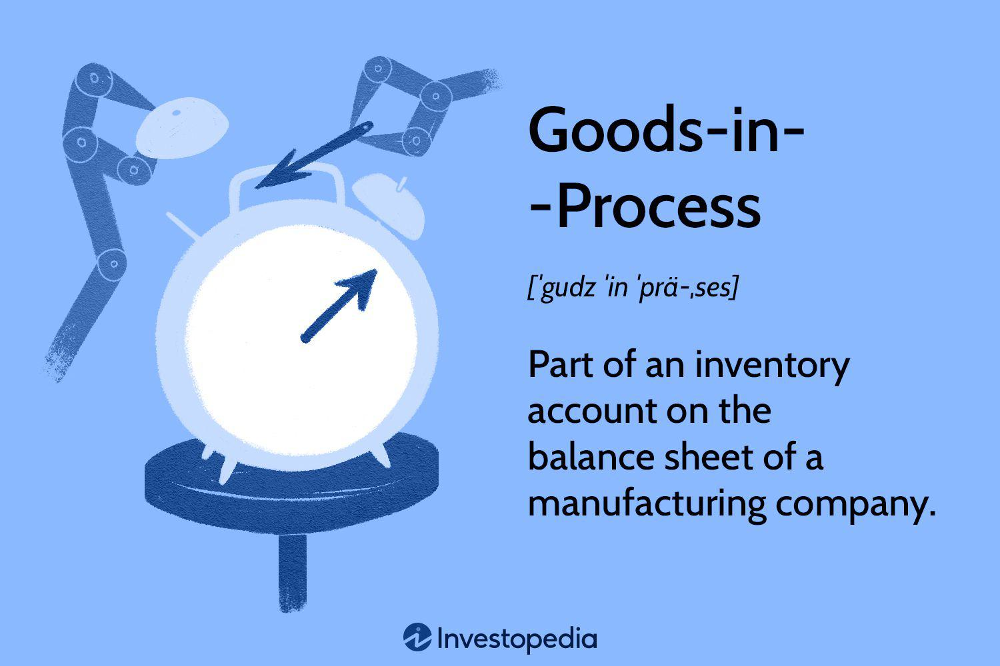

## Table of Contents

## What are goods in process?

Goods in process, also known as work in process, are products that are in the middle of being made. They are not finished yet, but they are not just raw materials either. This stage is important in manufacturing because it shows how much work has been done and how much is left to do.

Companies keep track of goods in process to know how their production is going. They can see if they are making things quickly enough or if they need to speed up. It also helps them figure out how much money they have spent on making the products so far. This information is useful for planning and managing the business.

## How do goods in process differ from raw materials and finished goods?

Goods in process are different from raw materials because raw materials are the basic things that haven't been worked on yet. For example, wood is a raw material before it's cut and shaped into furniture. Goods in process, on the other hand, are these raw materials after some work has been done on them but before they're completely finished. So, if you take that wood and start cutting it into pieces for a table, it becomes a good in process.

Goods in process are also different from finished goods. Finished goods are products that are ready to be sold or used. They have gone through all the steps of production and are complete. For example, a fully assembled table is a finished good. Goods in process are still being worked on and are not ready to be sold yet. They are somewhere in the middle of the production process, waiting for the final touches to become finished goods.

## Why is it important to track goods in process?

It's important to track goods in process because it helps companies understand how their production is going. By keeping an eye on goods in process, a business can see how quickly they are making things and if they need to work faster to meet their goals. This is really helpful for planning and making sure they can deliver products on time.

Also, tracking goods in process helps companies figure out how much money they have spent so far on making the products. This information is useful for managing the business's money and making smart decisions about where to spend more or save. Knowing the costs at each step of production can help a company stay on budget and keep their prices right for customers.

## What is the typical process flow for goods in process in manufacturing?

In manufacturing, goods in process start their journey when raw materials enter the production line. These materials are then worked on through different steps like cutting, shaping, or assembling. Each step adds value to the product, slowly turning the raw materials into something more complete. During this time, the goods are called goods in process because they are in the middle of being made but not finished yet.

As the goods move through the production steps, they are monitored closely. This helps the company know how much work has been done and how much is left. It's important to keep track of this because it shows how well the production is going and if there are any delays. Once all the steps are done and the product is ready to be sold, it moves from being a good in process to a finished good. This whole process helps the company make sure they can produce goods efficiently and on time.

## How can goods in process be accounted for in financial statements?

Goods in process are shown on a company's financial statements as part of their inventory. This is because they are products that are not finished yet but have had some work done on them. On the balance sheet, goods in process are listed under the "Inventory" section, along with raw materials and finished goods. This helps show how much money the company has tied up in products that are still being made.

In the income statement, the cost of goods in process is part of the "Cost of Goods Sold" (COGS). This is because the money spent on making these goods is a cost that the company needs to account for when figuring out how much it costs to make the products they sell. By including the cost of goods in process in COGS, the company can see how much it is spending on production and how that affects their profits.

## What are the common challenges in managing goods in process?

Managing goods in process can be tricky because it's hard to keep track of everything that's happening during production. If the company doesn't watch closely, things can get delayed, and it can be tough to know exactly where each product is in the process. This can lead to problems like not being able to finish products on time or not having enough goods ready to sell when customers want them.

Another challenge is keeping costs under control. As goods move through the production steps, it's important to know how much money is being spent at each stage. If costs get too high, it can hurt the company's profits. This means the company needs to find a good balance between spending money to make the goods and keeping the costs low enough to make a profit.

Sometimes, managing goods in process can also be about dealing with changes. If there's a problem with a machine or if the company needs to change how they make something, it can mess up the whole process. This can make it hard to keep everything running smoothly and can lead to more delays and higher costs.

## What technologies can help in monitoring goods in process?

One technology that helps in monitoring goods in process is the use of sensors and Internet of Things (IoT) devices. These can be put on machines or on the goods themselves to track where they are and how they're doing in the production process. For example, sensors can tell if a machine is working well or if it needs fixing. This helps the company know right away if something is going wrong, so they can fix it quickly and keep things moving smoothly.

Another helpful technology is software for managing production, like Manufacturing Execution Systems (MES). This software keeps track of all the steps in making goods, from when raw materials come in to when the products are finished. It can show how long each step takes and help the company see if they are on track to meet their goals. By using this software, the company can make better plans and make sure they are using their time and resources well.

Lastly, using data analytics and dashboards can also make a big difference. These tools take all the information from sensors and software and turn it into easy-to-understand charts and reports. This helps managers see at a glance how the production is going and make quick decisions if they need to change anything. With these technologies, companies can keep a close eye on their goods in process and make sure everything runs smoothly.

## How does the management of goods in process impact overall production efficiency?

Managing goods in process well can make a big difference in how efficiently a company makes things. If a company keeps a close eye on their goods in process, they can see where things might be slowing down or where they can speed up. This helps them make sure that products move through the production steps quickly and smoothly. When everything is managed well, the company can make more products in less time, which means they can meet their deadlines and keep their customers happy.

On the other hand, if goods in process are not managed well, it can cause a lot of problems. Products might get stuck at certain stages, leading to delays and wasted time. This can make it hard for the company to finish making products on time, which can upset customers and hurt the business. By keeping a good handle on goods in process, a company can avoid these issues and make sure their production runs as efficiently as possible.

## What are the key performance indicators (KPIs) for goods in process?

Key performance indicators (KPIs) for goods in process help companies see how well they are doing in making their products. One important KPI is the time it takes for goods to go from being raw materials to finished products. This is called the cycle time. If the cycle time is short, it means the company is making things quickly and efficiently. Another KPI is the work in process (WIP) inventory level. This shows how many goods are in the middle of being made at any time. If there are too many goods in process, it might mean there are delays or problems in the production line.

Another useful KPI is the throughput rate, which tells how many goods are moving through the production process in a certain amount of time. A high throughput rate means the company is producing a lot of goods quickly. The quality rate is also important because it measures how many goods in process meet the company's standards for quality. If the quality rate is high, it means fewer goods need to be fixed or thrown away, which saves time and money. Together, these KPIs help companies keep their production running smoothly and efficiently.

## How can lean manufacturing principles be applied to goods in process?

Lean manufacturing is all about making things better by getting rid of waste and making the production process smoother. When it comes to goods in process, lean principles can help by making sure that products move through the production steps as quickly as possible without stopping. This means looking at each step to see if there are any delays or if there's too much stuff waiting to be worked on. By fixing these problems, companies can make sure that goods in process keep moving and don't pile up, which helps them finish products faster and save money.

One big part of lean manufacturing is something called "just-in-time" production. This means that companies only make goods in process when they need them, instead of making a lot and letting them sit around. This helps keep the number of goods in process low, which saves space and money. It also means that if something goes wrong, it's easier to fix because there's less stuff to deal with. By using lean principles, companies can make their production more efficient and get their goods from raw materials to finished products in less time.

## What are the advanced strategies for optimizing goods in process inventory?

One advanced strategy for optimizing goods in process inventory is using real-time data and analytics. By keeping a close eye on the production process with sensors and software, companies can see exactly where goods are and how long they take to move through each step. This helps them spot any delays or problems quickly and fix them before they get worse. With this information, companies can make smart decisions about when to speed up or slow down production, which helps keep the right amount of goods in process without having too much or too little.

Another strategy is using automation and robotics in the production line. Machines can work faster and more accurately than people, which means they can help move goods in process through the production steps more quickly. Automation also helps reduce mistakes and keeps the production process smooth. By using robots and automated systems, companies can make sure that goods in process are always moving and that they don't get stuck waiting for the next step. This helps keep the inventory at the right level and makes the whole production process more efficient.

## How do industry-specific regulations affect the handling of goods in process?

Industry-specific regulations can change how companies handle goods in process. In some industries, like food and medicine, there are strict rules about how products must be made to keep them safe and good quality. These rules might say how long goods can stay in process before they need to be finished, or they might require special checks and tests at different steps. Companies have to follow these rules carefully, which can mean they need to keep a close eye on their goods in process and make sure everything is done the right way.

In other industries, like car making or electronics, the rules might focus more on how goods in process are tracked and reported. These regulations could require companies to keep detailed records of where each product is in the production process and how long it takes to move from one step to the next. This helps make sure that the production process is open and honest, and it can also help companies spot problems and fix them quickly. No matter the industry, following these regulations is important for keeping goods in process safe, high-quality, and on track.

## What is the current status of work-in-progress in algorithmic trading?

Algorithmic trading employs the concept of work-in-progress (WIP) to manage the development and evolution of trading strategies. Much like work-in-progress in manufacturing, where unfinished products continuously evolve until fully complete, trading strategies in [algorithmic trading](/wiki/algorithmic-trading) undergo a similar iterative development process. This involves rigorous back-testing and multiple iterations to ensure strategies are thoroughly vetted before they are deployed in the financial markets.

The back-testing phase is crucial as it evaluates a strategy's potential performance using historical data. This evaluation allows traders to identify strengths, weaknesses, and areas for improvement. Such rigorous testing reduces the risk of deploying ineffective strategies in live trading environments. For example, a trading strategy might be evaluated using various statistical metrics, such as the Sharpe ratio, which measures risk-adjusted return. The Sharpe ratio is defined by the formula:

$$
\text{Sharpe Ratio} = \frac{R_p - R_f}{\sigma_p}
$$

Where:
- $R_p$ is the expected portfolio return,
- $R_f$ is the risk-free rate,
- $\sigma_p$ is the standard deviation of the portfolio's excess return.

By utilizing data-driven insights, traders can fine-tune parameters to optimize strategy performance. Such iterative refinement processes demonstrate parallels with manufacturing, where unfinished goods are subject to continuous improvement until they achieve a desired level of quality.

Algorithmic trading benefits significantly from these ongoing developmental processes, emphasizing the importance of continuous monitoring and optimization in achieving operational efficiency. Strategies reflect the concept of WIP by being in a constant state of evaluation and adjustment, allowing traders to respond swiftly to market changes and maintain robust performance over time.

Furthermore, the utilization of algorithmic trading necessitates a reliance on data-driven insights derived from comprehensive testing cycles. These insights inform strategic decisions, enhance risk management, and facilitate the adaptation of strategies to evolving market dynamics. Python, a preferred programming language in algorithmic trading, offers numerous libraries such as 'pandas', 'NumPy', and '[backtrader](/wiki/backtrader)' for developing and back-testing trading strategies, illustrating the confluence of technology and finance in refining WIP concepts:

```python
import pandas as pd
import numpy as np

# Example: Calculate moving average crossover strategy
def moving_average_crossover(data, short_window=40, long_window=100):
    data['short_mavg'] = data['Close'].rolling(window=short_window, min_periods=1).mean()
    data['long_mavg'] = data['Close'].rolling(window=long_window, min_periods=1).mean()
    return data

# Load sample data
data = pd.read_csv('historical_stock_data.csv')

# Generate signals
signals = moving_average_crossover(data)
```

This script captures the essence of how algorithmic trading utilizes WIP concepts for ongoing strategy development, focusing on the precision and refinement necessary to remain competitive in the financial markets.

## References & Further Reading

- Bergstra, J., et al. (2011). **Algorithms for Hyper-Parameter Optimization**. This work discusses the development of algorithms for optimizing hyper-parameters, which may be particularly relevant in refining algorithmic trading strategies to enhance performance and reduce computational costs. The use of techniques such as grid search and random search in parameter tuning can be fundamental in developing efficient trading algorithms.

- Lopez de Prado, M. (2018). **Advances in Financial Machine Learning**. This book provides a comprehensive guide to utilizing machine learning in finance, offering insights into developing predictive models and adaptive algorithms. Practical examples include employing machine learning for pattern recognition and back-testing in trading strategies.

- Aronson, D. (2006). **Evidence-Based Technical Analysis**. Aronson offers a methodological approach to technical analysis, advocating for empirical validation of trading strategies. The emphasis on evidence-based methods aligns with the principles of algorithmic trading, where historical data and statistical techniques are employed to validate strategies.

- Jansen, S. (2020). **Machine Learning for Algorithmic Trading**. This text covers the integration of machine learning with trading practices, focusing on model development, feature engineering, and prediction evaluation. Strategies for deploying machine learning models in live trading environments are discussed, underscoring the parallels to work-in-progress concepts in iterative development and refinement.

- Chan, E.P. (2009). **Quantitative Trading**. Chan provides a detailed exploration of quantitative strategies in trading, including statistical arbitrage and automated execution. The book highlights the importance of robust strategy design and testing, reinforcing the need for continuous monitoring and adaptation similar to work-in-progress management in manufacturing.

These references serve as critical resources for understanding the intersection of manufacturing and finance through work-in-progress principles, providing foundational knowledge for enhancing efficiencies in algorithmic trading.

