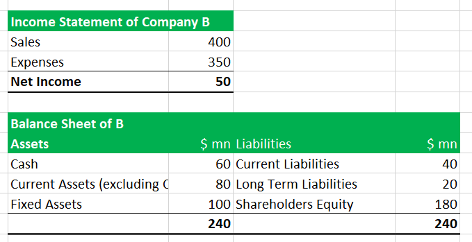

Intangible assets have become a cornerstone of modern economies, playing a crucial role in the valuation and strategic positioning of companies. Unlike tangible assets, such as machinery or real estate, intangible assets are non-physical resources that generate value. They encompass a wide range of elements, including intellectual property, brand recognition, and proprietary technology. Among these, goodwill stands out as a unique intangible asset that arises during the acquisition of one company by another, representing the premium paid over the fair market value of tangible and identifiable intangible assets.

Goodwill is an indicator of a company's intrinsic value, reflecting factors like brand reputation, customer loyalty, and high employee morale. Its relevance lies in business combinations where it provides insights into the potential for future earnings and competitive advantages. This asset is recorded on the balance sheet and undergoes annual impairment tests to ensure its value is not overstated.



Parallel to the growing significance of intangible assets is the evolution of algorithmic trading, which revolutionizes financial markets by employing sophisticated algorithms to execute trades at high speeds and volumes. Algorithmic trading leverages data-driven strategies, often relying on complex mathematical models to capitalize on market inefficiencies, minimize trading costs, and reduce human errors.

The purpose of this article is to explore the intersection of intangible assets, specifically goodwill, and algorithmic trading. It will investigate how advancements in trading technology can impact the valuation and perception of goodwill, providing a nuanced understanding of the contemporary financial landscape. The following sections will dissect several key topics, starting with a comprehensive overview of intangible assets and goodwill, followed by an examination of goodwill accounting principles and their implications. The article will then introduce algorithmic trading, detail its foundational technologies and strategies, and finally analyze how the integration of goodwill assessment within automated trading systems can serve as a strategic advantage. Through real-world examples and potential future trends, we aim to demonstrate the synergy between these two pivotal aspects of financial management.

## Table of Contents

## Understanding Intangible Assets and Goodwill

Intangible assets are non-physical assets that hold value due to the rights or competitive advantages they provide to a business. Unlike tangible assets, which have a physical form—such as machinery or buildings—intangible assets exist as legal rights or identifiable advantages. Characteristics distinguishing intangible assets include their non-physical nature, potential to generate economic benefits, and their ability to be identifiable and separable from the company or arise from contractual or other legal rights. Examples of intangible assets include patents, trademarks, copyrights, and goodwill.

Goodwill is a distinct type of intangible asset. It arises primarily during corporate acquisitions, reflecting the excess of the purchase price over the fair value of the identifiable net assets acquired. Goodwill represents future economic benefits from synergies, customer relationships, reputation, and brand strength that are not individually recognized as separate assets. On financial statements, goodwill is recorded as an asset and tested annually for impairment rather than amortized over time.

The generation of goodwill occurs when a company is acquired at a price higher than the sum of its identifiable tangible and intangible assets minus its liabilities. For example, if Company A acquires Company B for $10 million, and the fair value of Company B's tangible and identifiable intangible assets minus liabilities is $7 million, the goodwill recorded would be $3 million. This amount reflects the premium paid for unquantifiable benefits such as brand loyalty or strategic positioning.

Measuring and valuing goodwill presents significant challenges. Unlike other assets that can be appraised with relative precision, goodwill is inherently subjective and relies on projections about future performance. This subjectivity can lead to substantial variations in goodwill valuations across similar transactions. Additionally, impairment tests for goodwill require estimation of cash flows, which are susceptible to management bias and market [volatility](/wiki/volatility-trading-strategies).

In terms of business strategy and market positioning, goodwill is a critical element that can enhance a company's competitive edge. It acts as an indicator of a company's ability to maintain superior customer relations, branding, and operational synergies that may translate into long-term profitability. A strong goodwill component within a business strategy often reflects robust market positioning and a solid foundation for sustainable competitive advantage.

Overall, understanding intangible assets and goodwill is crucial for investors and business leaders as they assess a company's true value and potential for future growth. The strategic perception and proper valuation of goodwill can significantly influence corporate decisions, mergers and acquisitions, and market perception.

## The Principles of Goodwill Accounting

Intangible assets play a crucial role in modern financial reporting, with goodwill being one of the most significant components. The accounting treatment of goodwill is primarily governed by established standards such as Generally Accepted Accounting Principles (GAAP) in the United States and the International Financial Reporting Standards (IFRS) globally. These frameworks ensure consistency and reliability in reporting, allowing investors and stakeholders to accurately assess a company's financial performance.

### Accounting Standards and Regulations

Under GAAP, goodwill is defined as the excess purchase price paid during an acquisition over the fair value of identifiable net assets. It is recorded as an asset on the balance sheet and is subject to an annual impairment test, rather than amortization. The Financial Accounting Standards Board (FASB) outlines these provisions under ASC 350, while the IFRS, managed by the International Accounting Standards Board (IASB), details goodwill treatment in IAS 36.

### Goodwill Impairment Testing

The impairment test assesses whether the carrying amount of goodwill exceeds its recoverable amount. This involves comparing the book value of a reporting unit to its fair value. If the book value is higher, goodwill is considered impaired, resulting in a write-down. The implications of this process are significant, as impairment can indicate a decline in the anticipated economic benefits from an acquisition, potentially affecting investor confidence and the company’s stock price. 

### Amortization vs. Impairment

Differences between amortization and impairment are crucial in goodwill accounting. Amortization involves the systematic reduction of an asset’s value over time, traditionally applied to tangible assets with finite useful lives. Conversely, impairment does not follow a predetermined schedule; it reflects an immediate adjustment based on the asset's economic reality. GAAP's preference for impairment over amortization aligns with the notion that the economic life of goodwill is generally indefinite, subject only to reduction based on performance-based assessment.

### Financial Health and Investor Perception

The accounting treatment of goodwill markedly influences a company’s financial health and investor perception. Goodwill impairment can lead to substantial write-offs; for example, a notable case occurred when Kraft Heinz reported a $15.4 billion impairment charge in 2019, causing its shares to plummet. Such write-downs can raise questions about the initial valuations of acquisitions and the management's ability to integrate operations to achieve forecasted synergies. 

### Real-World Examples and Business Valuations

The impact of goodwill accounting is evident in real-world scenarios. Comcast’s acquisition of Sky resulted in a $4.6 billion goodwill impairment in 2020 due to reduced profitability expectations and increased competition. These adjustments affect not only the current valuation but also long-term strategic directions and market positioning. For investors, understanding the nuances of goodwill accounting is essential for interpreting a company’s financial statements and estimating its true valuation.

In summary, the principles of goodwill accounting, encompassing strict regulatory standards and complex impairment testing, are vital for accurately reflecting a company's financial condition. By understanding these dynamics, stakeholders can better navigate the intricate landscape of corporate accounting and make informed decisions.

 to Algorithmic Trading

Algorithmic trading, often referred to as algo trading, is a method of executing trades using pre-programmed instructions accounting for variables such as timing, price, and [volume](/wiki/volume-trading-strategy). This form of trading uses algorithms to enter and [exit](/wiki/exit-strategy) positions in the financial market, facilitating faster and more efficient transactions. Over the last few decades, [algorithmic trading](/wiki/algorithmic-trading) has seen exponential growth, becoming a dominant force in modern financial ecosystems, particularly in equities, foreign exchange, and commodity markets.

The expansion of algorithmic trading has been driven by advancements in technology and the increasing complexity of financial markets. Key technologies that support algorithmic trading include high-frequency trading ([HFT](/wiki/high-frequency-trading-strategies)) systems, advanced computational software, and [machine learning](/wiki/machine-learning) algorithms. HFT, a subset of algorithmic trading, enables the execution of a large number of orders within fractions of a second, taking advantage of small price fluctuations. Meanwhile, machine learning and [artificial intelligence](/wiki/ai-artificial-intelligence) are utilized to identify patterns in large datasets, improving predictive precision and strategy development.

The advantages of algorithmic trading are notable. By automating trading processes, algo trading enhances speed and efficiency considerably. It reduces the likelihood of human error and emotion-driven decisions, which can detract from objective trading strategy. Furthermore, algorithmic trading allows for the [backtesting](/wiki/backtesting) of strategies using historical market data, supporting the development of more robust trading algorithms.

Despite these benefits, algorithmic trading presents several challenges and risks. One major concern is regulatory oversight; the rapid speed and volume of trades can contribute to market volatility, as exhibited by events such as the 2010 Flash Crash. Consequently, regulatory bodies, including the U.S. Securities and Exchange Commission (SEC) and the European Securities and Markets Authority (ESMA), have implemented measures to monitor and control the impact of HFT and algo trading activities.

Market volatility is another prevalent risk, as algorithmic strategies may inadvertently exacerbate price swings during periods of low [liquidity](/wiki/liquidity-risk-premium) or high uncertainty. Additionally, technical failures, such as glitches or network downtime, can lead to significant financial losses.

Central to the success of algorithmic trading is the effective utilization of data. Massive volumes of structured and unstructured data, including market prices, trading volumes, social media sentiment, and economic indicators, provide the foundation for developing and refining algorithms. Efficient data processing and analysis are critical in detecting trends and anomalies, enabling the formulation of strategies that can capitalize on short-term market inefficiencies.

In conclusion, algorithmic trading has transformed financial markets by leveraging advanced technologies and data-driven strategies to optimize trading efficiency and performance. While offering substantial benefits, it also requires careful management of its inherent risks to maintain market stability and integrity. As technology continues to evolve, so too will the capabilities and sophistication of algorithmic trading systems.

## The Intersection of Goodwill and Algo Trading

Algorithmic trading, with its reliance on complex algorithms and data-driven analysis, has transformed the valuation landscape for intangible assets such as goodwill. Traditionally, the assessment of goodwill, which arises during corporate acquisitions, hinges on subjective evaluations and market conditions. However, algorithmic trading presents opportunities to refine how goodwill is assessed and integrated into trading strategies.

### Impact of Algorithmic Trading on Goodwill Valuation

Algorithmic trading leverages vast datasets and advanced computational techniques to derive insights and predict future market movements. By applying similar methodologies, algorithms can assess the intrinsic value of goodwill by analyzing a corporation's market position, competitive advantage, and brand reputation—factors contributing to goodwill. A quantitative model might consider historical data, peer comparisons, and real-time market sentiment, effectively bridging the gap between subjective valuations and objective analysis. 

### Incorporating Goodwill Valuation into Trading Strategies

Incorporating goodwill valuation into trading algorithms necessitates a multifaceted approach. Algorithms can integrate machine learning models to process financial reports, news articles, and social media sentiments related to corporate goodwill. For instance, a linear regression model could be trained to predict stock price movements based on changes in reported goodwill figures and other financial metrics:

```python
import numpy as np
from sklearn.linear_model import LinearRegression

# Sample data for algorithm
goodwill_changes = np.array([[0.1], [0.04], [0.06], [-0.02]])
stock_price_changes = np.array([0.05, 0.02, 0.04, -0.01])

# Create and train model
model = LinearRegression().fit(goodwill_changes, stock_price_changes)

# Predict future stock price changes
future_goodwill_change = np.array([[0.05]])
predicted_stock_change = model.predict(future_goodwill_change)
```

### Algorithms and Market Sentiment on Goodwill

Algorithms can also evaluate market sentiment trends, providing insights into how perceived changes in a company's goodwill affect stock valuation. Natural language processing (NLP) can be employed to extract sentiment scores from diverse sources, enabling algorithms to gauge investor attitudes and predict market reactions to goodwill reports. Sentiment analysis tools can process language nuances, enhancing algorithms' ability to detect shifts in market perception and incorporate these changes into trading strategies.

### Case Studies: Algo Trading and Goodwill

Real-world examples reveal how algorithmic trading strategies have adapted to changes in goodwill reporting. Significant goodwill impairments in companies like GE and Kraft Heinz have led to stock volatility, prompting algorithmic traders to adjust their models accordingly. By evaluating the extent of goodwill impairment and its reception in the market, traders can recalibrate their strategies to optimize portfolio returns.

### Future Implications

The integration of goodwill assessment into automated trading systems is poised to evolve with advancements in artificial intelligence and data analytics. Future systems might employ [deep learning](/wiki/deep-learning) to autonomously refine valuation models, enabling traders to react swiftly to changes in corporate goodwill. This convergence could lead to more accurate asset valuations, improved trading efficiency, and greater market stability.

Algorithmic trading offers a promising avenue for enhancing the precision of goodwill valuation, providing companies and investors with nuanced insights essential for navigating the complexities of modern financial markets. As technology continues to advance, the interplay between intangible asset management and automated trading is expected to amplify, driving innovation in financial analysis and investment strategy.

## The Strategic Value of Combining Goodwill Accounting and Algo Trading

Combining goodwill accounting and algorithmic trading offers significant strategic advantages for businesses, primarily by enhancing decision-making processes and optimizing investment strategies. Leveraging insights from both areas allows companies to bridge accounting with real-time market dynamics, providing a comprehensive understanding of business value and market perception.

Integrating financial analysis tools with algorithmic trading platforms is a crucial step in harnessing this advantage. Goodwill, an intangible asset resulting from the acquisition of one company by another for a premium value, reflects brand reputation, customer relations, and intellectual capital. Accurately accounting for goodwill is essential, as it impacts financial statements and investor perceptions. By integrating goodwill data, including impairment tests and valuations, into algo trading systems, companies can better assess market sentiment and make informed trades. These systems can adapt trading algorithms to incorporate goodwill fluctuations, potentially enhancing the predictability and effectiveness of trading strategies.

There are successful use cases highlighting the benefits of this synergy. For example, firms that have constructed algorithms to respond to changes in goodwill impairment reports have been able to capitalize on these events, leading to strategic buy or sell decisions. Algos that assess market reactions to goodwill adjustments can detect undervalued or overvalued stocks, thus improving portfolio performance. This approach allows businesses to proactively manage their market positions and respond swiftly to financial disclosures affecting company valuations.

The role of fintech is pivotal in facilitating the integration of goodwill accounting with algorithmic trading. Advanced data analytics tools and machine learning models enable deeper insights into how intangible assets, like goodwill, influence market behaviors. Fintech solutions provide platforms that combine financial accounting insights with high-frequency trading capabilities, allowing for the automation and optimization of investment strategies. As fintech evolves, the capacity to process complex datasets and execute trades based on nuanced financial metrics, such as goodwill, becomes increasingly sophisticated.

For companies aiming to effectively combine goodwill accounting with algorithmic trading, several recommendations can be made. First, they should invest in robust data analytics capabilities that can handle financial reporting data, including detailed goodwill valuations. Developing machine learning models that can interpret this data in the context of market conditions will yield strategic insights. It is also advisable for companies to foster collaborations between their accounting and trading teams to ensure that goodwill data informs trading strategies accurately. Additionally, staying abreast of technological advancements in fintech can enable companies to leverage cutting-edge tools for integrating these domains.

The strategic combination of goodwill accounting with algorithmic trading not only enhances competitive advantage but also positions businesses to make more informed, agile decisions in an increasingly complex financial landscape.

## Conclusion

In conclusion, the exploration of intangible assets, particularly goodwill, alongside the advancement of algorithmic trading highlights a compelling synergy in modern financial management. Understanding intangible asset management is crucial, as these assets, including goodwill, often constitute a significant portion of a company's value and influence strategic business decisions. The ability to accurately value and report on goodwill impacts financial statements, investor perceptions, and overall market positioning.

Simultaneously, mastering advanced trading technologies such as algorithmic trading offers significant advantages. Algorithmic trading, with its speed, efficiency, and data-driven strategies, has transformed the financial landscape. By integrating algorithms with goodwill valuation, companies can derive insightful assessments of market sentiment and trends associated with corporate goodwill reports.

The convergence of goodwill accounting and algorithmic trading presents numerous benefits and future opportunities. Businesses that effectively combine these domains gain strategic advantages, enabling more informed decision-making and potentially leading to improved business outcomes. The growing role of fintech in facilitating this integration underscores the evolving nature of financial management.

As the financial industry continues to evolve, it is imperative for businesses to explore innovative strategies that harness the potential of both intangible asset management and algorithmic trading. Companies are encouraged to adopt forward-thinking approaches, integrating these insights into their operations to remain competitive and thrive in today's dynamic marketplace. This continual exploration and innovation will pave the way for future advancements in the intertwined fields of financial management and trading technologies.

## References & Further Reading

[1]: Bergstra, J., Bardenet, R., Bengio, Y., & Kégl, B. (2011). ["Algorithms for Hyper-Parameter Optimization."](https://proceedings.neurips.cc/paper/2011/file/86e8f7ab32cfd12577bc2619bc635690-Paper.pdf) Advances in Neural Information Processing Systems 24.

[2]: ["Advances in Financial Machine Learning"](https://www.amazon.com/Advances-Financial-Machine-Learning-Marcos/dp/1119482089) by Marcos Lopez de Prado

[3]: ["Evidence-Based Technical Analysis: Applying the Scientific Method and Statistical Inference to Trading Signals"](https://www.amazon.com/Evidence-Based-Technical-Analysis-Scientific-Statistical/dp/0470008741) by David Aronson

[4]: ["Machine Learning for Algorithmic Trading"](https://github.com/PacktPublishing/Machine-Learning-for-Algorithmic-Trading-Second-Edition) by Stefan Jansen

[5]: ["Quantitative Trading: How to Build Your Own Algorithmic Trading Business"](https://www.amazon.com/Quantitative-Trading-Build-Algorithmic-Business/dp/0470284889) by Ernest P. Chan