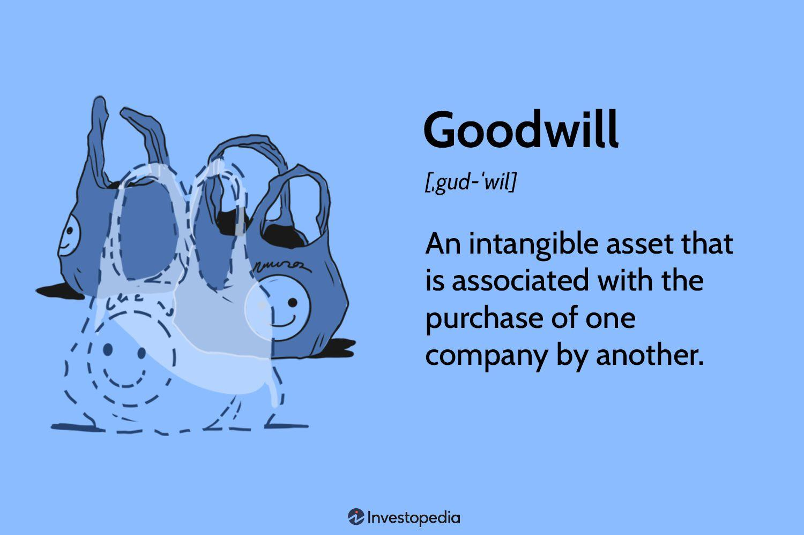

## Table of Contents

## What is goodwill in accounting?

Goodwill in accounting is the value of a company's reputation, customer loyalty, and other intangible factors that make it more valuable than just its physical assets and money. When one company buys another, the price paid might be higher than the value of the buildings, machines, and other things the bought company owns. The extra amount paid is called goodwill. It shows how much the buying company thinks the brand name, happy customers, and skilled workers of the other company are worth.

Goodwill is recorded on the balance sheet as an asset, but it's different from things like buildings or trucks because you can't touch it. It's important because it can help a company make more money in the future. However, if the value of the company goes down, the goodwill might need to be reduced, which is called an impairment. This means the company has to admit that the extra amount they paid for the other company isn't worth as much anymore.

## How is goodwill different from other intangible assets?

Goodwill is a special kind of intangible asset that comes up when one company buys another for more than the value of its physical stuff like buildings and machines. This extra amount is called goodwill because it represents the value of things you can't touch, like the company's good name, happy customers, and skilled workers. Unlike other intangible assets, goodwill is not something a company can buy or sell by itself. It's tied to the whole business and only shows up when a company is bought.

Other intangible assets, like patents, trademarks, or copyrights, can be bought, sold, or licensed separately from the business. These assets have a clear value and can be used to make money directly. For example, a company can license its trademark to another company for a fee. Goodwill, on the other hand, doesn't have a separate value that can be easily measured or used in the same way. It's more about the overall value of the business and how it's seen by customers and the market.

## What are the types of goodwill?

There are two main types of goodwill: purchased goodwill and inherent goodwill. Purchased goodwill happens when one company buys another company for more money than the value of its buildings, machines, and other stuff. The extra money paid is called purchased goodwill. This type of goodwill shows up on the financial records of the buying company as an asset. It's the most common type of goodwill because it's easy to see and measure when a business is bought.

Inherent goodwill, also known as internally generated goodwill, is different. It's the value that a company builds up over time by having a good name, happy customers, and doing business well. This type of goodwill isn't bought; it grows naturally as the business does well. Inherent goodwill doesn't show up on financial records because it's hard to measure exactly. It's more about the overall feel and reputation of the company, which can make it more valuable but isn't something you can point to on a balance sheet.

## When is goodwill recognized in financial statements?

Goodwill is recognized in financial statements when one company buys another company for more money than the value of its physical stuff like buildings and machines. The extra money paid is called goodwill. This happens because the buying company thinks the reputation, happy customers, and skilled workers of the other company are worth something extra. So, when the deal is done, the buying company puts this extra amount on its balance sheet as an asset called goodwill.

Goodwill isn't recognized just because a company is doing well on its own. If a company builds up a good name and happy customers over time without being bought, this kind of goodwill, called inherent goodwill, doesn't show up on the financial statements. Only when a company is bought and the price paid is higher than the value of its physical stuff does goodwill get recorded in the financial statements.

## How is goodwill calculated during a business acquisition?

Goodwill is calculated during a business acquisition by figuring out the difference between the price paid for the company and the fair value of its net assets. The fair value of net assets is the total value of everything the company owns, like buildings and machines, minus what it owes, like loans. If a company is bought for $1 million but the fair value of its net assets is only $700,000, the goodwill would be $300,000. This $300,000 represents the extra value the buying company thinks the reputation, happy customers, and skilled workers of the bought company are worth.

To find the fair value of the net assets, the buying company often hires experts to look at everything the bought company owns and owes. They might look at things like how much similar buildings or machines are worth in the market, or how much it would cost to replace them. Once they have a good idea of the fair value of the net assets, they subtract that from the price paid for the company to find the goodwill. This process helps make sure the goodwill number on the financial statements is as accurate as possible.

## What is the difference between purchased goodwill and internally generated goodwill?

Purchased goodwill happens when one company buys another for more money than the value of its buildings, machines, and other stuff. The extra money paid is called purchased goodwill. This type of goodwill shows up on the financial records of the buying company as an asset. It's the most common type of goodwill because it's easy to see and measure when a business is bought. For example, if a company is bought for $1 million but its net assets are worth $700,000, the purchased goodwill would be $300,000.

Internally generated goodwill, or inherent goodwill, is different. It's the value that a company builds up over time by having a good name, happy customers, and doing business well. This type of goodwill isn't bought; it grows naturally as the business does well. Inherent goodwill doesn't show up on financial records because it's hard to measure exactly. It's more about the overall feel and reputation of the company, which can make it more valuable but isn't something you can point to on a balance sheet.

## How is goodwill impairment tested?

Goodwill impairment testing is done to see if the value of goodwill on a company's balance sheet is still worth what they paid for it. Companies do this test at least once a year, or more often if something happens that might make the goodwill worth less. They compare the fair value of the part of the business that has the goodwill, called a reporting unit, to what's on the [books](/wiki/algo-trading-books). If the fair value is less than what's on the books, it means the goodwill might be worth less now.

If the fair value is less, the company then figures out how much less the goodwill is worth. They do this by comparing the fair value of the reporting unit to the value of all its assets and subtracting its debts. If the fair value of the reporting unit is less than the value of its assets minus debts, the difference is how much the goodwill has lost value. The company then has to write down the goodwill on their balance sheet by that amount, which is called an impairment loss. This makes sure the financial statements show a true picture of what the company is worth.

## What are the accounting standards related to goodwill (e.g., IFRS, GAAP)?

Goodwill accounting is guided by two main sets of rules: the International Financial Reporting Standards (IFRS) and the Generally Accepted Accounting Principles (GAAP). Under IFRS, which is used in many countries around the world, companies must test goodwill for impairment at least once a year. If the value of goodwill goes down, the company has to reduce its value on the balance sheet. This means they need to figure out if the part of the business with the goodwill is worth less than what's written down. If it is, they calculate the difference and write down the goodwill by that amount.

GAAP, used mainly in the United States, also requires companies to test goodwill for impairment, but the rules are a bit different. Companies can first do a simple test to see if they need to do a more detailed check. If they think the goodwill might be worth less, they do a deeper look. Like IFRS, if the value of the business unit with the goodwill is less than what's on the books, the company has to write down the goodwill. Both sets of rules aim to make sure that the financial statements show a true picture of the company's value, but they use slightly different ways to get there.

## How should goodwill be reported on the balance sheet?

Goodwill should be reported on the balance sheet as an intangible asset. It shows up on the balance sheet when one company buys another for more money than the value of its buildings, machines, and other stuff. This extra amount paid is called goodwill and represents the value of the bought company's reputation, happy customers, and skilled workers. Goodwill is listed under non-current assets, separate from physical assets like buildings or machines, because it's something you can't touch but still has value.

Once goodwill is on the balance sheet, the company needs to check it at least once a year to see if it's still worth what they paid for it. This is called an impairment test. If the value of the business unit with the goodwill has gone down, the company has to reduce the value of the goodwill on the balance sheet. This makes sure the financial statements show a true picture of what the company is worth.

## What are the tax implications of goodwill?

When a company buys another company and records goodwill, there can be tax implications. Goodwill itself isn't something you can claim as a regular expense to lower your taxes each year. Instead, for tax purposes, goodwill is treated as a capital asset. This means if the company ever sells the business, the value of the goodwill can affect how much tax they have to pay on any profit from the sale. If the selling price is higher than what was paid for the goodwill, the company might have to pay capital gains tax on that difference.

However, there's a way to spread out the tax impact over time. When a company buys another, they can choose to do something called a "Section 197 intangible" election under U.S. tax law. This lets them slowly deduct the cost of the goodwill over 15 years, instead of all at once when they sell the business. This can help lower their taxable income a little bit each year. But remember, this is just for U.S. tax rules, and other countries might have different ways to handle goodwill for taxes.

## How does goodwill affect a company's financial ratios and valuation?

Goodwill can change how a company looks on paper when you look at its financial ratios and overall value. When a company buys another one and records goodwill, it makes the company's total assets bigger. This can make ratios like the return on assets (ROA) look smaller because the profit is spread over a bigger number of assets. Also, if a company has a lot of goodwill on its balance sheet, it might make the company seem more valuable than it really is, because goodwill can be hard to turn into cash if the business needs money fast.

If the goodwill loses value, which is called an impairment, it can really shake things up. When a company has to write down the value of its goodwill, it shows up as a loss on the income statement. This can make the company's earnings look worse, which can mess up ratios like the price-to-earnings (P/E) ratio. It can also make investors worry about the company's future, which might lower its stock price. So, goodwill can have a big effect on how a company is seen and valued by people looking at its numbers.

## What are some real-world examples of goodwill in major corporate acquisitions?

When Disney bought Marvel Entertainment in 2009 for $4 billion, they paid more than what Marvel's buildings, machines, and other stuff were worth. The extra amount Disney paid was recorded as goodwill on their balance sheet. This goodwill represented the value of Marvel's famous characters like Spider-Man and Iron Man, and their loyal fans. Disney believed that Marvel's brand and stories would help them make more money in the future, so they were willing to pay extra for it.

Another example is when Microsoft bought LinkedIn in 2016 for $26.2 billion. Microsoft paid a lot more than the value of LinkedIn's offices, computers, and other things. The difference was recorded as goodwill, showing how much Microsoft valued LinkedIn's network of professionals and its potential to grow. Microsoft thought that owning LinkedIn would help them connect better with business customers and make more money, so they were happy to pay the extra amount.

## References & Further Reading

[1]: Bergstra, J., Bardenet, R., Bengio, Y., & Kégl, B. (2011). ["Algorithms for Hyper-Parameter Optimization."](https://proceedings.neurips.cc/paper/2011/file/86e8f7ab32cfd12577bc2619bc635690-Paper.pdf) Advances in Neural Information Processing Systems 24.

[2]: ["Advances in Financial Machine Learning"](https://www.amazon.com/Advances-Financial-Machine-Learning-Marcos/dp/1119482089) by Marcos Lopez de Prado

[3]: ["Evidence-Based Technical Analysis: Applying the Scientific Method and Statistical Inference to Trading Signals"](https://www.amazon.com/Evidence-Based-Technical-Analysis-Scientific-Statistical/dp/0470008741) by David Aronson

[4]: ["Machine Learning for Algorithmic Trading"](https://github.com/PacktPublishing/Machine-Learning-for-Algorithmic-Trading-Second-Edition) by Stefan Jansen

[5]: ["Quantitative Trading: How to Build Your Own Algorithmic Trading Business"](https://www.amazon.com/Quantitative-Trading-Build-Algorithmic-Business/dp/0470284889) by Ernest P. Chan