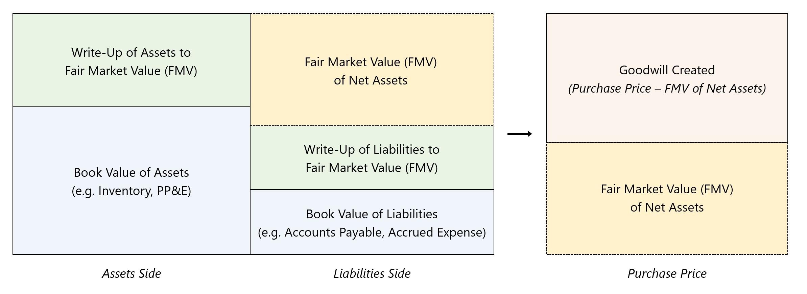

In today's fast-paced financial landscape, understanding the intricacies of accounting, goodwill amortization, and algorithmic trading has become essential. These concepts are foundational within their respective domains and intersect to shape contemporary business strategies and decision-making processes.

Goodwill, an intangible asset, arises when one company acquires another for a price exceeding the fair market value of its identifiable net assets. This excess valuation often reflects the acquiring company's perception of the target's brand strength, customer relationships, and synergistic opportunities. The accurate accounting and management of goodwill are vital, as they directly impact a company's financial health and strategic outlook. Amortization practices, governed by accounting standards, especially influence how goodwill is recorded and assessed over time.

In the context of algorithmic trading, where decisions are driven by sophisticated computational models designed to optimize investment strategies, the valuation of intangible assets like goodwill plays a critical role. Precise asset valuation influences trading models, integrating factors such as market conditions, regulatory changes, and company performance metrics. Algorithmic trading strategies utilize these inputs to dynamically adapt to changing market scenarios, thereby enhancing decision-making capabilities.

This article explores how accounting practices concerning goodwill amortization interface with algorithmic trading strategies, offering financial professionals insights into more effective intangible asset management and trading automation approaches. By appreciating the connections between these domains, professionals can better navigate the complexities of today's markets and position themselves strategically amidst continuous technological and regulatory evolutions.

## Table of Contents

## Understanding Goodwill in Accounting

Goodwill is a key intangible asset recognized in accounting during the acquisition of a company when the purchase price surpasses the fair market value of the company's net identifiable assets. This often signifies the premium paid for factors such as the company's brand reputation, customer loyalty, and synergistic benefits anticipated from the acquisition.

The derivation of goodwill primarily occurs during business combinations. It is represented by the formula:

$$
\text{Goodwill} = \text{Purchase Price} - (\text{Fair Value of Identifiable Net Assets})
$$

The role of goodwill in a company's financials extends beyond mere asset recognition. It often reflects the value attributed to critical competitive elements that do not feature as individual assets on the balance sheet, such as strong brand identity or robust customer relationships. These components contribute to a company’s long-term performance and market positioning.

The legal framework guiding the amortization of goodwill has evolved substantially, particularly influenced by changes in accounting standards. Historically, goodwill was subject to systematic amortization over a specified period, typically reflecting its gradual reduction in value. However, this changed with the issuance of Financial Accounting Standards Board (FASB) updates, specifically with the introduction of the Statement of Financial Accounting Standards No. 142 (SFAS 142) in 2001, which eliminated the routine amortization of goodwill. Instead, the FASB introduced an impairment-only approach, requiring companies to test goodwill annually for impairment and recognize any reduction in its value.

This shift was aimed at providing a more accurate reflection of a company’s financial health by acknowledging that goodwill might not decline in a linear fashion as previously assumed. The emphasis on impairment testing was intended to ensure asset valuations better matched economic realities.

Certain regulatory updates have further refined goodwill accounting practices. For instance, the FASB's Accounting Standards Update (ASU) No. 2014-02 permitted private companies to amortize goodwill on a straight-line basis over a period not exceeding ten years, coupled with an impairment model. This change aimed to alleviate some of the burdens associated with the annual impairment testing and is illustrative of the dynamic nature of goodwill accounting standards.

In this context, goodwill acts as a crucial indicator within financial analysis and decision-making processes, capturing elements of corporate valuation that extend beyond tangible asset assessments. Understanding these regulatory frameworks and their historical progression is essential for financial professionals tasked with managing and reporting on intangible assets effectively.

## Goodwill Amortization and Impairment

Amortization of goodwill is a critical accounting practice that involves the systematic reduction of its recorded value over a specific period, as dictated by prevailing accounting standards. Goodwill itself represents the excess of the purchase price over the fair market value of identifiable assets and liabilities acquired during a business acquisition. In the context of financial reporting, amortization has historically been a method to manage this intangible asset on the balance sheet.

In recent years, changes in accounting standards have altered how goodwill is treated, particularly for private companies. The Financial Accounting Standards Board (FASB) has provided an alternative to the traditional annual impairment testing requirement, allowing private companies to opt for a straight-line amortization of goodwill over a ten-year period. This option significantly reduces the complexity and cost associated with annual impairment tests, which require evaluating whether the carrying value of goodwill exceeds its fair value based on current market conditions and internal performance metrics.

Impairment testing remains essential for public companies and is a safeguard ensuring that financial statements accurately reflect the value of assets. This process involves assessing the carrying amount of goodwill against factors such as market [volatility](/wiki/volatility-trading-strategies), economic indicators, and the operational performance of the acquired business segment. Should the carrying value exceed the fair value, an impairment loss is recognized, adjusting the book value of goodwill to its present fair value.

The interplay between amortization and impairment testing underscores the need for accurate valuation practices. It ensures that financial reports provide a truthful representation of a company's asset holdings, offering investors a clear view of potential risks associated with overvalued intangible assets. While private companies benefit from reduced financial statement volatility via amortization, the rigorous process of impairment testing in public companies highlights its importance in maintaining market integrity and investor confidence.

## The Role of Algorithmic Trading

Algorithmic trading involves the use of sophisticated algorithms to conduct trades at speeds and frequencies impossible for human traders. It relies on pre-programmed criteria based on multiple market data sources to execute trading strategies autonomously. The sophistication of these algorithms allows traders to analyze vast amounts of data, identify patterns and trends, and make informed decisions more rapidly than traditional methods.

Intangible assets, such as patents and goodwill, significantly influence [algorithmic trading](/wiki/algorithmic-trading), particularly in industries where intellectual property constitutes a substantial portion of market value. Goodwill, an intangible asset arising from the acquisition premium over tangible and identifiable intangible assets, can herald future earnings and affect a firm’s financial health as perceived by market participants. When such assets are valued more highly or are seen as more stable, they can lead to stock price premiums, which feed into algorithmic models designed to assess and act upon a firm's financial health.

The valuation of these intangible assets directly affects algorithmic trading strategies. Precise valuation is crucial as it impacts models predicting stock movements and company performance. If an algorithm predicts increased value from intangible assets, it may initiate buy orders to capitalize on the anticipated rise. Conversely, undervaluation or impairment of these assets could trigger selling strategies.

Algorithmic trading systems are designed to accommodate rapid shifts in market sentiment and regulatory environments. As markets react to news, earnings reports, or shifts in accounting standards, algorithms must dynamically adjust to maintain effective trading strategies. This adaptability is especially vital when regulations or practices concerning goodwill and other intangibles change, necessitating updated valuation models that reflect new realities.

The integration of [machine learning](/wiki/machine-learning) and AI further augments the capacity of algorithmic trading, offering advanced analytics tools capable of learning from data patterns. These technologies can refine asset valuations, analyzing historical data to predict the impact of intangible assets on future performance. This predictive capability enables more precise trading decisions, enhancing profitability.

Algorithmic traders must navigate the complexities of valuing intangible assets like goodwill, where subjective judgments play a significant role. They leverage comprehensive data analytics to develop insights into market trends and asset values, ensuring that their algorithms maintain an edge in fast-paced markets.

In conclusion, the interplay between algorithmic trading and intangible assets underscores the importance of accurate asset valuation to optimize trading strategies. As financial regulations evolve and market dynamics shift, algorithmic systems must remain flexible and data-driven, ensuring that trading decisions reflect the current and anticipated economic landscape.

## Challenges and Opportunities

Accurately valuing intangible assets such as goodwill remains one of the most significant challenges in financial accounting. Unlike tangible assets, the valuation of intangible assets is often subjective, heavily relying on estimates and assumptions about future economic benefits. This subjectivity can significantly impact financial reports and, by extension, influence trading strategies. For instance, variations in the perceived value of goodwill can affect a company's balance sheet and profitability, thereby altering investor perception and potentially affecting stock prices.

Conversely, the advent of algorithmic trading brings opportunities through enhanced data analytics capabilities. Algorithms can process vast amounts of data at high speeds, offering deep insights into asset valuations and market trends. This ability to rapidly analyze and respond to complex datasets means that algorithmic trading can potentially mitigate some of the uncertainties associated with intangible asset valuations. By incorporating real-time data, market sentiment, and predictive analytics, algorithms can more accurately assess the implications of goodwill variations on a company's financial health and market positioning.

However, navigating the complexities associated with both intangible asset valuation and algorithmic trading necessitates a keen understanding of evolving regulatory landscapes. For instance, changes in accounting standards or financial regulations can have a ripple effect, influencing both how goodwill is assessed and how trading strategies are devised. To effectively manage these dynamics, organizations must adopt agile methodologies that allow for swift adaptation to regulatory shifts. This requires not only staying informed about regulatory updates but also fostering a culture of continuous learning and flexibility within financial institutions.

One practical approach is to develop a robust framework for continuous evaluation and adjustment of both asset valuation techniques and trading algorithms. This might involve regular re-calibration of valuation models and algorithmic strategies in response to new data or regulatory guidance. The use of machine learning and [artificial intelligence](/wiki/ai-artificial-intelligence) in these frameworks can further enhance their adaptability and predictive accuracy.

In summary, while the subjective nature of intangible asset valuation poses challenges, leveraging advanced computational strategies in algorithmic trading presents significant opportunities. By understanding regulatory changes and adopting agile frameworks, organizations can effectively navigate these complexities, optimize their financial strategies, and seize emerging market opportunities.

## Conclusion

Understanding the interplay between goodwill accounting and algorithmic trading is essential for modern financial management. Goodwill, as an intangible asset, plays a significant role in determining a company's overall valuation. Accurate valuation of such assets is critical not only for authentic financial reporting but also for informing algorithmic trading strategies.

Algorithmic trading relies heavily on data accuracy and precision. It can integrate real-time environmental changes and regulatory updates, thus necessitating robust asset valuation methods that incorporate intangibles like goodwill. When goodwill is accurately valued and managed, it strengthens decision-making processes in automated trading systems, giving traders an edge by providing deeper insights into a company's intrinsic value.

Financial professionals who harness technological evolutions, paired with a thorough understanding of shifting regulatory landscapes, can leverage these dynamics to maintain competitiveness. Adapting to technological advancements enables better alignment with market trends, facilitating more robust trading strategies. The symbiotic relationship between goodwill accounting and algorithmic trading ultimately enables improved financial performance and strategic market positioning. Embracing this interconnectedness empowers organizations to not only comply with accounting standards but also to innovate in trading practices, thereby achieving sustainable economic growth.

## References & Further Reading

1. **"Business Combinations" by the Financial Accounting Standards Board (FASB)**: This comprehensive guideline covers the principles for recognizing and measuring assets, liabilities, and non-controlling interests in business combinations. It provides foundational knowledge on how goodwill arises, its subsequent measurement, and its impact on financial reporting. [FASB Accounting Standards Codification (ASC) Topic 805](https://www.fasb.org/home)

2. **"Goodwill and Impairment: A Guide"** by Deloitte provides an in-depth exploration of goodwill accounting, focusing on the principles of impairment testing and the options available for amortization. This document is particularly useful for understanding practical applications and common challenges in goodwill valuation.

3. **"Algorithmic Trading & DMA" by Barry Johnson**: This book serves as a fundamental text on the subject of algorithmic trading, explaining market microstructure, the importance of back-testing strategies, and the influence of various asset classes on trading algorithms. It's essential reading for understanding the technical and strategic aspects of algorithmic trading.

4. **"Managing Intangible Assets: Sustaining Value in Business" by Mary Adams**: This book highlights the importance of intangible assets, including goodwill, in modern business. It presents case studies and management strategies for leveraging these assets for strategic advantage, providing insights into their financial impacts.

5. **“Asymmetric Information in Financial Markets: Introduction and Applications” by Ricardo N. Bebczuk**: Bebczuk's work shows how asymmetric information influences financial markets and decision-making processes, offering a context in which accounting for goodwill and algorithmic trading must operate.

6. **"The Impact of Amortization and Impairment of Goodwill on Financial Reporting: Evidence from European Firms" by Agustina Barriel and Rosario Acasuso**: This scholarly article investigates the effect of different accounting treatments of goodwill on financial reporting quality among European companies, providing empirical analysis and insights.

These references collectively offer foundational guidance and advanced strategies necessary for professionals navigating the multifaceted interactions between goodwill accounting and algorithmic trading.