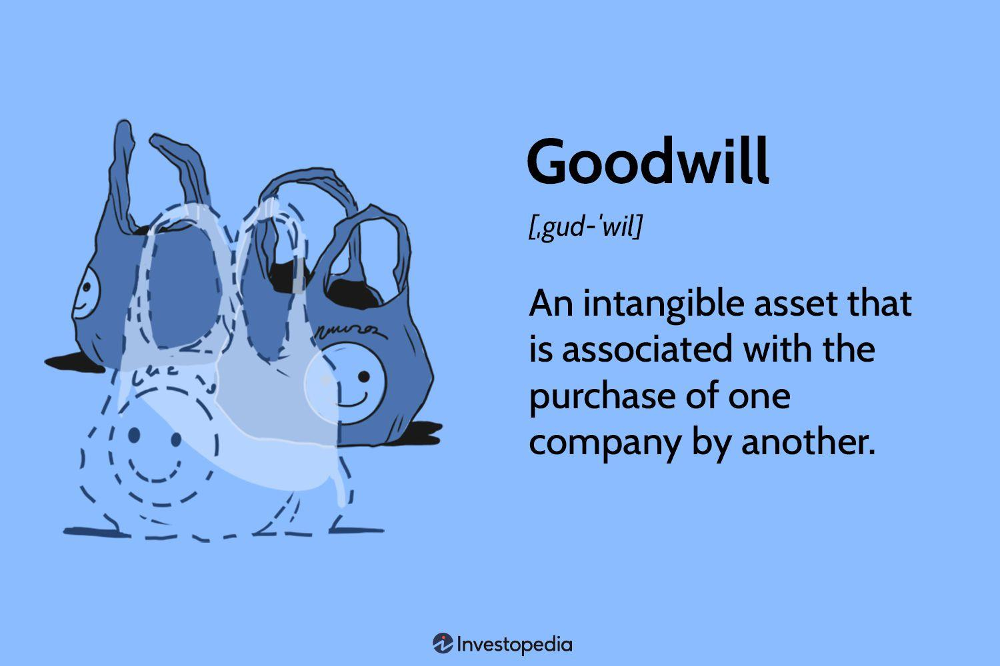

## Table of Contents

## What is goodwill in the context of business?

Goodwill is a term used in business to describe the value of a company's reputation and customer relationships. It is an intangible asset, which means it doesn't have a physical form like a building or a machine. Goodwill can be thought of as the extra value a business has because people trust it and like its products or services. When a company is sold, the price might be higher than the value of its physical assets because of this goodwill.

Goodwill often comes from things like a strong brand name, loyal customers, and good relationships with suppliers. For example, if a company is well-known and respected, it can charge more for its products and still keep its customers happy. This ability to earn more money because of its reputation is what adds to the company's goodwill. Accountants try to measure goodwill when a business is bought or sold, but it can be tricky because it's not something you can see or touch.

## How is goodwill considered a capital asset?

Goodwill is considered a capital asset because it adds value to a business over the long term. When a company has a good reputation and strong customer loyalty, it can make more money than a similar company without these advantages. This extra earning power is seen as an asset that can be bought and sold, just like buildings or equipment. Even though goodwill is not something you can touch, it's still treated as a capital asset because it helps the business make profits over time.

In accounting, when one company buys another, the price paid might be higher than the value of the physical things the bought company owns. The difference is often called goodwill. For example, if Company A buys Company B for $1 million, but Company B's buildings and machines are only worth $700,000, the extra $300,000 is considered goodwill. This amount is recorded on the balance sheet as a capital asset, showing that Company A paid for the value of Company B's reputation and customer base.

## What are the different types of goodwill?

There are two main types of goodwill: purchased goodwill and inherent goodwill. Purchased goodwill happens when a company buys another company for more than the value of its physical assets. This extra amount paid is called purchased goodwill. It's recorded on the buyer's balance sheet as an asset. For example, if Company A buys Company B for more money than the value of Company B's buildings and machines, the difference is considered purchased goodwill.

Inherent goodwill, on the other hand, is the value a company builds up over time because of its good reputation and loyal customers. This type of goodwill is not bought; it grows naturally as the company does well. For example, if a local bakery becomes famous for its delicious cakes, it has built up inherent goodwill. This goodwill helps the bakery earn more money because people trust and like it. Inherent goodwill is not shown on the balance sheet because it's not something the company paid for directly.

## How is goodwill valued in a business?

Valuing goodwill in a business can be tricky because it's not something you can see or touch. Goodwill comes from things like a good reputation, loyal customers, and strong relationships with suppliers. To figure out how much goodwill is worth, people often look at how much more money the business can make because of these advantages. They might compare the business to others in the same industry or use special formulas that take into account the company's past earnings and future [earning](/wiki/earning-announcement) potential.

One common way to value goodwill is when a business is bought or sold. If the price paid for the business is higher than the value of its buildings, machines, and other physical things, the difference is called goodwill. For example, if a company is sold for $1 million, but its physical assets are only worth $700,000, the extra $300,000 is considered goodwill. This amount is then recorded on the buyer's balance sheet as an asset. It's important because it shows that the buyer is paying for the value of the company's reputation and customer base, which can help the business make more money in the future.

## What methods are used to calculate goodwill?

One way to calculate goodwill is called the excess earnings method. This method looks at how much more money a business can make because of its good reputation and loyal customers. First, you figure out how much money the business makes each year after paying for things like salaries and rent. Then, you guess how much money a similar business without any special advantages would make. The difference between these two amounts is the extra earnings from goodwill. You then take this extra amount and multiply it by a number that shows how many years into the future you think the business will keep making this extra money. This gives you the value of the goodwill.

Another method to calculate goodwill is the capitalization of average profits method. This method looks at the average profit a business has made over a few years. You take this average profit and subtract a fair return on the business's physical assets, like buildings and machines. The fair return is what you would expect to earn from these assets if you invested them somewhere else. The difference between the average profit and this fair return is the extra profit that comes from goodwill. You then divide this extra profit by a rate that shows how much risk there is in the business. This gives you the value of the goodwill.

Both of these methods try to put a number on how much a business's reputation and customer relationships are worth. They help when a business is being bought or sold, because the buyer needs to know how much to pay for these intangible benefits. While these methods can give a good guess, valuing goodwill is never exact because it depends on many things that can change, like how people feel about the business and what might happen in the future.

## Can goodwill be bought and sold like other capital assets?

Goodwill can be bought and sold, but it's a bit different from other capital assets like buildings or machines. When a company buys another company, the price paid might be more than the value of the physical things the bought company owns. The extra amount paid is called goodwill, and it's because the buyer wants to own the reputation and customer loyalty of the bought company. This goodwill is then recorded on the buyer's balance sheet as an asset, just like any other capital asset.

However, goodwill can't be bought and sold on its own like a piece of equipment. You can't just sell the goodwill of a business without selling the business itself. The value of goodwill comes from the whole business, including its reputation, customer base, and relationships with suppliers. So, when people talk about buying or selling goodwill, they're really talking about buying or selling the whole business that has this goodwill.

## What are the accounting treatments for goodwill?

When a company buys another company for more than the value of its physical things, the extra amount is called goodwill. This goodwill is put on the buyer's balance sheet as an asset. It's like saying, "We paid extra for the good name and loyal customers of the company we bought." Every year, the company needs to check if this goodwill is still worth the same amount. If it's not, they might need to lower its value on the balance sheet. This is called impairment.

Goodwill is not like other things a company owns, like buildings or machines. You can't touch it, and it doesn't wear out over time. But, it's still very important because it helps the company make more money. When a company is doing well and people like its products, the goodwill might stay the same or even go up. But if things change and the company's reputation gets worse, the goodwill might need to be lowered. This can happen if the company loses customers or if it's not making as much money as before.

## How does goodwill impact a company's financial statements?

Goodwill shows up on a company's balance sheet as an asset. When a company buys another company for more money than the value of its buildings and machines, the extra amount is called goodwill. This means the buying company paid extra for the good reputation and loyal customers of the company they bought. Goodwill is important because it can help the company make more money in the future. But, every year, the company needs to check if the goodwill is still worth the same amount. If the company's reputation gets worse or it loses customers, the value of the goodwill might go down, and this change needs to be shown on the balance sheet.

If the value of goodwill goes down, it's called impairment. This means the company needs to lower the value of the goodwill on its balance sheet. When this happens, it also affects the income statement because the company has to show a loss. This loss is called an impairment loss. It's like saying, "We thought our goodwill was worth more, but now it's worth less." So, goodwill can make a company's financial statements look better or worse, depending on whether its value stays the same or goes down.

## What are the tax implications of goodwill as a capital asset?

When a company buys another company and pays extra for its goodwill, this extra amount can affect the company's taxes. In many countries, goodwill is considered a capital asset, just like buildings or machines. When the company that bought the goodwill sells it later, it might have to pay capital gains tax on any profit it makes. This means if the company sells the business with the goodwill for more money than it paid, it has to pay tax on the difference.

However, the rules about taxing goodwill can be different in different places. In some countries, companies can also take a tax deduction if the value of their goodwill goes down, which is called an impairment loss. This can help lower the company's tax bill for that year. It's important for companies to know the tax laws in their country so they can handle their goodwill correctly and not pay more tax than they need to.

## How does goodwill affect mergers and acquisitions?

When one company buys another company, the price they pay might be more than the value of the buildings, machines, and other things the bought company owns. The extra amount is called goodwill. Goodwill comes from the good reputation and loyal customers of the bought company. It's important because it can help the buying company make more money in the future. So, when companies are thinking about merging or buying another company, they look at how much goodwill the other company has. This can make the price of the deal higher because the buyer wants to own the good name and customer base of the company they're buying.

But, goodwill can also make things tricky in mergers and acquisitions. After the deal, the buying company needs to check every year if the goodwill is still worth the same amount. If the bought company's reputation gets worse or it loses customers, the value of the goodwill might go down. This is called impairment. When this happens, the buying company has to show a loss on its financial statements, which can make its profits look smaller. So, goodwill can affect how much a company is willing to pay for another company and how the deal looks on paper after it's done.

## What are the risks associated with goodwill impairment?

When a company's goodwill loses value, it's called impairment. This can happen if the company's reputation gets worse or it loses customers. Impairment can be a big problem because it means the company has to show a loss on its financial statements. This loss can make the company's profits look smaller, which might scare away investors or make it harder to get loans. If a lot of goodwill is impaired, it can even hurt the company's stock price.

Checking for impairment every year is important, but it can also be tricky. Sometimes, it's hard to tell if goodwill is really losing value or if it's just a temporary problem. If a company waits too long to recognize impairment, it might have to make a big adjustment all at once, which can be a shock to investors. On the other hand, if a company is too quick to say its goodwill is impaired, it might miss out on future profits if the goodwill turns out to be worth more than they thought.

## How do regulatory frameworks differ in the treatment of goodwill across countries?

Different countries have different rules about how companies should handle goodwill on their financial statements. In the United States, the rules come from the Financial Accounting Standards Board (FASB). They say that companies need to check the value of their goodwill every year and write it down if it's worth less. This is called impairment testing. In Europe, the rules come from the International Financial Reporting Standards (IFRS), which are a bit different. Under IFRS, companies also need to check for impairment, but they can do it more often than just once a year if they think the value might have gone down.

In some countries, like Japan, the rules are a bit stricter. Japanese companies have to check for impairment more often and might have to write down the value of their goodwill faster than companies in the U.S. or Europe. Also, some countries allow companies to spread out the cost of goodwill over time, which is called amortization. This is different from the U.S., where companies can't do this. All these differences can make it hard for companies that do business in many countries to keep track of their goodwill and report it correctly on their financial statements.

## What are the Principles of Goodwill Accounting?

Goodwill accounting is a fundamental aspect of financial reporting and is governed by standards such as Generally Accepted Accounting Principles (GAAP) and International Financial Reporting Standards (IFRS). These frameworks ensure that goodwill is managed consistently and transparently across companies.

Goodwill, being an intangible asset, is not subject to amortization. Instead, it undergoes annual impairment testing. This approach is predicated on the fact that goodwill does not have a finite useful life in the same way that tangible assets, such as machinery and equipment, do. Consequently, amortization, which spreads the cost of an asset over its useful life, is not applicable to goodwill.

Impairment testing is a crucial process that determines whether the carrying amount of goodwill on a company's balance sheet exceeds its recoverable amount. The recoverable amount is defined as the higher of fair value less costs of disposal and value in use. If the carrying amount exceeds the recoverable amount, an impairment loss is recognized, impacting the company’s financial statements and potentially influencing investor confidence. The formula for the impairment loss is:

$$
\text{Impairment Loss} = \text{Carrying Amount} - \text{Recoverable Amount}
$$

In a practical sense, the impairment test helps prevent the overstatement of assets and provides a more accurate representation of a company’s financial health. The test involves complex judgments and estimates, including forecasting future cash flows and determining appropriate discount rates to calculate the present value of expected earnings from the cash-generating units to which the goodwill is allocated.

The distinction between amortization and impairment testing is significant. While amortization reflects a systematic allocation of an intangible asset’s cost, impairment is an evaluation of its recoverability. Goodwill is subject to impairment because its value often fluctuates based on market and economic conditions, making it essential to reassess its valuation annually. This methodology aligns with the economic realities and financial prudence, ensuring that investors and stakeholders have reliable information for their decision-making processes.

In summary, the principles of goodwill accounting under GAAP and IFRS are designed to ensure financial consistency, transparency, and accuracy in reporting. Companies must perform regular impairment tests to verify the validity and recoverability of goodwill, avoiding the automatic amortization that would otherwise not reflect its true economic value.

 to Algorithmic Trading

Algorithmic trading, commonly referred to as algo trading, employs pre-defined computational algorithms to execute trades based on specific market conditions. This approach enhances trading speed and efficiency, operating at a pace and scale that are unattainable for human traders. By automating trade execution, [algorithmic trading](/wiki/algorithmic-trading) minimizes human errors and mitigates emotional biases, fostering a more rational and data-driven decision-making process.

The core mechanism of algorithmic trading is its reliance on pre-programmed instructions that guide when, how, and at what price trades should be executed. These instructions are based on a diverse range of criteria, such as timing, price, quantity, or any mathematical model. The algorithms can be as simple as executing an order when a stock hits a certain price point or as complex as employing [machine learning](/wiki/machine-learning) models to predict market trends.

The advent of high-frequency trading ([HFT](/wiki/high-frequency-trading-strategies)) systems exemplifies the technological advances that have expanded the potential of algorithmic trading. HFT involves the rapid execution of a large number of trades at extremely high speeds, often within milliseconds. This technique exploits small price discrepancies with the aim of accruing profits over numerous transactions. To facilitate these rapid trades, firms often co-locate their servers near exchanges to minimize latency.

Moreover, the integration of machine learning within algorithmic trading has significantly broadened its landscape. Machine learning techniques enable the analysis of vast datasets to discern patterns and predict market movements. Algorithms can adapt to changing market conditions, fine-tuning their strategies to maintain competitiveness. For instance, algorithms utilizing [reinforcement learning](/wiki/reinforcement-learning) can dynamically adjust their trading strategies by continuously learning from the outcomes of previous trades.

Here is a simple Python structure showcasing a basic algorithmic trading strategy employing moving averages:

```python
def moving_average_strategy(prices, short_window=40, long_window=100):
    import pandas as pd
    signals = pd.DataFrame(index=prices.index)
    signals['price'] = prices
    signals['short_mavg'] = prices.rolling(window=short_window, min_periods=1, center=False).mean()
    signals['long_mavg'] = prices.rolling(window=long_window, min_periods=1, center=False).mean()

    # Create signals
    signals['signal'] = 0.0
    signals['signal'][short_window:] = np.where(signals['short_mavg'][short_window:] > signals['long_mavg'][short_window:], 1.0, 0.0)   

    # Generate trading orders
    signals['positions'] = signals['signal'].diff()

    return signals

# Sample Usage assuming 'data' is a time series of stock prices
# signals = moving_average_strategy(data)
```

In conclusion, algorithmic trading represents a paradigm shift in financial markets, largely attributed to technological innovations and the increasing sophistication of data analytics. As technology advances, the scope and precision of algorithmic trading are expected to grow, continuously transforming the landscape of trading and investment practices.

## References & Further Reading

- **Bergstra, J., et al. (2011). Algorithms for Hyper-Parameter Optimization**: This work provides insight into optimizing hyper-parameters, a critical process in improving algorithmic trading models through enhanced prediction accuracy and computational efficiency. Understanding these optimization algorithms can help in fine-tuning trading strategies.

- **Marcos Lopez de Prado. Advances in Financial Machine Learning**: This book offers comprehensive coverage of machine learning techniques applied to finance, including concepts important for the development of sophisticated algorithmic trading systems. It discusses cutting-edge machine learning paradigms that traders can implement to leverage goodwill accounting insights in their strategies.

- **David Aronson. Evidence-Based Technical Analysis**: Aronson's work emphasizes the importance of rigorous statistical tests over subjective judgment in technical analysis. By incorporating evidence-based techniques, traders can create robust models to interpret goodwill data and improve the reliability of trading decisions.

- **Stefan Jansen. Machine Learning for Algorithmic Trading**: Jansen’s book explores the application of machine learning models in algorithmic trading, providing practical guidance and examples. The integration of goodwill accounting insights can be enhanced by the methodologies discussed, facilitating better-informed automated trading strategies.

- **Ernest P. Chan. Quantitative Trading: How to Build Your Own Algorithmic Trading Business**: This guide offers foundational knowledge for developing a quantitative trading business. Chan’s insights can be particularly useful for those aiming to utilize goodwill accounting metrics to identify trading opportunities by interpreting stock valuation shifts.

