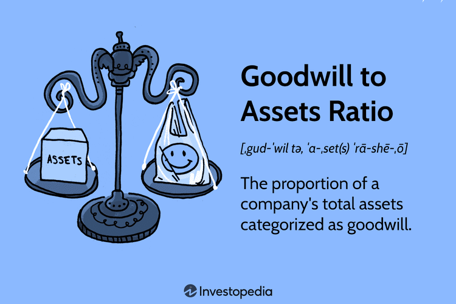

This article explores the complex relationships between capital assets, goodwill accounting, and algorithmic trading. Goodwill is an intangible asset that emerges during business acquisitions, representing the premium paid over the fair market value of the acquired entity's net identifiable assets. It captures elements such as brand reputation, customer loyalty, and proprietary technology, which may not have a directly quantifiable economic benefit but are crucial for future earnings and competitive advantage.

Algorithmic trading, on the other hand, represents a significant leap forward in financial market operations by using sophisticated algorithms and data analysis to execute trades. This form of trading has transformed the landscape by enabling rapid, precise, and data-driven decision-making processes. It minimizes human error and removes emotional biases, thus creating a more efficient market environment.



This article aims to examine how goodwill accounting can be used within algorithmic trading strategies to potentially unlock greater value. By leveraging algorithms to refine the valuation of goodwill, traders can gain insights into market sentiment and stock valuation, thus improving their trading strategies. An understanding of these methodologies is crucial for investors, financial analysts, and business leaders seeking to thrive in today's data-driven financial landscape. These concepts present a unique opportunity to enhance strategic decision-making and optimize investment outcomes by aligning intangible asset valuation with cutting-edge trading techniques.

## Table of Contents

## Understanding Goodwill and Capital Assets

Goodwill is an intangible asset recognized when a company acquires another by paying a premium over the fair market value of the net identifiable assets. This premium reflects elements that are not easily quantifiable yet hold substantial future economic benefits. Goodwill encompasses aspects such as brand value, which represents the reputation and recognition a company possesses within its market. This adds to its potential to attract and retain customers. Customer relationships are another critical component of goodwill, representing the established connections and loyalty a business maintains with its clientele, which often translate into sustained revenue streams. Proprietary technology included in goodwill, refers to the exclusive technologies or processes a company has developed or acquired, offering competitive advantages and innovative capabilities.

Capital assets are long-term assets vital for generating ongoing revenue for a business. These assets, which include property, plant, equipment, and certain financial assets, are foundational to a company's operational capacity and financial health. They are typically held for periods exceeding a year and play a crucial role in delivering consistent economic benefits through productivity and efficiency.

Goodwill, despite being intangible, is considered a capital asset because it significantly contributes to future revenue generation. Its value stems from its potential to enhance a company's [earning](/wiki/earning-announcement) capability, much like tangible capital assets do. The recognition and management of goodwill on financial statements are critical, as they influence investment decisions, reflect business combinations' success, and affect a company's reported financial health.

In accounting practices, goodwill is handled with a focus on its ability to yield economic value over time. Unlike tangible capital assets that undergo depreciation, goodwill is subject to impairment. This involves testing regularly to ensure that its carrying value does not exceed its recoverable amount, aligning with standards prescribed by Generally Accepted Accounting Principles (GAAP) and International Financial Reporting Standards (IFRS). Properly maintaining the value of goodwill is essential for accurate financial reporting and maintaining investor confidence in a company's financial statements.

## Principles of Goodwill Accounting

Goodwill accounting is a fundamental aspect of financial reporting and is governed by standards such as Generally Accepted Accounting Principles (GAAP) and International Financial Reporting Standards (IFRS). These frameworks ensure that goodwill is managed consistently and transparently across companies.

Goodwill, being an intangible asset, is not subject to amortization. Instead, it undergoes annual impairment testing. This approach is predicated on the fact that goodwill does not have a finite useful life in the same way that tangible assets, such as machinery and equipment, do. Consequently, amortization, which spreads the cost of an asset over its useful life, is not applicable to goodwill.

Impairment testing is a crucial process that determines whether the carrying amount of goodwill on a company's balance sheet exceeds its recoverable amount. The recoverable amount is defined as the higher of fair value less costs of disposal and value in use. If the carrying amount exceeds the recoverable amount, an impairment loss is recognized, impacting the company’s financial statements and potentially influencing investor confidence. The formula for the impairment loss is:

$$
\text{Impairment Loss} = \text{Carrying Amount} - \text{Recoverable Amount}
$$

In a practical sense, the impairment test helps prevent the overstatement of assets and provides a more accurate representation of a company’s financial health. The test involves complex judgments and estimates, including forecasting future cash flows and determining appropriate discount rates to calculate the present value of expected earnings from the cash-generating units to which the goodwill is allocated.

The distinction between amortization and impairment testing is significant. While amortization reflects a systematic allocation of an intangible asset’s cost, impairment is an evaluation of its recoverability. Goodwill is subject to impairment because its value often fluctuates based on market and economic conditions, making it essential to reassess its valuation annually. This methodology aligns with the economic realities and financial prudence, ensuring that investors and stakeholders have reliable information for their decision-making processes.

In summary, the principles of goodwill accounting under GAAP and IFRS are designed to ensure financial consistency, transparency, and accuracy in reporting. Companies must perform regular impairment tests to verify the validity and recoverability of goodwill, avoiding the automatic amortization that would otherwise not reflect its true economic value.

 to Algorithmic Trading

Algorithmic trading, commonly referred to as algo trading, employs pre-defined computational algorithms to execute trades based on specific market conditions. This approach enhances trading speed and efficiency, operating at a pace and scale that are unattainable for human traders. By automating trade execution, [algorithmic trading](/wiki/algorithmic-trading) minimizes human errors and mitigates emotional biases, fostering a more rational and data-driven decision-making process.

The core mechanism of algorithmic trading is its reliance on pre-programmed instructions that guide when, how, and at what price trades should be executed. These instructions are based on a diverse range of criteria, such as timing, price, quantity, or any mathematical model. The algorithms can be as simple as executing an order when a stock hits a certain price point or as complex as employing [machine learning](/wiki/machine-learning) models to predict market trends.

The advent of high-frequency trading ([HFT](/wiki/high-frequency-trading-strategies)) systems exemplifies the technological advances that have expanded the potential of algorithmic trading. HFT involves the rapid execution of a large number of trades at extremely high speeds, often within milliseconds. This technique exploits small price discrepancies with the aim of accruing profits over numerous transactions. To facilitate these rapid trades, firms often co-locate their servers near exchanges to minimize latency.

Moreover, the integration of machine learning within algorithmic trading has significantly broadened its landscape. Machine learning techniques enable the analysis of vast datasets to discern patterns and predict market movements. Algorithms can adapt to changing market conditions, fine-tuning their strategies to maintain competitiveness. For instance, algorithms utilizing [reinforcement learning](/wiki/reinforcement-learning) can dynamically adjust their trading strategies by continuously learning from the outcomes of previous trades.

Here is a simple Python structure showcasing a basic algorithmic trading strategy employing moving averages:

```python
def moving_average_strategy(prices, short_window=40, long_window=100):
    import pandas as pd
    signals = pd.DataFrame(index=prices.index)
    signals['price'] = prices
    signals['short_mavg'] = prices.rolling(window=short_window, min_periods=1, center=False).mean()
    signals['long_mavg'] = prices.rolling(window=long_window, min_periods=1, center=False).mean()

    # Create signals
    signals['signal'] = 0.0
    signals['signal'][short_window:] = np.where(signals['short_mavg'][short_window:] > signals['long_mavg'][short_window:], 1.0, 0.0)   

    # Generate trading orders
    signals['positions'] = signals['signal'].diff()

    return signals

# Sample Usage assuming 'data' is a time series of stock prices
# signals = moving_average_strategy(data)
```

In conclusion, algorithmic trading represents a paradigm shift in financial markets, largely attributed to technological innovations and the increasing sophistication of data analytics. As technology advances, the scope and precision of algorithmic trading are expected to grow, continuously transforming the landscape of trading and investment practices.

## The Intersection of Goodwill and Algo Trading

Algorithmic trading has revolutionized the financial landscape by utilizing large datasets and advanced analytical frameworks. This precision-driven approach can significantly enhance the valuation process of goodwill, a critical component often characterized by its intangible and complex nature. Goodwill, as derived from business acquisitions, can influence stock pricing and investor sentiment, making its accurate assessment vital for strategy development within trading environments.

The vast datasets employed in algorithmic trading enrich the process of goodwill valuation by providing quantitative insights that traditional methods may overlook. For instance, by analyzing patterns in market data alongside publicly disclosed financial information, algorithms can estimate the market's perception of a company’s intangible assets, such as brand reputation or intellectual property. This enhanced estimation capability allows traders to better forecast stock movements based on goodwill valuations, aligning their strategies with anticipated market trends.

Integrating goodwill valuation into trading algorithms can also improve market sentiment analysis. Algorithms designed to assess sentiment may incorporate goodwill metrics as a variable, quantifying how shifts in perceived intangible asset value could affect stock prices. For example, sudden increases or decreases in goodwill due to updated company valuations or market events might signal potential buying or selling opportunities. 

Practical applications are evident in case studies where algorithmic trading strategies have been tailored to respond to goodwill reporting changes. These adaptations can help optimize portfolio returns by dynamically adjusting asset allocations in response to detected environment shifts. For instance, in scenarios where accounting standards or market conditions prompt significant goodwill impairments, algorithms may flag these events as indicators of underlying financial health, prompting a reevaluation of investment positions.

Overall, combining goodwill valuation with algorithmic trading creates a powerful synergy. It not only enhances the precision of financial forecasting but also provides a robust framework for detecting undervalued or overvalued assets. As technology continues to advance, the integration of these sophisticated approaches will likely deepen, offering traders and business strategists valuable tools to navigate complex market dynamics.

## Strategic Value of Combining Goodwill Accounting and Algo Trading

Integrating goodwill insights into algorithmic trading systems can significantly enhance decision-making and optimize investment outcomes by leveraging the nuanced interplay between financial accounting and advanced trading algorithms. Goodwill is often a crucial element in understanding a company's true valuation beyond the tangible assets listed on its balance sheet. By incorporating insights derived from goodwill accounting, algorithmic traders can gain a more comprehensive understanding of stock valuation, particularly in identifying stocks that are potentially undervalued or overvalued. This capability offers a strategic edge in formulating more effective trading strategies.

One method to implement this integration is by analyzing patterns in goodwill adjustments reported by companies. For instance, a sudden impairment in goodwill may indicate a decline in the anticipated cash flows from an acquired entity, which, in turn, can signal potential adjustments in stock prices. Algorithmic trading systems, equipped with machine learning algorithms, can be trained to recognize such patterns and generate predictive insights on market sentiment and stock movement. The integration of these financial insights into trading algorithms allows for enhanced detection of [arbitrage](/wiki/arbitrage) opportunities based on the perceived discrepancies in a company’s market valuation versus its reported goodwill.

In the context of detecting valuation discrepancies, a quantitative approach could be employed to develop a model that predicts stock price reactions to changes in reported goodwill. The model might use features such as historical goodwill impairment charges, the sector of the business, news sentiment analysis, and macroeconomic indicators. A machine learning model, such as a gradient boosting classifier, could be trained to provide predictive classifications on whether stocks will outperform or underperform following significant goodwill write-offs or accolades.

```python
from sklearn.ensemble import GradientBoostingClassifier
from sklearn.model_selection import train_test_split
from sklearn.metrics import accuracy_score
import pandas as pd

# hypothetical dataset containing the predictor variables
data = pd.read_csv('goodwill_data.csv')

# defining the features and target
features = data.drop(['stock_performance'], axis=1)
target = data['stock_performance']

# splitting the dataset into training and testing sets
X_train, X_test, y_train, y_test = train_test_split(features, target, test_size=0.2, random_state=42)

# training the Gradient Boosting Classifier
model = GradientBoostingClassifier()
model.fit(X_train, y_train)

# predicting and evaluating the model
predictions = model.predict(X_test)
accuracy = accuracy_score(y_test, predictions)

print(f'Model Accuracy: {accuracy:.2f}')
```

Fintech innovations provide the necessary tools and platforms to seamlessly incorporate these advanced analytics into trading systems. These platforms often combine financial accounting data with sophisticated trading algorithms, thereby allowing traders to make informed decisions with mechanized precision. They transform traditional financial signals into actionable trading strategies, driven by profound insights from goodwill fluctuations and their potential market impacts. As fintech continues to expand its offerings, the fusion of goodwill accounting and algorithmic trading is poised to provide substantial benefits, generating profitable opportunities and enhancing the strategic flexibility of traders.

## Conclusion

The convergence of goodwill accounting and algorithmic trading presents significant strategic advantages for businesses intent on gaining competitive edges in the financial sector. By marrying the rigor of goodwill accounting, which captures intangible asset value beyond traditional metrics, with the precision of algorithmic trading, businesses can unlock nuanced insights that refine investment strategies. This intersection allows for a more comprehensive understanding of market dynamics, where goodwill variances can inform trading algorithms to identify potential undervalued or overvalued stocks, thus optimizing portfolio allocations.

For decision-makers and analysts, mastering the connection between these domains can enhance predictive accuracy and improve decision-making processes. Algorithmic trading, characterized by its reliance on data analysis and sophisticated computational models, can benefit from the deep insights offered by understanding goodwill adjustments and their implications on a company's perceived market value.

Firms must remain vigilant of technological advancements that inform both goodwill accounting practices and algorithmic trading models. As machine learning and [artificial intelligence](/wiki/ai-artificial-intelligence) continue to evolve, they offer new methods to synthesize vast amounts of data for greater financial insights. Businesses are thus encouraged to explore the integration of these technologies to harness their potential fully, adapting to new economic conditions, and seizing opportunities for growth and efficiency.

Overall, the fusion of goodwill accounting and algorithmic trading can lead to improved business success by providing a competitive edge, pivotal in today's fast-paced financial markets. Embracing these advancements not only fortifies strategic decision-making but also paves the way for innovative approaches to capital management.

## References & Further Reading

- **Bergstra, J., et al. (2011). Algorithms for Hyper-Parameter Optimization**: This work provides insight into optimizing hyper-parameters, a critical process in improving algorithmic trading models through enhanced prediction accuracy and computational efficiency. Understanding these optimization algorithms can help in fine-tuning trading strategies.

- **Marcos Lopez de Prado. Advances in Financial Machine Learning**: This book offers comprehensive coverage of machine learning techniques applied to finance, including concepts important for the development of sophisticated algorithmic trading systems. It discusses cutting-edge machine learning paradigms that traders can implement to leverage goodwill accounting insights in their strategies.

- **David Aronson. Evidence-Based Technical Analysis**: Aronson's work emphasizes the importance of rigorous statistical tests over subjective judgment in technical analysis. By incorporating evidence-based techniques, traders can create robust models to interpret goodwill data and improve the reliability of trading decisions.

- **Stefan Jansen. Machine Learning for Algorithmic Trading**: Jansen’s book explores the application of machine learning models in algorithmic trading, providing practical guidance and examples. The integration of goodwill accounting insights can be enhanced by the methodologies discussed, facilitating better-informed automated trading strategies.

- **Ernest P. Chan. Quantitative Trading: How to Build Your Own Algorithmic Trading Business**: This guide offers foundational knowledge for developing a quantitative trading business. Chan’s insights can be particularly useful for those aiming to utilize goodwill accounting metrics to identify trading opportunities by interpreting stock valuation shifts.

