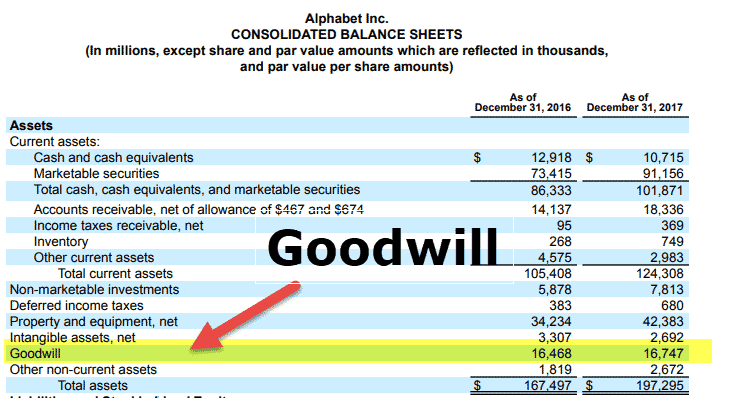

Goodwill is a crucial intangible asset that emerges during corporate acquisitions when a buyer pays more for a company than the fair value of its identifiable net assets. This excess payment often reflects valuable brand reputation, customer relationships, and other non-quantifiable assets contributing to future economic benefits. In corporate finance and accounting, goodwill is significant because it offers a more realistic picture of a company's value beyond its tangible assets, guiding strategic investment decisions.

Goodwill impairment occurs when the carrying amount of goodwill exceeds its recoverable amount, indicating that the goodwill asset is overvalued on the balance sheet. Recognizing goodwill impairment in financial reporting is essential as it aligns a company's book value with its true economic value, allowing investors and stakeholders to make more informed evaluations of its financial health. Goodwill impairment is reported as a loss on the income statement, reducing net income and affecting profitability metrics.



The integration of goodwill accounting with algorithmic trading has opened new avenues for strategic financial decision-making. Algorithmic trading, which uses complex algorithms to execute trades based on market data, can provide valuable insights into how goodwill valuations impact stock performance. With advanced data analysis capabilities, trading algorithms assess market sentiment and predict responses to goodwill-related announcements, allowing traders to optimize their strategies and exploit market inefficiencies.

This article aims to explore the intricacies of goodwill impairment tests and the pertinent accounting standards that govern these processes. Furthermore, it will examine the role of algorithmic trading in enhancing financial analysis, offering insights into materially important goodwill valuations that affect investment decisions. Through a detailed examination of these topics, the article seeks to provide readers with a comprehensive understanding of how goodwill can influence both company valuation and trading strategies.

## Table of Contents

## Understanding Goodwill and Impairment

Goodwill is an intangible asset that comes into existence when a company acquires another entity for a consideration exceeding the fair value of its identifiable net assets. This discrepancy arises due to the acquired company's reputation, brand, customer relations, intellectual property, and other non-quantifiable strengths. Unlike tangible assets, goodwill is not a physical item but represents potential future economic benefits due to the acquisition.

Goodwill impairment occurs when the carrying amount of goodwill in the financial statements exceeds its fair value, which may be influenced by various external and internal factors. Externally, adverse economic conditions, market demand fluctuations, regulatory changes, or competitive pressures can lead to a decline in a business's expected [earning](/wiki/earning-announcement) potential, thereby necessitating impairment. Internally, strategic changes such as shifts in business models, management decisions, restructuring, or underperformance can also trigger a goodwill impairment.

When impairment is recognized, it impacts the financial statements significantly. On the income statement, an impairment loss is recorded, reducing the net income for that period, thus affecting profitability metrics. Meanwhile, on the balance sheet, the carrying value of goodwill decreases, which also leads to a reduction in total assets and equity.

Impairment testing involves comparing the carrying amount of a reporting unit, which includes goodwill, to its fair value. If the carrying amount exceeds the fair value, the excess is recognized as an impairment loss. The primary concepts include 'fair value', which is the price that would be received to sell an asset in an orderly transaction between market participants, and 'carrying amount', the book value of an asset as recorded on the balance sheet. A systematic approach to testing ensures that any overvaluation of goodwill is promptly adjusted to reflect the true economic value of the acquired assets.

## Accounting Standards for Goodwill Impairment

Accounting for goodwill impairment is a critical component of financial reporting and is governed by established accounting standards such as Generally Accepted Accounting Principles (GAAP) in the United States and International Financial Reporting Standards (IFRS) globally. These standards ensure that companies report their financial position accurately, particularly when it comes to the valuation of intangible assets like goodwill.

**Evolution of Standards over Time**

The assessment of goodwill impairment has evolved significantly over time. In the United States, the Financial Accounting Standards Board (FASB) introduced Statement of Financial Accounting Standards No. 142 (SFAS 142) in 2001, emphasizing Fair Value Testing. SFAS 142 marked a departure from the systematic amortization of goodwill, instead requiring companies to perform annual impairment tests. This transition sought to align the carrying amount of goodwill on balance sheets more closely with its fair value, thereby enhancing the accuracy of financial statements.

The International Accounting Standards Board (IASB), governing IFRS, similarly mandates impairment testing rather than amortization under IAS 36, "Impairment of Assets." Like SFAS 142, this standard requires companies to determine whether the carrying amount of goodwill exceeds its recoverable amount, defined as the higher of its fair value less costs of disposal and its value in use.

**Steps Involved in Goodwill Impairment Testing**

Under current standards, the goodwill impairment test is generally performed annually or whenever there is an indication that goodwill might be impaired. The test involves several steps:

1. **Identification of Reporting Units or Cash-Generating Units (CGUs):** Goodwill is allocated to these units, which are tested for impairment.
2. **Fair Value Measurement:** The fair value of the reporting unit is estimated. If the fair value exceeds the carrying amount, then goodwill is not impaired.
3. **Calculating Impairment (if necessary):** If the carrying amount exceeds the fair value, an impairment loss is recorded. The loss is calculated as the difference between these two figures.

**Simplified Testing Approaches**

To decrease the complexity and associated costs of goodwill impairment testing, both GAAP and IFRS have incorporated simplified testing approaches:

- **Step 0 Qualitative Test (GAAP):** Introduced by FASB, this optional test allows companies to first assess qualitative factors to determine whether it is more likely than not that the fair value is less than its carrying amount. If, based on this qualitative assessment, an entity concludes that it is not more likely than not, then the quantitative impairment test is not necessary.

- **Private Company Options (GAAP):** Recognizing the burden of annual impairment tests on private companies, FASB has provided an alternative for private companies, allowing them to amortize goodwill over a period of up to 10 years and perform a triggering event-based impairment test, rather than annual testing.

- **IFRS Simplification for Small Entities:** While IFRS does not provide a direct equivalent to the Step 0 test, some jurisdictions may allow small or medium-sized entities to use less onerous methods within their national GAAPs that are still aligned with IFRS principles.

These approaches reflect ongoing efforts to balance the need for rigorous financial reporting with the practicalities of implementing complex accounting standards.

## The Role of Algo Trading in Goodwill Analysis

Algorithmic trading, commonly referred to as algo trading, is an automated execution system that uses pre-programmed trading instructions accounting for variables such as timing, price, and [volume](/wiki/volume-trading-strategy). Its rise in financial markets has transformed trading operations by increasing efficiency, speed, and precision, significantly reducing the manual intervention required in traditional trading processes. According to the Bank for International Settlements, algo trading accounted for over 60% of all trades in the United States and over 50% in Europe by 2019.

Algo trading leverages data-driven analysis to incorporate various quantitative and qualitative factors impacting stock valuations, including goodwill. Goodwill represents the premium paid over the net fair value of a company's identifiable assets during an acquisition, reflecting intangible factors such as brand reputation and customer loyalty. These intangible elements can considerably affect a company's perceived and actual market value.

Algorithms can provide nuanced evaluations of goodwill impacts by processing large datasets, including historical financial statements, market data, and economic indicators. They employ techniques such as [machine learning](/wiki/machine-learning) to detect patterns and assess the effect of goodwill on a firm's stock price. For example, algorithms can be designed to analyze market responses to financial statements reporting goodwill impairments — a condition when the carrying value of goodwill exceeds its fair value, indicating potential overpayment in acquisitions.

Integration of goodwill evaluation within trading algorithms can anticipate market responses to announcements related to goodwill. When news of goodwill impairment emerges, algorithms can adjust trading strategies by analyzing historical market behavior during similar events and incorporating sentiment analysis to gauge investor reactions. As an example, consider an algorithm that processes recent stock price movements, trading volumes, and sentiment from news outlets and social media. Upon identifying a goodwill impairment announcement, the algorithm could execute trades in milliseconds to capitalize on anticipated price shifts, thus gaining a strategic advantage.

In practice, algo trading adapts its strategies based on goodwill impairments by altering trading parameters such as asset allocation, risk thresholds, and timing of trades. For instance, algorithms might short-sell stocks of companies reporting significant goodwill impairments or, conversely, find opportunities to buy undervalued stocks that the market overreacts to.

By harnessing sentiment analysis, algorithms can refine trading strategies around goodwill announcements. They analyze text data from news sources, press releases, and social media posts to compute a sentiment score, which is used to predict short-term market movements. For example:

```python
from textblob import TextBlob
import numpy as np

# Sample text from a press release on goodwill impairment
text = """
XYZ Corp announced a $500 million goodwill impairment charge due to declining market conditions.
"""

# Calculate the sentiment score
analysis = TextBlob(text)
sentiment_score = analysis.sentiment.polarity

# Trade decision based on sentiment
if sentiment_score < -0.1:
    trade_action = "sell"
elif sentiment_score > 0.1:
    trade_action = "buy"
else:
    trade_action = "hold"
```

This Python code shows a simple sentiment analysis approach to evaluate text data. By assessing the sentiment polarity, trading algorithms can make informed decisions in response to the perceived market sentiment, thereby dynamically adjusting strategies around goodwill announcements and economic conditions.

In conclusion, algo trading is a powerful tool that, when integrated with goodwill analysis, can significantly enhance trading strategies. Through the use of advanced algorithms, financial analysts and traders can respond swiftly and strategically to changes in market dynamics influenced by goodwill and other intangible assets.

## Strategic Benefits of Combining Goodwill Accounting and Algo Trading

Integrating goodwill insights with [algorithmic trading](/wiki/algorithmic-trading) offers a nuanced approach to enhancing decision-making and refining investment strategies. Goodwill, being an intangible asset on balance sheets, influences perceived corporate value beyond tangible assets. When combined with algorithmic trading, which utilizes automated systems and complex mathematical models for making trading decisions, companies can gain a strategic edge by accurately predicting market responses and adjusting investment portfolios accordingly.

### Enhancing Investment Strategies through Integration

The synthesis of goodwill accounting and algorithmic trading allows businesses to make insightful financial decisions by incorporating real-time analysis of goodwill impairments. Such integration enables algorithms to adjust trading models based on fluctuations in goodwill values and trends. By utilizing machine learning and [artificial intelligence](/wiki/ai-artificial-intelligence), trading algorithms can discern patterns and predict market behaviors toward changes in goodwill, providing a timely advantage in executing trades with precision.

### Case Studies Highlighting Integration Effectiveness

Successful applications of this strategy can be observed in several industry case studies. One notable example is the adoption of this integrated approach by investment firms during periods of significant economic transitions. By leveraging algorithms designed to account for goodwill impairments along with traditional financial metrics, these firms were able to outperform competitors who relied solely on conventional analysis.

Another case involved a technology company undergoing restructuring, where goodwill impairment was a critical [factor](/wiki/factor-investing). Firms using algorithmic trading incorporated these impairments into their models, allowing them to foresee the resultant market impact and swiftly adapt their trading strategies, achieving superior returns compared to peers that missed these signals.

### Role of Fintech Advancements

Financial technology (fintech) advancements have played a crucial role in merging goodwill insights with algorithmic trading. Technologies such as big data analytics, blockchain, and machine learning provide robust platforms for analyzing large datasets, uncovering correlations, and automating complex processes associated with goodwill calculations and trading decisions. These innovations facilitate enhanced real-time data processing and improved decision-making speed and accuracy.

### Best Practices for Capitalizing on Insights

To effectively capitalize on insights gained from combining goodwill accounting with algorithmic trading, businesses should adopt the following best practices:

1. **Invest in Data Analytics Infrastructure**: Implement state-of-the-art data analytics platforms to ensure comprehensive data collection and analysis capabilities.

2. **Develop Multi-Disciplinary Teams**: Create teams with expertise in finance, technology, and data science to foster collaboration and integration of goodwill insights into trading strategies.

3. **Continuous Model Refinement**: Regularly update and refine trading algorithms to incorporate the latest data on goodwill as well as emerging market trends and anomalies.

4. **Leverage Machine Learning**: Integrate machine learning algorithms to enhance predictive accuracy, enabling better anticipation of market movements related to goodwill impairments.

5. **Foster a Culture of Innovation**: Encourage continuous learning and innovation to remain adaptable to technological advancements and changing market conditions.

By effectively integrating goodwill accounting with algorithmic trading, companies can achieve a strategic advantage, ensuring nimbleness in a rapidly evolving financial landscape and securing leadership in market positioning.

## Conclusion

Understanding goodwill impairment is crucial for effective financial management, as it plays a significant role in the accurate representation of a company's financial health. Goodwill, being an intangible asset, requires careful attention, especially when market conditions or internal strategic decisions influence its valuation. The implications of goodwill impairment are far-reaching, affecting both the income statement and the balance sheet, and can have a profound impact on investor perceptions and stock valuations.

Integrating goodwill accounting with algorithmic trading offers a strategic advantage, as it enhances the depth and accuracy of financial analysis. Algo trading, with its data-driven approach, can efficiently incorporate goodwill valuations to evaluate the potential impact on stock prices. By doing so, it enables financial analysts and traders to anticipate market responses to goodwill-related announcements, thereby enhancing investment strategies and decision-making processes.

It is essential for businesses to invest in technological advancements to remain competitive in an increasingly digital financial landscape. The combination of sophisticated goodwill accounting methods and algorithmic trading platforms can provide valuable insights that support market leadership. Businesses embracing these technologies can expect more precise valuation models, better risk management, and improved strategic planning.

Looking ahead, future trends are likely to see even deeper integration of intangible asset management with trading technologies. The continuing evolution of machine learning and artificial intelligence in trading algorithms will enable more accurate predictions and adaptive strategies. This synergy between financial management and technology is expected to drive more efficient markets and offer businesses an enhanced toolkit for achieving and maintaining strategic advantages.

## References & Further Reading

1. **Goodwill, Impairment Testing, and Financial Reporting:**

   - KPMG. "Goodwill Impairment Testing: Industry Insights and Accounting Standards." Available at: [KPMG Goodwill Impairment Guide](https://home.kpmg/xx/en/home/insights/2020/12/goodwill-impairment.html)
   - Financial Accounting Standards Board (FASB). "Accounting Standards Codification Topic 350 - Intangibles—Goodwill and Other." Available at: [FASB ASC 350](https://asc.fasb.org)

2. **Accounting Standards on Goodwill:**

   - International Financial Reporting Standards (IFRS). "International Accounting Standard 36 (IAS 36) – Impairment of Assets." Access at: [IFRS IAS 36](https://www.ifrs.org/issued-standards/list-of-standards/ias-36-impairment-of-assets/)
   - Generally Accepted Accounting Principles (GAAP). "Standards for Goodwill Accounting and Reporting." Refer to official summaries: [GAAP Guidelines](https://fasb.org/jsp/FASB/Page/SectionPage&cid=1218220137062)

3. **Algorithmic Trading and Finance Technology Integration:**

   - Narang, R. (2013). "Inside the Black Box: The Simple Truth About Quantitative Trading." A comprehensive book on quantitative trading strategies.
   - Aldridge, I. (2009). "High-Frequency Trading: A Practical Guide to Algorithmic Strategies and Trading Systems." Discusses various algorithmic strategies.

4. **Financial Analysis and Modern Technology:**

   - Hull, J. C. (2018). "Options, Futures, and Other Derivatives." Provides insight into derivatives and their role in present-day financial markets.
   - Fabozzi, F. J., & Fabozzi, P. (2009). "Financial Modeling of the Equity Market: From CAPM to Cointegration." Explores the intersection of finance theory and practical model applications.

5. **Technology's Role in Financial Markets:**

   - Gomber, P., Arndt, B., Lutat, M., & Uhle, T. (2011). "High-Frequency Trading." [Electronic Markets, Vol. 21, pages 205-221](https://link.springer.com/article/10.1007/s12525-011-0078-9). This article examines the impact of high-frequency trading on market efficiency.

6. **Online Learning and Resources:**

   - Coursera and edX offer modules on financial accounting principles, algorithmic trading, and the role of financial technology in market operations. Explore offerings from institutions like Wharton School or MIT Sloan School of Management for courses on modern finance strategies.

These curated sources will provide foundational knowledge and advanced insights into goodwill accounting practices, impairment testing, and the integration of algorithmic trading techniques in financial markets.